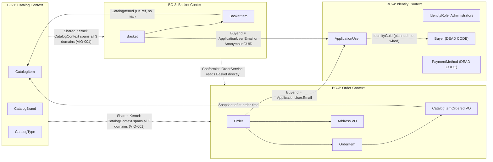

=== DOCUMENT: 05_DOMAIN_MODEL.md ===

# Domain Model — eShopOnWeb
## DDD Bounded Contexts and Context Map

---

## 1. Bounded Context Definitions

### BC-1: Catalog Context
**Purpose:** Manages the product catalog — all products, brands, and types.
**Owner:** PublicApi + BlazorAdmin
**Ubiquitous Language:** Product, Brand, Type, Price, Image, PictureUri
**Aggregate Roots:** CatalogItem, CatalogBrand, CatalogType
**External Interactions:** Basket (supplies CatalogItemId by reference); Order (reads to create snapshot at order time)

### BC-2: Basket Context
**Purpose:** Manages temporary shopping state for both anonymous and authenticated users.
**Owner:** Web MVC + ApplicationCore
**Ubiquitous Language:** Basket, Item, Quantity, BuyerId (email or anonymous GUID), Unit Price
**Aggregate Roots:** Basket
**Entities:** BasketItem (child of Basket)
**External Interactions:** Catalog (receives CatalogItemId + price from UI layer); Order (OrderService reads basket at checkout time)

### BC-3: Order Context
**Purpose:** Records completed purchase transactions as immutable historical records.
**Owner:** Web MVC + ApplicationCore
**Ubiquitous Language:** Order, Order Line, Unit Price, Units, Shipping Address, Buyer, Product Snapshot
**Aggregate Roots:** Order
**Entities:** OrderItem (child of Order)
**Value Objects:** Address (owned), CatalogItemOrdered (owned snapshot)
**External Interactions:** Catalog (reads at order creation to build CatalogItemOrdered snapshot); Basket (reads basket state to create order lines)

### BC-4: Identity Context
**Purpose:** Manages user accounts, authentication, role assignment, and token issuance.
**Owner:** Infrastructure/Identity + Web MVC
**Ubiquitous Language:** User, Role, Administrator, Token, Claim, Password, Lockout
**External Entities:** ApplicationUser (ASP.NET Identity)
**Aggregate Roots (Planned/Dead):** Buyer (defined but not persisted — ASMP-003)
**External Interactions:** All other contexts receive BuyerId (email string) as a cross-context identifier

---

## 2. Context Map (Mermaid)



---

## 3. Aggregate Detail Models

### Basket Aggregate

```
Basket (IAggregateRoot)
├── Id: int (EF identity)
├── BuyerId: string (email for authenticated; GUID for anonymous)
├── Items: IReadOnlyCollection<BasketItem>  [private _items backing field]
├── TotalItems: int [computed: sum of quantities]
│
├── Methods:
│   ├── AddItem(catalogItemId: int, price: decimal, quantity: int): void
│   │   └── If same CatalogItemId exists: AddQuantity; else new BasketItem
│   ├── RemoveEmptyItems(): void
│   │   └── Removes all items where Quantity <= 0
│   └── SetNewBuyerId(buyerId: string): void
│
└── BasketItem (Entity, child)
    ├── Id: int
    ├── UnitPrice: decimal  ← FROZEN at add time; never recalculated
    ├── Quantity: int  ← Guard.Against.OutOfRange (>= 0)
    ├── CatalogItemId: int  ← cross-context reference only (no navigation)
    └── BasketId: int  ← FK to Basket
    Methods:
    ├── AddQuantity(quantity: int): void
    └── SetQuantity(quantity: int): void  ← Guard.Against.OutOfRange
```

### Order Aggregate

```
Order (IAggregateRoot)
├── Id: int (EF identity)
├── BuyerId: string  ← Guard.Against.NullOrEmpty
├── OrderDate: DateTimeOffset  ← set to DateTimeOffset.Now at construction
├── ShipToAddress: Address  ← EF OwnsOne, required, cannot be null
├── OrderItems: IReadOnlyCollection<OrderItem>  [private _orderItems backing field]
│
├── Methods:
│   └── Total(): decimal  ← sum of (OrderItem.UnitPrice * OrderItem.Units)
│
├── Address (Value Object, EF Owned)
│   ├── Street: string  (max 180 chars)
│   ├── City: string  (max 100 chars)
│   ├── State: string  (max 60 chars)
│   ├── Country: string  (max 90 chars)
│   └── ZipCode: string  (max 18 chars)
│
└── OrderItem (Entity, child)
    ├── Id: int
    ├── ItemOrdered: CatalogItemOrdered  ← EF OwnsOne — immutable product snapshot
    │   ├── CatalogItemId: int  ← Guard.Against.Zero
    │   ├── ProductName: string  ← Guard.Against.NullOrEmpty
    │   └── PictureUri: string  ← Guard.Against.NullOrEmpty
    ├── UnitPrice: decimal  ← Guard.Against.NegativeOrZero
    └── Units: int  ← Guard.Against.OutOfRange (>= 1)
```

### CatalogItem Aggregate

```
CatalogItem (IAggregateRoot)
├── Id: int (HiLo sequence: catalog_hilo)
├── Name: string  ← Guard.Against.NullOrEmpty; duplicate check via DuplicateException
├── Description: string  ← Guard.Against.NullOrEmpty
├── Price: decimal  ← FluentValidation: 0.01–1000.00, 2dp max
├── PictureUri: string
├── CatalogTypeId: int  ← Guard.Against.Zero
├── CatalogType: CatalogType? (navigation)
├── CatalogBrandId: int  ← Guard.Against.Zero
└── CatalogBrand: CatalogBrand? (navigation)

Methods:
├── UpdateDetails(details: CatalogItemDetails): void
├── UpdateBrand(catalogBrandId: int): void
├── UpdateType(catalogTypeId: int): void
└── UpdatePictureUri(pictureName: string): void

Inner Record:
└── CatalogItemDetails { Name?: string, Description?: string, Price: decimal }
```

---

## 4. Domain Events (Identified — Not Implemented)

The following domain events are implied by the business rules but are NOT implemented in the current codebase. No `IDomainEvent`, `INotification`, or equivalent was found in ApplicationCore.

| Event | Trigger | Downstream Actions Needed |
|-------|---------|--------------------------|
| OrderCreated | Order.CreateOrderAsync completes | Clear basket; send confirmation email; trigger fulfilment |
| BasketTransferred | TransferBasketAsync completes | Delete anonymous basket (currently done synchronously) |
| AccountRegistered | UserManager.CreateAsync succeeds | Send confirmation email |
| CatalogItemUpdated | UpdateCatalogItemEndpoint completes | Invalidate catalog caches (currently client-side only) |

---

## 5. Cross-Context Data Flow

### Catalog → Basket (at item add time)
```
[UI Layer] → reads CatalogItem.Price and CatalogItem.Id
           → passes to BasketService.AddItemToBasket(catalogItemId, price, qty)
           → BasketItem.UnitPrice = price (frozen here, never recalculated)
```
**Note:** Price is passed by the UI layer. There is no server-side price lookup at basket-add time. The UI is trusted for price input — this is an architectural trust boundary worth reviewing.

### Catalog → Order (at checkout time)
```
OrderService.CreateOrderAsync(basketId, address):
  1. Reads Basket via IRepository<Basket> with BasketWithItemsSpecification
  2. For each BasketItem.CatalogItemId:
     → reads CatalogItem via IRepository<CatalogItem>
     → creates CatalogItemOrdered(id, name, pictureUri)  ← snapshot
  3. Creates OrderItem(itemOrdered, unitPrice=BasketItem.UnitPrice, units=BasketItem.Quantity)
```

### Basket → Identity (BuyerId linkage)
```
Basket.BuyerId = string
  - For authenticated users: email address (ApplicationUser.Email / UserName)
  - For anonymous users: Guid.NewGuid().ToString()
  - Transfer: BasketService.SetNewBuyerId(userName) or new basket created for userName
```
