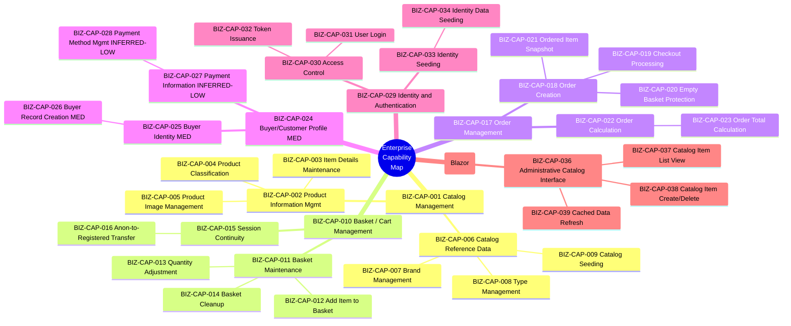
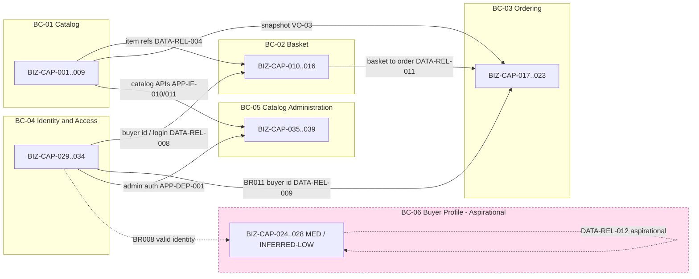

# 02 — Business Capability Model

> **Single source of truth:** `ENTERPRISE_KNOWLEDGE_GRAPH.json`. Every capability, relationship, ownership mapping, priority, and dependency below traces to graph node ids (BIZ-CAP / BIZ-PROC / DATA-ENT / DATA-AGG / DATA-REPO / APP-SVC / APP-IF / APP-DEP) and the recorded cross-links. Bounded contexts (BC-01..BC-07) and generation priorities are reused verbatim from the shared `DECISIONS.json`; they are **not** re-derived here.
>
> **Status discipline (honored throughout):** Capabilities are tagged with their preserved graph `status`/`confidence`. The Buyer/Customer Profile and Payment branches are explicitly flagged. `BIZ-CAP-027` *Payment Information* and `BIZ-CAP-028` *Payment Method Management* are **`status=inferred`, `confidence=LOW`** (inferred from the `PaymentMethod` data-model entity `DATA-ENT-011`, which is `persisted=false`, `status=aspirational/unimplemented`, RC-002). `BIZ-CAP-024/025/026` are `ACTIVE` but `confidence=MEDIUM` and are surfaced through the aspirational context **BC-06**. `target_stack` is **EMPTY (0 nodes)** — no target technology is asserted in this document.
>
> All **39** `BIZ-CAP` nodes appear at least once below.

---

## 1. Capability Hierarchy

The catalog of 39 capabilities decomposes into a strict three-level tree (L1 → L2 → L3) rooted in six L1 capabilities. Levels and parentage are taken directly from each node's `level` and `parent` fields.

### 1.1 Nested capability list (full L1/L2/L3)

Legend: **[ACTIVE/HIGH]** = `status=ACTIVE`, `confidence=HIGH`; **[ACTIVE/MED]** = `status=ACTIVE`, `confidence=MEDIUM`; **[INFERRED/LOW]** = `status=inferred`, `confidence=LOW` (low-confidence, flagged).

- **`BIZ-CAP-001` Catalog Management** *(L1, ACTIVE/HIGH)* — manage the store product catalog (product information + reference data).
  - **`BIZ-CAP-002` Product Information Management** *(L2, ACTIVE/HIGH)*
    - `BIZ-CAP-003` Catalog Item Details Maintenance *(L3, ACTIVE/HIGH)* — name, description, price, image.
    - `BIZ-CAP-004` Product Classification *(L3, ACTIVE/HIGH)* — assign brand and type.
    - `BIZ-CAP-005` Product Image Management *(L3, ACTIVE/HIGH)* — generate/maintain image paths.
  - **`BIZ-CAP-006` Catalog Reference Data** *(L2, ACTIVE/HIGH)*
    - `BIZ-CAP-007` Brand Management *(L3, ACTIVE/HIGH)*
    - `BIZ-CAP-008` Type Management *(L3, ACTIVE/HIGH)*
    - `BIZ-CAP-009` Catalog Seeding *(L3, ACTIVE/HIGH)* — populate initial catalog data on startup.
- **`BIZ-CAP-010` Basket / Shopping Cart Management** *(L1, ACTIVE/HIGH)*
  - **`BIZ-CAP-011` Basket Maintenance** *(L2, ACTIVE/HIGH)*
    - `BIZ-CAP-012` Add Item to Basket *(L3, ACTIVE/HIGH)* — consolidate quantity if present.
    - `BIZ-CAP-013` Quantity Adjustment *(L3, ACTIVE/HIGH)* — prevent negative values (BR007).
    - `BIZ-CAP-014` Basket Cleanup *(L3, ACTIVE/HIGH)* — remove zero-quantity lines (BR006).
  - **`BIZ-CAP-015` Session Continuity** *(L2, ACTIVE/HIGH)*
    - `BIZ-CAP-016` Anonymous-to-Registered Basket Transfer *(L3, ACTIVE/HIGH)* — merge on login.
- **`BIZ-CAP-017` Order Management** *(L1, ACTIVE/HIGH)*
  - **`BIZ-CAP-018` Order Creation** *(L2, ACTIVE/HIGH)*
    - `BIZ-CAP-019` Checkout Processing *(L3, ACTIVE/HIGH)* — basket → confirmed order.
    - `BIZ-CAP-020` Empty Basket Protection *(L3, ACTIVE/HIGH)* — block checkout on empty basket (BR012).
    - `BIZ-CAP-021` Ordered Item Snapshot *(L3, ACTIVE/HIGH)* — capture name/picture/price at order time.
  - **`BIZ-CAP-022` Order Calculation** *(L2, ACTIVE/HIGH)*
    - `BIZ-CAP-023` Order Total Calculation *(L3, ACTIVE/HIGH)* — sum(unit price × quantity) (BR010).
- **`BIZ-CAP-024` Buyer / Customer Profile Management** *(L1, ACTIVE/**MEDIUM**)* — manage buyer identity records and payment information. *(Surfaced via aspirational context BC-06; see §3 and §4.)*
  - **`BIZ-CAP-025` Buyer Identity** *(L2, ACTIVE/MEDIUM)*
    - `BIZ-CAP-026` Buyer Record Creation *(L3, ACTIVE/MEDIUM)* — link buyer to a valid identity account (BR008).
  - **`BIZ-CAP-027` Payment Information** *(L2, **INFERRED/LOW**)* — associate payment information with a buyer. *`status=inferred`, `confidence=LOW` taken verbatim from the graph node (GRAPH_INDEX); not demoted by this document.*
    - `BIZ-CAP-028` Payment Method Management *(L3, **INFERRED/LOW**)* — inferred from the `PaymentMethod` data-model entity (`DATA-ENT-011`), not confirmed in process logic.
- **`BIZ-CAP-029` Identity & Authentication** *(L1, ACTIVE/HIGH)*
  - **`BIZ-CAP-030` Access Control** *(L2, ACTIVE/HIGH)*
    - `BIZ-CAP-031` User Login *(L3, ACTIVE/HIGH)* — validate credentials, report lockout/permission status.
    - `BIZ-CAP-032` Token Issuance *(L3, ACTIVE/HIGH)* — signed JWT with identity + role claims.
  - **`BIZ-CAP-033` Identity Seeding** *(L2, ACTIVE/HIGH)*
    - `BIZ-CAP-034` Identity Data Seeding *(L3, ACTIVE/HIGH)* — seed initial users + roles on startup.
- **`BIZ-CAP-035` Admin Catalog Operations (Blazor)** *(L1, ACTIVE/HIGH)*
  - **`BIZ-CAP-036` Administrative Catalog Interface** *(L2, ACTIVE/HIGH)*
    - `BIZ-CAP-037` Catalog Item List View *(L3, ACTIVE/HIGH)* — display items, types, brands to admins.
    - `BIZ-CAP-038` Catalog Item Create/Delete *(L3, ACTIVE/HIGH)*
    - `BIZ-CAP-039` Cached Data Refresh *(L3, ACTIVE/HIGH)* — refresh cached lists after changes.

**Coverage check:** L1 = 6 (`001, 010, 017, 024, 029, 035`); L2 = 11 (`002, 006, 011, 015, 018, 022, 025, 027, 030, 033, 036`); L3 = 22 (`003, 004, 005, 007, 008, 009, 012, 013, 014, 016, 019, 020, 021, 023, 026, 028, 031, 032, 034, 037, 038, 039`). Total = **39**. Low-confidence/inferred nodes: `BIZ-CAP-027`, `BIZ-CAP-028`. Medium-confidence nodes: `BIZ-CAP-024`, `BIZ-CAP-025`, `BIZ-CAP-026`.

### 1.2 Capability tree (mermaid)

---

## 2. Capability Relationships

### 2.1 Parent / child (decomposition)

Derived from each node's `parent` field. Six roots (`parent=null`) decompose into L2 groupings, which decompose into L3 leaves.

| L1 (root) | L2 children | L3 leaves (by L2 parent) |
|---|---|---|
| `BIZ-CAP-001` Catalog Management | `002`, `006` | `002`→`003,004,005`; `006`→`007,008,009` |
| `BIZ-CAP-010` Basket / Cart Management | `011`, `015` | `011`→`012,013,014`; `015`→`016` |
| `BIZ-CAP-017` Order Management | `018`, `022` | `018`→`019,020,021`; `022`→`023` |
| `BIZ-CAP-024` Buyer / Customer Profile *(MED)* | `025`, `027` *(INFERRED/LOW)* | `025`→`026`; `027`→`028` *(INFERRED/LOW)* |
| `BIZ-CAP-029` Identity & Authentication | `030`, `033` | `030`→`031,032`; `033`→`034` |
| `BIZ-CAP-035` Admin Catalog Operations | `036` | `036`→`037,038,039` |

### 2.2 Sibling relationships

Siblings share a parent and therefore should be modeled as cohesive within the same bounded context (see §3). Notable sibling sets:

| Parent | Siblings | Cohesion note |
|---|---|---|
| `BIZ-CAP-002` | `003`, `004`, `005` | Product attribute, classification, and image maintenance — all over `DATA-ENT-001`. |
| `BIZ-CAP-006` | `007`, `008`, `009` | Brand/type reference + seeding over `DATA-ENT-002/003`. |
| `BIZ-CAP-011` | `012`, `013`, `014` | Mutating operations on `DATA-AGG-001` (Basket). |
| `BIZ-CAP-018` | `019`, `020`, `021` | All driven by checkout process `BIZ-PROC-005`. |
| `BIZ-CAP-025` vs `BIZ-CAP-027` | siblings under `024` | **Confidence split:** `025` ACTIVE/MED vs `027` INFERRED/LOW — the payment branch is the weaker sibling and is not implemented. |
| `BIZ-CAP-030` | `031`, `032` | Login + token issuance, both via `BIZ-PROC-007`. |
| `BIZ-CAP-036` | `037`, `038`, `039` | All delivered through `BIZ-PROC-006` (admin UI). |

### 2.3 Relationship diagram (mermaid)

```mermaid
graph TD
  C001[BIZ-CAP-001 Catalog Mgmt] --> C002[002 Product Info]
  C001 --> C006[006 Reference Data]
  C002 --> C003[003 Item Details]
  C002 --> C004[004 Classification]
  C002 --> C005[005 Image Mgmt]
  C006 --> C007[007 Brand]
  C006 --> C008[008 Type]
  C006 --> C009[009 Catalog Seeding]
  C010[BIZ-CAP-010 Basket Mgmt] --> C011[011 Maintenance]
  C010 --> C015[015 Session Continuity]
  C011 --> C012[012 Add Item]
  C011 --> C013[013 Qty Adjust]
  C011 --> C014[014 Cleanup]
  C015 --> C016[016 Anon Transfer]
  C017[BIZ-CAP-017 Order Mgmt] --> C018[018 Order Creation]
  C017 --> C022[022 Order Calculation]
  C018 --> C019[019 Checkout]
  C018 --> C020[020 Empty Basket Protection]
  C018 --> C021[021 Ordered Item Snapshot]
  C022 --> C023[023 Order Total]
  C024[BIZ-CAP-024 Buyer Profile MED] --> C025[025 Buyer Identity MED]
  C024 --> C027[027 Payment Info INFERRED/LOW]
  C025 --> C026[026 Buyer Record Creation MED]
  C027 --> C028[028 Payment Method INFERRED/LOW]
  C029[BIZ-CAP-029 Identity and Auth] --> C030[030 Access Control]
  C029 --> C033[033 Identity Seeding]
  C030 --> C031[031 User Login]
  C030 --> C032[032 Token Issuance]
  C033 --> C034[034 Identity Data Seeding]
  C035[BIZ-CAP-035 Admin Catalog Ops] --> C036[036 Admin Interface]
  C036 --> C037[037 Item List View]
  C036 --> C038[038 Create/Delete]
  C036 --> C039[039 Cache Refresh]

  classDef inferred fill:#fde,stroke:#c39,stroke-dasharray:4 3;
  classDef medium fill:#ffe,stroke:#cc3;
  class C027,C028 inferred;
  class C024,C025,C026 medium;
```

---

## 3. Capability Ownership

Ownership maps each capability to its **bounded context (BC-##)** and the **owning service/module (APP-SVC)** that holds the relevant behavior or persists the backing entity. The chain used is: capability → `capability_to_process` → `process_to_entity` → `entity_to_service` (data-ownership), reconciled against the bounded-context `capability_ids` membership recorded in `DECISIONS.json`. Where a capability has no `capability_to_process` link (parent/grouping capabilities, or capabilities with no detailed process), ownership is inherited from its leaves/context.

### 3.1 Capability → context → owning service

| Capability | BC | Owning service(s) (APP-SVC) | Data-ownership basis | Status / conf |
|---|---|---|---|---|
| `BIZ-CAP-001`–`009` (Catalog tree) | **BC-01 Catalog** | `APP-SVC-001` Catalog (module); persistence `APP-SVC-023` CatalogContext, `APP-SVC-025` seed; reads `APP-SVC-030/031/032/036`; admin write `APP-SVC-033/034/035`; `APP-SVC-020` UriComposer (image paths, `005`) | `DATA-ENT-001/002/003` → `APP-SVC-001` (`entity_to_service`); `DATA-REPO-003` CatalogContext | ACTIVE/HIGH |
| `BIZ-CAP-010`–`016` (Basket tree) | **BC-02 Basket** | `APP-SVC-003` Basket (module); `APP-SVC-027` BasketGuards (`013/014` qty rules) | `DATA-ENT-004/005` → `APP-SVC-003`; `DATA-AGG-001` BasketAggregate | ACTIVE/HIGH |
| `BIZ-CAP-017`–`023` (Order tree) | **BC-03 Ordering** | `APP-SVC-004` Order (module); `APP-SVC-038` OrderController; `APP-SVC-041/042/043` order-history handlers | `DATA-ENT-006/007/013/012` → `APP-SVC-004` (012 physically catalog-owned, see note); `DATA-AGG-002` OrderAggregate | ACTIVE/HIGH |
| `BIZ-CAP-024`, `025`, `026` (Buyer Identity) | **BC-06 Buyer/Customer Profile (Aspirational)** | No dedicated Buyer service exists; the aspirational `DATA-ENT-010` Buyer is nominally mapped to `APP-SVC-004` (Order) in `entity_to_service` — treated as a misattribution of an unpersisted entity (see §3.2). Today the buyer reference is satisfied by `ApplicationUser` in **BC-04** (`DATA-REL-008/009` soft refs) | `DATA-ENT-010` Buyer `persisted=false`; `entity_to_service DATA-ENT-010→APP-SVC-004` (aspirational); `DATA-AGG-003` aspirational | **ACTIVE/MED — aspirational context** |
| `BIZ-CAP-027`, `028` (Payment) | **BC-06 (Aspirational)** | No dedicated Payment service exists; the aspirational `DATA-ENT-011` PaymentMethod is nominally mapped to `APP-SVC-004` (Order) in `entity_to_service` — treated as a misattribution of an unpersisted entity (see §3.2) | `DATA-ENT-011` PaymentMethod `persisted=false`; `entity_to_service DATA-ENT-011→APP-SVC-004` (aspirational); `DATA-REL-012` aspirational | **INFERRED/LOW** |
| `BIZ-CAP-029`–`034` (Identity tree) | **BC-04 Identity & Access** | `APP-SVC-002` Identity (module); `APP-SVC-021` IdentityTokenClaimService (`032`); `APP-SVC-024` AppIdentityDbContext; `APP-SVC-026` seed (`034`); `APP-SVC-029` AuthenticateEndpoint; `APP-SVC-037/039` Manage/User controllers | `DATA-ENT-008/009` → `APP-SVC-002`; `DATA-REPO-004` AppIdentityDbContext | ACTIVE/HIGH |
| `BIZ-CAP-035`–`039` (Admin Catalog) | **BC-05 Catalog Administration** | `APP-SVC-005` Admin (module); `APP-SVC-016` BlazorAdmin SPA; UI components `APP-SVC-046/047/048/049`; `APP-SVC-051` auth state; cache decorators `APP-SVC-044/045`, list page `APP-SVC-050` | **Owns no entities/aggregates;** consumes BC-01 via `APP-IF-010` ICatalogItemService / `APP-IF-011` ICatalogLookupDataService | ACTIVE/HIGH |

### 3.2 Ownership notes (boundary nuances, traced)

- **Snapshot overlap (BC-01 ↔ BC-03):** `DATA-ENT-012` CatalogItemOrdered is physically catalog-owned (`entity_to_service DATA-ENT-012→APP-SVC-001`) but is a conceptual member of `DATA-AGG-002` (`DATA-REL-006`). Resolved in `DECISIONS.json` as value object **VO-03**, copied at checkout into BC-03. Capabilities `BIZ-CAP-021` (snapshot) and `BIZ-CAP-019` (checkout) drive this copy.
- **Buyer reference (BC-06 ↔ BC-04):** `BIZ-CAP-026` requires a valid identity account (BR008); since `DATA-ENT-010` Buyer is unpersisted, the buyer id is the `ApplicationUser` id owned by **BC-04** (`DATA-REL-008/009` soft references). See **ASMP-FE-003**.
- **Aspirational Buyer/Payment service mapping (BC-06):** `cross_links.entity_to_service` records `DATA-ENT-010 Buyer → APP-SVC-004` and `DATA-ENT-011 PaymentMethod → APP-SVC-004` (the Order module). Both entities are `persisted=false`, `status=aspirational/unimplemented` (RC-002), so these links are treated as a **misattribution of aspirational entities to the nearest co-located module** (Buyer/Order share the same area in the reference codebase), not as evidence of a real Buyer/Payment service. No dedicated Buyer or Payment service or repository exists. `DECISIONS.json` BC-06 `service_ids=[]` reflects this resolution; the raw `entity_to_service` link is preserved here for traceability but is not promoted to an ownership claim. See **ASMP-FE-003**.
- **Functional vs physical hosting (BC-07):** Routes for Basket/Order/Identity capabilities are physically served by the Web shell `APP-SVC-006` (and PublicApi `APP-SVC-011` for `APP-API-001`), grouped in **BC-07 Web Presentation Shell**. Functional capability ownership stays with BC-02/BC-03/BC-04 per **ASMP-FE-004**. BC-07 owns **no** capability.
- **Role ownership (BC-04):** `DATA-ENT-009` Role assignment to `APP-SVC-002` is inferred (graph assumption `ASSUMP-006`, conf 0.7), relevant to `BIZ-CAP-034`.

---

## 4. Capability Prioritization

Prioritization combines two graph-grounded inputs: (a) the preserved capability `status`/`confidence` flags, and (b) the context-level `generation_priorities` (priority 1–7) recorded in `DECISIONS.json`. Capabilities inherit the generation priority of their owning context.

### 4.1 Status tiers

| Tier | Capabilities | Disposition |
|---|---|---|
| **Tier A — ACTIVE / HIGH** (29 caps) | `001`–`023`, `029`–`039` | Implemented, evidence-confirmed. Primary forward-engineering scope. |
| **Tier B — ACTIVE / MEDIUM** (3 caps) | `024`, `025`, `026` | Confirmed concept but backed by aspirational `Buyer` entity; generate only on explicit decision. |
| **Tier C — INFERRED / LOW** (2 caps) | `027`, `028` *(Payment)* | **Low-confidence, payment caps.** Inferred from `DATA-ENT-011` (unpersisted). **Do not** generate persistence without a deliberate decision (RC-002, ASMP-FE-003). |

### 4.2 Generation sequence (capability priority via owning context)

| Priority | Context | Capabilities in scope | Rationale (evidence, summarized from `generation_priorities`) |
|---|---|---|---|
| **1** | **BC-04 Identity & Access** | `029, 030, 031, 032, 033, 034` | Cross-cutting prerequisite for basket transfer (`BIZ-PROC-003`), order buyer-id (BR011), admin auth. Persistence already isolated in `DATA-REPO-004` → cleanest cut in the `APP-DEP-001` cycle. Establishes auth contract `APP-API-001`. |
| **2** | **BC-01 Catalog** | `001, 002, 003, 004, 005, 006, 007, 008, 009` | Upstream reference data for Basket/Order (`DATA-REL-004`, VO-03). Highest coupling (`APP-SVC-001` score 13, readiness Blocked) + source of violations `APP-DEP-002..007, 010`; generate early to force the shared `DATA-REPO-003` split. |
| **3** | **BC-02 Basket** | `010, 011, 012, 013, 014, 015, 016` | Depends on Catalog (item refs) and Identity (`DATA-REL-008`). Well-defined `DATA-AGG-001`; contributor to `APP-DEP-001`. |
| **4** | **BC-03 Ordering** | `017, 018, 019, 020, 021, 022, 023` | Consumes Basket handoff (`DATA-REL-011`), Catalog snapshot (VO-03), buyer id. Lowest core coupling (`APP-SVC-004` score 4), clean `DATA-AGG-002`, but functionally downstream. |
| **5** | **BC-05 Catalog Administration** | `035, 036, 037, 038, 039` | Presentation/SPA over BC-01 APIs; cannot precede Catalog/Identity. `OQ-001` (merge Admin + BlazorAdmin) must be decided first; runtime HTTP deps `APP-DEP-017/018`. |
| **6** | **BC-07 Web Presentation Shell** | *(none — host/composition only)* | Composition/host concern generated last; wraps finished contexts. `EfRepository` (`APP-DEP-009`) and shared `DATA-REPO-003` must already be split. |
| **7** | **BC-06 Buyer / Customer Profile (Aspirational)** | `024, 025, 026, 027, 028` | **ASPIRATIONAL/UNIMPLEMENTED (RC-002).** `DATA-ENT-010/011` `persisted=false`; payment caps INFERRED/LOW. Generated **last and only on an explicit decision**, never inferred as discovered. Gap: **ASMP-FE-003**. |

> **Payment-capability call-out:** `BIZ-CAP-027` and `BIZ-CAP-028` are the lowest-priority, lowest-confidence capabilities in the model. They have no process beyond the aspirational `BIZ-PROC-008` (Buyer Record Creation, 0 detailed steps), no service, no API, and no persisted entity. They are documented for completeness only.

---

## 5. Capability Dependencies

Capability dependencies are **derived**, not asserted: each runtime capability resolves through `capability_to_process → process_to_entity → entity_to_service`, and inter-capability dependency arises wherever those chains cross a context boundary or share an entity. Module-level coupling (`APP-DEP-001`–`019`) is overlaid as the structural realization of those dependencies.

### 5.1 Capability → process → entity → service chains (traced)

| Capability | Process (`capability_to_process`) | Entities (`process_to_entity`) | Service (`entity_to_service`) |
|---|---|---|---|
| `BIZ-CAP-002` (browse/info) | `BIZ-PROC-001` | `DATA-ENT-001/002/003` | `APP-SVC-001` |
| `BIZ-CAP-009` (catalog seed) | `BIZ-PROC-009` | `DATA-ENT-001/002/003` | `APP-SVC-001` (`APP-SVC-025`) |
| `BIZ-CAP-012` (add item) | `BIZ-PROC-002` | `DATA-ENT-004/005`, `DATA-ENT-001` | `APP-SVC-003` (+ soft ref `APP-SVC-001`) |
| `BIZ-CAP-016` (anon transfer) | `BIZ-PROC-003` | `DATA-ENT-004/005`, `DATA-ENT-008` | `APP-SVC-003` (+ `APP-SVC-002`) |
| `BIZ-CAP-013`, `014` (qty/cleanup) | `BIZ-PROC-004` | `DATA-ENT-005/004` | `APP-SVC-003` (`APP-SVC-027`) |
| `BIZ-CAP-019`, `020`, `021`, `023` (checkout) | `BIZ-PROC-005` | `DATA-ENT-004/006/007/012/013/001` | `APP-SVC-004` (+ `APP-SVC-001/003`) |
| `BIZ-CAP-037`, `038`, `039` (admin) | `BIZ-PROC-006` | `DATA-ENT-001/002/003` | `APP-SVC-001` via `APP-SVC-016` |
| `BIZ-CAP-031`, `032` (login/token) | `BIZ-PROC-007` | `DATA-ENT-008/009` | `APP-SVC-002` (`APP-SVC-021`) |
| `BIZ-CAP-026` (buyer record) | `BIZ-PROC-008` | `DATA-ENT-010`, `DATA-ENT-008` | `DATA-ENT-010`→`APP-SVC-004` in `entity_to_service` (aspirational misattribution; no dedicated Buyer service — see §3.2) → today identity ref via `APP-SVC-002` |
| `BIZ-CAP-034` (identity seed) | `BIZ-PROC-010` | `DATA-ENT-008/009` | `APP-SVC-002` (`APP-SVC-026`) |

> Parent/grouping capabilities (`001, 006, 010, 011, 015, 017, 018, 022, 024, 025, 027, 029, 030, 033, 035, 036`) and the no-process leaves (`003, 004, 005, 007, 008, 028`) inherit their dependencies from the chained leaves above within the same context. `BIZ-CAP-005` (image paths) additionally depends on `APP-SVC-020` UriComposer (`APP-DEP-010`).

### 5.2 Inter-capability dependency map

| Dependent capability | Depends on | Dependency basis (graph) |
|---|---|---|
| `BIZ-CAP-012` Add Item to Basket | `BIZ-CAP-001` Catalog (item exists) | `DATA-REL-004` BasketItem *..1 CatalogItem (soft) → BC-02 → BC-01 |
| `BIZ-CAP-016` Anon Basket Transfer | `BIZ-CAP-029` Identity (login event) | `BIZ-PROC-003` triggered by login; `DATA-ENT-008` involvement; `DATA-REL-008` |
| `BIZ-CAP-019` Checkout | `BIZ-CAP-010` Basket (source basket) | `DATA-REL-011` Basket 1..1 Order — BC-02 → BC-03 handoff |
| `BIZ-CAP-021` Ordered Item Snapshot | `BIZ-CAP-001` Catalog (snapshot source) | VO-03 copied from `DATA-ENT-012`/`APP-SVC-001` at checkout |
| `BIZ-CAP-019` Checkout | `BIZ-CAP-029` Identity (buyer id) | BR011 order requires buyer id; `DATA-REL-009` soft ref to `ApplicationUser` |
| `BIZ-CAP-023` Order Total | `BIZ-CAP-021` Snapshot (`UnitPrice`) | BR010 total = sum(unit price × qty) over `DATA-ENT-007` |
| `BIZ-CAP-037/038/039` Admin | `BIZ-CAP-001` Catalog (data) + `BIZ-CAP-029` Identity (auth) | `APP-IF-010/011` to Catalog APIs; `APP-DEP-017/018`; Admin→Identity in `APP-DEP-001` |
| `BIZ-CAP-026` Buyer Record (MED) | `BIZ-CAP-029` Identity (valid account) | BR008 reject without valid identity ref; `DATA-ENT-010`→`DATA-ENT-008` |
| `BIZ-CAP-028` Payment (INFERRED/LOW) | `BIZ-CAP-024/025` Buyer | `DATA-REL-012` Buyer 1..* PaymentMethod (aspirational) |

### 5.3 Module-dependency realization & structural risks

The capability dependencies above are structurally realized by — and currently obstructed by — these recorded module dependencies:

- **`APP-DEP-001` (RISK-CYCLE-001):** module cycle Admin → ApplicationCore → Basket → Catalog → DataAccess → Identity → Order → Web → back to Admin. Spans the dependency edges between BC-01..BC-05 and BC-07. Must be broken before contexts deploy independently. Reality vs static artifact is unresolved (`OQ-004`).
- **`DATA-REPO-003` (RISK-SHARED-DBCTX-001):** the shared `CatalogContext` persists Catalog (BC-01), Basket (BC-02), and Order (BC-03) entities in one DbContext — a single persistence boundary crossing three contexts. The `BIZ-CAP-012`/`019` cross-context chains physically traverse this shared context. (`OQ-008`.)
- **`APP-DEP-009` (RISK-EFREPO-001):** `EfRepository` (`APP-SVC-022`, coupling 16) plus direct endpoint/PageModel→repository violations `APP-DEP-002..008` couple BC-01 catalog endpoints (serving `BIZ-CAP-003/004/037/038`) directly to data access, bypassing the `APP-IF-001/002` abstractions.

### 5.4 Capability dependency diagram (mermaid)

---

## 6. Assumptions & Gaps

### 6.1 Assumptions applied (reused from graph / `DECISIONS.json`)

| ID | Statement (summary) | Basis | Impact |
|---|---|---|---|
| `ASMP-FE-003` | BC-06 Buyer/Profile is surfaced only from aspirational nodes; today the buyer reference is `ApplicationUser` (BC-04). | `DATA-ENT-010/011` `persisted=false` (RC-002); `DATA-REL-008/009` soft refs; `BIZ-CAP-027/028` inferred/LOW. | Do not generate Buyer/Payment persistence (and therefore `BIZ-CAP-024`–`028`) without an explicit decision. |
| `ASMP-FE-004` | Web-shell-served routes and the PublicApi authenticate endpoint are attributed to functional contexts (BC-02/03/04); physical hosting stays with BC-07. | `service_to_api` maps; `ASSUMP-001/002`. | Capability ownership in §3 distinguishes functional ownership from physical hosting (`OQ-009`). |
| `ASSUMP-006` (graph) | Role (`DATA-ENT-009`) ownership by `APP-SVC-002` is inferred (conf 0.7). | Graph assumption. | Affects `BIZ-CAP-034` ownership confidence. |

### 6.2 New assumptions added by this document

| ID | Statement | Basis | Impact |
|---|---|---|---|
| **ASMP-FE-005** | Parent/grouping capabilities and the no-process L3 leaves (`003, 004, 005, 007, 008, 028`) inherit context membership and dependencies from their decomposing leaves / owning context, because no `capability_to_process` link exists for them in `cross_links`. | `cross_links.capability_to_process` contains 17 entries and omits these ids; bounded-context `capability_ids` in `DECISIONS.json` assign them. | Ownership/dependency for these caps is by inheritance, not direct evidence; if a future process node is added it should be re-traced. |
| **ASMP-FE-006** | `BIZ-CAP-035` Admin Catalog Operations and its children own no data; the BC-05 ↔ Admin-module merge (`OQ-001`) is left unresolved, so the owning-service set lists both `APP-SVC-005` and `APP-SVC-016`. | BC-05 `entity_ids=[]`, `aggregate_ids=[]`; `OQ-001` unresolved. | Final service ownership for `BIZ-CAP-035`–`039` is contingent on the `OQ-001` decision. |

### 6.3 Open gaps flagged (graph open questions)

- **`OQ-001`** — Merge of Admin module (`APP-SVC-005`) with BlazorAdmin (`APP-SVC-016`) unresolved → affects BC-05 ownership of `BIZ-CAP-035`–`039`.
- **`OQ-004`** — `APP-DEP-001` cycle: real runtime cycle vs static-resolution artifact unresolved → affects realizability of all cross-context capability dependencies in §5.3.
- **`OQ-005`** — No confirmed JWT enforcement on PublicApi (`TECH-SEC-010`) → affects the access-control posture of `BIZ-CAP-030`/`031`/`032` at the boundary.
- **`OQ-008`** — `IRepository<T>`/`IReadRepository<T>` served-entity sets partly inferred → affects the precision of catalog/basket data-ownership chains.
- **`OQ-009`** — Synthetic ROUTE/CLI method labels → affects functional-vs-physical API attribution (ties to ASMP-FE-004).
- **Payment / Buyer gap** — `BIZ-CAP-024`–`028` have no implemented persistence, service, or API; `BIZ-PROC-008` has 0 detailed steps. These capabilities are documented but not buildable from current evidence (RC-002, ASMP-FE-003).
