# 04 — Business Process Model

> ⚠️ **DISC-001 (verified 2026-06-25):** Any stock-reorder process/decision derived from `CatalogItem`
> stock fields (`AvailableStock`/`RestockThreshold`/`MaxStockThreshold`/`OnReorder`) is a **verified
> discrepancy** — those fields and the reorder behavior are absent from the real `eShopOnWeb` source. Do
> not generate a reorder workflow. See [`../EVIDENCE_VERIFICATION_REPORT.md`](../EVIDENCE_VERIFICATION_REPORT.md).

**Single source of truth:** `ENTERPRISE_KNOWLEDGE_GRAPH.json` (business.processes `BIZ-PROC-001..010`, actors `BIZ-ACT-001..005`, cross_links `capability_to_process`).
**Shared decisions reused verbatim:** `DECISIONS.json` (bounded contexts BC-01..BC-07; domain events EVT-01..12).
**Scope:** All 10 evidenced business processes. Every element traces to graph node ids. No processes, rules, actors, or steps are invented. Status/confidence flags are preserved.

> **Technology-neutral statement.** This document models *behavior*, not implementation. Where the originating evidence names a runtime artifact (e.g. `GuardExtensions.cs`, `Order.cs`), it is cited as **Current (legacy)** provenance only. `target_stack` is EMPTY (0 nodes); no target technology is asserted. Any later realization may use any of the mandated target options (Java Spring Boot / ASP.NET Core / Node.js / Python; React/Angular/Vue; PostgreSQL/SQL Server/MySQL; Docker/Kubernetes) without changing the process semantics below.

---

## 1. Process Inventory (overview)

| Process | Trigger (evidence) | Steps in evidence | Confidence | Functional bounded context | Primary actor |
|---|---|---|---|---|---|
| BIZ-PROC-001 Browse Catalog | Customer chooses to view available catalog items | 1 | MEDIUM | BC-01 Catalog | BIZ-ACT-001 / BIZ-ACT-002 |
| BIZ-PROC-002 Add Item to Basket | Customer (or anonymous user) selects a catalog item | 3 | HIGH | BC-02 Basket | BIZ-ACT-001 / BIZ-ACT-002 |
| BIZ-PROC-003 Transfer Anonymous Basket to Registered User | An anonymous user logs in or registers | 3 | HIGH | BC-02 Basket | BIZ-ACT-002 → BIZ-ACT-001 |
| BIZ-PROC-004 Adjust Basket | Customer reviews their merged/finalized basket before checkout | 1 | MEDIUM | BC-02 Basket | BIZ-ACT-001 |
| BIZ-PROC-005 Checkout / Place Order | Customer initiates checkout from their basket | 6 | HIGH | BC-03 Ordering | BIZ-ACT-001 + BIZ-ACT-004 |
| BIZ-PROC-006 Catalog Item Administration | Administrator manages catalog items via the admin (Blazor) interface | 4 | HIGH | BC-05 Catalog Administration (over BC-01) | BIZ-ACT-003 + BIZ-ACT-004 |
| BIZ-PROC-007 User Authentication | User submits login credentials via the API | 3 | HIGH | BC-04 Identity & Access | BIZ-ACT-001 + BIZ-ACT-004 |
| BIZ-PROC-008 Buyer Record Creation | A buyer record needs to be created against a valid identity account | 0 (gap) | MEDIUM | BC-06 Buyer / Customer Profile (Aspirational) | BIZ-ACT-004 |
| BIZ-PROC-009 Catalog Seeding | System startup | 0 (gap) | MEDIUM | BC-01 Catalog | BIZ-ACT-004 |
| BIZ-PROC-010 Identity Data Seeding | System startup | 0 (gap) | MEDIUM | BC-04 Identity & Access | BIZ-ACT-004 |

**Step-evidence gaps:** BIZ-PROC-008/009/010 have `steps=[]` in evidence. Per HARD RULES these are flagged as gaps (see §3 and ASMP-FE-101..103) and rendered as trigger→outcome only.

---

## 2. Process Descriptions

### BIZ-PROC-001 — Browse Catalog *(BC-01 Catalog, conf MEDIUM)*
Customer or anonymous shopper views available catalog items, filtering by brand or type. This is the value-add entry stage of the Customer Browse-to-Order value stream. It reads catalog master data (`DATA-ENT-001` CatalogItem, `DATA-ENT-002` CatalogBrand, `DATA-ENT-003` CatalogType — `process_to_entity`). The evidence records this as a value-stream stage with **no step-level breakdown** beyond the single summary step; no business rules are attached (`business_rules=[]`).

### BIZ-PROC-002 — Add Item to Basket *(BC-02 Basket, conf HIGH)*
Adds the requested catalog item to the customer's (or anonymous user's) basket so the basket contains the item at the correct quantity, consolidating quantity if the item is already present. Governed by **BR005** (consolidate-vs-new-line). Touches `DATA-ENT-004` Basket, `DATA-ENT-005` BasketItem, `DATA-ENT-001` CatalogItem. Emits candidate domain event **EVT-01 ItemAddedToBasket** (`DECISIONS.json`).

### BIZ-PROC-003 — Transfer Anonymous Basket to Registered User *(BC-02 Basket, conf HIGH)*
Merges an anonymous user's basket into the now-registered user's basket on login/registration, so the registered basket contains all anonymous-session items. Governed by **BR005**. Touches `DATA-ENT-004` Basket, `DATA-ENT-005` BasketItem, `DATA-ENT-008` ApplicationUser (the now-registered identity). Emits candidate event **EVT-03 AnonymousBasketTransferred**. This is the dependency bridge from BIZ-PROC-007 (auth) into the basket lifecycle.

### BIZ-PROC-004 — Adjust Basket *(BC-02 Basket, conf MEDIUM)*
Customer adjusts quantities or removes items before checkout. Governed by **BR006** (zero-quantity line removed) and **BR007** (negative quantity rejected). Touches `DATA-ENT-005` BasketItem, `DATA-ENT-004` Basket. Emits candidate event **EVT-02 BasketQuantityAdjusted**. Recorded as a value-stream stage; **not detailed as a standalone step-level process** beyond the single summary step.

### BIZ-PROC-005 — Checkout / Place Order *(BC-03 Ordering, conf HIGH)*
Converts the basket into a confirmed order with snapshotted item details, a buyer id, a shipping address, and a calculated total; checkout is blocked if the basket is empty. Governed by **BR009** (order line requires valid catalog item id/name/picture), **BR010** (order total = sum(unit price × quantity)), **BR011** (order requires buyer id), **BR012** (block checkout for empty basket). Touches `DATA-ENT-004` Basket, `DATA-ENT-006` Order, `DATA-ENT-007` OrderItem, `DATA-ENT-012` CatalogItemOrdered, `DATA-ENT-013` Address, `DATA-ENT-001` CatalogItem. Emits candidate events **EVT-06 CheckoutRejectedEmptyBasket**, **EVT-04 OrderPlaced**, **EVT-05 OrderTotalCalculated**. This is the BC-02 → BC-03 handoff (`DATA-REL-011` Basket 1..1 Order).

### BIZ-PROC-006 — Catalog Item Administration *(BC-05 over BC-01, conf HIGH)*
Administrator views the item/type/brand list, creates and deletes catalog items via the Blazor admin interface, with validation and a cache refresh. Governed by **BR001** (name/description/price validation), **BR002** (brand id ≠ 0), **BR003** (type id ≠ 0), **BR004** (image path generation). Touches `DATA-ENT-001` CatalogItem, `DATA-ENT-002` CatalogBrand, `DATA-ENT-003` CatalogType. Emits candidate events **EVT-08 CatalogItemCreated**, **EVT-09 CatalogItemDeleted**, **EVT-10 CatalogCacheRefreshed**.

### BIZ-PROC-007 — User Authentication *(BC-04 Identity & Access, conf HIGH)*
User submits login credentials via the API; the system validates them against the identity store and, if valid and not locked out, issues a signed JWT containing identity and role claims. No explicit business rules in evidence (`business_rules=[]`); a lockout/not-allowed decision is embedded in the step text. Touches `DATA-ENT-008` ApplicationUser, `DATA-ENT-009` Role. Emits candidate event **EVT-07 UserAuthenticated**. Prerequisite for admin operations (BIZ-PROC-006) and for anonymous-basket transfer (BIZ-PROC-003).

### BIZ-PROC-008 — Buyer Record Creation *(BC-06 Aspirational, conf MEDIUM)*
Creates a buyer record linked to a valid identity account; a record without a valid identity reference is rejected. Governed by **BR008** (reject buyer creation without valid identity reference) and constrained by **BR011** (order requires buyer id). Touches `DATA-ENT-010` Buyer (**persisted=false, aspirational/unimplemented, RC-002**) and `DATA-ENT-008` ApplicationUser. **Step-level gap:** `steps=[]` — no step breakdown in evidence. Emits candidate event **EVT-11 BuyerRecordCreated**. *Design input only — do not generate persistence without an explicit decision (ASMP-FE-003 / ASMP-FE-101).*

### BIZ-PROC-009 — Catalog Seeding *(BC-01 Catalog, conf MEDIUM)*
Populates initial catalog data on system startup, performed by the System / Service Account. No business rules in evidence. Touches `DATA-ENT-001`, `DATA-ENT-002`, `DATA-ENT-003`. **Step-level gap:** `steps=[]` (ASMP-FE-102).

### BIZ-PROC-010 — Identity Data Seeding *(BC-04 Identity & Access, conf MEDIUM)*
Populates initial user accounts and roles on startup, performed by the System / Service Account (confirmed role name "Administrators", RC-008). No business rules in evidence. Touches `DATA-ENT-008` ApplicationUser, `DATA-ENT-009` Role. **Step-level gap:** `steps=[]` (ASMP-FE-103).

---

## 3. Activity Flows

Each diagram is built strictly from the process `steps[]` and the decision text embedded in those steps. Processes with empty `steps[]` show **trigger → outcome only** with an explicit evidence-gap note.

### BIZ-PROC-001 — Browse Catalog *(single summary step; no step-level breakdown in evidence)*

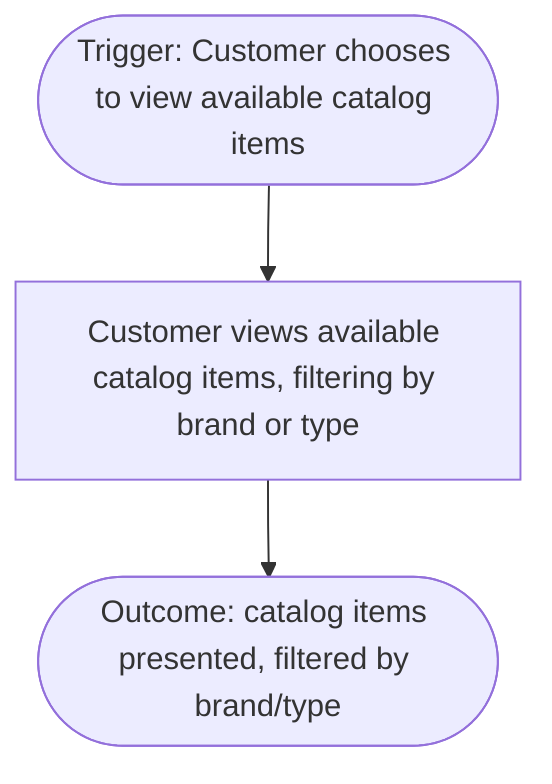
*Evidence note: BIZ-PROC-001 has a single value-stream summary step; no decomposition exists in evidence (conf MEDIUM).*

### BIZ-PROC-002 — Add Item to Basket

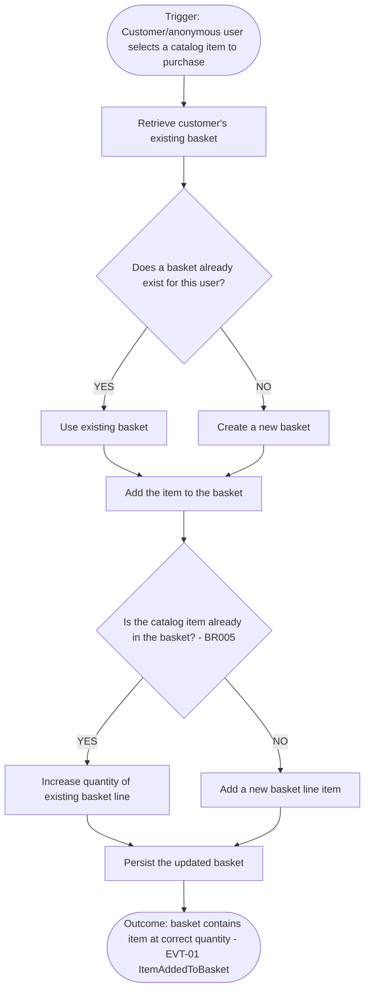

### BIZ-PROC-003 — Transfer Anonymous Basket to Registered User

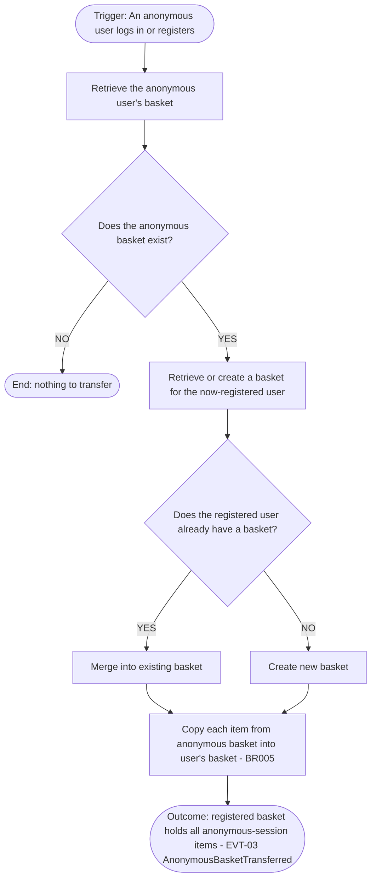

### BIZ-PROC-004 — Adjust Basket *(single summary step; not detailed as standalone process in evidence)*

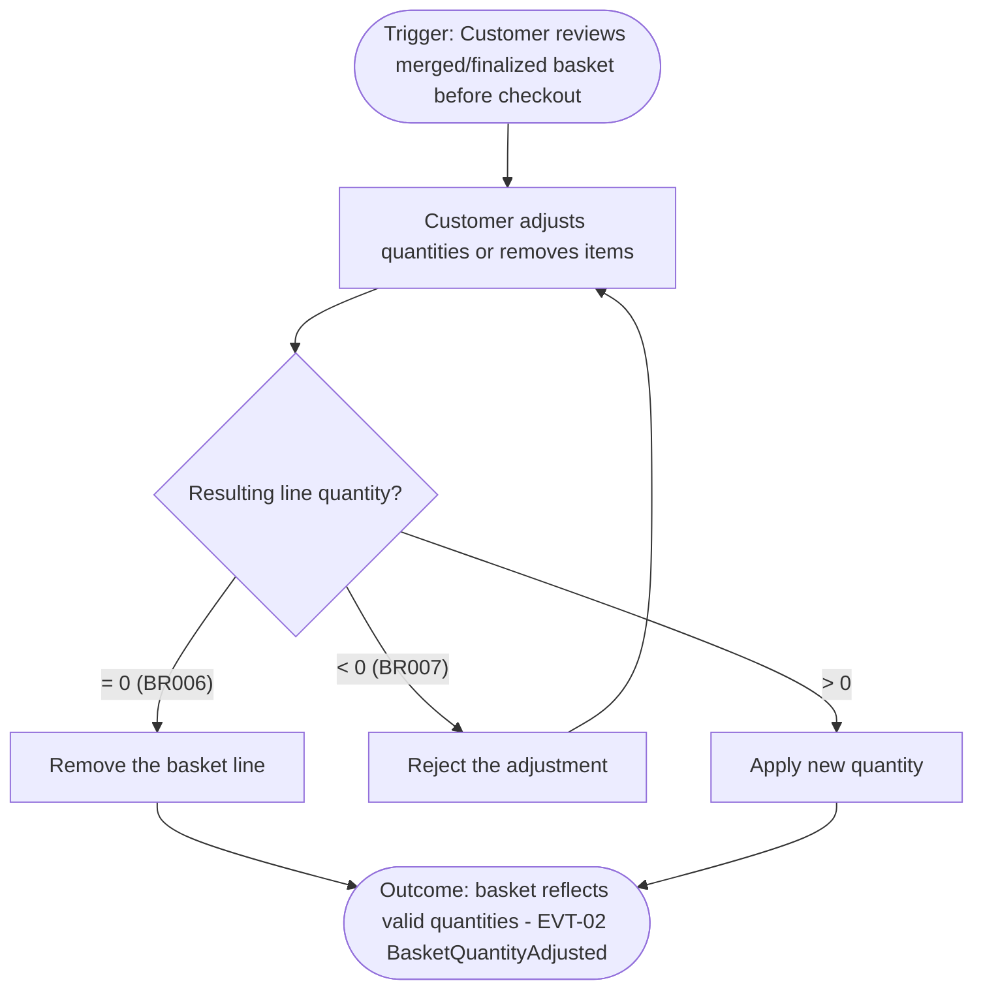
*Evidence note: decision branches BR006/BR007 are derived from the attached business rules; the process itself carries a single summary step (conf MEDIUM).*

### BIZ-PROC-005 — Checkout / Place Order

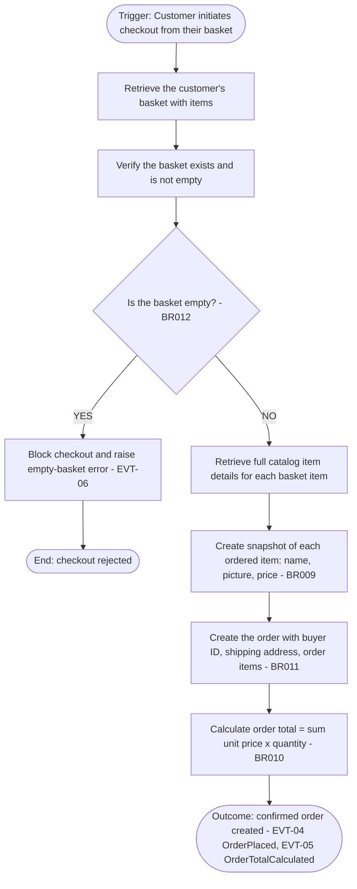

### BIZ-PROC-006 — Catalog Item Administration

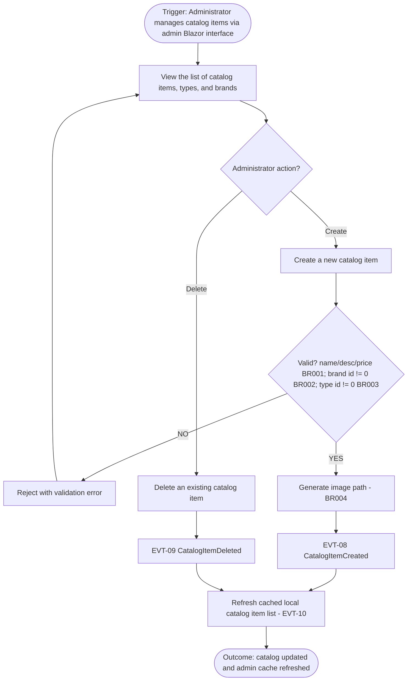

### BIZ-PROC-007 — User Authentication

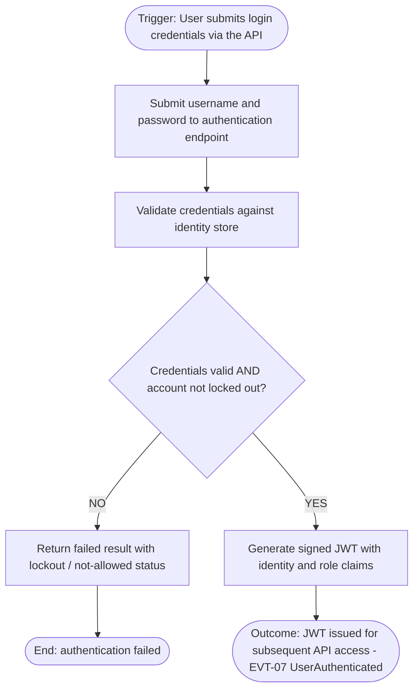

### BIZ-PROC-008 — Buyer Record Creation *(EVIDENCE GAP: steps empty — trigger→outcome only)*

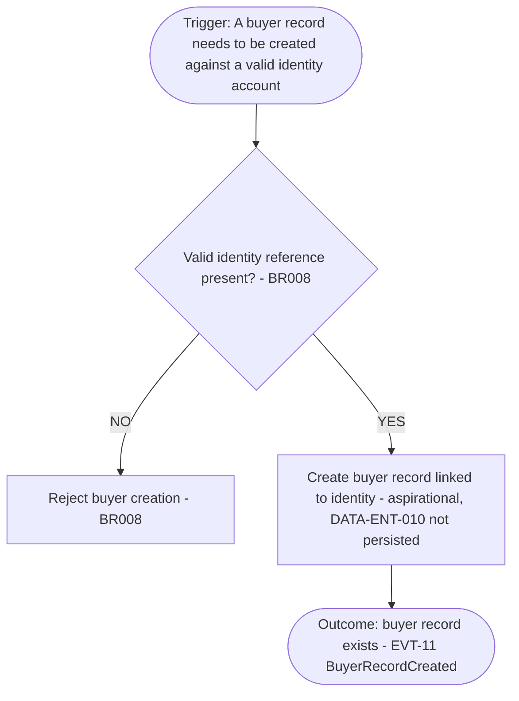
*Evidence gap: `steps=[]`. The single decision shown is derived solely from the attached rule BR008; no step-level workflow exists in evidence. BC-06 is aspirational/unimplemented (RC-002) — see ASMP-FE-101.*

### BIZ-PROC-009 — Catalog Seeding *(EVIDENCE GAP: steps empty — trigger→outcome only)*

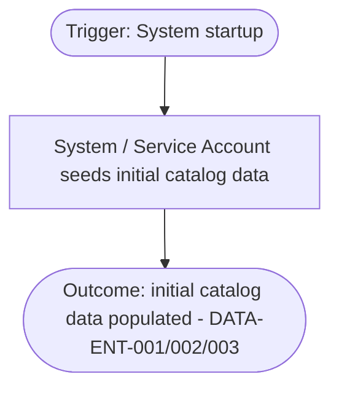
*Evidence gap: `steps=[]`; no step-level breakdown (ASMP-FE-102).*

### BIZ-PROC-010 — Identity Data Seeding *(EVIDENCE GAP: steps empty — trigger→outcome only)*

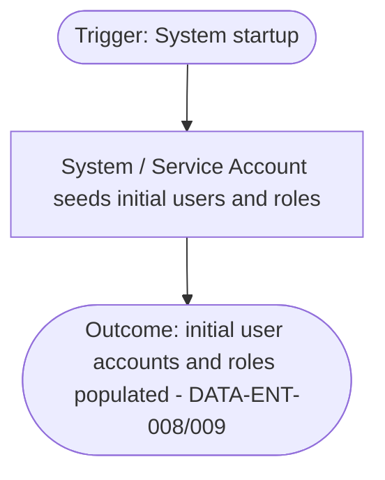
*Evidence gap: `steps=[]`; no step-level breakdown (ASMP-FE-103).*

---

## 4. Decision Points

Decision points are extracted **only** from the processes' attached `business_rules` and the explicit decision text inside their `steps[]`. The four named control points called out in the task brief (empty basket; qty ≥ 0; lockout; OnReorder threshold) are mapped below.

| Decision point | Rule / source | Process | Branch logic | Outcome |
|---|---|---|---|---|
| Basket exists for user? | step decision (BIZ-PROC-002) | BIZ-PROC-002 | YES → use existing; NO → create new | basket obtained |
| Item already in basket? | **BR005** | BIZ-PROC-002, BIZ-PROC-003 | YES → increase quantity; NO → add new line | consolidated basket |
| Anonymous basket exists? | step decision (BIZ-PROC-003) | BIZ-PROC-003 | YES → continue; NO → end (nothing to transfer) | transfer or no-op |
| Registered user has basket? | step decision (BIZ-PROC-003) | BIZ-PROC-003 | YES → merge; NO → create new | merge target chosen |
| **Quantity ≥ 0 / zero-line cleanup** | **BR006** (zero-qty line removed), **BR007** (negative qty rejected) | BIZ-PROC-004 | =0 → remove line; <0 → reject; >0 → apply | valid quantities only |
| **Empty basket protection** | **BR012** (block checkout for empty basket) | BIZ-PROC-005 | empty → block + raise error (EVT-06); not empty → continue | guards checkout |
| Valid ordered-item snapshot? *(derived validation control — rule-derived, no explicit step-level decision branch in BIZ-PROC-005 evidence; see note below)* | **BR009** (valid catalog item id/name/picture) | BIZ-PROC-005 | invalid → reject line; valid → snapshot | order line integrity |
| Order requires buyer id | **BR011** | BIZ-PROC-005, BIZ-PROC-008 | no buyer id → cannot create order | order constraint |
| Order total computation | **BR010** (sum unit price × quantity) | BIZ-PROC-005 | — (calculation, not branch) | order total set |
| Catalog item field validation | **BR001** (name/desc/price), **BR002** (brand id ≠ 0), **BR003** (type id ≠ 0) | BIZ-PROC-006 | invalid → reject; valid → create | validated create |
| Image path generation | **BR004** | BIZ-PROC-006 | — (derivation step) | PictureUri set |
| **Credentials valid AND not locked out** (lockout) | step decision (BIZ-PROC-007) | BIZ-PROC-007 | invalid/locked → fail with lockout/not-allowed status; valid → issue JWT | auth result |
| Valid identity reference? | **BR008** | BIZ-PROC-008 | no valid identity → reject buyer creation | buyer integrity |

> **Note on BR009 (derived control).** The "Valid ordered-item snapshot?" row is a **rule-derived** validation control: `BIZ-PROC-005.steps[]` contains only "Create a snapshot of each ordered item (name, picture, price) for the order record" with **no reject/decision branch**. The "invalid → reject line" branch is inferred from rule BR009, not evidenced as a step-level decision — consistent with how the §3 BIZ-PROC-004 note flags BR006/BR007. Accordingly the §3 BIZ-PROC-005 activity flow correctly does **not** draw this branch.

### Note on the **OnReorder / restock threshold** decision (requested but not a process decision)
The task brief lists "OnReorder threshold" as a candidate decision point. **It is NOT present in any `business.processes` node or any business rule (BR001–BR012).** It exists only as entity-lifecycle attributes on `DATA-ENT-001` CatalogItem (`AvailableStock`, `RestockThreshold`, `MaxStockThreshold`, `OnReorder`) and is surfaced in `DECISIONS.json` as the **weakest** candidate event **EVT-12 StockReorderTriggered** with `source_process_id: null`. There is no process, no actor, and no rule describing a reorder workflow.

- **Gap flagged** and assumption recorded: **ASMP-FE-104** (mirrors graph `ASMP-FE-002`). A stock-reorder decision point must NOT be modeled as an active process control until a reorder process/rule is confirmed by stakeholders.

---

## 5. Process Dependencies (sequencing)

The requested storefront sequence **Browse → Basket → Checkout → Order** and the **Auth-precedes-admin** rule are realized as follows. Edges are derived from process triggers, shared entities (`process_to_entity`), the Basket→Order handoff (`DATA-REL-011`), and the soft buyer reference (`DATA-REL-008/009`).

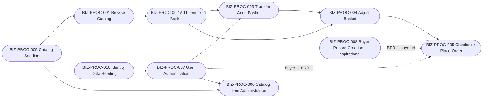

| Dependency | From → To | Basis (evidence) |
|---|---|---|
| Seeding precedes browse | BIZ-PROC-009 → BIZ-PROC-001 | Seeding populates `DATA-ENT-001/002/003` that Browse reads (`process_to_entity`) |
| Seeding precedes auth | BIZ-PROC-010 → BIZ-PROC-007 | Identity seeding populates `DATA-ENT-008/009` that Auth validates against |
| **Browse → Basket** | BIZ-PROC-001 → BIZ-PROC-002 | Customer selects an item viewed in Browse; shared `DATA-ENT-001` |
| Auth → Transfer | BIZ-PROC-007 → BIZ-PROC-003 | Transfer trigger is "anonymous user logs in or registers" |
| Add → Transfer | BIZ-PROC-002 → BIZ-PROC-003 | Transfer copies items created by Add (`DATA-ENT-004/005`, BR005) |
| Basket → Adjust | BIZ-PROC-002/003 → BIZ-PROC-004 | Adjust acts on the merged/finalized basket |
| **Basket → Checkout → Order** | BIZ-PROC-004 → BIZ-PROC-005 | Checkout consumes the basket; Basket→Order handoff `DATA-REL-011` |
| Auth supplies buyer id | BIZ-PROC-007 → BIZ-PROC-005 | Order requires buyer id (**BR011**); buyer ref is the ApplicationUser id soft-ref `DATA-REL-009` (ASMP-FE-003) |
| Buyer record → Order (aspirational) | BIZ-PROC-008 → BIZ-PROC-005 | **BR011/BR008**; aspirational (RC-002) — today satisfied by ApplicationUser, not a persisted Buyer |
| **Auth precedes admin** | BIZ-PROC-007 → BIZ-PROC-006 | Administrator (BIZ-ACT-003, Admin permission) must authenticate before catalog admin (BC-05 consumes BC-01 via authenticated APIs) |
| Seeding precedes admin | BIZ-PROC-009 → BIZ-PROC-006 | Admin views/edits seeded catalog data |

> **Module-cycle caveat:** the static module dependency CYCLE `APP-DEP-001` (RISK-CYCLE-001 in `DECISIONS.json`) spans BC-01..BC-05 and BC-07; its real-vs-static nature is **OQ-004 (UNRESOLVED)**. The *process* sequencing above is the intended business flow and is independent of that infrastructure-level cycle, which must be broken before the contexts deploy independently.

---

## 6. Process Ownership

Ownership maps each process to its functional bounded context (`DECISIONS.json` BC-01..BC-07) and primary actor(s) (`BIZ-ACT-001..005`). Per ASMP-FE-004, processes whose routes are physically hosted by the Web shell (BC-07 / `APP-SVC-006`) or PublicApi (`APP-SVC-011`) are owned **functionally** by the domain context; physical hosting stays with BC-07.

| Process | Owning bounded context | Primary actor(s) | Notes on ownership |
|---|---|---|---|
| BIZ-PROC-001 Browse Catalog | BC-01 Catalog | BIZ-ACT-001 Customer / BIZ-ACT-002 Anonymous | Reads catalog master data; storefront pages physically on Web shell (BC-07) |
| BIZ-PROC-002 Add Item to Basket | BC-02 Basket | BIZ-ACT-001 / BIZ-ACT-002 | Basket/Checkout Razor pages (`APP-API-050..052`) hosted by BC-07, functionally BC-02 |
| BIZ-PROC-003 Transfer Anonymous Basket | BC-02 Basket | BIZ-ACT-002 → BIZ-ACT-001 | Cross-context identity touchpoint to BC-04 (soft ref `DATA-REL-008`) |
| BIZ-PROC-004 Adjust Basket | BC-02 Basket | BIZ-ACT-001 Customer | — |
| BIZ-PROC-005 Checkout / Place Order | BC-03 Ordering | BIZ-ACT-001 Customer + BIZ-ACT-004 System (totals) | Consumes BC-02 basket; snapshot VO-03 copied from BC-01; buyer id from BC-04 |
| BIZ-PROC-006 Catalog Item Administration | BC-05 Catalog Administration (over BC-01) | BIZ-ACT-003 Administrator + BIZ-ACT-004 System (cache refresh) | Presentation/SPA context; OQ-001 (merge Admin+BlazorAdmin) UNRESOLVED |
| BIZ-PROC-007 User Authentication | BC-04 Identity & Access | BIZ-ACT-001 Customer + BIZ-ACT-004 System (token issuance) | Authenticate endpoint `APP-API-001` in PublicApi, functionally BC-04 |
| BIZ-PROC-008 Buyer Record Creation | BC-06 Buyer/Customer Profile (Aspirational) | BIZ-ACT-004 System | Aspirational (RC-002); buyer ref today = ApplicationUser (BC-04) |
| BIZ-PROC-009 Catalog Seeding | BC-01 Catalog | BIZ-ACT-004 System / Service Account | Startup batch responsibility |
| BIZ-PROC-010 Identity Data Seeding | BC-04 Identity & Access | BIZ-ACT-004 System / Service Account | Startup batch responsibility |

---

## 7. Process-to-Capability Mapping

All **17** `capability_to_process` cross-links from the graph, in full:

| # | Capability | Process | Bounded context |
|---|---|---|---|
| 1 | BIZ-CAP-002 Product Information Management | BIZ-PROC-001 Browse Catalog | BC-01 |
| 2 | BIZ-CAP-012 Add Item to Basket | BIZ-PROC-002 Add Item to Basket | BC-02 |
| 3 | BIZ-CAP-016 Anonymous-to-Registered Basket Transfer | BIZ-PROC-003 Transfer Anonymous Basket | BC-02 |
| 4 | BIZ-CAP-013 Quantity Adjustment | BIZ-PROC-004 Adjust Basket | BC-02 |
| 5 | BIZ-CAP-014 Basket Cleanup | BIZ-PROC-004 Adjust Basket | BC-02 |
| 6 | BIZ-CAP-019 Checkout Processing | BIZ-PROC-005 Checkout / Place Order | BC-03 |
| 7 | BIZ-CAP-020 Empty Basket Protection | BIZ-PROC-005 Checkout / Place Order | BC-03 |
| 8 | BIZ-CAP-021 Ordered Item Snapshot | BIZ-PROC-005 Checkout / Place Order | BC-03 |
| 9 | BIZ-CAP-023 Order Total Calculation | BIZ-PROC-005 Checkout / Place Order | BC-03 |
| 10 | BIZ-CAP-038 Catalog Item Create/Delete | BIZ-PROC-006 Catalog Item Administration | BC-05 |
| 11 | BIZ-CAP-037 Catalog Item List View | BIZ-PROC-006 Catalog Item Administration | BC-05 |
| 12 | BIZ-CAP-039 Cached Data Refresh | BIZ-PROC-006 Catalog Item Administration | BC-05 |
| 13 | BIZ-CAP-031 User Login | BIZ-PROC-007 User Authentication | BC-04 |
| 14 | BIZ-CAP-032 Token Issuance | BIZ-PROC-007 User Authentication | BC-04 |
| 15 | BIZ-CAP-026 Buyer Record Creation | BIZ-PROC-008 Buyer Record Creation | BC-06 (aspirational) |
| 16 | BIZ-CAP-009 Catalog Seeding | BIZ-PROC-009 Catalog Seeding | BC-01 |
| 17 | BIZ-CAP-034 Identity Data Seeding | BIZ-PROC-010 Identity Data Seeding | BC-04 |

### Coverage notes — capabilities and processes with NO link

**All 10 processes are linked** to at least one capability (each `BIZ-PROC-001..010` appears above), so no process is orphaned.

**Capabilities with NO `capability_to_process` link (22 of 39).** 39 total capabilities minus 17 distinctly linked = 22 unlinked. These exist in the capability map but have no direct process node in evidence — most are structural parents (L1/L2) or leaf capabilities whose behavior is exercised by a linked sibling process. They are listed so the gap is explicit, not invented:

| Linked-via / nature | Capabilities with no direct process link |
|---|---|
| Catalog parents/leaves (behavior under BIZ-PROC-001/006/009) | BIZ-CAP-001, BIZ-CAP-003, BIZ-CAP-004, BIZ-CAP-005, BIZ-CAP-006, BIZ-CAP-007, BIZ-CAP-008 |
| Basket parents (behavior under BIZ-PROC-002/003/004) | BIZ-CAP-010, BIZ-CAP-011, BIZ-CAP-015 |
| Ordering parents (behavior under BIZ-PROC-005) | BIZ-CAP-017, BIZ-CAP-018, BIZ-CAP-022 |
| Buyer/Profile — aspirational (RC-002) | BIZ-CAP-024, BIZ-CAP-025 |
| Payment — **inferred / LOW** (RC-002) | BIZ-CAP-027, BIZ-CAP-028 |
| Identity parents (behavior under BIZ-PROC-007/010) | BIZ-CAP-029, BIZ-CAP-030, BIZ-CAP-033 |
| Admin parents (behavior under BIZ-PROC-006) | BIZ-CAP-035, BIZ-CAP-036 |

*Of these, BIZ-CAP-024/025 (aspirational) and BIZ-CAP-027/028 (inferred, confidence LOW) are the only ones not behaviorally covered by an active linked process; the remainder are parent/aggregate capabilities whose behavior is realized through their linked descendant process. No process node is fabricated to cover them.*

---

## 8. Assumptions and Gaps (this document)

New assumptions are namespaced `ASMP-FE-1xx` to avoid collision with `DECISIONS.json` (`ASMP-FE-001..004`) and graph `ASSUMP-001..007`.

| ID | Statement | Basis (evidence) | Impact |
|---|---|---|---|
| ASMP-FE-101 | BIZ-PROC-008 Buyer Record Creation has no step-level flow; rendered as trigger→decision(BR008)→outcome only. | `BIZ-PROC-008.steps=[]`; `DATA-ENT-010` persisted=false aspirational (RC-002); reuses graph `ASMP-FE-003`. | Do not generate buyer/payment persistence workflow without an explicit forward-engineering decision (BC-06). |
| ASMP-FE-102 | BIZ-PROC-009 Catalog Seeding modeled as trigger→outcome; no steps in evidence. | `BIZ-PROC-009.steps=[]`; conf MEDIUM. | Seeding workflow detail must be confirmed before generating a seeding process. |
| ASMP-FE-103 | BIZ-PROC-010 Identity Data Seeding modeled as trigger→outcome; no steps in evidence. | `BIZ-PROC-010.steps=[]`; conf MEDIUM; role "Administrators" RC-008. | Seeding workflow detail must be confirmed before generating a seeding process. |
| ASMP-FE-104 | The "OnReorder / restock threshold" decision is NOT an evidenced process control; it derives only from `DATA-ENT-001` stock attributes (EVT-12, weakest candidate, `source_process_id=null`). | No `business.processes` node and no BR describes reorder; reuses graph `ASMP-FE-002`. | Do not model a reorder decision point as active behavior until a reorder process/rule is confirmed. |
| ASMP-FE-105 | Functional process ownership is attributed to domain contexts while physical hosting (Web shell / PublicApi) remains BC-07; honored for BIZ-PROC-002/003/005/007. | Reuses graph `ASMP-FE-004`; `service_to_api` maps storefront/identity routes to `APP-SVC-006/011`. | Downstream API-ownership docs must keep functional vs physical hosting distinct (OQ-009). |

**Open questions referenced:** OQ-001 (merge Admin + BlazorAdmin — affects BIZ-PROC-006 ownership), OQ-004 (real vs static module cycle APP-DEP-001), OQ-005 (no confirmed JWT enforcement on PublicApi — affects BIZ-PROC-007 boundary), OQ-009 (synthetic ROUTE/CLI labels).
