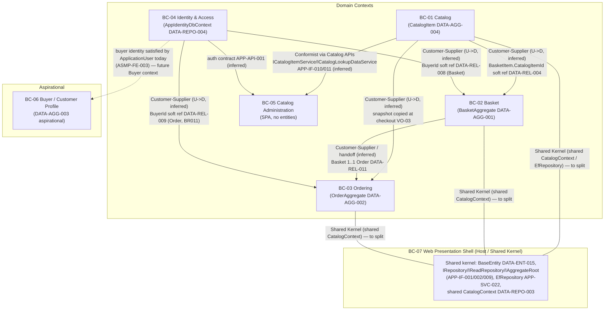

# 05 — Domain Model (Domain-Driven Design)

> ⚠️ **DISC-001 (verified 2026-06-25):** `CatalogItem` stock fields (`AvailableStock`, `RestockThreshold`,
> `MaxStockThreshold`, `OnReorder`) and the derived `StockReorderTriggered` (EVT-12) are a **verified
> discrepancy** — absent from the real `eShopOnWeb` source. Do not generate the stock fields or any reorder
> event/capability. See [`../EVIDENCE_VERIFICATION_REPORT.md`](../EVIDENCE_VERIFICATION_REPORT.md).

> **Single source of truth:** `ENTERPRISE_KNOWLEDGE_GRAPH.json`. Every element below traces to graph node ids (BIZ-CAP/PROC, DATA-ENT/REL/AGG/REPO, APP-SVC/IF/API/DEP) and reuses the shared decisions in `.work/DECISIONS.json` verbatim.
>
> **Status discipline (honored throughout):** Buyer (DATA-ENT-010) and PaymentMethod (DATA-ENT-011) are `persisted=false`, `status=aspirational/unimplemented` (RC-002); BuyerAggregate (DATA-AGG-003) is aspirational; payment capabilities BIZ-CAP-027/028 are `inferred`, confidence LOW. CatalogItemDetails (DATA-ENT-014) is aspirational. `target_stack` is **EMPTY (0 nodes)** — no target technology is asserted as discovered here; the legacy stack is labelled **Current (legacy)**.
>
> **Modeling-candidate flag:** Value objects (VO-##) and domain events (EVT-##) are forward-engineering **modeling candidates marked INFERRED**; each is anchored to a DATA entity attribute set or a BIZ-PROC / business rule. They are not assertions of existing code constructs.

---

## 1. Bounded Contexts

The seven bounded contexts below are reused **exactly** from `DECISIONS.json` (BC-01..BC-07). Grouping derives only from evidence module candidates (APP-SVC-*), data ownership (DATA-REPO-003/004, `entity_to_service`), and aggregates (DATA-AGG-*). BC-06 is **aspirational only**; BC-07 is a **presentation/host shell**, not a domain context.

### BC-01 — Catalog
- **Purpose:** Owns product/catalog master data, classification (brand/type), reference data, catalog seeding, and admin-facing catalog read/list views consumed via APIs. Canonical source of truth for live product data (DATA-ENT-001).
- **Capabilities:** BIZ-CAP-001..009 (all ACTIVE/HIGH) — Catalog Management, Product Information Management, Catalog Item Details Maintenance, Product Classification, Product Image Management, Catalog Reference Data, Brand Management, Type Management, Catalog Seeding.
- **Processes:** BIZ-PROC-001 (Browse Catalog), BIZ-PROC-009 (Catalog Seeding).
- **Aggregates:** DATA-AGG-004 (CatalogItem).
- **Entities:** DATA-ENT-001 CatalogItem (persisted), DATA-ENT-002 CatalogBrand (persisted), DATA-ENT-003 CatalogType (persisted), DATA-ENT-012 CatalogItemOrdered (persisted; physically catalog-owned per `entity_to_service` but conceptually an Order snapshot — see VO-03 / BC-03), DATA-ENT-014 CatalogItemDetails (**aspirational/unimplemented** — design input only).
- **Ubiquitous-language terms** (from entity descriptions): *Catalog Item* (product offered for sale, with stock-management fields AvailableStock/RestockThreshold/MaxStockThreshold/OnReorder); *Brand* (manufacturer/label grouping products, e.g. "Adventure Works"); *Type* (product category, e.g. Mugs, T-Shirts, stickers); *Picture URI*; *Restock Threshold / On Reorder*.
- **Boundary note:** Highest-coupling module (APP-SVC-001 coupling 13, boundary Weak, readiness Blocked). Direct endpoint→EfRepository violations (APP-DEP-002..007) and UriComposer high-coupling (APP-DEP-010) sit here. The shared CatalogContext (DATA-REPO-003) crosses BC-01/BC-02/BC-03 and requires a per-context split.

### BC-02 — Basket
- **Purpose:** Owns the shopping-cart lifecycle: add/adjust items, quantity rules, cleanup, session continuity, and anonymous-to-registered basket transfer. BasketAggregate is the consistency boundary.
- **Capabilities:** BIZ-CAP-010..016 (ACTIVE/HIGH) — Basket/Shopping Cart Management, Basket Maintenance, Add Item to Basket, Quantity Adjustment, Basket Cleanup, Session Continuity, Anonymous-to-Registered Basket Transfer.
- **Processes:** BIZ-PROC-002 (Add Item to Basket), BIZ-PROC-003 (Transfer Anonymous Basket to Registered User), BIZ-PROC-004 (Adjust Basket).
- **Aggregates:** DATA-AGG-001 (BasketAggregate).
- **Entities:** DATA-ENT-004 Basket (persisted), DATA-ENT-005 BasketItem (persisted).
- **Ubiquitous-language terms:** *Basket* (temporary collection of products a customer intends to purchase; belongs to one customer, keyed by *BuyerId*); *Basket Item / Line* (a single line referencing a CatalogItem with unit price captured at time of adding plus quantity); *BuyerId* (soft, cross-database reference to AspNetUsers.Id, DATA-REL-008).
- **Boundary note:** APP-SVC-003 coupling 9, boundary Weak, readiness Blocked; contributor to the APP-DEP-001 cycle. BasketItem references CatalogItem softly (DATA-REL-004) — carry CatalogItemId as an identifier, do not import the catalog aggregate. Basket→Order transition (DATA-REL-011) is the BC-02 → BC-03 handoff. Checkout/Basket Razor pages (APP-API-050..052) are physically served by the Web shell (APP-SVC-006) but functionally belong here (ASMP-FE-004).

### BC-03 — Ordering
- **Purpose:** Owns order creation from a basket, ordered-item snapshotting, shipping-address capture, order-total calculation, and order-history queries. OrderAggregate is the consistency boundary.
- **Capabilities:** BIZ-CAP-017..023 (ACTIVE/HIGH) — Order Management, Order Creation, Checkout Processing, Empty Basket Protection, Ordered Item Snapshot, Order Calculation, Order Total Calculation.
- **Processes:** BIZ-PROC-005 (Checkout / Place Order).
- **Aggregates:** DATA-AGG-002 (OrderAggregate).
- **Entities:** DATA-ENT-006 Order (persisted, PII), DATA-ENT-007 OrderItem (persisted), DATA-ENT-013 Address (persisted, PII), DATA-ENT-012 CatalogItemOrdered (persisted snapshot; see VO-03).
- **Ubiquitous-language terms:** *Order* (a confirmed purchase recording OrderDate, a flattened owned-type shipping Address, and BuyerId); *Order Item* (a single purchased line embedding a snapshot of the catalog item plus UnitPrice and Units); *Ordered Item Snapshot* (intentional historical denormalization, not a live FK); *Ship-To Address*; *Order Total*.
- **Boundary note:** APP-SVC-004 coupling 4 (lowest among core modules), boundary Weak, readiness Blocked. OrderAggregate members = Order, OrderItem, Address, CatalogItemOrdered. Order requires a BuyerId (BR011, DATA-REL-009 soft reference to ApplicationUser); the Buyer concept (DATA-ENT-010 / DATA-AGG-003) is aspirational, so the buyer reference is today the ApplicationUser id (ASMP-FE-003). Order/MyOrders + Order/Detail (APP-API-035/036) are physically served by the Web shell via MediatR; functionally Ordering (ASMP-FE-004).

### BC-04 — Identity & Access
- **Purpose:** Owns authentication, JWT token issuance, access control, user/role data, and identity seeding. Distinct from the Buyer/Customer profile concept (BC-06).
- **Capabilities:** BIZ-CAP-029..034 (ACTIVE/HIGH) — Identity & Authentication, Access Control, User Login, Token Issuance, Identity Seeding, Identity Data Seeding.
- **Processes:** BIZ-PROC-007 (User Authentication), BIZ-PROC-010 (Identity Data Seeding).
- **Aggregates:** none (no DATA-AGG in evidence).
- **Entities:** DATA-ENT-008 ApplicationUser (persisted, PII), DATA-ENT-009 Role (persisted).
- **Ubiquitous-language terms:** *Application User* (identity/account of a customer or staff member — login credentials, email, roles; canonical source of truth for identity); *Role* (role governing system access; confirmed role name "Administrators", RC-008); *JWT token / identity & role claims*.
- **Boundary note:** APP-SVC-002 coupling 8, boundary Weak, readiness Blocked; owns AppIdentityDbContext (DATA-REPO-004) serving ApplicationUser + Role — already isolated from the shared CatalogContext. Role ownership inferred (ASSUMP-006, conf 0.7). The Authenticate endpoint (APP-API-001) lives in PublicApi (APP-SVC-011) but is functionally Identity; the /Manage, /User, /Account flows (APP-API-014..034, 037, 038, 041..044) are physically served by the Web shell (ASMP-FE-004). TECH-SEC-010 (no confirmed JWT enforcement on PublicApi) / OQ-005 apply here.

### BC-05 — Catalog Administration
- **Purpose:** Administrative catalog operations surface — item list view, create/delete, and cached-data refresh — delivered through the BlazorAdmin SPA. A behavior-only presentation context over BC-01 Catalog capabilities.
- **Capabilities:** BIZ-CAP-035..039 (ACTIVE/HIGH) — Admin Catalog Operations (Blazor), Administrative Catalog Interface, Catalog Item List View, Catalog Item Create/Delete, Cached Data Refresh.
- **Processes:** BIZ-PROC-006 (Catalog Item Administration).
- **Aggregates / Entities:** none (consumes BC-01 via ICatalogItemService / ICatalogLookupDataService, APP-IF-010/011).
- **Ubiquitous-language terms:** *Catalog Item List View*; *Cached Data Refresh* (refresh of the cached local catalog item list after create/delete); *Admin* / *BlazorAdmin SPA*.
- **Boundary note:** **OQ-001 UNRESOLVED** — whether to MERGE the Admin module (APP-SVC-005, coupling 3) with the BlazorAdmin deployable (APP-SVC-016, non-deployable frontend SPA, APP-RISK-006) is kept SEPARATE pending human review. BlazorAdmin has runtime HTTP dependencies on PublicApi (APP-DEP-017) and Web (APP-DEP-018). The Admin module depends on Identity (BC-04) and is the cycle head in APP-DEP-001.

### BC-06 — Buyer / Customer Profile (Aspirational)
- **Purpose:** Candidate context for buyer identity and payment information. **ENTIRELY aspirational/unimplemented** (RC-002); surfaced only because the buyer reference (BuyerId) and payment concepts appear in the model. Kept separate from BC-04.
- **Capabilities:** BIZ-CAP-024 Buyer/Customer Profile Management (MEDIUM), BIZ-CAP-025 Buyer Identity (MEDIUM), BIZ-CAP-026 Buyer Record Creation (MEDIUM), BIZ-CAP-027 Payment Information (**inferred, LOW**), BIZ-CAP-028 Payment Method Management (**inferred, LOW**).
- **Processes:** BIZ-PROC-008 (Buyer Record Creation — 0 detailed steps; governed by BR008/BR011).
- **Aggregates:** DATA-AGG-003 (BuyerAggregate, aspirational).
- **Entities:** DATA-ENT-010 Buyer (`persisted=false`, aspirational), DATA-ENT-011 PaymentMethod (`persisted=false`, aspirational).
- **Ubiquitous-language terms:** *Buyer* (aspirational customer aggregate that would store payment methods; confirmed dead/unmapped code); *Payment Method* (a way for a customer to pay, associated with a Buyer; confirmed dead/unmapped code, not currently PCI-DSS scope).
- **Boundary note:** **DESIGN INPUT, not migration data.** Relationship DATA-REL-012 (Buyer 1..* PaymentMethod) is aspirational. No services, APIs, or repositories in evidence. Today the buyer identity is satisfied by ApplicationUser (BC-04). Do **not** generate persistence for this context without an explicit forward-engineering decision (ASMP-FE-003).

### BC-07 — Web Presentation Shell (Cross-Cutting)
- **Purpose:** The MVC/Razor web application host that physically serves storefront, basket, order-history, and identity pages and exposes health checks. A **presentation/composition shell, not a domain context**; its routes are functionally owned by BC-02/BC-03/BC-04.
- **Capabilities / Processes / Aggregates / Entities:** none (host/cross-cutting only).
- **Modules grouped:** Web (APP-SVC-006), PublicApi (APP-SVC-011), ApplicationCore (APP-SVC-007), DataAccess (APP-SVC-008) + EfRepository (APP-SVC-022, coupling 16, APP-DEP-009), Infrastructure (APP-SVC-009), CrossCutting (APP-SVC-010), SharedContracts (APP-SVC-012), Verification (APP-SVC-013), plus APP-SVC-040/041/042/043/022.
- **Boundary note:** Shared kernel / infrastructure to be split per target boundaries; EfRepository and the shared CatalogContext (DATA-REPO-003) are the principal split obstacles. APP-DEP-011 records Web→PublicApi has no project reference (runtime-only). Health checks (APP-API-012/013) and bootstrap (APP-API-054/055) live here. Project references APP-DEP-013..016 and the runtime SQL dependency APP-DEP-019 participate in the APP-DEP-001 cycle.

---

## 2. Aggregates & Aggregate Roots

The graph records exactly **four** aggregates (DATA-AGG-001..004). Aggregate roots are the consistency boundary; only the root is referenced from outside the aggregate.

| Aggregate | Id | Root entity | Member entities | Context | Status |
|---|---|---|---|---|---|
| BasketAggregate | DATA-AGG-001 | **Basket** (DATA-ENT-004) | Basket, BasketItem (DATA-ENT-005) | BC-02 | implemented |
| OrderAggregate | DATA-AGG-002 | **Order** (DATA-ENT-006) | Order, OrderItem (DATA-ENT-007), Address (DATA-ENT-013), CatalogItemOrdered (DATA-ENT-012) | BC-03 | implemented |
| BuyerAggregate | DATA-AGG-003 | **Buyer** (DATA-ENT-010) | Buyer, PaymentMethod (DATA-ENT-011) | BC-06 | **aspirational/unimplemented** |
| CatalogItem | DATA-AGG-004 | **CatalogItem** (DATA-ENT-001) | CatalogItem | BC-01 | implemented |

**Notes on roots and invariants (evidence-anchored):**
- **BasketAggregate (DATA-AGG-001):** Root Basket owns its BasketItem collection (DATA-REL-003, Basket 1..* BasketItem). Invariants: zero-quantity lines are removed (BR006), negative quantities rejected (BR007), adds consolidate quantity if the line already exists (BR005). External references to a basket use the root only; CatalogItemId on a line is a soft cross-context reference to BC-01 (DATA-REL-004).
- **OrderAggregate (DATA-AGG-002):** Root Order owns OrderItem (DATA-REL-005, 1..*), each OrderItem owns a CatalogItemOrdered snapshot (DATA-REL-006, 1..1), and Order owns one Address (DATA-REL-007, 1..1). Invariants: order requires a valid BuyerId (BR011), checkout blocked for empty basket (BR012), order total = Σ(unit price × quantity) (BR010), each line requires a valid catalog item id/name/picture (BR009). The snapshot members decouple the order from live catalog state.
- **CatalogItem (DATA-AGG-004):** A single-entity aggregate; its root and sole member is CatalogItem. OQ-006 notes the aggregate node shares the name "CatalogItem" with the entity (DATA-ENT-001) — treated here as the same conceptual root, not a duplicate.
- **BuyerAggregate (DATA-AGG-003):** Aspirational. Root Buyer would own PaymentMethod (DATA-REL-012, 1..*); none of this is persisted (RC-002). Modeled for completeness only; not generated without a deliberate decision (ASMP-FE-003).

---

## 3. Entities (15 DATA-ENT, grouped by context)

`persisted` and `status` flags are reproduced verbatim from the graph. PII flags from entity nodes are noted.

### BC-01 — Catalog
| Entity | Id | Persisted | Status | Key attributes | PII |
|---|---|---|---|---|---|
| CatalogItem | DATA-ENT-001 | true | implemented | Id, Name, Description, Price, PictureUri, CatalogTypeId, CatalogBrandId, AvailableStock, RestockThreshold, MaxStockThreshold, OnReorder | No |
| CatalogBrand | DATA-ENT-002 | true | implemented | Id, Brand | No |
| CatalogType | DATA-ENT-003 | true | implemented | Id, Type | No |
| CatalogItemOrdered | DATA-ENT-012 | true | implemented | ItemOrdered_CatalogItemId, ItemOrdered_ProductName, ItemOrdered_PictureUri | No |
| CatalogItemDetails | DATA-ENT-014 | **false** | **aspirational/unimplemented** | (none) | No |

> DATA-ENT-012 is physically catalog-owned (`entity_to_service` DATA-ENT-012→APP-SVC-001) but is conceptually an OrderAggregate snapshot — modeled as value object VO-03 in BC-03. DATA-ENT-014 is a likely non-persisted DTO/read-model struct; design input only.

### BC-02 — Basket
| Entity | Id | Persisted | Status | Key attributes | PII |
|---|---|---|---|---|---|
| Basket | DATA-ENT-004 | true | implemented | Id, BuyerId | No |
| BasketItem | DATA-ENT-005 | true | implemented | Id, BasketId, CatalogItemId, UnitPrice, Quantity | No |

### BC-03 — Ordering
| Entity | Id | Persisted | Status | Key attributes | PII |
|---|---|---|---|---|---|
| Order | DATA-ENT-006 | true | implemented | Id, BuyerId, OrderDate, ShipToAddress_Street/City/State/Country/ZipCode | **Yes** |
| OrderItem | DATA-ENT-007 | true | implemented | Id, OrderId, ItemOrdered_CatalogItemId, ItemOrdered_ProductName, ItemOrdered_PictureUri, UnitPrice, Units | No |
| Address | DATA-ENT-013 | true | implemented | ShipToAddress_Street, ShipToAddress_City, ShipToAddress_State, ShipToAddress_Country, ShipToAddress_ZipCode | **Yes** |
| CatalogItemOrdered | DATA-ENT-012 | true | implemented | (snapshot — see BC-01 / VO-03) | No |

> Address (DATA-ENT-013) and CatalogItemOrdered (DATA-ENT-012) are flattened/owned types embedded into the Orders/OrderItems tables (not their own tables). Modeled as value objects VO-01 and VO-03.

### BC-04 — Identity & Access
| Entity | Id | Persisted | Status | Key attributes | PII |
|---|---|---|---|---|---|
| ApplicationUser | DATA-ENT-008 | true | implemented | Id, UserName, Email, PasswordHash, PhoneNumber | **Yes** |
| Role | DATA-ENT-009 | true | implemented | Id, Name | No |

> IdentityDb schema is INFERRED standard ASP.NET Core Identity (confidence 0.7); Role ownership inferred (ASSUMP-006).

### BC-06 — Buyer / Customer Profile (Aspirational)
| Entity | Id | Persisted | Status | Key attributes | PII |
|---|---|---|---|---|---|
| Buyer | DATA-ENT-010 | **false** | **aspirational/unimplemented** | (none) | No |
| PaymentMethod | DATA-ENT-011 | **false** | **aspirational/unimplemented** | (none) | No |

> Confirmed dead/unmapped code (RC-002): no DbSet, no EF configuration, no repository usage. Design input only.

### Cross-cutting (BC-07 / ApplicationCore)
| Entity | Id | Persisted | Status | Key attributes | PII |
|---|---|---|---|---|---|
| BaseEntity | DATA-ENT-015 | **false** | implemented | Id | No |

> Abstract base class providing the Id property (`entity_to_service` DATA-ENT-015→APP-SVC-007). Not its own table; a shared-kernel supertype, not a domain entity in any single context.

---

## 4. Value Objects

Reused verbatim from `DECISIONS.json` (VO-01..VO-06). All are **INFERRED** modeling candidates anchored to entity attribute sets and business rules.

| VO | Name | Context | Source entity | Fields | Status | Basis / note |
|---|---|---|---|---|---|---|
| VO-01 | Address | BC-03 | DATA-ENT-013 | Street, City, State, Country, ZipCode | INFERRED | Owned member of OrderAggregate (DATA-REL-007); ShipToAddress_* columns. **PII-bearing** (DATA-ENT-013 pii=true). Treat as immutable Address VO embedded in Order. |
| VO-02 | BasketItem (Line) | BC-02 | DATA-ENT-005 | CatalogItemId, UnitPrice, Quantity | INFERRED | Member of BasketAggregate (DATA-REL-003); has an Id (local entity) but purchase-snapshot semantics make it a strong VO candidate. CatalogItemId is a soft cross-context ref to BC-01 (DATA-REL-004). Quantity governed by BR006/BR007. |
| VO-03 | CatalogItemOrdered (Ordered-Item Snapshot) | BC-03 | DATA-ENT-012 | CatalogItemId, ProductName, PictureUri | INFERRED | Snapshot decoupling Order from live Catalog (DATA-REL-006, BR009; BIZ-PROC-005). Physically catalog-owned in evidence (DATA-ENT-012→APP-SVC-001) but conceptually Order-owned — resolve as copied-at-checkout VO in BC-03. |
| VO-04 | OrderItem (Line) | BC-03 | DATA-ENT-007 | CatalogItemOrdered, UnitPrice, Units | INFERRED | Member of OrderAggregate (DATA-REL-005/006); BR010 total = sum(unit price × qty). Has an Id (aggregate-internal entity), surfaced as VO because meaningful only within OrderAggregate. |
| VO-05 | Money (Price) | BC-01 | DATA-ENT-001 | Amount | INFERRED | Price (DATA-ENT-001) / UnitPrice (DATA-ENT-005/007); BR010, BIZ-CAP-023. **No currency attribute exists in evidence** — a currency-bearing Money VO would be NEW design (offered as amount-only candidate). Gap: **ASMP-FE-001**. |
| VO-06 | ProductClassification (Brand/Type Reference) | BC-01 | DATA-ENT-001 | CatalogBrandId, CatalogTypeId | INFERRED | Classification pair on CatalogItem (DATA-REL-001/002, BIZ-CAP-004, BR002/BR003). CatalogBrand (DATA-ENT-002) / CatalogType (DATA-ENT-003) remain reference entities. |

---

## 5. Domain Services

Mapped from `application.services` whose `kind = domain-service` plus the relevant application interfaces (APP-IF-*). Domain services hold behavior that does not naturally belong to a single entity/aggregate; ports/abstractions are infrastructure boundaries to be dependency-inverted when breaking the APP-DEP-001 cycle.

| Domain service / port | Id | Kind | Context | Role |
|---|---|---|---|---|
| UriComposer | APP-SVC-020 | domain-service | BC-01 | Composes catalog item picture URIs (Product Image Management, BIZ-CAP-005). **HIGH-coupling component (score 8, ARCH-VIOL-010, APP-DEP-010)** — invert behind IUriComposer when carving BC-01. |
| BasketGuards | APP-SVC-027 | domain-service | BC-02 | Guard/invariant enforcement for the basket (GuardExtensions), enforcing basket-quantity rules (BR006/BR007) and empty-basket guard feeding checkout (BR012). |
| IUriComposer | APP-IF-004 | abstraction | BC-01 | Port implemented by UriComposer (APP-SVC-020); the seam for catalog URI composition. |
| ITokenClaimsService | APP-IF-003 | port | BC-04 | Token/claims issuance port implemented by IdentityTokenClaimService (APP-SVC-021); underpins JWT issuance (BIZ-CAP-032, BIZ-PROC-007). |
| IBasketService | APP-IF-006 | abstraction | BC-02 | Basket command operations port (no implementor recorded — `implemented_by=[]`; an application/domain seam to realize). |
| IBasketQueryService | APP-IF-007 | abstraction | BC-02 | Basket query/read port (no implementor recorded; query-side seam). |
| ICatalogItemService | APP-IF-010 | abstraction | BC-01 / consumed by BC-05 | Catalog item operations port; implemented by CachedCatalogItemServiceDecorator (APP-SVC-044). BC-05 admin SPA consumes it. |
| ICatalogLookupDataService | APP-IF-011 | abstraction | BC-01 / consumed by BC-05 | Brand/type lookup port; implemented by CachedCatalogLookupDataServiceDecorator (APP-SVC-045). |
| IRepository&lt;T&gt; | APP-IF-001 | abstraction | BC-07 (shared kernel) | Generic write repository; implemented by EfRepository (APP-SVC-022). |
| IReadRepository&lt;T&gt; | APP-IF-002 | abstraction | BC-07 (shared kernel) | Generic read repository; implemented by EfRepository (APP-SVC-022). |
| IAggregateRoot | APP-IF-009 | abstraction | BC-07 (shared kernel) | Marker abstraction for aggregate roots (Basket, Order, CatalogItem); enforces "reference roots only." |
| IAppLogger&lt;T&gt; | APP-IF-005 | abstraction | BC-07 (cross-cutting) | Logging port (no implementor recorded). |
| IEmailSender | APP-IF-008 | port | BC-04 (notifications) | Email-sending port (no implementor recorded); used by SendVerificationEmail (APP-API-016). |
| IMediator | APP-IF-012 | external | BC-07 | External mediator (MediatR, TECH-CUR-011) used by OrderController and order query handlers (APP-SVC-038/041/042/043) for APP-API-035/036. |
| CustomAuthStateProvider | APP-IF-013 / APP-SVC-051 | UI | BC-05 | Blazor auth-state provider (UI integration), not a domain service; listed for completeness as the BlazorAdmin auth seam. |

> **Note on application/query handlers:** GetMyOrders / GetMyOrdersHandler / GetOrderDetails (APP-SVC-041/042/043, layer Application, module Web) are functional BC-03 query handlers physically hosted by the Web shell (ASMP-FE-004); they are application services (CQRS query side via IMediator), not domain services, and are listed here only to anchor the IMediator seam.

---

## 6. Domain Events

Reused verbatim from `DECISIONS.json` (EVT-01..EVT-12). All are **INFERRED** candidates anchored to a BIZ-PROC and/or business rule. EVT-12 is the weakest candidate (no process node).

| Event | Id | Context | Source process | Trigger anchor | Status |
|---|---|---|---|---|---|
| ItemAddedToBasket | EVT-01 | BC-02 | BIZ-PROC-002 | Add/consolidate item then persist basket (BR005); BIZ-CAP-012 | INFERRED |
| BasketQuantityAdjusted | EVT-02 | BC-02 | BIZ-PROC-004 | Adjust basket (BR006 zero-qty removed; BR007 negative rejected); BIZ-CAP-013/014 | INFERRED |
| AnonymousBasketTransferred | EVT-03 | BC-02 | BIZ-PROC-003 | Copy each item from anonymous to user basket (BR005); BIZ-CAP-016 | INFERRED |
| OrderPlaced | EVT-04 | BC-03 | BIZ-PROC-005 | Create order with buyer id, address, items (BR011); BC-02→BC-03 handoff (DATA-REL-011); BIZ-CAP-018/019 | INFERRED |
| OrderTotalCalculated | EVT-05 | BC-03 | BIZ-PROC-005 | Calculate total from prices/quantities (BR010); BIZ-CAP-023 | INFERRED |
| CheckoutRejectedEmptyBasket | EVT-06 | BC-03 | BIZ-PROC-005 | Block checkout for empty basket (BR012, GuardExtensions); BIZ-CAP-020 | INFERRED |
| UserAuthenticated | EVT-07 | BC-04 | BIZ-PROC-007 | Generate signed JWT with identity/role claims; BIZ-CAP-031/032 | INFERRED |
| CatalogItemCreated | EVT-08 | BC-01 | BIZ-PROC-006 | Create catalog item (BR001/BR002/BR003/BR004); BIZ-CAP-038 | INFERRED |
| CatalogItemDeleted | EVT-09 | BC-01 | BIZ-PROC-006 | Delete catalog item; BIZ-CAP-038 | INFERRED |
| CatalogCacheRefreshed | EVT-10 | BC-05 | BIZ-PROC-006 | Refresh cached catalog list after create/delete; BIZ-CAP-039 (APP-SVC-049/044/045) | INFERRED |
| BuyerRecordCreated | EVT-11 | BC-06 | BIZ-PROC-008 | Create buyer record linked to valid identity (BR008); BIZ-CAP-026 — **aspirational** | INFERRED |
| StockReorderTriggered | EVT-12 | BC-01 | (none) | Derived only from OnReorder/RestockThreshold/MaxStockThreshold/AvailableStock on DATA-ENT-001; **no process/rule node** | INFERRED |

> **EVT-12 caveat (ASMP-FE-002):** weakest candidate — no BIZ-PROC node or business rule describes a reorder workflow; inferred purely from CatalogItem stock attributes. Do not generate reorder behavior without confirming the lifecycle. EVT-11 governs an aspirational entity (ASMP-FE-003) and must not drive persistence generation.

---

## 7. Context Relationships (Context Map)

Relationship patterns are derived from module dependencies (APP-DEP-*), data ownership (DATA-REPO-003/004), and soft cross-context references (DATA-REL-008/009). Pattern labels (Shared Kernel / Customer-Supplier / Anti-Corruption Layer / Conformist) are **inferred** from those couplings and are explicitly marked as such; the underlying coupling facts are evidence.

### 7.1 Module-dependency cycle (RISK-CYCLE-001 / APP-DEP-001)

The recorded module cycle spans BC-01..BC-05 and BC-07 and must be broken before contexts deploy independently. Its reality (true runtime cycle vs static-resolution artifact) is **unresolved (OQ-004)**.

### 7.2 Relationship pattern catalogue

| From | To | Pattern (status) | Evidence | Direction |
|---|---|---|---|---|
| BC-01 Catalog | BC-02 Basket | Customer-Supplier (**inferred**) | BasketItem.CatalogItemId soft ref (DATA-REL-004); carry as identifier, not aggregate import | Upstream → Downstream |
| BC-01 Catalog | BC-03 Ordering | Customer-Supplier (**inferred**) | Ordered-item snapshot VO-03 copied at checkout (DATA-REL-006, BR009, BIZ-PROC-005) | Upstream → Downstream |
| BC-02 Basket | BC-03 Ordering | Customer-Supplier / handoff (**inferred**) | Basket 1..1 Order transition (DATA-REL-011); OrderPlaced EVT-04 | Upstream → Downstream |
| BC-04 Identity | BC-02 Basket | Customer-Supplier (**inferred**) | Basket *..1 ApplicationUser soft ref BuyerId (DATA-REL-008) | Upstream → Downstream |
| BC-04 Identity | BC-03 Ordering | Customer-Supplier (**inferred**) | Order *..1 ApplicationUser soft ref BuyerId (DATA-REL-009, BR011) | Upstream → Downstream |
| BC-01 Catalog | BC-05 Catalog Admin | Conformist over Catalog APIs (**inferred**) | ICatalogItemService / ICatalogLookupDataService (APP-IF-010/011); APP-API-002..008; runtime HTTP APP-DEP-017/018 | Upstream → Downstream |
| BC-04 Identity | BC-05 Catalog Admin | Conformist / auth contract (**inferred**) | Authenticate APP-API-001 consumed by BlazorAdmin; CustomAuthStateProvider APP-SVC-051 | Upstream → Downstream |
| BC-04 Identity | BC-06 Buyer (Aspirational) | Substitution / future split (**inferred**) | ApplicationUser id satisfies BuyerId today (ASMP-FE-003); future Buyer context distinct from auth | — |
| BC-01/02/03 | BC-07 Shell | Shared Kernel — **to split** | Shared CatalogContext DATA-REPO-003 (crosses BC-01/02/03); EfRepository APP-SVC-022; BaseEntity DATA-ENT-015; APP-IF-001/002/009 | Shared kernel |
| All domain | BC-07 Shell | Host / composition (**not a domain relationship**) | service_to_api maps APP-API-014..052 to Web APP-SVC-006; APP-API-001 to PublicApi APP-SVC-011 (ASMP-FE-004) | Host |

### 7.3 Coupling risks to break (from DECISIONS.json)

- **RISK-CYCLE-001 (APP-DEP-001):** break via dependency-inversion of shared abstractions (APP-IF-001..013), splitting the shared CatalogContext (DATA-REPO-003), and removing direct endpoint→EfRepository violations (APP-DEP-002..008). OQ-004 unresolved.
- **RISK-SHARED-DBCTX-001 (DATA-REPO-003):** CatalogContext persists Catalog (BC-01), Basket (BC-02) and Order (BC-03) entities in one DbContext — split along context lines. AppIdentityDbContext (DATA-REPO-004) already isolates BC-04. OQ-008.
- **RISK-EFREPO-001 (APP-DEP-009):** EfRepository total coupling 16 (ARCH-VIOL-009) plus endpoint/PageModel→EfRepository violations (APP-DEP-002..008) — introduce per-context repository abstractions behind APP-IF-001/002 and route through application services.

---

## 8. Gaps & Forward-Engineering Assumptions

| Id | Statement | Basis | Impact |
|---|---|---|---|
| ASMP-FE-001 | A currency-bearing Money VO (VO-05) is not derivable; Price/UnitPrice are bare decimals on DATA-ENT-001/005/007 | No currency field in any entity key_attributes; target_stack empty | Multi-currency would be NEW design; default to amount-only Money VO; do not assert currency as discovered |
| ASMP-FE-002 | StockReorderTriggered (EVT-12) inferred only from OnReorder/RestockThreshold/MaxStockThreshold/AvailableStock on DATA-ENT-001 | No reorder BIZ-PROC node or business rule | Confirm reorder lifecycle with stakeholders before generating reorder behavior; weakest event candidate |
| ASMP-FE-003 | BC-06 Buyer/Customer Profile surfaced only from aspirational nodes + soft BuyerId; ApplicationUser (BC-04) satisfies the buyer reference today | DATA-ENT-010/011 persisted=false (RC-002); DATA-AGG-003 aspirational; DATA-REL-008/009 soft refs; BIZ-CAP-027/028 inferred LOW | Do not generate Buyer/Payment persistence without explicit decision; Identity-vs-Buyer split is a deliberate forward-engineering choice |
| ASMP-FE-004 | Web-shell-served routes (APP-SVC-006) and PublicApi authenticate (APP-SVC-011) attributed to FUNCTIONAL contexts (BC-02/03/04); physical hosting stays with BC-07 | service_to_api maps; ASSUMP-001/002 | Downstream documents must distinguish functional ownership from physical hosting; honor OQ-009 |

**Open questions referenced:** OQ-001 (merge Admin + BlazorAdmin — BC-05), OQ-004 (real vs artifact dependency cycle), OQ-005 (PublicApi JWT enforcement — BC-04 / TECH-SEC-010), OQ-006 (CatalogItem aggregate vs entity duplication — DATA-AGG-004), OQ-008 (IRepository/IReadRepository served entities partly inferred), OQ-009 (synthetic ROUTE/CLI method labels).

**Graph assumptions reused:** ASSUMP-006 (Role ownership inferred, conf 0.7).
