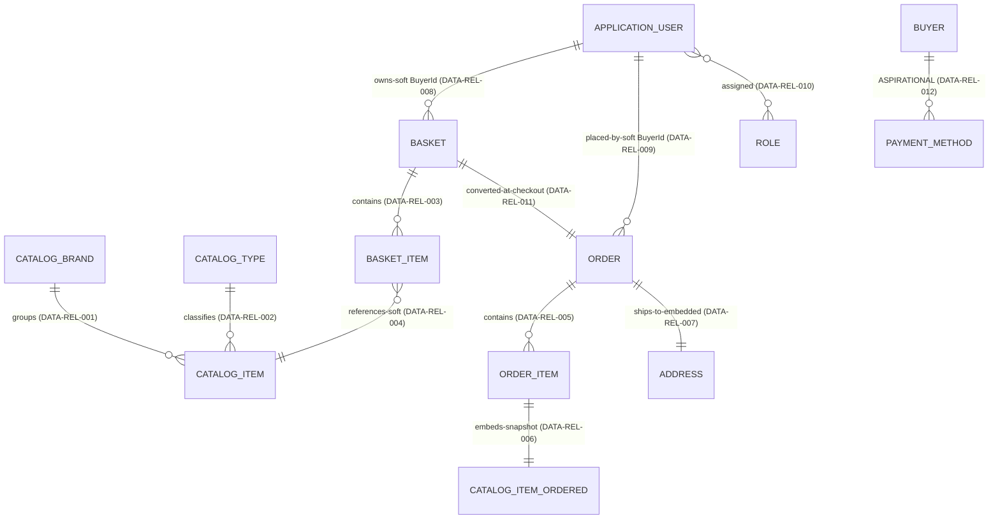

# 07 — Data Model Specification

> ⚠️ **DISC-001 (verified 2026-06-25):** `CatalogItem` stock fields (`AvailableStock`, `RestockThreshold`,
> `MaxStockThreshold`, `OnReorder`) are a **verified discrepancy** — not in the real `eShopOnWeb` source.
> Do not generate them or any stock/reorder constraint. See
> [`../EVIDENCE_VERIFICATION_REPORT.md`](../EVIDENCE_VERIFICATION_REPORT.md).

**Status:** Forward-engineering specification (technology-neutral)
**Single source of truth:** `enterprise-foundation-package/ENTERPRISE_KNOWLEDGE_GRAPH.json`
**Shared decisions reused:** `forward-engineering-package/.work/DECISIONS.json` (bounded contexts, value objects, domain events)
**Date:** 2026-06-23

---

## 0. Purpose, Scope and Reading Guide

This document specifies the data model of the system at three progressively concrete levels, all derived strictly from the Enterprise Knowledge Graph:

1. **Conceptual Model** — business concepts (entities) and their relationships, expressed in business language with a narrative and a diagram.
2. **Logical Model** — normalized logical tables derived from graph entities, attributes and relationships, using neutral data types, primary keys and foreign keys traced to `DATA-REL-*`.
3. **Physical Model Guidance** — neutral mapping notes (type mappings, indexing, persistence boundaries) presented as **options** for PostgreSQL / SQL Server / MySQL, never as assertions.

It also fully specifies **Relationships & Cardinality** (all 12 `DATA-REL-*`) and **Constraints** (keys, FK integrity, and business-rule constraints BR001–BR012).

### Implemented vs Aspirational — the single most important distinction in this document

The graph **preserves status flags** and this document honors them verbatim. Throughout, the following separation is enforced and never blurred:

| Class | Graph status | Entities | Treatment in this spec |
|---|---|---|---|
| **Implemented** | `persisted=true`, `status=implemented` | `DATA-ENT-001..009`, `DATA-ENT-012`, `DATA-ENT-013` | Specified as live tables / owned types backed by current evidence. |
| **Owned value types (implemented, no own table)** | `persisted=true`, `status=implemented` | `DATA-ENT-012` CatalogItemOrdered, `DATA-ENT-013` Address | Modeled as embedded value objects flattened into parent tables. |
| **Aspirational / unimplemented** | `persisted=false`, `status=aspirational/unimplemented` | `DATA-ENT-010` Buyer, `DATA-ENT-011` PaymentMethod, `DATA-ENT-014` CatalogItemDetails, `DATA-AGG-003`, `DATA-REL-012` | **NOT in the current persisted schema (RC-002).** Documented as design input only, in clearly fenced "Aspirational" subsections; **no persistence is specified** for them without a deliberate forward-engineering decision (see `ASMP-FE-003`). |
| **Abstract / structural (no own table)** | `persisted=false`, `status=implemented` | `DATA-ENT-015` BaseEntity | Modeled as an inheritance/identity convention, not a table. |

> Payment capabilities `BIZ-CAP-027`/`BIZ-CAP-028` are INFERRED / LOW confidence; the Buyer/Customer Profile context (`BC-06`) is **aspirational only**. `target_stack` in the graph is **empty (0 nodes)** — therefore every concrete database technology named below (PostgreSQL, SQL Server, MySQL) is a **neutral option offered for forward engineering, explicitly "not in legacy evidence" as a chosen target**, while the legacy provider set (EF Core with InMemory / SqlServer / Postgres per `TECH-CUR-005..008`, `TECH-CUR-020..022`) is labeled **Current (legacy)**.

---

## 1. Conceptual Model (Business Concepts)

### 1.1 Narrative

The business deals in **products** offered for sale. Each product (**CatalogItem**, `DATA-ENT-001`) is described by a name, description, price, picture, and stock-management figures (available stock, restock threshold, maximum stock threshold, and an on-reorder flag). Every product is classified by exactly one **Brand** (**CatalogBrand**, `DATA-ENT-002`) and exactly one **Type/category** (**CatalogType**, `DATA-ENT-003`); a brand or type groups many products (`DATA-REL-001`, `DATA-REL-002`). CatalogItem is the **canonical source of truth for live product data** and is its own one-member aggregate (`DATA-AGG-004`).

A shopper assembles a **Shopping Basket** (**Basket**, `DATA-ENT-004`) — a temporary collection of items they intend to buy. A basket holds many **Basket Lines** (**BasketItem**, `DATA-ENT-005`), each referring to one product and capturing the unit price at the time the line was added, plus a quantity (`DATA-REL-003`, `DATA-REL-004`). The basket and its lines form the **BasketAggregate** (`DATA-AGG-001`, root = Basket). A basket belongs to one customer through a **soft reference** `BuyerId` to the customer's identity account (`DATA-REL-008`).

At checkout, a basket is converted into exactly one **Order** (`DATA-ENT-006`, relationship `DATA-REL-011`). An order records the order date, a **shipping Address** (`DATA-ENT-013`, captured as an embedded value, `DATA-REL-007`), and the buyer's identity reference (`DATA-REL-009`, soft). An order contains many **Order Lines** (**OrderItem**, `DATA-ENT-007`, relationship `DATA-REL-005`). Crucially, each order line embeds a **point-in-time snapshot of the product as it was at purchase** (**CatalogItemOrdered**, `DATA-ENT-012`: catalog item id, product name, picture), plus the unit price and the number of units (`DATA-REL-006`). This snapshot is an intentional historical denormalization, **not a live link back to the product** — so the order remains accurate even if the product later changes. The order and its lines, address and snapshot form the **OrderAggregate** (`DATA-AGG-002`, root = Order).

A customer has an **identity account** (**ApplicationUser**, `DATA-ENT-008`) holding login credentials, email, phone, and is assigned one or more **Roles** (`DATA-ENT-009`) governing access (the confirmed role is "Administrators", RC-008; relationship `DATA-REL-010`). Identity is the canonical source of truth for who a user is; the inferred standard ASP.NET Core Identity schema underlies it (confidence 0.7).

> **Aspirational concepts (not implemented today — RC-002).** A **Buyer** (`DATA-ENT-010`) profile that would own one or more **Payment Methods** (`DATA-ENT-011`, relationship `DATA-REL-012`, aggregate `DATA-AGG-003`) exists **only as unused source code** and is **not part of the persisted schema**. Today, the buyer reference on baskets and orders is satisfied directly by the ApplicationUser id (`ASMP-FE-003`). **CatalogItemDetails** (`DATA-ENT-014`) is a likely read-model/DTO, not a persisted concept. These appear below only in clearly fenced aspirational sections.

### 1.2 Conceptual Diagram



> Legend: solid lines = implemented (`DATA-REL-001..011`). The Buyer–PaymentMethod link is **aspirational/unimplemented** (`DATA-REL-012`, RC-002) and is shown only as a design input. CatalogItemOrdered and Address are **owned value types** embedded into OrderItem and Order respectively (no independent tables).

### 1.3 Conceptual Entity Catalogue

| Concept | Node | Persisted | PII | Status | Aggregate | Notes |
|---|---|---|---|---|---|---|
| CatalogItem (Product) | `DATA-ENT-001` | Yes | No | implemented | `DATA-AGG-004` (root) | Canonical live product data |
| CatalogBrand | `DATA-ENT-002` | Yes | No | implemented | — | Reference data |
| CatalogType (Category) | `DATA-ENT-003` | Yes | No | implemented | — | Reference data |
| Basket | `DATA-ENT-004` | Yes | No | implemented | `DATA-AGG-001` (root) | Soft BuyerId to identity |
| BasketItem (Line) | `DATA-ENT-005` | Yes | No | implemented | `DATA-AGG-001` | Candidate VO `VO-02` |
| Order | `DATA-ENT-006` | Yes | **Yes** | implemented | `DATA-AGG-002` (root) | Embeds Address |
| OrderItem (Line) | `DATA-ENT-007` | Yes | No | implemented | `DATA-AGG-002` | Candidate VO `VO-04`; embeds snapshot |
| ApplicationUser | `DATA-ENT-008` | Yes | **Yes** | implemented | — (`BC-04`) | Inferred ASP.NET Identity (0.7) |
| Role | `DATA-ENT-009` | Yes | No | implemented | — (`BC-04`) | Role ownership inferred (`ASSUMP-006`) |
| CatalogItemOrdered (snapshot) | `DATA-ENT-012` | Yes (owned) | No | implemented | `DATA-AGG-002` | Owned VO `VO-03`, embedded in OrderItem |
| Address (shipping) | `DATA-ENT-013` | Yes (owned) | **Yes** | implemented | `DATA-AGG-002` | Owned VO `VO-01`, embedded in Order |
| BaseEntity | `DATA-ENT-015` | No | No | implemented (abstract) | — | Provides `Id`; no own table |
| **Buyer** | `DATA-ENT-010` | **No** | No | **aspirational/unimplemented** | `DATA-AGG-003` (asp.) | RC-002 — design input only |
| **PaymentMethod** | `DATA-ENT-011` | **No** | No | **aspirational/unimplemented** | `DATA-AGG-003` (asp.) | RC-002 — design input only |
| **CatalogItemDetails** | `DATA-ENT-014` | **No** | No | **aspirational/unimplemented** | — | Likely read-model/DTO; not a table |

---

## 2. Logical Model (Normalized Logical Tables)

Logical tables below are normalized to 3NF where the evidence supports it, using **neutral logical data types** (resolved to concrete physical types in §4). Keys and foreign keys are traced to the relationship nodes `DATA-REL-*`. Owned value types are presented both as their conceptual value object and as the flattened columns the evidence records.

> **Neutral type vocabulary:** `Identifier` (surrogate key), `ShortText` (bounded string, e.g. names/codes), `LongText` (descriptions/URIs), `Decimal(money)` (monetary amount — note `ASMP-FE-001`: no currency attribute exists in evidence), `Integer`, `Boolean`, `Timestamp`.

### 2.1 Implemented Logical Tables

#### 2.1.1 `CatalogItem` — `DATA-ENT-001` (aggregate root `DATA-AGG-004`)

| Column | Logical type | Key | Source / constraint |
|---|---|---|---|
| Id | Identifier | **PK** | `DATA-ENT-015` BaseEntity provides `Id` |
| Name | ShortText | | BR001 (name required) |
| Description | LongText | | BR001 (description required) |
| Price | Decimal(money) | | BR001 (price valid); candidate `VO-05` Money (amount only) |
| PictureUri | LongText | | BR004 (image path generation) |
| CatalogTypeId | Identifier | **FK → CatalogType.Id** | `DATA-REL-002`; BR003 (≠ 0) |
| CatalogBrandId | Identifier | **FK → CatalogBrand.Id** | `DATA-REL-001`; BR002 (≠ 0) |
| AvailableStock | Integer | | stock-management field |
| RestockThreshold | Integer | | stock-management field |
| MaxStockThreshold | Integer | | stock-management field |
| OnReorder | Boolean | | stock lifecycle flag (see `EVT-12`/`ASMP-FE-002`) |

#### 2.1.2 `CatalogBrand` — `DATA-ENT-002`

| Column | Logical type | Key | Source |
|---|---|---|---|
| Id | Identifier | **PK** | reference data |
| Brand | ShortText | | brand label |

#### 2.1.3 `CatalogType` — `DATA-ENT-003`

| Column | Logical type | Key | Source |
|---|---|---|---|
| Id | Identifier | **PK** | reference data |
| Type | ShortText | | category label |

#### 2.1.4 `Basket` — `DATA-ENT-004` (aggregate root `DATA-AGG-001`)

| Column | Logical type | Key | Source / constraint |
|---|---|---|---|
| Id | Identifier | **PK** | BaseEntity `Id` |
| BuyerId | ShortText | **Soft FK → ApplicationUser.Id** | `DATA-REL-008` — **soft, cross-database, app-enforced; NOT a DB-level FK** |

#### 2.1.5 `BasketItem` — `DATA-ENT-005` (member of `DATA-AGG-001`; candidate VO `VO-02`)

| Column | Logical type | Key | Source / constraint |
|---|---|---|---|
| Id | Identifier | **PK** | BaseEntity `Id` |
| BasketId | Identifier | **FK → Basket.Id** | `DATA-REL-003` |
| CatalogItemId | Identifier | **Soft FK → CatalogItem.Id** | `DATA-REL-004` — cross-context soft reference to `BC-01` |
| UnitPrice | Decimal(money) | | price captured at add-time; `VO-05` |
| Quantity | Integer | | BR006 (0 ⇒ line removed), BR007 (negative rejected) |

#### 2.1.6 `Order` — `DATA-ENT-006` (aggregate root `DATA-AGG-002`; **PII**)

| Column | Logical type | Key | Source / constraint |
|---|---|---|---|
| Id | Identifier | **PK** | BaseEntity `Id` |
| BuyerId | ShortText | **Soft FK → ApplicationUser.Id** | `DATA-REL-009` soft; BR011 (order requires buyer id) |
| OrderDate | Timestamp | | order placement time |
| ShipToAddress_Street | ShortText | | embedded `Address` `VO-01` (`DATA-REL-007`) — **PII** |
| ShipToAddress_City | ShortText | | embedded `Address` |
| ShipToAddress_State | ShortText | | embedded `Address` |
| ShipToAddress_Country | ShortText | | embedded `Address` |
| ShipToAddress_ZipCode | ShortText | | embedded `Address` |

> **Address (`DATA-ENT-013`, `VO-01`)** is an **owned value type with no table of its own**; its fields are flattened into `Order` as the `ShipToAddress_*` columns (`DATA-REL-007`, cardinality 1..1). It is PII-bearing.

#### 2.1.7 `OrderItem` — `DATA-ENT-007` (member of `DATA-AGG-002`; candidate VO `VO-04`)

| Column | Logical type | Key | Source / constraint |
|---|---|---|---|
| Id | Identifier | **PK** | BaseEntity `Id` |
| OrderId | Identifier | **FK → Order.Id** | `DATA-REL-005` |
| ItemOrdered_CatalogItemId | Identifier | | embedded snapshot `VO-03` (`DATA-REL-006`); BR009 |
| ItemOrdered_ProductName | ShortText | | embedded snapshot; BR009 |
| ItemOrdered_PictureUri | LongText | | embedded snapshot; BR009 |
| UnitPrice | Decimal(money) | | `VO-05`; BR010 (total = Σ unit price × units) |
| Units | Integer | | BR010 |

> **CatalogItemOrdered (`DATA-ENT-012`, `VO-03`)** is an **owned value type with no table of its own**; its three fields are flattened into `OrderItem` as the `ItemOrdered_*` columns (`DATA-REL-006`, cardinality 1..1). This is an **intentional historical snapshot, not a live FK** to `CatalogItem`. Note the boundary nuance: in evidence it is physically catalog-owned (`entity_to_service DATA-ENT-012 → APP-SVC-001`) but conceptually Order-owned — resolved as a copied-at-checkout VO in `BC-03` (`DECISIONS.json` `VO-03`).

#### 2.1.8 `ApplicationUser` — `DATA-ENT-008` (`BC-04`; **PII**; inferred ASP.NET Identity, confidence 0.7)

| Column | Logical type | Key | Source |
|---|---|---|---|
| Id | Identifier | **PK** | identity key (inferred) |
| UserName | ShortText | (unique — Identity convention) | inferred |
| Email | ShortText | (unique — Identity convention) | inferred — **PII** |
| PasswordHash | LongText | | inferred — secret material |
| PhoneNumber | ShortText | | inferred — **PII** |

#### 2.1.9 `Role` — `DATA-ENT-009` (`BC-04`; inferred, confidence 0.7)

| Column | Logical type | Key | Source |
|---|---|---|---|
| Id | Identifier | **PK** | identity key (inferred) |
| Name | ShortText | (unique — Identity convention) | confirmed value "Administrators" (RC-008) |

#### 2.1.10 `ApplicationUserRole` (join) — derived from `DATA-REL-010` (inferred `AspNetUserRoles`, confidence 0.7)

| Column | Logical type | Key | Source |
|---|---|---|---|
| UserId | Identifier | **PK part, FK → ApplicationUser.Id** | `DATA-REL-010` (`*..*`) |
| RoleId | Identifier | **PK part, FK → Role.Id** | `DATA-REL-010` |

> This join table is the standard resolution of the `*..*` `DATA-REL-010`. It is **inferred** (the IdentityDb schema is standard ASP.NET Core Identity, confidence 0.7; `ASSUMP-006`). Do not assert its exact column set beyond the relationship evidence.

#### 2.1.11 Structural convention — `BaseEntity` (`DATA-ENT-015`)

`BaseEntity` (`persisted=false`, abstract) supplies the `Id` surrogate key to entities and has **no table of its own**. In the logical model it is realized as the common `Id` Identifier column on every implemented entity table above.

### 2.2 Persistence Ownership (Logical)

The evidence records two persistence contexts plus repository abstractions:

| Repository / Context | Node | Serves (entities) | Note |
|---|---|---|---|
| `CatalogContext` | `DATA-REPO-003` | CatalogItem, CatalogBrand, CatalogType, Basket, BasketItem, Order, OrderItem | **One DbContext crossing three contexts** `BC-01`/`BC-02`/`BC-03` — `RISK-SHARED-DBCTX-001`; split recommended |
| `AppIdentityDbContext` | `DATA-REPO-004` | ApplicationUser, Role | Already isolates `BC-04` |
| `IRepository<T>` | `DATA-REPO-001` | graph `serves=[CatalogItem, Basket]`; Order **inferred** (OQ-008) | Repository abstraction (`APP-IF-001`) |
| `IReadRepository<T>` | `DATA-REPO-002` | graph `serves=[]` (empty); CatalogItem **inferred** (OQ-008) | Read-side abstraction (`APP-IF-002`) |

> **Logical-model implication:** the shared `CatalogContext` (`DATA-REPO-003`) is a single persistence boundary spanning Catalog, Basket and Ordering. Forward engineering should split it along `BC-01`/`BC-02`/`BC-03` lines (`DECISIONS.json` `RISK-SHARED-DBCTX-001`); `AppIdentityDbContext` already provides the clean Identity cut. The `Basket.BuyerId` and `Order.BuyerId` references crossing into Identity are **soft** and must remain soft identifiers across the split (do not introduce a hard cross-context FK).

### 2.3 Aspirational Logical Tables — DESIGN INPUT ONLY (RC-002)

> The following are **NOT in the current persisted schema**. They are surfaced only because the concepts exist as unused source code and a soft `BuyerId` reference. **Do not generate persistence for them without a deliberate forward-engineering decision** (`ASMP-FE-003`). Payment capabilities `BIZ-CAP-027`/`BIZ-CAP-028` are INFERRED / LOW confidence.

| Aspirational entity | Node | Key attributes in evidence | Status |
|---|---|---|---|
| Buyer | `DATA-ENT-010` | none recorded (empty `key_attributes`) | aspirational/unimplemented; dead/unmapped code (confidence 0.9) |
| PaymentMethod | `DATA-ENT-011` | none recorded (empty `key_attributes`) | aspirational/unimplemented; not currently PCI-DSS scope |
| CatalogItemDetails | `DATA-ENT-014` | none recorded | aspirational/unimplemented; likely a read-model/DTO, not a table |

- **Aspirational relationship:** `DATA-REL-012` Buyer `1..*` PaymentMethod (`DATA-AGG-003` BuyerAggregate, aspirational).
- **Gap:** the graph records **no attributes** for Buyer or PaymentMethod, so no columns can be specified from evidence (see `ASMP-FE-005`). If this context is ever built, modeling would be a green-field decision distinct from `BC-04` Identity (`ASMP-FE-003`).

---

## 3. Relationships & Cardinality (all 12 `DATA-REL-*`)

| Rel | From → To | Cardinality | Realization (logical) | Status |
|---|---|---|---|---|
| `DATA-REL-001` | CatalogItem → CatalogBrand | `*..1` | `CatalogItem.CatalogBrandId` FK → `CatalogBrand.Id` | implemented |
| `DATA-REL-002` | CatalogItem → CatalogType | `*..1` | `CatalogItem.CatalogTypeId` FK → `CatalogType.Id` | implemented |
| `DATA-REL-003` | Basket → BasketItem | `1..*` | `BasketItem.BasketId` FK → `Basket.Id` | implemented |
| `DATA-REL-004` | BasketItem → CatalogItem | `*..1` | `BasketItem.CatalogItemId` **soft FK** → `CatalogItem.Id` (cross-context) | implemented |
| `DATA-REL-005` | Order → OrderItem | `1..*` | `OrderItem.OrderId` FK → `Order.Id` | implemented |
| `DATA-REL-006` | OrderItem → CatalogItemOrdered | `1..1` | Owned value type embedded (`ItemOrdered_*`); **snapshot, not a FK** | implemented |
| `DATA-REL-007` | Order → Address | `1..1` | Owned value type embedded (`ShipToAddress_*`) | implemented |
| `DATA-REL-008` | Basket → ApplicationUser | `*..1` | `Basket.BuyerId` **soft, cross-database, app-enforced** (no DB FK; confidence 0.8) | implemented-soft-reference |
| `DATA-REL-009` | Order → ApplicationUser | `*..1` | `Order.BuyerId` **soft, cross-database, app-enforced** (no DB FK; confidence 0.8) | implemented-soft-reference |
| `DATA-REL-010` | ApplicationUser → Role | `*..*` | Resolved via `ApplicationUserRole` join (inferred `AspNetUserRoles`, 0.7) | implemented-inferred |
| `DATA-REL-011` | Basket → Order | `1..1` | Basket converted to Order at checkout; **RC-007: basket not cleared afterward** | implemented |
| `DATA-REL-012` | Buyer → PaymentMethod | `1..*` | **ASPIRATIONAL — not in persisted schema (RC-002)** | aspirational/unimplemented |

> **Cardinality notation:** `*..1` = many-to-one (many on the "from" side); `1..*` = one-to-many; `1..1` = one-to-one; `*..*` = many-to-many. Soft references (`DATA-REL-004`, `DATA-REL-008`, `DATA-REL-009`) are **application-enforced identifiers**, not database foreign keys, and cross persistence/context boundaries (CatalogDb ↔ IdentityDb; Basket ↔ Catalog).

---

## 4. Physical Model Guidance (Neutral — Options, Not Assertions)

> **Target stack is EMPTY in the graph (0 target-stack nodes).** Every concrete database below is offered as a **neutral forward-engineering option**, explicitly **"not in legacy evidence as a chosen target."** The **Current (legacy)** persistence per the graph is **EF Core** (`TECH-CUR-005`) with interchangeable providers: **SqlServer** (`TECH-CUR-006`, Azure SQL Edge `TECH-CUR-020`), **PostgreSQL** (`TECH-CUR-007`, `TECH-CUR-021`), and **InMemory** (`TECH-CUR-008`, `TECH-CUR-022`) for test. Because the legacy already runs across SQL Server / PostgreSQL / InMemory through one ORM abstraction, the model is inherently provider-portable; the guidance below preserves that portability for any of the three mandated relational options.

### 4.1 Neutral → Physical Type Mapping (options)

| Neutral logical type | PostgreSQL (option) | SQL Server (option) | MySQL (option) | Notes |
|---|---|---|---|---|
| Identifier (surrogate PK) | `integer GENERATED ... AS IDENTITY` or `bigint` | `INT IDENTITY` / `BIGINT IDENTITY` | `INT AUTO_INCREMENT` / `BIGINT` | Match legacy int keys; choose `bigint` if growth expected |
| Identifier (Identity string keys) | `text` / `varchar(450)` | `NVARCHAR(450)` | `VARCHAR(255)` | ASP.NET Identity uses string keys; keep portable length |
| ShortText | `varchar(n)` | `NVARCHAR(n)` | `VARCHAR(n)` | Bound names/labels (e.g. 200) |
| LongText (description / URI) | `text` | `NVARCHAR(MAX)` | `TEXT` / `VARCHAR(2048)` for URIs | PictureUri can be bounded `varchar` |
| Decimal(money) | `numeric(18,2)` | `DECIMAL(18,2)` | `DECIMAL(18,2)` | No currency attribute exists (`ASMP-FE-001`); amount-only |
| Integer | `integer` | `INT` | `INT` | Stock/quantity/units |
| Boolean | `boolean` | `BIT` | `TINYINT(1)` / `BOOLEAN` | `OnReorder` flag |
| Timestamp | `timestamptz` | `DATETIME2` / `DATETIMEOFFSET` | `DATETIME` / `TIMESTAMP` | `OrderDate`; prefer timezone-aware |

### 4.2 Owned Value Types — Physical Strategy (options)

- **Address (`VO-01`/`DATA-ENT-013`)** and **CatalogItemOrdered (`VO-03`/`DATA-ENT-012`)** are flattened into their parent tables in the legacy (EF Core owned types → `ShipToAddress_*`, `ItemOrdered_*` columns). Neutral options:
  - **Option A (recommended, matches legacy):** keep them **column-embedded** in `Orders` / `OrderItems` (flattened prefixed columns). Portable across all three engines.
  - **Option B:** extract to separate 1:1 tables only if a target ORM lacks owned-type support; this changes `DATA-REL-006`/`DATA-REL-007` realization but **not** their `1..1` cardinality.
- The CatalogItemOrdered snapshot must remain a **copied value** (no FK to `CatalogItem`) under any engine — enforce by **not** adding a foreign key on `ItemOrdered_CatalogItemId`.

### 4.3 Indexing Guidance (options — emphasis on FKs)

| Index target | Rationale | Trace |
|---|---|---|
| `CatalogItem(CatalogBrandId)` | FK lookup / brand filter (Browse Catalog) | `DATA-REL-001`, `BIZ-PROC-001` |
| `CatalogItem(CatalogTypeId)` | FK lookup / type filter | `DATA-REL-002`, `BIZ-PROC-001` |
| `BasketItem(BasketId)` | FK to parent basket; line retrieval | `DATA-REL-003` |
| `BasketItem(CatalogItemId)` | soft-ref lookup to product | `DATA-REL-004` |
| `OrderItem(OrderId)` | FK to parent order; line retrieval | `DATA-REL-005` |
| `Basket(BuyerId)` | soft-ref filter "my basket" | `DATA-REL-008` |
| `Order(BuyerId)` | soft-ref filter "my orders" (`Order/MyOrders`) | `DATA-REL-009`, `APP-API-035` |
| `ApplicationUserRole(UserId, RoleId)` | composite PK / join | `DATA-REL-010` |
| Unique `ApplicationUser(UserName)`, `ApplicationUser(Email)`, `Role(Name)` | Identity uniqueness (convention) | `DATA-ENT-008`/`009` (inferred 0.7) |

> Index every **enforced FK** and every **soft-reference** join/filter column. Soft references (`BuyerId`, `BasketItem.CatalogItemId`) get **indexes but no DB-level FK constraint**, preserving the cross-database / cross-context boundary the evidence records (`DATA-REL-004/008/009`).

### 4.4 Persistence Boundary Guidance (options)

- **Current (legacy):** a single `CatalogContext` (`DATA-REPO-003`) physically persists Catalog + Basket + Order entities; `AppIdentityDbContext` (`DATA-REPO-004`) persists identity separately.
- **Neutral target options:** (a) keep one shared schema (lowest change), or (b) split per bounded context (`BC-01`/`BC-02`/`BC-03`) per `RISK-SHARED-DBCTX-001`, keeping Identity isolated as it already is. Under any option, retain soft references across context boundaries — do not promote them to hard FKs. Any of PostgreSQL / SQL Server / MySQL can host either layout; this is a deployment/ownership decision, not a data-shape decision.

---

## 5. Constraints

### 5.1 Keys (Primary & Candidate)

| Table | Primary key | Candidate / unique | Trace |
|---|---|---|---|
| CatalogItem | `Id` | — | `DATA-ENT-001`, `DATA-ENT-015` |
| CatalogBrand | `Id` | — | `DATA-ENT-002` |
| CatalogType | `Id` | — | `DATA-ENT-003` |
| Basket | `Id` | — | `DATA-ENT-004` |
| BasketItem | `Id` | — | `DATA-ENT-005` |
| Order | `Id` | — | `DATA-ENT-006` |
| OrderItem | `Id` | — | `DATA-ENT-007` |
| ApplicationUser | `Id` | unique `UserName`, unique `Email` (Identity convention, inferred 0.7) | `DATA-ENT-008` |
| Role | `Id` | unique `Name` (inferred 0.7) | `DATA-ENT-009` |
| ApplicationUserRole | (`UserId`,`RoleId`) | — | `DATA-REL-010` (inferred) |

### 5.2 Foreign-Key / Referential Integrity Constraints

**Enforced (DB-level) foreign keys — implemented:**

| FK | Column → Target | On the basis of |
|---|---|---|
| FK-1 | `CatalogItem.CatalogBrandId` → `CatalogBrand.Id` | `DATA-REL-001` |
| FK-2 | `CatalogItem.CatalogTypeId` → `CatalogType.Id` | `DATA-REL-002` |
| FK-3 | `BasketItem.BasketId` → `Basket.Id` (cascade-delete candidate within `DATA-AGG-001`) | `DATA-REL-003` |
| FK-4 | `OrderItem.OrderId` → `Order.Id` (cascade-delete candidate within `DATA-AGG-002`) | `DATA-REL-005` |
| FK-5 | `ApplicationUserRole.UserId` → `ApplicationUser.Id` | `DATA-REL-010` |
| FK-6 | `ApplicationUserRole.RoleId` → `Role.Id` | `DATA-REL-010` |

**Soft references — application-enforced ONLY, NO DB-level FK (preserve as such):**

| Soft ref | Column → Target | Constraint posture |
|---|---|---|
| SR-1 | `BasketItem.CatalogItemId` → `CatalogItem.Id` | App-enforced; cross-context (`DATA-REL-004`) |
| SR-2 | `Basket.BuyerId` → `ApplicationUser.Id` | App-enforced; cross-database (`DATA-REL-008`, confidence 0.8) |
| SR-3 | `Order.BuyerId` → `ApplicationUser.Id` | App-enforced; cross-database (`DATA-REL-009`, confidence 0.8) |

**Embedded value types — no FK (snapshot/owned):**

- `OrderItem.ItemOrdered_*` (CatalogItemOrdered, `DATA-REL-006`) — **must NOT carry a FK** to `CatalogItem`; it is an intentional historical snapshot.
- `Order.ShipToAddress_*` (Address, `DATA-REL-007`) — embedded owned columns, no separate table/FK under Option A.

### 5.3 Business-Rule Constraints (from hidden business rules BR001–BR012)

| Rule | Constraint statement | Where modeled | Trace |
|---|---|---|---|
| **BR001** | A catalog item requires valid name, description and price. | `CatalogItem` `Name`/`Description` NOT NULL; `Price` valid (≥ 0) | `BIZ-PROC-006`, `DATA-ENT-001` |
| **BR002** | Catalog item brand id must be ≠ 0. | `CatalogItem.CatalogBrandId` ≠ 0 (CHECK + FK `DATA-REL-001`) | `BIZ-PROC-006` |
| **BR003** | Catalog item type id must be ≠ 0. | `CatalogItem.CatalogTypeId` ≠ 0 (CHECK + FK `DATA-REL-002`) | `BIZ-PROC-006` |
| **BR004** | Image path is generated for a catalog item. | `CatalogItem.PictureUri` populated on create | `BIZ-PROC-006` |
| **BR005** | Adding an item already in the basket increases the existing line quantity instead of creating a duplicate line. | Application/aggregate invariant on `BasketItem(BasketId, CatalogItemId)`; a **unique (BasketId, CatalogItemId)** constraint is an option to enforce consolidation | `BIZ-PROC-002`, `DATA-AGG-001` |
| **BR006** | A zero-quantity basket line is removed. | `BasketItem.Quantity` = 0 ⇒ line deleted (aggregate invariant) | `BIZ-PROC-004`, `EVT-02` |
| **BR007** | Negative basket quantity is rejected. | `BasketItem.Quantity` ≥ 0 (CHECK) | `BIZ-PROC-004` |
| **BR008** | A buyer record without a valid identity reference is rejected. | **Aspirational** — applies to `DATA-ENT-010` Buyer (not persisted; RC-002) | `BIZ-PROC-008`, `BC-06` |
| **BR009** | An order line requires a valid catalog item id, product name and picture. | `OrderItem.ItemOrdered_*` (snapshot) NOT NULL | `BIZ-PROC-005`, `DATA-REL-006` |
| **BR010** | Order total = Σ (unit price × units). | Derived/calculated on `Order` from `OrderItem.UnitPrice × Units` (no stored total column in evidence) | `BIZ-PROC-005`, `BIZ-CAP-023` (graph nodes); `EVT-05` OrderTotalCalculated (`DECISIONS.json` candidate event, status INFERRED — not a graph node) |
| **BR011** | An order requires a buyer id (cannot be created without one). | `Order.BuyerId` NOT NULL (soft ref `DATA-REL-009`) | `BIZ-PROC-005` |
| **BR012** | Checkout is blocked for an empty basket; an order cannot be created from an empty basket. | Cross-aggregate invariant at the `Basket → Order` handoff | `BIZ-PROC-005`, `DATA-REL-011`, `EVT-06` |

> **Notes on constraint realization:** BR005, BR006, BR010, BR012 are **behavioral/aggregate invariants** primarily enforced in the domain layer; the table above also lists the optional declarative DB constraints (e.g. unique `(BasketId, CatalogItemId)` for BR005, CHECK `Quantity ≥ 0` for BR007) that can back them. BR008 is **aspirational** because Buyer is unimplemented (RC-002). BR010 has **no stored order-total column in the evidence** — order total is calculated, not persisted (`DATA-ENT-006` has no total attribute). RC-007 records that the basket is **not** cleared after order creation, which is a behavioral observation, not a schema constraint.

---

## 6. Implemented vs Aspirational — Consolidated Separation

| Layer | Implemented (specify & build) | Aspirational / design-input only (do NOT build without explicit decision) |
|---|---|---|
| Entities | `DATA-ENT-001..009`, `012`, `013` (+ abstract `015`) | `DATA-ENT-010` Buyer, `DATA-ENT-011` PaymentMethod, `DATA-ENT-014` CatalogItemDetails |
| Aggregates | `DATA-AGG-001`, `DATA-AGG-002`, `DATA-AGG-004` | `DATA-AGG-003` BuyerAggregate |
| Relationships | `DATA-REL-001..011` | `DATA-REL-012` Buyer→PaymentMethod |
| Business rules | BR001–BR007, BR009–BR012 | BR008 (Buyer creation rule) |
| Capabilities backing | ACTIVE/HIGH (e.g. `BIZ-CAP-001..023`, `029..039`) | `BIZ-CAP-024`/`025`/`026` (ACTIVE/MEDIUM, but backing the aspirational Buyer context `BC-06` per RC-002); `BIZ-CAP-027`/`028` (inferred/LOW) |
| Context | `BC-01`–`BC-05`, `BC-07` | `BC-06` Buyer/Customer Profile (Aspirational) |

---

## 7. Assumptions and Gaps

| ID | Statement | Basis | Impact |
|---|---|---|---|
| `ASMP-FE-001` (reused) | No currency attribute exists; `Price`/`UnitPrice` are bare decimals. | `DATA-ENT-001/005/007` `key_attributes`; `target_stack` empty | `Decimal(money)` is amount-only (`VO-05`); multi-currency would be a NEW design element, not discovered |
| `ASMP-FE-002` (reused) | `OnReorder`/`RestockThreshold`/`MaxStockThreshold`/`AvailableStock` imply a reorder lifecycle, but no process/rule node describes it. | `DATA-ENT-001`; absence of reorder `BIZ-PROC`/BR | Stock columns are modeled, but no reorder behavior/constraint is specified; confirm before building (`EVT-12` weakest) |
| `ASMP-FE-003` (reused) | Buyer context (`BC-06`) is aspirational; the buyer reference is today the `ApplicationUser` id. | RC-002; `DATA-ENT-010/011` `persisted=false`; soft `DATA-REL-008/009` | No Buyer/Payment persistence specified; Identity-vs-Buyer split is a deliberate future choice |
| `ASMP-FE-005` (new) | Buyer (`DATA-ENT-010`) and PaymentMethod (`DATA-ENT-011`) have **empty `key_attributes`** in the graph, so no columns can be specified from evidence. | `DATA-ENT-010/011` `key_attributes=[]` | Any aspirational Buyer/Payment schema would be entirely green-field; do not fabricate columns |
| `ASMP-FE-006` (new) | The IdentityDb schema (ApplicationUser, Role, the `*..*` join, and uniqueness on UserName/Email/Name) is **inferred standard ASP.NET Core Identity (confidence 0.7)**, not directly observed. | `DATA-ENT-008/009`, `DATA-REL-010`, `DATA-REPO-004`; `ASSUMP-006` | Treat Identity columns/uniqueness as inferred conventions; confirm exact schema before hard-coding |

**Open questions referenced:** `OQ-008` (which entities `IRepository<T>`/`IReadRepository<T>` serve is partly inferred — affects §2.2 repository bindings). Order is **inferred** (not cited) as served by `IRepository<T>` per `DATA-REPO-001` note.

**Graph assumptions reused:** `ASSUMP-006` (Role ownership/Identity inference, confidence 0.7).

---

*End of 07 — Data Model Specification (Logical).*

---

## 8. Physical Data Model

> ⚠️ **DISC-001 (verified 2026-06-25):** `CatalogItem` columns `AvailableStock`, `RestockThreshold`, `MaxStockThreshold`, `OnReorder` and the `CK_CatalogItem_Stock` constraint are a **verified discrepancy** — absent from the real `eShopOnWeb` source. Generate `CatalogItem` with only: Id, Name, Description, Price, PictureUri, CatalogTypeId, CatalogBrandId (+ FKs).

**Scope:** 11 implemented/persisted entities. Aspirational entities (DATA-ENT-010/011/014) excluded (GR-05). Type choices are ⚠ **neutral defaults** derived from logical types + recommended PostgreSQL target. Overridable per chosen DB.

### 8.1 Naming standards & conventions

| Element | Convention | Example |
|---|---|---|
| Table | PascalCase singular | `CatalogItem` |
| Column | PascalCase | `CatalogBrandId` |
| PK | `Id` | `Id` |
| FK column | `<Target>Id` | `CatalogBrandId` |
| Owned/embedded VO | `<Owner>_<Field>` flatten | `ShipToAddress_City` |
| Index | `IX_<Table>_<Cols>` | `IX_CatalogItem_CatalogBrandId` |
| Unique | `UQ_<Table>_<Cols>` | `UQ_ApplicationUser_NormalizedEmail` |
| FK constraint | `FK_<Child>_<Parent>` | `FK_BasketItem_Basket` |
| Check | `CK_<Table>_<Rule>` | `CK_BasketItem_Quantity` |

### 8.2 Physical tables (11 implemented entities)

Legend: PK = primary key · FK = foreign key · NN = NOT NULL · 🟦 = requires confirmation.

#### 8.2.1 `CatalogItem` (DATA-ENT-001 · aggregate root DATA-AGG-004)

| Column | Type (Postgres default) | Null | Key | Default | Source |
|---|---|---|---|---|---|
| Id | `integer GENERATED ALWAYS AS IDENTITY` | NN | PK | — | DATA-ENT-001 |
| Name | `varchar(100)` 🟦 | NN | | — | key_attr |
| Description | `text` | NULL | | — | key_attr |
| Price | `numeric(18,2)` | NN | | — | VO-05 Money (amount-only) |
| PictureUri | `varchar(1000)` 🟦 | NULL | | — | key_attr |
| CatalogTypeId | `integer` | NN | FK→CatalogType | — | DATA-REL-002 |
| CatalogBrandId | `integer` | NN | FK→CatalogBrand | — | DATA-REL-001 |

Constraints: `CK_CatalogItem_Price (Price >= 0)` (BR001).
Indexes: `IX_CatalogItem_CatalogBrandId`, `IX_CatalogItem_CatalogTypeId`.

#### 8.2.2 `CatalogBrand` (DATA-ENT-002)

| Column | Type | Null | Key |
|---|---|---|---|
| Id | `integer GENERATED ALWAYS AS IDENTITY` | NN | PK |
| Brand | `varchar(100)` 🟦 | NN | |

Constraint: `CK_CatalogBrand_Id (Id <> 0)` (BR002).

#### 8.2.3 `CatalogType` (DATA-ENT-003)

| Column | Type | Null | Key |
|---|---|---|---|
| Id | `integer GENERATED ALWAYS AS IDENTITY` | NN | PK |
| Type | `varchar(100)` 🟦 | NN | |

Constraint: `CK_CatalogType_Id (Id <> 0)` (BR003).

#### 8.2.4 `Basket` (DATA-ENT-004 · aggregate root DATA-AGG-001)

| Column | Type | Null | Key | Note |
|---|---|---|---|---|
| Id | `integer GENERATED ALWAYS AS IDENTITY` | NN | PK | |
| BuyerId | `varchar(256)` 🟦 | NN | **soft ref** | DATA-REL-008 → ApplicationUser.Id; **no DB FK** (cross-DB) |

Index: `IX_Basket_BuyerId`.

#### 8.2.5 `BasketItem` (DATA-ENT-005 · member of DATA-AGG-001)

| Column | Type | Null | Key |
|---|---|---|---|
| Id | `integer GENERATED ALWAYS AS IDENTITY` | NN | PK |
| BasketId | `integer` | NN | FK→Basket (ON DELETE CASCADE) |
| CatalogItemId | `integer` | NN | **soft ref** DATA-REL-004 (cross-context; no DB FK) |
| UnitPrice | `numeric(18,2)` | NN | |
| Quantity | `integer` | NN | |

Constraints: `CK_BasketItem_Quantity (Quantity >= 0)` (BR006/BR007). Index: `IX_BasketItem_BasketId`.

#### 8.2.6 `Order` (DATA-ENT-006 · aggregate root DATA-AGG-002 · **PII**)

| Column | Type | Null | Key |
|---|---|---|---|
| Id | `integer GENERATED ALWAYS AS IDENTITY` | NN | PK |
| BuyerId | `varchar(256)` | NN | **soft ref** DATA-REL-009 (no FK) (BR011) |
| OrderDate | `timestamptz` | NN | default `now()` |
| ShipToAddress_Street | `varchar(180)` 🟦 | NN | owned VO-01 (PII) |
| ShipToAddress_City | `varchar(100)` 🟦 | NN | owned VO-01 (PII) |
| ShipToAddress_State | `varchar(100)` 🟦 | NULL | owned VO-01 |
| ShipToAddress_Country | `varchar(100)` 🟦 | NN | owned VO-01 |
| ShipToAddress_ZipCode | `varchar(18)` 🟦 | NN | owned VO-01 |

Index: `IX_Order_BuyerId`.

#### 8.2.7 `OrderItem` (DATA-ENT-007 · member of DATA-AGG-002)

| Column | Type | Null | Key |
|---|---|---|---|
| Id | `integer GENERATED ALWAYS AS IDENTITY` | NN | PK |
| OrderId | `integer` | NN | FK→Order (ON DELETE CASCADE) |
| ItemOrdered_CatalogItemId | `integer` | NN | owned snapshot VO-03 (**no FK** — DR-06) |
| ItemOrdered_ProductName | `varchar(100)` 🟦 | NN | owned snapshot (BR009) |
| ItemOrdered_PictureUri | `varchar(1000)` 🟦 | NULL | owned snapshot |
| UnitPrice | `numeric(18,2)` | NN | |
| Units | `integer` | NN | `CK_OrderItem_Units (Units >= 1)` |

Index: `IX_OrderItem_OrderId`.

#### 8.2.8 `ApplicationUser` (DATA-ENT-008 · **PII** · INFERRED 0.7)

| Column | Type | Null | Key |
|---|---|---|---|
| Id | `varchar(450)` | NN | PK |
| UserName | `varchar(256)` | NULL | UQ |
| NormalizedUserName | `varchar(256)` | NULL | UQ 🟦 |
| Email | `varchar(256)` | NULL | (PII) |
| NormalizedEmail | `varchar(256)` | NULL | UQ 🟦 |
| EmailConfirmed | `boolean` | NN | `false` |
| PasswordHash | `text` | NULL | |
| SecurityStamp | `text` | NULL | 🟦 |
| ConcurrencyStamp | `text` | NULL | 🟦 |
| PhoneNumber | `varchar(50)` 🟦 | NULL | (PII) |
| PhoneNumberConfirmed | `boolean` | NN | `false` 🟦 |
| TwoFactorEnabled | `boolean` | NN | `false` 🟦 |
| LockoutEnd | `timestamptz` | NULL | 🟦 |
| LockoutEnabled | `boolean` | NN | `true` 🟦 |
| AccessFailedCount | `integer` | NN | `0` 🟦 |

Unique: `UQ_ApplicationUser_NormalizedUserName`, `UQ_ApplicationUser_NormalizedEmail`.

#### 8.2.9 `Role` (DATA-ENT-009 · INFERRED 0.7)

| Column | Type | Null | Key |
|---|---|---|---|
| Id | `varchar(450)` | NN | PK |
| Name | `varchar(256)` | NULL | UQ |
| NormalizedName | `varchar(256)` | NULL | UQ 🟦 |
| ConcurrencyStamp | `text` | NULL | 🟦 |

Confirmed role value: `Administrators` (RC-008). Unique: `UQ_Role_NormalizedName`.

#### 8.2.10 `AspNetUserRoles` (join — DATA-REL-010, INFERRED)

| Column | Type | Null | Key |
|---|---|---|---|
| UserId | `varchar(450)` | NN | PK, FK→ApplicationUser (CASCADE) |
| RoleId | `varchar(450)` | NN | PK, FK→Role (CASCADE) |

### 8.3 Primary & foreign key summary

| FK constraint | Child.Column | Parent | On delete | Type |
|---|---|---|---|---|
| FK_CatalogItem_CatalogBrand | CatalogItem.CatalogBrandId | CatalogBrand.Id | RESTRICT | hard |
| FK_CatalogItem_CatalogType | CatalogItem.CatalogTypeId | CatalogType.Id | RESTRICT | hard |
| FK_BasketItem_Basket | BasketItem.BasketId | Basket.Id | CASCADE | hard, intra-aggregate |
| FK_OrderItem_Order | OrderItem.OrderId | Order.Id | CASCADE | hard, intra-aggregate |
| FK_AspNetUserRoles_User | AspNetUserRoles.UserId | ApplicationUser.Id | CASCADE | hard |
| FK_AspNetUserRoles_Role | AspNetUserRoles.RoleId | Role.Id | CASCADE | hard |
| *(soft)* Basket.BuyerId | — | — | **app-enforced, no DB FK** | DATA-REL-008 |
| *(soft)* Order.BuyerId | — | — | **app-enforced, no DB FK** | DATA-REL-009 |
| *(soft)* BasketItem.CatalogItemId | — | — | **app-enforced** (cross-context) | DATA-REL-004 |

### 8.4 Schema/context boundaries (per-bounded-context split — DB-01)

| Schema / database | Tables | Bounded context |
|---|---|---|
| `catalog` | CatalogItem, CatalogBrand, CatalogType | BC-01 |
| `basket` | Basket, BasketItem | BC-02 |
| `ordering` | Order, OrderItem (+owned) | BC-03 |
| `identity` | ApplicationUser, Role, AspNetUserRoles | BC-04 |

### 8.5 Outstanding 🟦 decisions (do not invent)

| # | Decision | Default offered |
|---|---|---|
| D1 | String/length bounds marked 🟦 | defaults above; confirm vs source DTOs |
| D2 | Full Identity column set | ASP.NET Core standard set listed; verify vs IdentityDb |
| D3 | Stored vs derived order Total | derived (no column) |
| D4 | Basket line-consolidation unique constraint | default OFF until BR005 confirmed |
| D5 | Per-context DB split vs shared schema | per-context (DB-01 target) |
| D6 | Integer-identity vs GUID PKs | integer identity (legacy-aligned) |
| D7 | Default values (dates, flags) | defaults above |

---

## 9. Database DDL Specification

> ⚠️ **DISC-001 (verified 2026-06-25):** In the `CREATE TABLE CatalogItem` DDL below, the four stock columns (`AvailableStock`, `RestockThreshold`, `MaxStockThreshold`, `OnReorder`) and the `CK_CatalogItem_Stock` constraint have been **removed** — they are a verified discrepancy absent from the real `eShopOnWeb` source.

**Nature:** A specification an AI generator emits per chosen DB. Type tokens map per target (PostgreSQL / SQL Server / MySQL) per §4.1.

### 9.1 Type mapping (logical → physical per target)

| Logical | PostgreSQL | SQL Server | MySQL |
|---|---|---|---|
| Identifier (int identity) | `integer GENERATED ALWAYS AS IDENTITY` | `INT IDENTITY(1,1)` | `INT AUTO_INCREMENT` |
| Identity-string Id | `varchar(450)` | `NVARCHAR(450)` | `VARCHAR(450)` |
| ShortText(n) | `varchar(n)` | `NVARCHAR(n)` | `VARCHAR(n)` |
| LongText | `text` | `NVARCHAR(MAX)` | `TEXT` |
| Money | `numeric(18,2)` | `DECIMAL(18,2)` | `DECIMAL(18,2)` |
| Integer | `integer` | `INT` | `INT` |
| Boolean | `boolean` | `BIT` | `TINYINT(1)` |
| Timestamp | `timestamptz` | `DATETIME2` | `DATETIME` |

### 9.2 Migration / dependency ordering (topological — parents before children)

```
Wave 1 (no FK deps):   CatalogBrand · CatalogType · ApplicationUser · Role · Basket
Wave 2 (FK to Wave 1): CatalogItem (→Brand,→Type) · BasketItem (→Basket) · AspNetUserRoles (→User,→Role)
Wave 3 (FK to Wave 1): Order (root)
Wave 4 (FK to Wave 3): OrderItem (→Order)
```

Per-context split ordering: generate `identity` schema first (BC-04, GR-01 priority 1), then `catalog` (BC-01), `basket` (BC-02), `ordering` (BC-03).

### 9.3 Technology-neutral DDL (PostgreSQL shown; tokens swap per §9.1)

```sql
-- ============ Wave 1 ============
CREATE TABLE CatalogBrand (
    Id    integer GENERATED ALWAYS AS IDENTITY PRIMARY KEY,
    Brand varchar(100) NOT NULL,
    CONSTRAINT CK_CatalogBrand_Id CHECK (Id <> 0)          -- BR002
);

CREATE TABLE CatalogType (
    Id   integer GENERATED ALWAYS AS IDENTITY PRIMARY KEY,
    Type varchar(100) NOT NULL,
    CONSTRAINT CK_CatalogType_Id CHECK (Id <> 0)           -- BR003
);

CREATE TABLE ApplicationUser (              -- PII; INFERRED columns 🟦 verify vs IdentityDb
    Id                   varchar(450) PRIMARY KEY,
    UserName             varchar(256),
    NormalizedUserName   varchar(256),
    Email                varchar(256),
    NormalizedEmail      varchar(256),
    EmailConfirmed       boolean NOT NULL DEFAULT false,
    PasswordHash         text,
    SecurityStamp        text,
    ConcurrencyStamp     text,
    PhoneNumber          varchar(50),
    PhoneNumberConfirmed boolean NOT NULL DEFAULT false,
    TwoFactorEnabled     boolean NOT NULL DEFAULT false,
    LockoutEnd           timestamptz,
    LockoutEnabled       boolean NOT NULL DEFAULT true,
    AccessFailedCount    integer NOT NULL DEFAULT 0
);
CREATE UNIQUE INDEX UQ_ApplicationUser_NormalizedUserName ON ApplicationUser(NormalizedUserName);
CREATE UNIQUE INDEX UQ_ApplicationUser_NormalizedEmail    ON ApplicationUser(NormalizedEmail);

CREATE TABLE Role (
    Id               varchar(450) PRIMARY KEY,
    Name             varchar(256),
    NormalizedName   varchar(256),
    ConcurrencyStamp text
);
CREATE UNIQUE INDEX UQ_Role_NormalizedName ON Role(NormalizedName);

CREATE TABLE Basket (
    Id      integer GENERATED ALWAYS AS IDENTITY PRIMARY KEY,
    BuyerId varchar(256) NOT NULL          -- soft ref → ApplicationUser.Id (no DB FK, cross-DB)
);
CREATE INDEX IX_Basket_BuyerId ON Basket(BuyerId);

-- ============ Wave 2 ============
CREATE TABLE CatalogItem (
    Id                integer GENERATED ALWAYS AS IDENTITY PRIMARY KEY,
    Name              varchar(100) NOT NULL,
    Description       text,
    Price             numeric(18,2) NOT NULL,
    PictureUri        varchar(1000),
    CatalogTypeId     integer NOT NULL,
    CatalogBrandId    integer NOT NULL,
    CONSTRAINT FK_CatalogItem_CatalogBrand FOREIGN KEY (CatalogBrandId) REFERENCES CatalogBrand(Id) ON DELETE RESTRICT,
    CONSTRAINT FK_CatalogItem_CatalogType  FOREIGN KEY (CatalogTypeId)  REFERENCES CatalogType(Id)  ON DELETE RESTRICT,
    CONSTRAINT CK_CatalogItem_Price CHECK (Price >= 0)                          -- BR001
);
CREATE INDEX IX_CatalogItem_CatalogBrandId ON CatalogItem(CatalogBrandId);
CREATE INDEX IX_CatalogItem_CatalogTypeId  ON CatalogItem(CatalogTypeId);

CREATE TABLE BasketItem (
    Id            integer GENERATED ALWAYS AS IDENTITY PRIMARY KEY,
    BasketId      integer NOT NULL,
    CatalogItemId integer NOT NULL,         -- soft ref (cross-context, no DB FK)
    UnitPrice     numeric(18,2) NOT NULL,
    Quantity      integer NOT NULL,
    CONSTRAINT FK_BasketItem_Basket FOREIGN KEY (BasketId) REFERENCES Basket(Id) ON DELETE CASCADE,
    CONSTRAINT CK_BasketItem_Quantity CHECK (Quantity >= 0)                    -- BR006/BR007
    -- , CONSTRAINT UQ_BasketItem_Basket_Catalog UNIQUE (BasketId, CatalogItemId)  -- BR005 🟦 enable if confirmed
);
CREATE INDEX IX_BasketItem_BasketId ON BasketItem(BasketId);

CREATE TABLE AspNetUserRoles (
    UserId varchar(450) NOT NULL,
    RoleId varchar(450) NOT NULL,
    CONSTRAINT PK_AspNetUserRoles PRIMARY KEY (UserId, RoleId),
    CONSTRAINT FK_AspNetUserRoles_User FOREIGN KEY (UserId) REFERENCES ApplicationUser(Id) ON DELETE CASCADE,
    CONSTRAINT FK_AspNetUserRoles_Role FOREIGN KEY (RoleId) REFERENCES Role(Id)            ON DELETE CASCADE
);

-- ============ Wave 3 ============
CREATE TABLE "Order" (                      -- PII; quote reserved word per dialect
    Id                     integer GENERATED ALWAYS AS IDENTITY PRIMARY KEY,
    BuyerId                varchar(256) NOT NULL,      -- soft ref (BR011), no DB FK
    OrderDate              timestamptz NOT NULL DEFAULT now(),
    ShipToAddress_Street   varchar(180) NOT NULL,      -- owned VO-01 (PII)
    ShipToAddress_City     varchar(100) NOT NULL,
    ShipToAddress_State    varchar(100),
    ShipToAddress_Country  varchar(100) NOT NULL,
    ShipToAddress_ZipCode  varchar(18)  NOT NULL
);
CREATE INDEX IX_Order_BuyerId ON "Order"(BuyerId);

-- ============ Wave 4 ============
CREATE TABLE OrderItem (
    Id                        integer GENERATED ALWAYS AS IDENTITY PRIMARY KEY,
    OrderId                   integer NOT NULL,
    ItemOrdered_CatalogItemId integer NOT NULL,        -- snapshot VO-03 (NO FK — DR-06)
    ItemOrdered_ProductName   varchar(100) NOT NULL,   -- BR009
    ItemOrdered_PictureUri    varchar(1000),
    UnitPrice                 numeric(18,2) NOT NULL,
    Units                     integer NOT NULL,
    CONSTRAINT FK_OrderItem_Order FOREIGN KEY (OrderId) REFERENCES "Order"(Id) ON DELETE CASCADE,
    CONSTRAINT CK_OrderItem_Units CHECK (Units >= 1)
);
CREATE INDEX IX_OrderItem_OrderId ON OrderItem(OrderId);
```

### 9.4 Referential-integrity rules

| Rule | Enforcement |
|---|---|
| Intra-aggregate FKs (BasketItem→Basket, OrderItem→Order) | DB FK + `ON DELETE CASCADE` |
| Reference-data FKs (CatalogItem→Brand/Type) | DB FK + `ON DELETE RESTRICT` |
| Identity join FKs | DB FK + CASCADE |
| **Soft references** (Basket/Order.BuyerId; BasketItem.CatalogItemId) | **Application-enforced ONLY** — no DB FK (cross-DB / cross-context) |
| **Ordered-item snapshot** (OrderItem.ItemOrdered_*) | **NO FK by design** — historical snapshot (DR-06/BR009) |

---

*End of 07 — Data Model Specification.*
