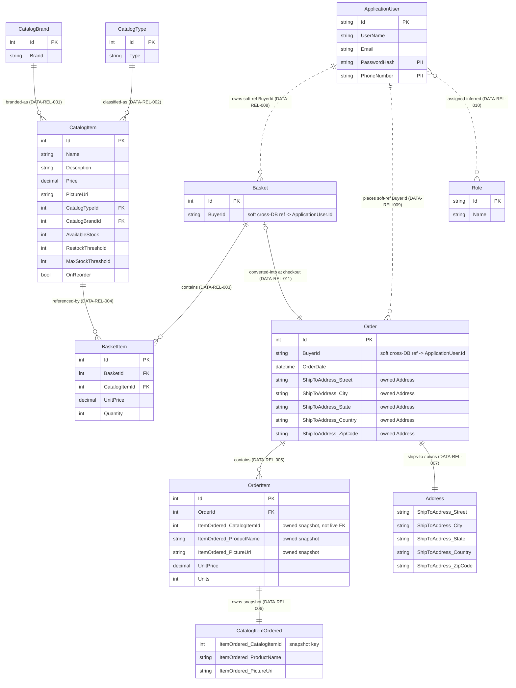
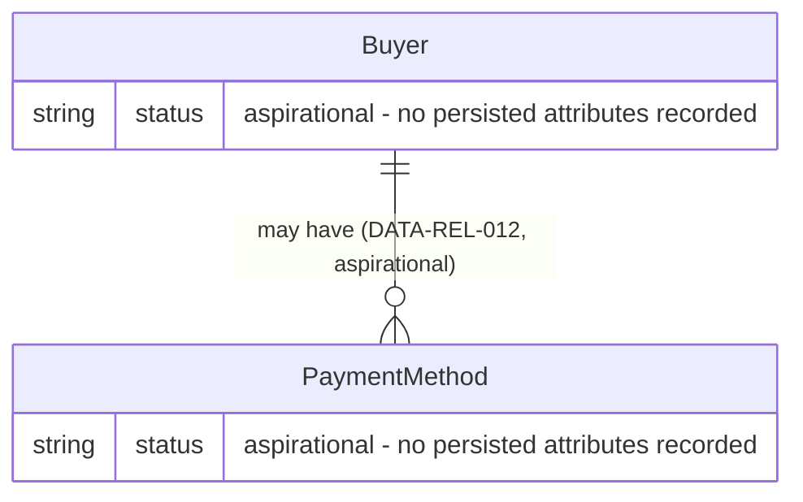

# 08 — Entity Relationship Diagram (ERD)

> ⚠️ **DISC-001 (verified 2026-06-25):** Any `CatalogItem` stock columns (`AvailableStock`,
> `RestockThreshold`, `MaxStockThreshold`, `OnReorder`) shown below are a **verified discrepancy** — absent
> from the real `eShopOnWeb` source. Exclude them from generated schema. See
> [`../EVIDENCE_VERIFICATION_REPORT.md`](../EVIDENCE_VERIFICATION_REPORT.md).

> Single source of truth: the Enterprise Knowledge Graph (`ENTERPRISE_KNOWLEDGE_GRAPH.json`). Every entity, relationship and aggregate below is traced to a graph node id (DATA-ENT / DATA-REL / DATA-AGG). No entities, attributes, keys, relationships or cardinalities have been invented; status flags are honored verbatim.
>
> Technology note: This document is technology-neutral. Where the persisted shape reflects implementation conventions (EF Core owned types, flattened columns, cross-database soft references), these are labelled **Current (legacy)** and described conceptually, not prescribed for any target stack.

---

## 1. Scope and Conventions

This ERD covers the **persisted** data model — every `DATA-ENT` with `persisted=true` and every `DATA-REL` that connects them — and, in a clearly separated section, the **aspirational** Buyer / PaymentMethod sub-model that is confirmed dead/unmapped code (RC-002) and therefore **not part of the current persisted schema**.

Persisted entities in scope (9): DATA-ENT-001 CatalogItem, DATA-ENT-002 CatalogBrand, DATA-ENT-003 CatalogType, DATA-ENT-004 Basket, DATA-ENT-005 BasketItem, DATA-ENT-006 Order, DATA-ENT-007 OrderItem, DATA-ENT-008 ApplicationUser, DATA-ENT-009 Role, DATA-ENT-012 CatalogItemOrdered, DATA-ENT-013 Address.

> Persistence nuance: DATA-ENT-012 (CatalogItemOrdered) and DATA-ENT-013 (Address) are **owned/value types** — persisted (`persisted=true`) but flattened into their owning tables (`OrderItems`, `Orders` respectively) rather than having tables of their own. They are modelled here as separate entities to honour the graph, with their flattening noted.

Excluded from the persisted ERD (honouring status flags):
- DATA-ENT-010 Buyer — `persisted=false`, aspirational/unimplemented (RC-002) → shown only in the Aspirational sub-model.
- DATA-ENT-011 PaymentMethod — `persisted=false`, aspirational/unimplemented (RC-002) → shown only in the Aspirational sub-model.
- DATA-ENT-014 CatalogItemDetails — `persisted=false`, likely a non-persisted DTO/value object (read-model). Not a table; see Gaps.
- DATA-ENT-015 BaseEntity — `persisted=false`, abstract base class providing `Id`. Not a table; documented in the Aggregate Mapping / notes as a supertype only.

---

## 2. Persisted ERD (Current — implemented schema)

The diagram below renders all persisted entities and all `implemented` / `implemented-soft-reference` / `implemented-inferred` relationships. Owned types are shown as discrete entities with a containment-style relationship to their owner. Soft, cross-database references (no DB-level FK; application-enforced only) are annotated in the relationship labels.

> Attribute data types shown in the diagram are **indicative conceptual types** (the graph records attribute names / keys, not column types). `Id` keys are modelled per the legacy convention: integer surrogate keys for catalog/basket/order entities; string identity keys for `ApplicationUser` / `Role` (Current legacy: ASP.NET Core Identity, INFERRED standard schema, confidence 0.7 per DATA-ENT-008/009). Confirm in target design — see Gaps and ASMP-FE-301.

### 2.1 Cross-database / boundary annotations (Current — legacy)

| Concern | Entities | Note (graph evidence) |
|---|---|---|
| Cross-DB soft reference | Basket→ApplicationUser (DATA-REL-008), Order→ApplicationUser (DATA-REL-009) | `BuyerId` links the Catalog/Order store to the Identity store with **no DB-level FK** — application-enforced only (confidence 0.8). |
| Owned-type flattening | Order→Address (DATA-REL-007), OrderItem→CatalogItemOrdered (DATA-REL-006) | Address persists as `ShipToAddress_*` columns inside `Orders`; CatalogItemOrdered persists as `ItemOrdered_*` columns inside `OrderItems`. |
| Historical snapshot, not a live FK | OrderItem (DATA-ENT-007) | `ItemOrdered_CatalogItemId` is an intentional point-in-time snapshot of CatalogItem, **not** an enforced FK to live `Catalog.Id` (WARNING 3). |
| Inferred join | ApplicationUser↔Role (DATA-REL-010) | Many-to-many via `AspNetUserRoles` join — INFERRED standard ASP.NET Core Identity (confidence 0.7). |

---

## 3. Aspirational sub-model — Buyer / PaymentMethod

> **Aspirational / not in current persisted schema (RC-002).** DATA-ENT-010 (Buyer) and DATA-ENT-011 (PaymentMethod) are `persisted=false`, `status=aspirational/unimplemented`, and are CONFIRMED dead/unmapped code (confidence 0.9): no `DbSet`, no EF configuration, no repository usage, no checkout flow or table backs them today. DATA-REL-012 between them is likewise `aspirational/unimplemented`. This sub-model is presented **only** to preserve the graph's recorded intent; it must not be treated as a discovered persisted structure.

The graph records **no `key_attributes`** for either entity (`attrs=[]`), so no keys or columns are shown — fabricating any would violate the no-invention rule. PaymentMethod is explicitly noted as **not currently in PCI-DSS scope** because nothing persists it. Should checkout/payment ever be implemented forward, this is where a target design would introduce the BuyerAggregate (DATA-AGG-003) — see Gaps and ASMP-FE-302.

---

## 4. Entities

| Entity ID | Name | Persisted | PII | Status | Key / Key Attributes | Notes |
|---|---|---|---|---|---|---|
| DATA-ENT-001 | CatalogItem | Yes | No | implemented | **Id (PK)**, Name, Description, Price, PictureUri, **CatalogTypeId (FK)**, **CatalogBrandId (FK)**, AvailableStock, RestockThreshold, MaxStockThreshold, OnReorder | Canonical live product data (price/stock). Root of DATA-AGG-004. |
| DATA-ENT-002 | CatalogBrand | Yes | No | implemented | **Id (PK)**, Brand | Reference data; groups products by brand/label. |
| DATA-ENT-003 | CatalogType | Yes | No | implemented | **Id (PK)**, Type | Reference data; product category/type. |
| DATA-ENT-004 | Basket | Yes | No | implemented | **Id (PK)**, BuyerId (soft ref → ApplicationUser.Id) | Root of DATA-AGG-001. BuyerId is a cross-DB soft reference. |
| DATA-ENT-005 | BasketItem | Yes | No | implemented | **Id (PK)**, **BasketId (FK)**, **CatalogItemId (FK)**, UnitPrice, Quantity | Basket line; member of DATA-AGG-001. |
| DATA-ENT-006 | Order | Yes | **Yes** | implemented | **Id (PK)**, BuyerId (soft ref), OrderDate, ShipToAddress_Street, ShipToAddress_City, ShipToAddress_State, ShipToAddress_Country, ShipToAddress_ZipCode | Root of DATA-AGG-002. Owns flattened Address. Contains PII (shipping address). |
| DATA-ENT-007 | OrderItem | Yes | No | implemented | **Id (PK)**, **OrderId (FK)**, ItemOrdered_CatalogItemId, ItemOrdered_ProductName, ItemOrdered_PictureUri, UnitPrice, Units | Member of DATA-AGG-002. Embeds CatalogItemOrdered snapshot (not a live FK). |
| DATA-ENT-008 | ApplicationUser | Yes | **Yes** | implemented | **Id (PK)**, UserName, Email, PasswordHash, PhoneNumber | Canonical identity. INFERRED standard ASP.NET Core Identity schema (confidence 0.7). PII. |
| DATA-ENT-009 | Role | Yes | No | implemented | **Id (PK)**, Name | Access-governing role (confirmed 'Administrators', RC-008). INFERRED Identity schema. |
| DATA-ENT-012 | CatalogItemOrdered | Yes (owned) | No | implemented | ItemOrdered_CatalogItemId, ItemOrdered_ProductName, ItemOrdered_PictureUri | Owned/value type flattened into `OrderItems`; intentional historical snapshot. Member of DATA-AGG-002. No independent table/PK. |
| DATA-ENT-013 | Address | Yes (owned) | **Yes** | implemented | ShipToAddress_Street, ShipToAddress_City, ShipToAddress_State, ShipToAddress_Country, ShipToAddress_ZipCode | Owned/value type flattened into `Orders`. Member of DATA-AGG-002. No independent table/PK. PII. |
| DATA-ENT-010 | Buyer | **No** | No | aspirational/unimplemented | (none recorded) | RC-002 dead/unmapped code. Aspirational sub-model only. |
| DATA-ENT-011 | PaymentMethod | **No** | No | aspirational/unimplemented | (none recorded) | RC-002 dead/unmapped code; not PCI-DSS scope today. Aspirational sub-model only. |
| DATA-ENT-014 | CatalogItemDetails | **No** | No | aspirational/unimplemented | (none recorded) | Likely non-persisted DTO/value-object (read-model). Not a table. Excluded from ERD. |
| DATA-ENT-015 | BaseEntity | **No** | No | implemented (abstract) | Id | Abstract supertype providing `Id`; not its own table. Excluded from ERD. |

All 15 DATA-ENT ids are represented (11 persisted/owned in the main diagram + table; 2 in the aspirational sub-model; 2 documented as excluded non-tables).

---

## 5. Relationships

| Rel ID | From → To | Cardinality (notation) | Reading | FK / Mechanism | Status |
|---|---|---|---|---|---|
| DATA-REL-001 | CatalogItem → CatalogBrand | `*..1` (many-to-one) | Many CatalogItems belong to one CatalogBrand | `CatalogItem.CatalogBrandId` FK → `CatalogBrands.Id` | implemented |
| DATA-REL-002 | CatalogItem → CatalogType | `*..1` (many-to-one) | Many CatalogItems belong to one CatalogType | `CatalogItem.CatalogTypeId` FK → `CatalogTypes.Id` | implemented |
| DATA-REL-003 | Basket → BasketItem | `1..*` (one-to-many) | One Basket contains many BasketItems | `BasketItem.BasketId` FK → `Baskets.Id` | implemented |
| DATA-REL-004 | BasketItem → CatalogItem | `*..1` (many-to-one) | Many BasketItems reference one CatalogItem | `BasketItem.CatalogItemId` FK → `Catalog.Id` | implemented |
| DATA-REL-005 | Order → OrderItem | `1..*` (one-to-many) | One Order contains many OrderItems | `OrderItem.OrderId` FK → `Orders.Id` | implemented |
| DATA-REL-006 | OrderItem → CatalogItemOrdered | `1..1` (one-to-one) | Each OrderItem embeds one CatalogItemOrdered snapshot | Owned type `ItemOrdered_*` in `OrderItems`; **snapshot, not a live FK** | implemented |
| DATA-REL-007 | Order → Address | `1..1` (one-to-one) | Each Order ships to one Address | Owned type `ShipToAddress_*` flattened into `Orders` | implemented |
| DATA-REL-008 | Basket → ApplicationUser | `*..1` (many-to-one) | Many Baskets belong to one user | `Basket.BuyerId` **soft cross-DB ref** → `AspNetUsers.Id` (no DB FK; app-enforced) | implemented-soft-reference |
| DATA-REL-009 | Order → ApplicationUser | `*..1` (many-to-one) | A user places many Orders over time | `Order.BuyerId` **soft cross-DB ref** → `AspNetUsers.Id` (no DB FK; app-enforced) | implemented-soft-reference |
| DATA-REL-010 | ApplicationUser → Role | `*..*` (many-to-many) | Users hold one or more Roles | `AspNetUserRoles` join (`UserId`→Users.Id, `RoleId`→Roles.Id), **INFERRED** | implemented-inferred |
| DATA-REL-011 | Basket → Order | `1..1` (one-to-one) | A Basket is converted into an Order at checkout | Process-level conversion at checkout; empty-basket protection enforced (RC-007: basket not cleared) | implemented |
| DATA-REL-012 | Buyer → PaymentMethod | `1..*` (one-to-many) | A Buyer may have one or more Payment Methods | **Aspirational only** — no table/FK exists (RC-002) | aspirational/unimplemented |

All 12 DATA-REL ids are represented (11 implemented in the main ERD; DATA-REL-012 in the aspirational sub-model).

---

## 6. Cardinalities Legend

The graph records cardinality in `from..to` notation (`*` = many, `1` = exactly one). Translation to Crow's-foot / Mermaid `erDiagram` notation used above:

| Graph notation | Meaning | Crow's-foot reading | Mermaid `erDiagram` operator |
|---|---|---|---|
| `*..1` | many on the *from* side, one on the *to* side | many-to-one | `to ||--o{ from` (one to zero-or-many) |
| `1..*` | one on the *from* side, many on the *to* side | one-to-many | `from ||--o{ to` |
| `1..1` | exactly one on each side | one-to-one | `||--||` (or `|o--||` where the left side is optional, e.g. a Basket need not become an Order) |
| `*..*` | many on each side | many-to-many | `}o..o{` (via join entity) |

Mermaid symbol reference used in the diagrams:

| Symbol | Meaning |
|---|---|
| `||` | exactly one (mandatory, one) |
| `o{` | zero-or-many (optional, many) |
| `|o` | zero-or-one (optional, one) |
| `--` | identifying / enforced relationship (DB-level FK) |
| `..` | non-identifying / soft / inferred relationship (no enforced DB FK — used for DATA-REL-008/009 cross-DB soft refs and DATA-REL-010 inferred join) |

> Convention applied: solid lines (`--`) denote relationships with an enforced foreign key in the same store; dotted lines (`..`) denote cross-database soft references (DATA-REL-008, DATA-REL-009) and the inferred Identity join (DATA-REL-010), which have no enforced DB-level FK.

---

## 7. Aggregate Mapping (DDD)

Entities grouped by their owning aggregate (`DATA-AGG`), with the aggregate root marked. Aggregate boundaries define transactional consistency and the entry point through which member entities are accessed.

| Aggregate ID | Aggregate Name | Root (★) | Member Entities | Status |
|---|---|---|---|---|
| DATA-AGG-001 | BasketAggregate | ★ Basket (DATA-ENT-004) | Basket (DATA-ENT-004), BasketItem (DATA-ENT-005) | implemented |
| DATA-AGG-002 | OrderAggregate | ★ Order (DATA-ENT-006) | Order (DATA-ENT-006), OrderItem (DATA-ENT-007), Address (DATA-ENT-013, owned), CatalogItemOrdered (DATA-ENT-012, owned) | implemented |
| DATA-AGG-004 | CatalogItem | ★ CatalogItem (DATA-ENT-001) | CatalogItem (DATA-ENT-001) | implemented |
| DATA-AGG-003 | BuyerAggregate | ★ Buyer (DATA-ENT-010) | Buyer (DATA-ENT-010), PaymentMethod (DATA-ENT-011) | **aspirational/unimplemented (RC-002)** |

### 7.1 Entities not assigned to an aggregate

| Entity | Reason (graph evidence) |
|---|---|
| CatalogBrand (DATA-ENT-002), CatalogType (DATA-ENT-003) | Reference/lookup data referenced by CatalogItem (DATA-REL-001/002); the graph does not list them as members of any DATA-AGG. Treated as standalone reference entities (within the Catalog module, APP-SVC-001). |
| ApplicationUser (DATA-ENT-008), Role (DATA-ENT-009) | Identity entities in a separate store (Identity module, APP-SVC-002). Not members of any catalog/order/basket aggregate; related to Basket/Order only via soft cross-DB references (DATA-REL-008/009) and to each other via DATA-REL-010. |
| BaseEntity (DATA-ENT-015) | Abstract supertype (provides `Id`); not a member of any aggregate and not persisted as a table. |
| CatalogItemDetails (DATA-ENT-014) | Non-persisted DTO/value-object; not assigned to an aggregate (not a table). |

> Owned-type note: Address (DATA-ENT-013) and CatalogItemOrdered (DATA-ENT-012) have no independent identity — they exist only within the OrderAggregate (DATA-AGG-002), persisted as flattened columns of `Orders` / `OrderItems`. They are accessible only through the Order root, consistent with DDD value-object semantics.

---

## 8. Assumptions

| ID | Assumption | Basis | Impact |
|---|---|---|---|
| ASMP-FE-301 | Indicative attribute data types in the Mermaid diagrams (e.g. `int Id`, `decimal Price`, `datetime OrderDate`, string identity keys for ApplicationUser/Role) are reasonable conceptual defaults. | The graph records attribute **names/keys only** (`key_attributes`), not column data types; legacy is EF Core over SQL Server / PostgreSQL (Current legacy, TECH-CUR-006/007). | Diagram types are conceptual, not authoritative. Confirm precise column types during physical target-schema design; mismatch risk if treated as a DDL contract. |
| ASMP-FE-302 | The aspirational BuyerAggregate (DATA-AGG-003) sub-model is documented for traceability only and is **not** a forward-engineering commitment. | DATA-ENT-010/011 and DATA-REL-012 are `persisted=false`, confirmed dead code (RC-002, confidence 0.9). | If payment/checkout is ever built forward, a deliberate design (incl. PCI-DSS scope) is required; do not auto-migrate this structure. |
| ASMP-FE-303 | The ApplicationUser↔Role many-to-many (DATA-REL-010) is realized through an `AspNetUserRoles`-style join entity not separately catalogued as a DATA-ENT. | DATA-REL-010 status `implemented-inferred`; standard ASP.NET Core Identity schema INFERRED (confidence 0.7). | The join entity is not in the entity inventory; target schema should make it explicit. Low risk (standard pattern). |

---

## 9. Gaps and Open Questions

- **No column data types / nullability / lengths in the graph** — only attribute names and key roles. Physical schema specifics (types, constraints, indexes) must be derived at target-design time. See ASMP-FE-301.
- **CatalogItemDetails (DATA-ENT-014)** — recorded as `persisted=false`, likely a DTO/projection but "to be confirmed" in the graph. Whether it is a read-model only is unresolved (relates to OQ on read-model boundaries). Excluded from the persisted ERD pending confirmation.
- **Cross-database referential integrity** — DATA-REL-008 / DATA-REL-009 use soft, application-enforced `BuyerId` references with no DB-level FK across the Catalog/Order and Identity stores. Integrity is not guaranteed at the data tier; a forward design must decide whether to consolidate stores or formalize the contract. (Current legacy boundary.)
- **Order/Basket lifecycle (RC-007)** — DATA-REL-011 (Basket→Order, `1..1` at checkout): the legacy `OrderService.CreateOrderAsync` does **not** clear the basket after order creation. Data-state consequence: a converted basket may persist post-checkout; flagged for forward remediation, not represented as a structural ERD element.
- **Identity schema is INFERRED (confidence 0.7)** — ApplicationUser (DATA-ENT-008) and Role (DATA-ENT-009) attributes are inferred standard ASP.NET Core Identity; actual columns should be verified against the live IdentityDb.
