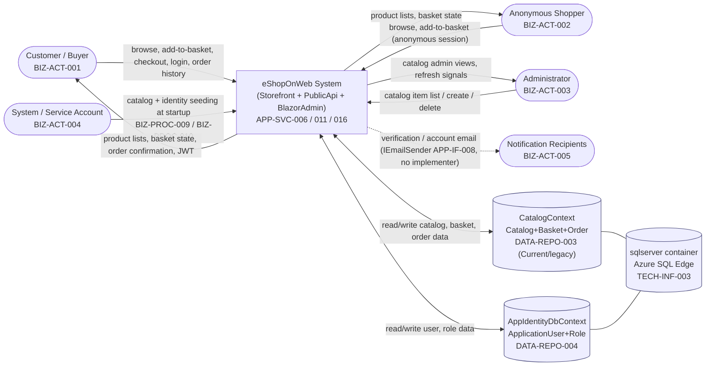
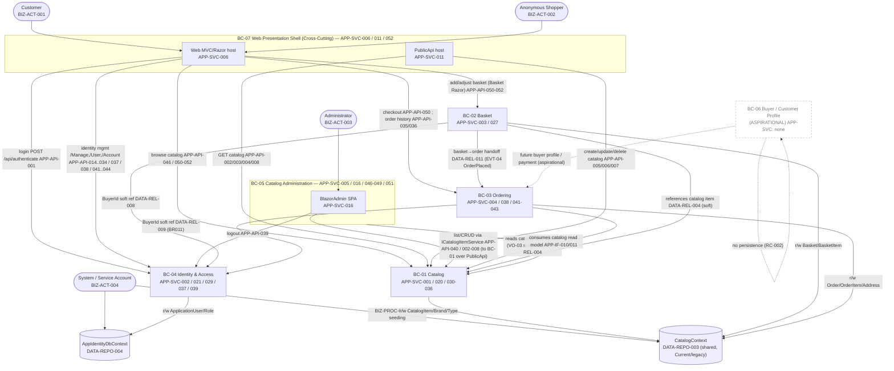
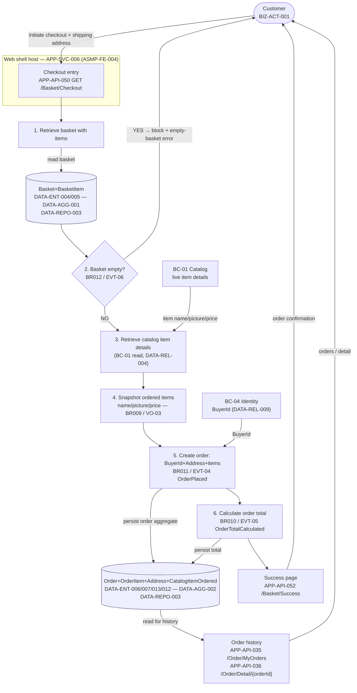
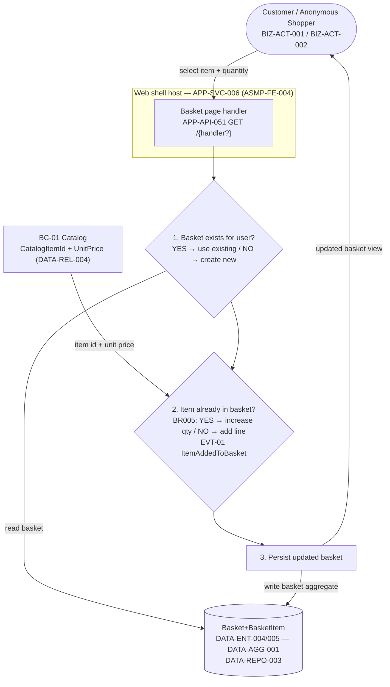
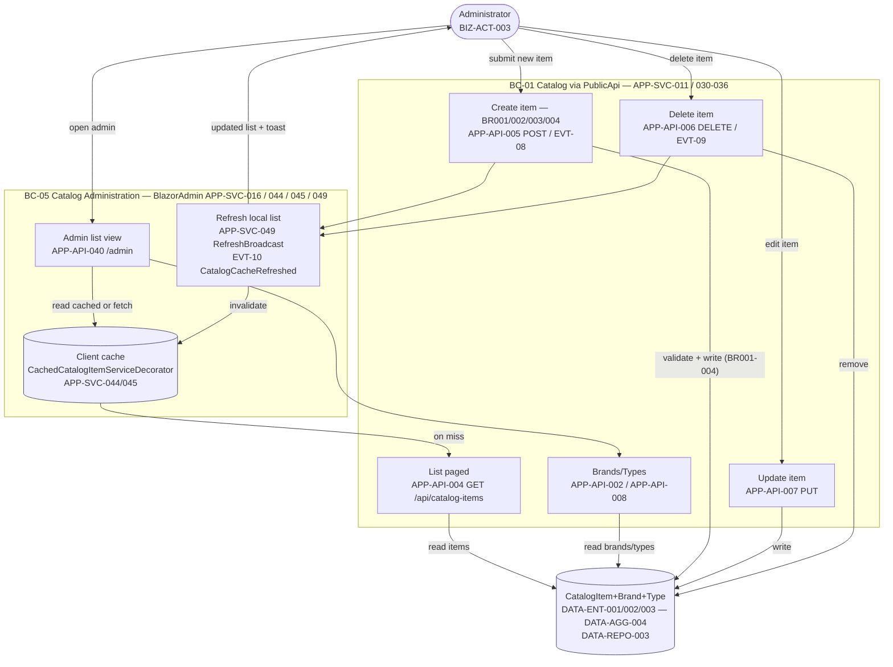

# 09 — Data Flow Diagram (DFD)

> **Single source of truth:** `ENTERPRISE_KNOWLEDGE_GRAPH.json`. Every external entity, process, data store, and data flow in this document traces to graph node ids (BIZ-ACT / BIZ-PROC / BIZ-CAP / DATA-ENT / DATA-AGG / DATA-REPO / APP-SVC / APP-API / TECH-INF) and the shared bounded-context decisions in `.work/DECISIONS.json`. No capabilities, services, entities, APIs, stores, or flows have been invented.
>
> **Technology neutrality:** The legacy persistence and hosting topology is labelled **Current (legacy)** where it appears. `target_stack` in the graph is **empty (0 nodes)**, so any target store/runtime is presented as a **neutral option ("not in legacy evidence")**, never asserted as discovered.
>
> **Status flags honoured:** Buyer (`DATA-ENT-010`) and PaymentMethod (`DATA-ENT-011`) are `persisted=false`, `status=aspirational/unimplemented` (RC-002); the Buyer/Customer Profile context (BC-06) and payment capabilities `BIZ-CAP-027/028` are inferred/LOW. They are shown as aspirational and dashed throughout, never as live data flows.

---

## 1. Purpose, Scope, and Notation

### 1.1 Purpose

This Data Flow Diagram models how data moves between **external actors**, the **system** (decomposed into bounded contexts and major services), and **data stores** (persistence repositories and infrastructure data stores). It is a process/data view that complements the structural views (component and deployment) and the behavioural views (use-case and process models). It exists to:

- Establish, for forward engineering, where data **originates** (Data Sources), where it **rests** (Data Stores), who **consumes** it (Data Consumers), and what **transforms** it (Data Transformations / process steps).
- Surface trust and ownership boundaries: which context **owns** which entity (per `cross_links.entity_to_service` and `DATA-REPO` ownership), and where data crosses a boundary (traced to `APP-API` ids).
- Anchor the persistence-decomposition decisions (split of the shared `CatalogContext` `DATA-REPO-003`, isolation of `AppIdentityDbContext` `DATA-REPO-004`) recorded in `RISK-SHARED-DBCTX-001`.

### 1.2 Scope

The DFD covers the three Level-1 decompositions and the three Level-2 key processes mandated for this document:

| Level | Coverage | Trace |
|-------|----------|-------|
| **Level 0** | Context diagram — external actors ↔ System ↔ data stores | `BIZ-ACT-001..005`, `TECH-INF-001..004`, `DATA-REPO-003/004` |
| **Level 1** | Decomposition into bounded contexts / major service modules with inter-context flows and store access | BC-01..BC-07, `APP-SVC-001..016`, `DATA-REPO-001..004` |
| **Level 2.A** | Checkout / Place Order | `BIZ-PROC-005`, `DATA-AGG-002` |
| **Level 2.B** | Add Item to Basket | `BIZ-PROC-002`, `DATA-AGG-001` |
| **Level 2.C** | Catalog Item Maintenance (Administration) | `BIZ-PROC-006`, `DATA-AGG-004` |

### 1.3 Notation

This document uses Gane–Sarson-style DFD semantics rendered in Mermaid:

| Symbol | DFD meaning | Mermaid representation |
|--------|-------------|------------------------|
| External entity (actor) | Data source/sink outside the system | stadium / rounded node, `BIZ-ACT-*` |
| Process | Transformation of data (a context, service, or process step) | rectangle, `BC-*` / `APP-SVC-*` / `BIZ-PROC-*` step |
| Data store | At-rest data (repository or infra store) | cylinder / `[( )]`, `DATA-REPO-*` / `TECH-INF-*` |
| Data flow | Directed movement of data, labelled with payload | arrow with label; crossing arrows are tagged with the `APP-API-*` id |
| Aspirational | Unimplemented design input (RC-002) | dashed node/edge |

> **Boundary attribution (ASMP-FE-004):** Many storefront, basket, order-history and identity routes are *physically* served by the Web presentation shell (`APP-SVC-006`, BC-07) and the authenticate endpoint is *physically* in PublicApi (`APP-SVC-011`). In this DFD a flow is attributed to its **functional** bounded context (BC-02/BC-03/BC-04) while the physical host (BC-07 / PublicApi) is shown as the channel. The crossing `APP-API-*` id is always cited so functional ownership and physical hosting are both visible.

---

## 2. Level 0 — Context Diagram

The system is treated as a single process. External actors (`BIZ-ACT-*`) exchange data with it; the system persists to/reads from the two legacy persistence boundaries and their infrastructure containers.

### 2.1 Data Sources, Stores, Consumers (Level 0)

| Category | Items (node ids) |
|----------|------------------|
| **Data Sources (external entities providing data)** | Customer / Buyer `BIZ-ACT-001`; Anonymous Shopper `BIZ-ACT-002`; Administrator `BIZ-ACT-003`; System / Service Account `BIZ-ACT-004` (seeding) |
| **Data Consumers (external entities receiving data)** | `BIZ-ACT-001`, `BIZ-ACT-002`, `BIZ-ACT-003`; Notification Recipients `BIZ-ACT-005` (email — port `APP-IF-008 IEmailSender`, no implementer in evidence) |
| **Data Stores** | `DATA-REPO-003` CatalogContext (Catalog + Basket + Order entities — shared, **Current/legacy**); `DATA-REPO-004` AppIdentityDbContext (ApplicationUser + Role); physical containers `TECH-INF-003` sqlserver / Azure SQL Edge under `TECH-INF-004` docker-compose |
| **Data Transformations** | The System (decomposed at Level 1) |

**Notes (Level 0):**

- The shared `DATA-REPO-003 CatalogContext` physically persists entities spanning **three** functional contexts (Catalog `BC-01`, Basket `BC-02`, Order `BC-03`). This single store crossing three contexts is recorded as `RISK-SHARED-DBCTX-001` and is the principal persistence-split obstacle. `DATA-REPO-004 AppIdentityDbContext` already isolates Identity (`BC-04`).
- Both contexts resolve at runtime to the single `TECH-INF-003` sqlserver / Azure SQL Edge container via the runtime SQL dependency `APP-DEP-019` (Web, PublicApi → sqlserver). Provider variants exist in evidence (`TECH-CUR-006` SqlServer, `TECH-CUR-007` PostgreSQL, `TECH-CUR-008` InMemory) — all **Current (legacy)**.
- The email outflow to `BIZ-ACT-005` is dashed: the port `APP-IF-008 IEmailSender` has **no implementer** in evidence (`impl_by=[]`); it is a declared sink, not a confirmed live flow.
- **Target option (not in legacy evidence):** the single shared relational engine could be replaced by **per-context databases** on one of the relational providers present in evidence (`TECH-CUR-006` SQL Server / `TECH-CUR-007` PostgreSQL, with `TECH-CUR-008` InMemory for tests); this is a neutral option, not a discovered fact.

---

## 3. Level 1 — Bounded-Context Decomposition

The single Level-0 process is decomposed into the bounded contexts and major service modules from `.work/DECISIONS.json` (BC-01..BC-07). Data ownership follows `cross_links.entity_to_service` and `DATA-REPO` membership; inter-context flows follow the evidence relationships (`DATA-REL-*`) and the API surface (`APP-API-*`). Crossing flows cite their `APP-API-*` id.

### 3.1 Context-to-Store Ownership (Level 1)

| Context | Owns entities (Data Stores) | Repository | Trace |
|---------|------------------------------|------------|-------|
| BC-01 Catalog | CatalogItem `DATA-ENT-001`, CatalogBrand `DATA-ENT-002`, CatalogType `DATA-ENT-003`, CatalogItemOrdered `DATA-ENT-012` (physically), CatalogItemDetails `DATA-ENT-014` (aspirational) | `DATA-REPO-003` (shared); `DATA-REPO-001 IRepository<T>` | `entity_to_service DATA-ENT-001/002/003/012→APP-SVC-001` |
| BC-02 Basket | Basket `DATA-ENT-004`, BasketItem `DATA-ENT-005` (`DATA-AGG-001`) | `DATA-REPO-003` (shared); `DATA-REPO-001` | `DATA-ENT-004/005→APP-SVC-003` |
| BC-03 Ordering | Order `DATA-ENT-006`, OrderItem `DATA-ENT-007`, Address `DATA-ENT-013`, CatalogItemOrdered `DATA-ENT-012` (snapshot, `DATA-AGG-002`) | `DATA-REPO-003` (shared) | `DATA-ENT-006/007/013→APP-SVC-004` |
| BC-04 Identity & Access | ApplicationUser `DATA-ENT-008`, Role `DATA-ENT-009` | `DATA-REPO-004` AppIdentityDbContext | `DATA-ENT-008/009→APP-SVC-002` |
| BC-05 Catalog Administration | **none** (behaviour-only over BC-01) | — | DECISIONS BC-05 (`entity_ids: []`) |
| BC-06 Buyer / Customer Profile | Buyer `DATA-ENT-010`, PaymentMethod `DATA-ENT-011` (`DATA-AGG-003`) — **aspirational** | none in evidence | RC-002, ASMP-FE-003 |
| BC-07 Web Presentation Shell | **none** (host/composition) | hosts `EfRepository APP-SVC-022` over `DATA-REPO-003` | DECISIONS BC-07 |

### 3.2 Level 1 Diagram

**Notes (Level 1):**

- **Shared store crossing three contexts** — BC-01, BC-02, BC-03 all read/write `DATA-REPO-003`. This is `RISK-SHARED-DBCTX-001`; the mitigation is to split CatalogContext along BC-01/BC-02/BC-03 lines. BC-04 is already cleanly isolated on `DATA-REPO-004`.
- **Module dependency cycle** — The runtime/static module cycle `APP-DEP-001` (Admin → ApplicationCore → Basket → Catalog → DataAccess → Identity → Order → Web → Admin) spans BC-01..BC-05 + BC-07. It is recorded as `RISK-CYCLE-001` (reality vs static artefact unresolved — `OQ-004`) and must be broken before contexts deploy independently. It is **not** a data flow and is therefore not drawn as one here; it is the structural coupling underlying these flows.
- **Layering violations** — Several BC-01 endpoints and the BC-07 `IndexModel` access data directly via `EfRepository` (`APP-DEP-002..008`, `APP-DEP-009`, coupling score 16). These are direct process→store flows that bypass an application-service transformation; `RISK-EFREPO-001` mandates routing them through per-context abstractions (`APP-IF-001/002`).
- **Cross-context references are soft identifiers, not imports** — Basket→Catalog (`DATA-REL-004`) and Basket/Order→ApplicationUser (`DATA-REL-008/009`) are soft references; the DFD carries an identifier (CatalogItemId, BuyerId) across the boundary, never the foreign aggregate.
- **BC-06 is dashed and unconnected to any store** — no services, APIs, or repositories exist in evidence (RC-002, ASMP-FE-003).

---

## 4. Level 2.A — Checkout / Place Order (`BIZ-PROC-005`)

Converts a basket into a confirmed order with snapshotted items, a buyer id, a shipping address, and a calculated total; blocked if the basket is empty. Capabilities `BIZ-CAP-019/020/021/023`; business rules `BR009/BR010/BR011/BR012`; aggregate `DATA-AGG-002 OrderAggregate`. Domain events `EVT-04 OrderPlaced`, `EVT-05 OrderTotalCalculated`, `EVT-06 CheckoutRejectedEmptyBasket`.

### 4.1 Explicit DFD Element Lists (2.A)

| DFD element | Items (node ids) |
|-------------|------------------|
| **Data Sources** | Customer `BIZ-ACT-001` (initiates checkout, supplies shipping address); BC-04 Identity (BuyerId from authenticated `ApplicationUser`, `DATA-REL-009`); BC-01 Catalog (live item details for snapshot, `DATA-REL-004`) |
| **Data Stores** | Basket `DATA-ENT-004` + BasketItem `DATA-ENT-005` (`DATA-AGG-001`) in `DATA-REPO-003`; Order `DATA-ENT-006` + OrderItem `DATA-ENT-007` + Address `DATA-ENT-013` + CatalogItemOrdered `DATA-ENT-012` (`DATA-AGG-002`) in `DATA-REPO-003` |
| **Data Transformations** | Retrieve basket → Verify non-empty (BR012) → Retrieve catalog details → Snapshot ordered items (BR009) → Create order with BuyerId+Address+items (BR011) → Calculate total (BR010) — the 6 steps of `BIZ-PROC-005` |
| **Data Consumers** | Customer `BIZ-ACT-001` (order confirmation / `APP-API-052 /Basket/Success`); Order history reader via `APP-API-035/036` (`APP-SVC-038/041/042/043`) |
| **Crossing APIs** | Checkout entry `APP-API-050 GET /Basket/Checkout`; success `APP-API-052`; order history `APP-API-035/036` (served by Web shell `APP-SVC-006` via MediatR — ASMP-FE-004) |

### 4.2 Diagram (2.A)

**Notes (2.A):** The CatalogItemOrdered snapshot (`DATA-ENT-012`, `VO-03`) is *physically* catalog-owned (`entity_to_service DATA-ENT-012→APP-SVC-001`) but conceptually copied into the Order aggregate at checkout — the diagram shows the copy-at-step-4 transformation that decouples the order from later catalog changes. BuyerId is today the `ApplicationUser` id (BC-04), because Buyer (`DATA-ENT-010`, BC-06) is aspirational (ASMP-FE-003). `APP-API-035/036` are physically served by the Web shell via MediatR (`APP-SVC-038/041/042/043`) but functionally belong to BC-03 (ASMP-FE-004).

---

## 5. Level 2.B — Add Item to Basket (`BIZ-PROC-002`)

Adds the selected catalog item to the customer's (or anonymous user's) basket, consolidating quantity if already present. Capability `BIZ-CAP-012`; business rule `BR005`; aggregate `DATA-AGG-001 BasketAggregate`; domain event `EVT-01 ItemAddedToBasket`. Related: anonymous-to-registered transfer `BIZ-PROC-003` (`EVT-03`).

### 5.1 Explicit DFD Element Lists (2.B)

| DFD element | Items (node ids) |
|-------------|------------------|
| **Data Sources** | Customer `BIZ-ACT-001` / Anonymous Shopper `BIZ-ACT-002` (selects item, quantity); BC-01 Catalog (CatalogItemId + UnitPrice reference, `DATA-REL-004`) |
| **Data Stores** | Basket `DATA-ENT-004` + BasketItem `DATA-ENT-005` (`DATA-AGG-001`) in `DATA-REPO-003` |
| **Data Transformations** | Retrieve-or-create basket → Add item, consolidating quantity if present (BR005) → Persist updated basket — the 3 steps of `BIZ-PROC-002` |
| **Data Consumers** | Customer / Anonymous Shopper `BIZ-ACT-001/002` (updated basket view via Basket Razor page `APP-API-051`) |
| **Crossing APIs** | Basket page `APP-API-051 GET /{handler?}` (Basket), served by Web shell `APP-SVC-006` (ASMP-FE-004) |

### 5.2 Diagram (2.B)

**Notes (2.B):** The anonymous basket (`BIZ-ACT-002`) is keyed by an anonymous session identifier; on login/registration the anonymous basket merges into the registered user's basket (`BIZ-PROC-003`, `EVT-03 AnonymousBasketTransferred`, `BIZ-CAP-016`) — a separate process that copies each `BasketItem` into the user's basket and reconciles the `BuyerId` soft reference (`DATA-REL-008`) to BC-04. UnitPrice on the basket line (`VO-02`) is captured from the catalog item at add-time.

---

## 6. Level 2.C — Catalog Item Maintenance / Administration (`BIZ-PROC-006`)

Administrator views, creates, and deletes catalog items via the BlazorAdmin SPA, with item-detail validation and a cache refresh so the admin UI reflects changes. Capabilities `BIZ-CAP-037/038/039`; business rules `BR001/BR002/BR003/BR004`; aggregate `DATA-AGG-004 CatalogItem`; domain events `EVT-08 CatalogItemCreated`, `EVT-09 CatalogItemDeleted`, `EVT-10 CatalogCacheRefreshed`.

### 6.1 Explicit DFD Element Lists (2.C)

| DFD element | Items (node ids) |
|-------------|------------------|
| **Data Sources** | Administrator `BIZ-ACT-003` (item details, create/delete commands); reference data CatalogBrand `DATA-ENT-002` / CatalogType `DATA-ENT-003` for the list view |
| **Data Stores** | CatalogItem `DATA-ENT-001` (`DATA-AGG-004`), CatalogBrand `DATA-ENT-002`, CatalogType `DATA-ENT-003` in `DATA-REPO-003`; BlazorAdmin client-side cache (`APP-SVC-044/045` decorators) |
| **Data Transformations** | View list (items/types/brands) → Create item (BR001 name/desc/price, BR002 brand≠0, BR003 type≠0, BR004 image path) → Delete item → Refresh cached local list — the 4 steps of `BIZ-PROC-006` |
| **Data Consumers** | Administrator `BIZ-ACT-003` (refreshed list view, `APP-SVC-049 RefreshBroadcast`, `APP-SVC-048 ToastComponent`) |
| **Crossing APIs** | List `APP-API-004 GET /api/catalog-items`, by id `APP-API-003`, brands `APP-API-002`, types `APP-API-008`, create `APP-API-005 POST`, update `APP-API-007 PUT`, delete `APP-API-006 DELETE` (all in PublicApi `APP-SVC-011`); SPA route `APP-API-040 /admin` |

### 6.2 Diagram (2.C)

**Notes (2.C):** BlazorAdmin reaches catalog data over runtime HTTP to PublicApi (`APP-DEP-017`) and Web (`APP-DEP-018`), consuming `ICatalogItemService` / `ICatalogLookupDataService` (`APP-IF-010/011`, implemented by the cache decorators `APP-SVC-044/045`). The create/update/delete endpoints depend **directly** on `EfRepository` (`APP-DEP-004/006/005`, `ARCH-VIOL-003/005/004`) — a direct transformation→store coupling to be broken under `RISK-EFREPO-001`. Whether the Admin module (`APP-SVC-005`) and BlazorAdmin deployable (`APP-SVC-016`) should merge is unresolved (`OQ-001`); BC-05 is kept separate, owning **no** persistent entities.

---

## 7. Cross-Cutting Data-Flow Observations and Risks

| Observation | Evidence | Forward-engineering implication |
|-------------|----------|--------------------------------|
| Single shared persistence boundary across three contexts | `DATA-REPO-003`, `RISK-SHARED-DBCTX-001`, `OQ-008` | Split CatalogContext along BC-01/BC-02/BC-03; AppIdentityDbContext (`DATA-REPO-004`) already isolates BC-04 |
| Module dependency cycle underlying the flows | `APP-DEP-001`, `RISK-CYCLE-001`, `OQ-004` | Break via dependency inversion (`APP-IF-001..013`) + store split + removing direct-repo flows before independent deployment |
| Direct process→store flows bypassing application services | `APP-DEP-002..009`, `RISK-EFREPO-001` | Route endpoints/PageModels through per-context repositories behind `APP-IF-001/002` |
| Email outflow with no implementer | `APP-IF-008 IEmailSender` (`impl_by=[]`), `BIZ-ACT-005` | Declared sink only; do not assume a live notification flow |
| Aspirational Buyer/Payment data has no flow | `DATA-ENT-010/011`, `DATA-AGG-003`, BC-06, RC-002 | Generate persistence only on an explicit decision (ASMP-FE-003) |

---

## 8. Assumptions and Gaps

### 8.1 Reused graph assumptions / open questions

- **ASSUMP-006** — Role ownership by BC-04 is inferred (confidence 0.7); reflected in the BC-04 store (`DATA-ENT-009`).
- **OQ-001** — Merge Admin (`APP-SVC-005`) with BlazorAdmin (`APP-SVC-016`): unresolved; BC-05 kept separate.
- **OQ-004** — Module cycle `APP-DEP-001` real vs static artefact: unresolved; cycle not drawn as a data flow.
- **OQ-005** — JWT enforcement on PublicApi (`TECH-SEC-010`): affects the Level-1 catalog write flows.
- **OQ-008** — `IRepository<T>` / `IReadRepository<T>` served-entity set partly inferred: affects store-ownership precision.
- **OQ-009** — Synthetic ROUTE/CLI API labels: honoured where Razor/SPA routes appear (`APP-API-009/010/011/040/051`).

### 8.2 Reused forward-engineering assumptions (from `.work/DECISIONS.json`)

- **ASMP-FE-003** — Buyer/Customer Profile (BC-06) is aspirational; BuyerId satisfied today by `ApplicationUser`.
- **ASMP-FE-004** — Routes physically served by the Web shell / PublicApi are attributed to their functional contexts in flows, with the crossing `APP-API-*` id cited.

### 8.3 New assumptions raised by this document

| ID | Statement | Basis | Impact |
|----|-----------|-------|--------|
| **ASMP-FE-005** | The anonymous basket (`BIZ-ACT-002`) is keyed by an anonymous session/cookie identifier; the graph records the *capability* (`BIZ-CAP-015/016`, `BIZ-PROC-003`) and the `BuyerId` soft reference (`DATA-REL-008`) but not the concrete session-key mechanism. | `BIZ-CAP-015 Session Continuity`, `BIZ-PROC-003`; no session-key attribute in `DATA-ENT-004` (only Id, BuyerId). | Anonymous-session identification must be confirmed before generating the basket-key and the transfer/merge flow; do not assume a specific cookie/session scheme. |
| **ASMP-FE-006** | The BlazorAdmin client-side cache shown as a data store is a transient in-memory cache (cache decorators `APP-SVC-044/045`, refresh `APP-SVC-049`), not a persisted store; it is drawn as a store only to depict the refresh/invalidation flow (`EVT-10`). | `APP-SVC-044/045/049`, `BIZ-CAP-039`; no persistence node for this cache. | Treat as volatile UI state; cache topology (in-process vs distributed) is a target-design choice, **not in legacy evidence**. |
| **ASMP-FE-007** | Provider/store binding at runtime resolves to a single relational engine (`TECH-INF-003`) via `APP-DEP-019`; provider variants `TECH-CUR-006/007/008` coexist in evidence without a declared default for production. | `APP-DEP-019`, `TECH-CUR-006/007/008`, `TECH-INF-003` (no version tag). | Production database engine selection (SQL Server `TECH-CUR-006` / PostgreSQL `TECH-CUR-007`, InMemory `TECH-CUR-008` for tests) is a **neutral target option, not in legacy evidence**; the DFD store is engine-agnostic. |

---

## 9. Traceability Summary

| DFD artifact | Primary node ids |
|--------------|------------------|
| External actors | `BIZ-ACT-001`, `BIZ-ACT-002`, `BIZ-ACT-003`, `BIZ-ACT-004`, `BIZ-ACT-005` |
| Bounded contexts (processes) | BC-01..BC-07 (DECISIONS.json) → `APP-SVC-001..016` |
| Level-2 processes | `BIZ-PROC-005`, `BIZ-PROC-002`, `BIZ-PROC-006` (+ related `BIZ-PROC-003`, `BIZ-PROC-009/010`) |
| Data stores (repositories) | `DATA-REPO-001`, `DATA-REPO-003`, `DATA-REPO-004` |
| Data stores (infra) | `TECH-INF-003`, `TECH-INF-004`; runtime binding `APP-DEP-019` |
| Aggregates / entities at rest | `DATA-AGG-001/002/004`; `DATA-ENT-001..009`, `DATA-ENT-012/013`; aspirational `DATA-ENT-010/011`, `DATA-AGG-003` |
| Crossing APIs | `APP-API-001/002/003/004/005/006/007/008`, `APP-API-035/036`, `APP-API-040`, `APP-API-050/051/052` |
| Inter-context relationships | `DATA-REL-004` (Basket/Order→Catalog), `DATA-REL-008/009` (→ApplicationUser), `DATA-REL-011` (Basket→Order) |
| Domain events on flows | `EVT-01`, `EVT-03`, `EVT-04`, `EVT-05`, `EVT-06`, `EVT-08`, `EVT-09`, `EVT-10` |
| Risks | `RISK-CYCLE-001` (`APP-DEP-001`/`OQ-004`), `RISK-SHARED-DBCTX-001` (`DATA-REPO-003`/`OQ-008`), `RISK-EFREPO-001` (`APP-DEP-009`) |
