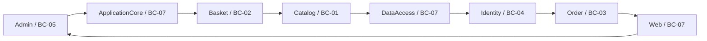

# 10 — Service Catalog

**Single source of truth:** `enterprise-foundation-package/ENTERPRISE_KNOWLEDGE_GRAPH.json`
**Shared decisions reused:** `forward-engineering-package/.work/DECISIONS.json` (bounded contexts BC-01…BC-07)
**Scope:** All 47 `application.services` (APP-SVC) nodes, catalogued by their evidence-recorded kind, responsibility, owning module/bounded context, dependencies (APP-DEP edges), interfaces (APP-IF), and exposed APIs (APP-API via `service_to_api` cross-links). Every coupling/boundary/migration-readiness string is reproduced **verbatim** from the graph.

> **Status & confidence flags are preserved.** Where the graph records a service's confidence as MEDIUM/LOW or marks it test-only/aspirational, that flag is carried forward unchanged. No services, interfaces, APIs, or dependencies are invented. The legacy stack (.NET 8 / ASP.NET Core / EF Core / Blazor — `TECH-CUR-001…003/005`) is referenced only as **Current (legacy)**; target stack is empty (0 nodes) so no target technology is asserted here.

---

## 1. How to read this catalog

The graph records 47 service-like nodes with three distinct **kinds**, which this catalog keeps separate because they migrate very differently:

| Kind (graph `kind` field) | Meaning | Count | Migration significance |
|---|---|---|---|
| `module` / `module+deployable-service` / `module+component` | **Logical module candidates** (MOD-### / CAP-### aliases) — boundary proposals, not classes. Some merge a deployable runtime facet. | 13 (APP-SVC-001…013) | These are the carving units; their `boundary` and `migration readiness` strings drive sequencing. |
| `domain-service` / `app-service` | **Concrete application/domain services** — real classes with behaviour behind an interface. | 5 (APP-SVC-016, 020, 021, 027, 028 — see note) | Map 1:1 onto target application services. |
| `component` | **Concrete components** — endpoints, controllers, DbContexts, seeders, Razor/Blazor UI, handlers, bootstrap. | 29 | Re-hosted under their context's API/UI/persistence layer. |

> Note on the "concrete service" row: the graph labels APP-SVC-020 (UriComposer) and APP-SVC-027 (BasketGuards) and APP-SVC-028 (JsonExtensions) as `domain-service`, and APP-SVC-016 (BlazorAdmin) and APP-SVC-021 (IdentityTokenClaimService) as `app-service`. All other behavioural classes are `component`.

Bounded-context (BC-##) assignment is taken **verbatim** from `DECISIONS.json` `bounded_contexts[].service_ids`. Where a service is physically hosted by one module but functionally belongs to another, that nuance is reproduced (ASSUMP-001/002, ASMP-FE-004).

---

## 2. Summary table — all 47 services

| id | Name | kind | Layer | Owning module | Bounded Context | Coupling / boundary / migration readiness (verbatim) | Confidence |
|---|---|---|---|---|---|---|---|
| APP-SVC-001 | Catalog | module | mixed | Catalog | BC-01 | HIGH (coupling score 13); boundary Weak; migration readiness Blocked | MEDIUM |
| APP-SVC-002 | Identity | module | mixed | Identity | BC-04 | HIGH (coupling 8); boundary Weak; migration readiness Blocked | MEDIUM |
| APP-SVC-003 | Basket | module | mixed | Basket | BC-02 | HIGH (coupling 9); boundary Weak; migration readiness Blocked; depends on Admin, ApplicationCore, Catalog, DataAccess and 3 more | MEDIUM |
| APP-SVC-004 | Order | module | mixed | Order | BC-03 | coupling 4; boundary Weak; migration readiness Blocked; depends on ApplicationCore, Catalog, DataAccess, Verification | MEDIUM |
| APP-SVC-005 | Admin | module | Presentation/UI | Admin | BC-05 | coupling 3; boundary Weak; migration readiness Blocked; depends on Identity | MEDIUM |
| APP-SVC-006 | Web | module+deployable-service | mixed | Web | BC-07 | HIGH (high-coupling module); boundary Weak; migration readiness Blocked | HIGH |
| APP-SVC-007 | ApplicationCore | module+component | Application/Domain | ApplicationCore | BC-07 | HIGH (high-coupling module); boundary Weak; migration readiness Blocked; depends on Catalog | HIGH |
| APP-SVC-008 | DataAccess | module | DataAccess | DataAccess | BC-07 | coupling 5; boundary Weak; migration readiness Blocked; high-coupling component EfRepository (16) | MEDIUM |
| APP-SVC-009 | Infrastructure | module+component | Infrastructure | Infrastructure | BC-07 | boundary Medium; migration readiness Needs Refactoring; depends on none detected | HIGH |
| APP-SVC-010 | CrossCutting | module | CrossCutting | CrossCutting | BC-07 | boundary Medium; migration readiness Needs Refactoring; high-coupling module per blueprint | MEDIUM |
| APP-SVC-011 | PublicApi | module+deployable-service | API | PublicApi | BC-07 (hosts BC-01/BC-04) | boundary Medium; migration readiness Needs Refactoring; depends on none detected | HIGH |
| APP-SVC-012 | SharedContracts | module+component | Application | SharedContracts | BC-07 | boundary Medium; migration readiness Needs Refactoring; depends on none detected | HIGH |
| APP-SVC-013 | Verification | module | mixed | Verification | BC-07 | boundary Medium; migration readiness Needs Refactoring; depends on ApplicationCore, DataAccess, Identity, Order and 1 more | LOW |
| APP-SVC-016 | BlazorAdmin | app-service | Presentation/UI | Admin | BC-05 | non-deployable; 11 API call mappings to BlazorAdmin (APP-RISK-006) | HIGH |
| APP-SVC-020 | UriComposer | domain-service | Application | ApplicationCore | BC-01 | HIGH coupling component (score 8) - ARCH-VIOL-010 / APP-RISK (UriComposer coupling 8) | HIGH |
| APP-SVC-021 | IdentityTokenClaimService | app-service | Application | Identity | BC-04 | located in Infrastructure/Identity | HIGH |
| APP-SVC-022 | EfRepository | component | DataAccess | DataAccess | BC-07 | HIGH coupling component (total coupling 16) - ARCH-VIOL-009 / APP-RISK-004 | HIGH |
| APP-SVC-023 | CatalogContext | component | DataAccess | Catalog | BC-01 | data-access adapter; review shared ownership | HIGH |
| APP-SVC-024 | AppIdentityDbContext | component | DataAccess | Identity | BC-04 | data-access adapter; review shared ownership | HIGH |
| APP-SVC-025 | CatalogContextSeed | component | DataAccess | Catalog | BC-01 | BatchJob, confidence 0.96 | HIGH |
| APP-SVC-026 | AppIdentityDbContextSeed | component | DataAccess | Identity | BC-04 | BatchJob, confidence 0.96 | HIGH |
| APP-SVC-027 | BasketGuards | domain-service | Application | ApplicationCore | BC-02 | Service component (GuardExtensions) | MEDIUM |
| APP-SVC-028 | JsonExtensions | domain-service | CrossCutting | ApplicationCore | BC-07 | Service / CrossCutting component | MEDIUM |
| APP-SVC-029 | AuthenticateEndpoint | component | API | Identity | BC-04 | API invocation adapter; COMP-0221 | HIGH |
| APP-SVC-030 | CatalogBrandListEndpoint | component | API | Catalog | BC-01 | API invocation adapter; direct repository dependency violation; COMP-0118 | HIGH |
| APP-SVC-031 | CatalogItemGetByIdEndpoint | component | API | Catalog | BC-01 | API invocation adapter; direct repository dependency violation; COMP-0122 | HIGH |
| APP-SVC-032 | CatalogItemListPagedEndpoint | component | API | Catalog | BC-01 | API invocation adapter; COMP-0223 | HIGH |
| APP-SVC-033 | CreateCatalogItemEndpoint | component | API | Catalog | BC-01 | API invocation adapter; direct repository dependency violation; COMP-0128 | HIGH |
| APP-SVC-034 | DeleteCatalogItemEndpoint | component | API | Catalog | BC-01 | API invocation adapter; direct repository dependency violation; COMP-0131 | HIGH |
| APP-SVC-035 | UpdateCatalogItemEndpoint | component | API | Catalog | BC-01 | API invocation adapter; direct repository dependency violation; COMP-0134 | HIGH |
| APP-SVC-036 | CatalogTypeListEndpoint | component | API | Catalog | BC-01 | API invocation adapter; direct repository dependency violation; COMP-0137 | HIGH |
| APP-SVC-037 | ManageController | component | API | Identity | BC-04 | MVC controller; COMP-0153; 21 /Manage routes | HIGH |
| APP-SVC-038 | OrderController | component | API | Order | BC-03 | MVC controller; COMP-0154; uses MediatR | HIGH |
| APP-SVC-039 | UserController | component | API | Identity | BC-04 | MVC controller; COMP-0155 | HIGH |
| APP-SVC-040 | IndexModel | component | Presentation/UI | Web | BC-07 | Razor PageModel; direct repository dependency violation | MEDIUM |
| APP-SVC-041 | GetMyOrders | component | Application | Web | BC-03 | Handler/request component | MEDIUM |
| APP-SVC-042 | GetMyOrdersHandler | component | Application | Web | BC-03 | Handler component | MEDIUM |
| APP-SVC-043 | GetOrderDetails | component | Application | Web | BC-03 | Handler/request component | MEDIUM |
| APP-SVC-044 | CachedCatalogItemServiceDecorator | component | Presentation/UI | Catalog | BC-01 | FrontendService decorator | MEDIUM |
| APP-SVC-045 | CachedCatalogLookupDataServiceDecorator | component | Presentation/UI | Catalog | BC-01 | FrontendService decorator | MEDIUM |
| APP-SVC-046 | BlazorComponent | component | Presentation/UI | Admin | BC-05 | FrontendComponent base | MEDIUM |
| APP-SVC-047 | BlazorLayoutComponent | component | Presentation/UI | Admin | BC-05 | FrontendComponent base | MEDIUM |
| APP-SVC-048 | ToastComponent | component | Presentation/UI | Admin | BC-05 | FrontendComponent | MEDIUM |
| APP-SVC-049 | RefreshBroadcast | component | Presentation/UI | Admin | BC-05 | FrontendComponent | MEDIUM |
| APP-SVC-050 | List | component | Presentation/UI | Catalog | BC-05 (consumes BC-01) | FrontendComponent / page; COMP-0257 | HIGH |
| APP-SVC-051 | CustomAuthStateProvider | component | Integration | Admin | BC-05 | Integration component | MEDIUM |
| APP-SVC-052 | Program | component | CrossCutting | CrossCutting | BC-07 | bootstrap/configuration; COMP-0140 | HIGH |

> **ID gap note:** the graph deliberately has no APP-SVC-014, -015, -017, -018, -019. They were merged into canonical nodes (`merged_from`): -015→APP-SVC-006 (Web), -017→APP-SVC-007 (ApplicationCore), -018→APP-SVC-012 (SharedContracts/BlazorShared), -019→APP-SVC-009 (Infrastructure), and -014→APP-SVC-011 (PublicApi). This is why the count is 47 across the range 001–052.

---

## 3. Logical module candidates vs concrete services vs components

| Classification | Service ids | Notes |
|---|---|---|
| **Logical module candidates** (carving units) | APP-SVC-001, -002, -003, -004, -005, -008, -010, -013 (pure `module`); APP-SVC-006, -011 (`module+deployable-service`); APP-SVC-007, -009, -012 (`module+component`) | These are the 13 MOD-### proposals. APP-SVC-013 Verification is a **test-project artifact, confidence LOW**, retention pending human review. |
| **Concrete application / domain services** | APP-SVC-016 (BlazorAdmin SPA, `app-service`), APP-SVC-020 (UriComposer, `domain-service`), APP-SVC-021 (IdentityTokenClaimService, `app-service`), APP-SVC-027 (BasketGuards, `domain-service`), APP-SVC-028 (JsonExtensions, `domain-service`) | Real behavioural classes behind ports/abstractions. |
| **Concrete components** | APP-SVC-022 (EfRepository), -023/-024 (DbContexts), -025/-026 (seed batch jobs), -029…-036 (API endpoints), -037/-038/-039 (MVC controllers), -040 (Razor PageModel), -041/-042/-043 (MediatR handlers/requests), -044/-045 (cache decorators), -046/-047/-048/-049 (Blazor UI components), -050 (List page), -051 (auth-state provider), -052 (Program bootstrap) | Re-hosted under their context's API/UI/persistence layer in the target design. |

---

## 4. Bounded-context views

Each context lists its services and, for behavioural nodes, the **APIs** (`service_to_api`) and **interfaces** (`APP-IF`) involved. The full route inventory lives in document `09` (API/Integration); here we cite the API ids the service hosts/handles.

### BC-01 — Catalog
**Owns** product/catalog master data, classification, seeding, and the catalog read/write API surface. Highest-coupling context (APP-SVC-001 coupling 13, boundary Weak, readiness **Blocked**) and the source of the direct endpoint→repository layering violations.

| id | Name | kind | Responsibility (from description) | Interfaces (APP-IF) | APIs (APP-API) |
|---|---|---|---|---|---|
| APP-SVC-001 | Catalog | module | Module candidate covering catalog brands/items/types; 66 components, 9 entry points; owns CatalogBrand/CatalogItem/CatalogType and CatalogContext | — (module) | (aggregates 002–008) |
| APP-SVC-020 | UriComposer | domain-service | Composes picture URIs (ComposePicUri); used by catalog item endpoints | **implements** APP-IF-004 IUriComposer | — |
| APP-SVC-023 | CatalogContext | component | EF Core DbContext for catalog data (SaveChangesAsync); resolved target of EfRepository in catalog flows | — | — |
| APP-SVC-025 | CatalogContextSeed | component | Database seed batch job for catalog (SeedAsync) | — | — |
| APP-SVC-030 | CatalogBrandListEndpoint | component | GET /api/catalog-brands; calls IRepository<CatalogBrand>.ListAsync | **consumes** APP-IF-001 | APP-API-002 |
| APP-SVC-031 | CatalogItemGetByIdEndpoint | component | GET /api/catalog-items/{id}; IRepository.GetByIdAsync + IUriComposer.ComposePicUri | **consumes** APP-IF-001, APP-IF-004 | APP-API-003 |
| APP-SVC-032 | CatalogItemListPagedEndpoint | component | GET /api/catalog-items (paged); IRepository Count/List + IUriComposer | **consumes** APP-IF-001, APP-IF-004 | APP-API-004 |
| APP-SVC-033 | CreateCatalogItemEndpoint | component | POST /api/catalog-items; IRepository Add/Count/Update + IUriComposer | **consumes** APP-IF-001, APP-IF-004 | APP-API-005 |
| APP-SVC-034 | DeleteCatalogItemEndpoint | component | DELETE /api/catalog-items/{id}; IRepository Delete/GetById | **consumes** APP-IF-001 | APP-API-006 |
| APP-SVC-035 | UpdateCatalogItemEndpoint | component | PUT /api/catalog-items; IRepository GetById/Update + IUriComposer | **consumes** APP-IF-001, APP-IF-004 | APP-API-007 |
| APP-SVC-036 | CatalogTypeListEndpoint | component | GET /api/catalog-types; IRepository<CatalogType>.ListAsync | **consumes** APP-IF-001 | APP-API-008 |
| APP-SVC-044 | CachedCatalogItemServiceDecorator | component | BlazorAdmin frontend decorator caching catalog item service (List) | **implements** APP-IF-010 ICatalogItemService | — |
| APP-SVC-045 | CachedCatalogLookupDataServiceDecorator | component | BlazorAdmin frontend decorator caching catalog lookup data (List) | **implements** APP-IF-011 ICatalogLookupDataService | — |
| APP-SVC-050 | List | component | BlazorAdmin catalog item list page backing /admin; calls ICatalogItemService / ICatalogLookupDataService | **consumes** APP-IF-010, APP-IF-011 | APP-API-040 (via APP-SVC-016) |

> **API note:** the catalog endpoints (APP-API-002…008) are physically hosted by the **PublicApi** deployable (APP-SVC-011 → `service_to_api`) but the endpoint components and the APIs are functionally owned by BC-01 (ASMP-FE-004).
> **Persistence note:** APP-SVC-023 CatalogContext (DATA-REPO-003) physically persists Catalog **and** Basket **and** Order entities — see RISK-SHARED-DBCTX-001 (§6).

### BC-02 — Basket
**Owns** the shopping-cart lifecycle and BasketAggregate (DATA-AGG-001). APP-SVC-003 coupling 9, boundary Weak, readiness **Blocked**; a contributor to the APP-DEP-001 cycle.

| id | Name | kind | Responsibility | Interfaces | APIs |
|---|---|---|---|---|---|
| APP-SVC-003 | Basket | module | Module candidate covering shopping basket; 23 components, 3 entry points; owns Basket/BasketItem aggregate | (relates to APP-IF-006 IBasketService, APP-IF-007 IBasketQueryService — no concrete implementer named) | Basket Razor pages (functional) |
| APP-SVC-027 | BasketGuards | domain-service | Guard-extension service for basket invariants (GuardExtensions) | — | — |

> Checkout/Basket Razor pages (APP-API-050/051/052) are physically served by the Web shell (APP-SVC-006) but functionally belong here (DECISIONS BC-02 note; ASMP-FE-004). APP-IF-006/APP-IF-007 have **empty `implemented_by`** in the graph — the concrete BasketService is not surfaced in evidence (gap; see §7).

### BC-03 — Ordering
**Owns** order creation, ordered-item snapshot, address capture, totals, and order-history queries (OrderAggregate, DATA-AGG-002). APP-SVC-004 coupling 4 (lowest of the core modules), boundary Weak, readiness **Blocked**.

| id | Name | kind | Responsibility | Interfaces | APIs |
|---|---|---|---|---|---|
| APP-SVC-004 | Order | module | Module candidate covering orders; 21 components, 2 entry points; owns Order/OrderItem/Buyer/PaymentMethod/Address aggregates and OrderController (Buyer/PaymentMethod aspirational — see note) | — | (035, 036 functional) |
| APP-SVC-038 | OrderController | component | MVC controller for orders (/Order/MyOrders, /Order/Detail/{orderId}); dispatches via IMediator.Send | **consumes** APP-IF-012 IMediator | APP-API-035, APP-API-036 |
| APP-SVC-041 | GetMyOrders | component | MediatR/CQRS request for retrieving a user's orders | (via APP-IF-012) | — |
| APP-SVC-042 | GetMyOrdersHandler | component | MediatR handler for GetMyOrders | (via APP-IF-012) | — |
| APP-SVC-043 | GetOrderDetails | component | MediatR/CQRS request for order detail | (via APP-IF-012) | — |

> APP-API-035/036 are physically hosted by the Web shell (APP-SVC-006 → `service_to_api`) but handled by OrderController (APP-SVC-038) and functionally owned by BC-03. The `module` description for APP-SVC-004 still references Buyer/PaymentMethod aggregates — those are aspirational (BC-06, RC-002), preserved verbatim but not migration data.

### BC-04 — Identity & Access
**Owns** authentication, JWT issuance, access control, user/role data, identity seeding. APP-SVC-002 coupling 8, boundary Weak, readiness **Blocked**; persistence already isolated in AppIdentityDbContext (DATA-REPO-004) — the cleanest cut point in the cycle (generation priority 1).

| id | Name | kind | Responsibility | Interfaces | APIs |
|---|---|---|---|---|---|
| APP-SVC-002 | Identity | module | Module candidate for authentication/account management; 66 components, 20–29 entry points (ManageController, UserController, AuthenticateEndpoint, ApplicationUser, IdentityTokenClaimService) | — | — |
| APP-SVC-021 | IdentityTokenClaimService | app-service | Issues JWT tokens (GetTokenAsync); invoked from AuthenticateEndpoint | **implements** APP-IF-003 ITokenClaimsService | — |
| APP-SVC-024 | AppIdentityDbContext | component | EF Core Identity DbContext; touched in health-check/seed flows | — | — |
| APP-SVC-026 | AppIdentityDbContextSeed | component | Database seed batch job for identity (SeedAsync) | — | — |
| APP-SVC-029 | AuthenticateEndpoint | component | POST /api/authenticate; calls ITokenClaimsService.GetTokenAsync + SignInManager.PasswordSignInAsync | **consumes** APP-IF-003 | APP-API-001 |
| APP-SVC-037 | ManageController | component | MVC controller for account management (/Manage/* — MyAccount, ChangePassword, SetPassword, ExternalLogins, 2FA, recovery codes; 21 routes); uses UserManager/SignInManager/IEmailSender/IAppLogger | **consumes** APP-IF-005 IAppLogger, APP-IF-008 IEmailSender | APP-API-014…034 |
| APP-SVC-039 | UserController | component | MVC controller for current user / logout (/User, /User/Logout); SignInManager.SignOutAsync | — | APP-API-037, APP-API-038 |

> APP-API-001 is hosted by PublicApi (APP-SVC-011) but functionally Identity. The /Manage, /User, /Account flows (APP-API-014…034, 037, 038, 041…044) are physically served by the Web shell (APP-SVC-006). TECH-SEC-010 (no confirmed JWT enforcement on PublicApi) / OQ-005 apply at this boundary. Role ownership is inferred (ASSUMP-006, conf 0.7).

### BC-05 — Catalog Administration
Presentation/SPA context over BC-01 capabilities. Owns **no** entities/aggregates; consumes Catalog through ICatalogItemService / ICatalogLookupDataService (APP-IF-010/011). **OQ-001** (whether to merge Admin module APP-SVC-005 with the BlazorAdmin deployable APP-SVC-016) is **UNRESOLVED** — kept separate.

| id | Name | kind | Responsibility | Interfaces | APIs |
|---|---|---|---|---|---|
| APP-SVC-005 | Admin | module | BlazorAdmin frontend module candidate; 23 components, 2 entry points; includes BlazorComponent, RefreshBroadcast, /Admin route, BlazorAdmin Program.cs | — | (via APP-SVC-016) |
| APP-SVC-016 | BlazorAdmin | app-service | Blazor WebAssembly SPA frontend; not independently deployable (served via Web host); calls PublicApi (apiBase) and Web (webBase) | (consumes APP-IF-010/011 via List) | APP-API-039, APP-API-040, APP-API-053 |
| APP-SVC-046 | BlazorComponent | component | Base frontend helper component (CallRequestRefresh); referenced by /logout and /admin | — | — |
| APP-SVC-047 | BlazorLayoutComponent | component | Base layout frontend component for BlazorAdmin | — | — |
| APP-SVC-048 | ToastComponent | component | Toast notification frontend component | — | — |
| APP-SVC-049 | RefreshBroadcast | component | Frontend broadcast helper (CallRequestRefresh) used in admin catalog list flow | — | — |
| APP-SVC-051 | CustomAuthStateProvider | component | BlazorAdmin custom authentication state provider (Integration layer) | **implements** APP-IF-013 CustomAuthStateProvider | — |

> APP-SVC-016 maps to APP-API-039/040/053 via `service_to_api`. APP-SVC-050 (List) is in BC-01's `service_ids` set but is the page rendered at the /admin route (APP-API-040) of this SPA — recorded under BC-01 above per DECISIONS, cross-referenced here.

### BC-06 — Buyer / Customer Profile (Aspirational)
**No services in evidence** (`service_ids: []`). Entirely aspirational/unimplemented (RC-002): DATA-ENT-010 Buyer, DATA-ENT-011 PaymentMethod persisted=false; DATA-AGG-003 aspirational; payment capabilities BIZ-CAP-027/028 inferred/LOW. Listed for completeness only; **no service is generated here without an explicit decision** (ASMP-FE-003). Today the buyer reference is satisfied by ApplicationUser (BC-04).

### BC-07 — Web Presentation Shell (Cross-Cutting)
Host/composition shell and shared technical modules. Not a domain context; its routes are functionally owned by BC-02/03/04 (ASMP-FE-004).

| id | Name | kind | Responsibility | Interfaces | APIs |
|---|---|---|---|---|---|
| APP-SVC-006 | Web | module+deployable-service | Storefront web host (ASP.NET Core MVC + Razor + Blazor Server); deployable `eshopwebmvc`; hosts BlazorAdmin static content | — | APP-API-009…013, 014…052, 055 (host) |
| APP-SVC-007 | ApplicationCore | module+component | Domain/application class library; owns domain entities, specifications, repository interfaces, UriComposer; not deployable | declares APP-IF-001/002/004/005/006/007/008/009 | — |
| APP-SVC-008 | DataAccess | module | Data-access adapter module; centers on EfRepository | — | — |
| APP-SVC-009 | Infrastructure | module+component | EF Core / Identity / data-config class library; providers SQL Server, PostgreSQL, InMemory; not deployable | — | — |
| APP-SVC-010 | CrossCutting | module | Cross-cutting concerns; 10 components, 7 entry points (Program.cs bootstraps, conventional/health-check routes) | — | (via APP-SVC-052) |
| APP-SVC-011 | PublicApi | module+deployable-service | Deployable ASP.NET Core Web API (REST, Swagger); `eshoppublicapi`; hosts catalog & auth endpoints | — | APP-API-001…008, 054 |
| APP-SVC-012 | SharedContracts | module+component | Shared models/validation library (BlazorShared); hosts ICatalogItemService, ICatalogLookupDataService, request/response DTOs | declares APP-IF-010/011 | — |
| APP-SVC-013 | Verification | module | Test/verification module from tests/ projects; **likely test-project artifact pending human review** | — | — |
| APP-SVC-022 | EfRepository | component | EF Core generic repository (List/Count/Add/Update/Delete/GetById); directly depended on by several endpoints (violations) | **implements** APP-IF-001, APP-IF-002 | — |
| APP-SVC-028 | JsonExtensions | domain-service | JSON helper service (ToJson); touched in seed/health-check flow | — | — |
| APP-SVC-040 | IndexModel | component | Razor PageModel that depends directly on EfRepository (ARCH-VIOL-007) | **consumes** APP-IF-001 (via EfRepository) | — |
| APP-SVC-052 | Program | component | Executable bootstrap (Program.cs) for PublicApi, Web, BlazorAdmin; registers routes, health checks, SPA fallback; composition root | — | APP-API-009…013, 054, 055 |

> APP-SVC-006 hosts the bulk of `service_to_api` mappings (APP-API-009…052 and 055). APP-SVC-011 maps to APP-API-001…008 + 054. APP-SVC-016 maps to APP-API-039/040/053. These three are the only services with `service_to_api` edges in the graph.
> **APP-DEP-011 nuance:** Web→PublicApi has **no project reference** — it is a runtime HTTP call only.

---

## 5. Dependency map (APP-DEP edges)

All 19 dependency edges, with from/to and the verbatim note. Module-level edges (`type=module`/`package`) shape the carving; component-level edges (`type=component`) are the layering violations and runtime integrations.

| id | from | to | type | Note (verbatim) |
|---|---|---|---|---|
| **APP-DEP-001** | Admin → ApplicationCore → Basket → Catalog → DataAccess → Identity → Order → Web | (cycle back to Admin) | module | **Module dependency CYCLE** (ARCH-VIOL-008 / APP-RISK-002). 1 module cycle detected. Must be broken or intentionally accepted before module/service extraction. Human review: confirm whether real cycle or static-resolution artifact. |
| APP-DEP-002 | CatalogBrandListEndpoint | EfRepository | component | Direct controller-like-to-repository dependency (ARCH-VIOL-001). Layer violation: API endpoint bypasses application service to hit data-access repository. |
| APP-DEP-003 | CatalogItemGetByIdEndpoint | EfRepository | component | Direct endpoint-to-repository dependency (ARCH-VIOL-002). |
| APP-DEP-004 | CreateCatalogItemEndpoint | EfRepository | component | Direct endpoint-to-repository dependency (ARCH-VIOL-003). |
| APP-DEP-005 | DeleteCatalogItemEndpoint | EfRepository | component | Direct endpoint-to-repository dependency (ARCH-VIOL-004). |
| APP-DEP-006 | UpdateCatalogItemEndpoint | EfRepository | component | Direct endpoint-to-repository dependency (ARCH-VIOL-005). |
| APP-DEP-007 | CatalogTypeListEndpoint | EfRepository | component | Direct endpoint-to-repository dependency (ARCH-VIOL-006). |
| APP-DEP-008 | IndexModel | EfRepository | component | Razor PageModel directly depends on repository (ARCH-VIOL-007). |
| APP-DEP-009 | EfRepository | (many consumers) | component | High-coupling component, total coupling score 16 (ARCH-VIOL-009 / APP-RISK-004). Should become explicit adapter behind interfaces in target design. |
| APP-DEP-010 | UriComposer | (catalog endpoints) | component | High-coupling component, coupling score 8 (ARCH-VIOL-010). |
| APP-DEP-011 | Web | PublicApi | module | No project reference from Web to PublicApi; dependency is a runtime HTTP/HTTPS call Web → eshoppublicapi via baseUrls.apiBase (synchronous). |
| APP-DEP-012 | PublicApi | ApplicationCore, Infrastructure | package | Project references: PublicApi.csproj → ApplicationCore.csproj, Infrastructure.csproj. |
| APP-DEP-013 | Web | ApplicationCore, BlazorAdmin, BlazorShared, Infrastructure | package | Project references: Web.csproj → ApplicationCore, BlazorAdmin, BlazorShared, Infrastructure. |
| APP-DEP-014 | Infrastructure | ApplicationCore | package | Project reference: Infrastructure.csproj → ApplicationCore.csproj. |
| APP-DEP-015 | ApplicationCore | BlazorShared | package | Project reference: ApplicationCore.csproj → BlazorShared.csproj. (**Unusual:** domain core depends on shared/frontend models.) |
| APP-DEP-016 | BlazorAdmin | BlazorShared | package | Project reference: BlazorAdmin.csproj → BlazorShared.csproj. |
| APP-DEP-017 | BlazorAdmin | PublicApi | component | Runtime HTTP/HTTPS synchronous dependency via baseUrls.apiBase. BlazorAdmin SPA calls PublicApi. |
| APP-DEP-018 | BlazorAdmin | Web | component | Runtime HTTP/HTTPS synchronous dependency via baseUrls.webBase. |
| APP-DEP-019 | Web, PublicApi | sqlserver | component | Runtime TCP/SQL synchronous dependency (ConnectionStrings:CatalogConnection / IdentityConnection; docker-compose depends_on). sqlserver = Azure SQL Edge. |

### 5.1 Module dependency cycle (APP-DEP-001)

The cycle spans **BC-01…BC-05 and BC-07** and crosses every domain context. Per RISK-CYCLE-001, its reality vs static-resolution artifact is **unresolved (OQ-004)**. It must be broken before any context can be deployed independently.

---

## 6. High-coupling / cycle risk subsection

Reproduces the three cross-context coupling risks from `DECISIONS.json` plus the per-service coupling scores recorded in the graph.

### 6.1 Coupling hotspots (verbatim scores)

| Service / module | Score | Boundary | Migration readiness | Source viol/risk |
|---|---|---|---|---|
| APP-SVC-022 EfRepository | **16** | (component) | — | ARCH-VIOL-009 / APP-RISK-004 |
| APP-SVC-001 Catalog | **13** | Weak | Blocked | APP-RISK-001 |
| APP-SVC-003 Basket | **9** | Weak | Blocked | — |
| APP-SVC-002 Identity | **8** | Weak | Blocked | — |
| APP-SVC-020 UriComposer | **8** | (component) | — | ARCH-VIOL-010 |
| APP-SVC-008 DataAccess | **5** | Weak | Blocked | hosts EfRepository(16) |
| APP-SVC-004 Order | **4** | Weak | Blocked | — |
| APP-SVC-005 Admin | **3** | Weak | Blocked | — |
| APP-SVC-006 Web | high-coupling | Weak | Blocked | high-coupling module |
| APP-SVC-007 ApplicationCore | high-coupling | Weak | Blocked | high-coupling module |
| APP-SVC-010 CrossCutting | high-coupling | Medium | Needs Refactoring | high-coupling module per blueprint |
| APP-SVC-016 BlazorAdmin | 11 API call mappings | — | non-deployable | APP-RISK-006 |

### 6.2 Cross-context coupling risks (from DECISIONS.json)

| Risk id | Dependency | Description | Open question | Mitigation (evidence-anchored) |
|---|---|---|---|---|
| **RISK-CYCLE-001** | APP-DEP-001 | Module cycle Admin → ApplicationCore → Basket → Catalog → DataAccess → Identity → Order → Web → Admin; spans BC-01…BC-05 + BC-07; must be broken before independent deployment | OQ-004 (real cycle vs static artifact — UNRESOLVED) | Dependency-inversion of shared abstractions (APP-IF-001…013); split shared CatalogContext (DATA-REPO-003); remove direct endpoint→EfRepository violations (APP-DEP-002…008) |
| **RISK-SHARED-DBCTX-001** | DATA-REPO-003 | CatalogContext (APP-SVC-023) physically persists Catalog (BC-01), Basket (BC-02) and Order (BC-03) entities in one DbContext — a single persistence boundary across three contexts | OQ-008 (IRepository/IReadRepository served entities partly inferred) | Per-context persistence ownership: split CatalogContext along BC-01/02/03; AppIdentityDbContext (DATA-REPO-004 / APP-SVC-024) already isolates BC-04 |
| **RISK-EFREPO-001** | APP-DEP-009 | EfRepository (APP-SVC-022) total coupling 16 (ARCH-VIOL-009); direct endpoint/PageModel→EfRepository violations (APP-DEP-002…008) couple BC-01 endpoints and the Web shell PageModel directly to data access | — | Per-context repository abstractions behind APP-IF-001/002; route endpoints through application services, not the shared repository |

### 6.3 Layering-violation cluster (the seven direct-to-repository edges)

APP-DEP-002…008 are seven component edges (six catalog endpoints + IndexModel) all terminating at **EfRepository (APP-SVC-022)**, bypassing any application service. Note that CatalogItemListPagedEndpoint (APP-SVC-032) has no direct-to-repository edge in the graph and is therefore not part of this cluster. These are the concrete mechanism behind both RISK-EFREPO-001 and a large share of the Catalog module's coupling-13 score, and they are the first thing to remove when carving BC-01 (generation priority 2). UriComposer (APP-SVC-020, APP-DEP-010, coupling 8) is the second catalog-side hotspot.

---

## 7. Gaps and assumptions

**Gaps flagged (stated, not fabricated):**

- **Empty `implemented_by` interfaces in BC-02/BC-04.** APP-IF-006 (IBasketService) and APP-IF-007 (IBasketQueryService) have no concrete implementer in evidence — the BasketService class is not surfaced; APP-IF-005 (IAppLogger), APP-IF-008 (IEmailSender) likewise have no named implementer. Catalogued as declared abstractions only.
- **No service nodes for BC-06.** The Buyer/Customer Profile context has `service_ids: []`; nothing to catalogue. Preserved as aspirational only (RC-002).
- **Verification module (APP-SVC-013)** is confidence LOW and flagged a likely test-project artifact "pending human review (whether to retain in enterprise views)." Retained in the catalog with its flag intact; should not be treated as a runtime service.
- **APP-SVC-040 IndexModel** is the only Web-module presentation component recorded with a repository violation; other Web Razor pages are captured as APIs (doc 09), not as discrete service nodes.

**Assumptions reused from DECISIONS.json (no new ones required):**

| id | Statement (abridged) | Basis | Impact |
|---|---|---|---|
| ASMP-FE-004 | Routes physically served by the Web shell (APP-SVC-006) and the authenticate endpoint in PublicApi (APP-SVC-011) are attributed to their FUNCTIONAL bounded contexts (BC-02/03/04); physical hosting stays with BC-07 | `service_to_api` maps APP-API-014…052 to APP-SVC-006 and APP-API-001 to APP-SVC-011; ASSUMP-001/002 record the Web/PublicApi module+deployable merges | API ownership distinguishes functional ownership from physical hosting; honor OQ-009 (synthetic ROUTE/CLI labels) |
| ASMP-FE-003 | BC-06 Buyer/Payment surfaced only from aspirational nodes; today the buyer reference is ApplicationUser (BC-04) | DATA-ENT-010/011 persisted=false (RC-002); DATA-AGG-003 aspirational; BIZ-CAP-027/028 inferred LOW | Do not generate Buyer/Payment services without an explicit decision |

**Open questions touching this catalog:** OQ-001 (merge Admin APP-SVC-005 + BlazorAdmin APP-SVC-016 — kept separate, conservative), OQ-004 (cycle reality), OQ-005 (PublicApi JWT enforcement / TECH-SEC-010), OQ-008 (repository-served entities partly inferred), OQ-009 (synthetic ROUTE/CLI method labels).
