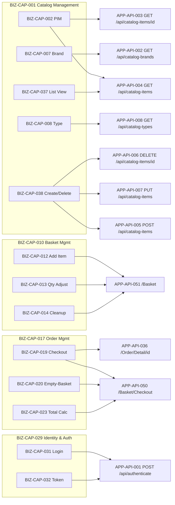

# 11. API Contract Specification (Technology-Neutral REST Contract)

> ⚠️ **DISC-001 (verified 2026-06-25):** Any `CatalogItem` request/response field for stock
> (`AvailableStock`/`RestockThreshold`/`MaxStockThreshold`/`OnReorder`) is a **verified discrepancy** —
> absent from the real `eShopOnWeb` source/DTOs. Exclude from generated contracts. See
> [`../EVIDENCE_VERIFICATION_REPORT.md`](../EVIDENCE_VERIFICATION_REPORT.md).

> **Single Source of Truth:** All endpoints, handlers, deployable units, entities, and ownership links in this document are traced to node ids in the Enterprise Knowledge Graph (`ENTERPRISE_KNOWLEDGE_GRAPH.json`). No endpoint, field, capability, or relationship has been invented. The graph records **exactly 55 application interfaces (APP-API-001 … APP-API-055)** and this contract documents all 55 — and only those 55.
>
> **Technology neutrality:** The legacy implementation (ASP.NET Core 8 / `MinimalApi.Endpoint` / MVC controllers / Razor Pages / Blazor WebAssembly — TECH-CUR-002, TECH-CUR-003, TECH-CUR-013) is referenced only as **Current (legacy)**. The contract itself is expressed in neutral REST + JSON terms so it can be realized on any of the mandated target stacks (Java Spring Boot, ASP.NET Core, Node.js, Python; PostgreSQL/SQL Server/MySQL behind it). The `target_stack` set in the graph is **empty (0 nodes)**; any target technology named below is a **neutral option, not in legacy evidence**.
>
> **Status flags honored:** `Buyer` (DATA-ENT-010) and `PaymentMethod` (DATA-ENT-011) are `persisted=false`, `status=aspirational/unimplemented` (RC-002) — **no payment or buyer-payment endpoint exists** in the 55, and none is fabricated here. Payment capabilities (BIZ-CAP-027/028) are INFERRED/LOW.

---

## 11.1 Scope, Conventions, and Reading Guide

### 11.1.1 What this contract covers

This specification defines the externally observable **request/response contract** for the application's interface surface. It separates three classes of interface, all preserved verbatim from the graph:

| Interface class | Graph evidence | Contract treatment |
|---|---|---|
| **REST/JSON service endpoints** | APP-API-001 … 008 (PublicApi, APP-SVC-011) | Fully specified: request model, response model, validation, error contract. These are the **principal endpoints**. |
| **MVC controller + Razor Page + identity-management routes** | APP-API-009 … 052, 055 (Web, APP-SVC-006) | Catalogued; selected order/basket/identity endpoints with clear handlers are detailed. Page routes are HTML/UI, not JSON APIs, and are flagged accordingly. |
| **Blazor SPA frontend routes & CLI host bootstraps** | APP-API-039, 040, 053, 054, 055 (BlazorAdmin APP-SVC-016 / host `Program`) | Catalogued only; `method=ROUTE`/`CLI` is a **synthetic label, not an extracted HTTP verb** (per OQ-009 / `method_note`). Not RESTful API operations. |

### 11.1.2 Neutral type vocabulary

Field types below are expressed as neutral logical types, mappable to any target language/serializer:

| Neutral type | Meaning | Example mapping |
|---|---|---|
| `Identifier` | Stable surrogate key (integer in legacy `Id` columns) | int64 / number / UUID (target choice) |
| `String` | UTF-8 text | string |
| `Text` | Long free text | string |
| `Decimal(money)` | Monetary amount with currency-safe precision | decimal / BigDecimal / numeric |
| `Integer` | Whole number | int32 |
| `Boolean` | True/false | bool |
| `DateTime` | Timestamp (ISO-8601) | timestamp |
| `Uri` | Absolute or relative resource locator | string (URI) |
| `Token` | Opaque bearer credential (signed JWT in legacy, TECH-SEC-002) | string |

### 11.1.3 Authentication & authorization baseline (graph-evidenced)

- **Authentication mechanisms present:** ASP.NET Core Identity cookie auth (TECH-SEC-001), JWT Bearer (TECH-SEC-002), Blazor WASM auth (TECH-SEC-003) — *Current (legacy)*.
- **CRITICAL GAP (preserved):** `No JWT/authentication enforcement configured for PublicApi` (**TECH-SEC-010**) and `No CORS policy found despite required cross-origin calls` (**TECH-SEC-011**). Open question **OQ-005** confirms JWT/CORS are *inferred from package references only*; no enforcement config was found. Therefore the catalog REST endpoints (APP-API-002…008) carry **`auth=not noted`** in the graph and are documented below as **"auth not enforced in legacy — SHOULD be protected in target"** (see §11.6).

---

## 11.2 Endpoint Catalog — All 55 Interfaces

Legend — **Flag**: `preserve` / `review` (graph `preserve_redesign_review`). **Auth**: graph `auth_required` (verbatim/condensed). **Owner svc**: from `service_to_api` cross-link. **Method note**: `ROUTE`/`CLI` are synthetic labels (OQ-009), not extracted HTTP verbs — marked †.

| API id | Method | Path | Deployable unit | Handler | Auth (graph) | Flag | Owner svc (service_to_api) |
|---|---|---|---|---|---|---|---|
| APP-API-001 | POST | `/api/authenticate` | PublicApi | AuthenticateEndpoint (APP-SVC-029) | issues JWT; ITokenClaimsService + SignInManager | preserve | APP-SVC-011 |
| APP-API-002 | GET | `/api/catalog-brands` | PublicApi | CatalogBrandListEndpoint (APP-SVC-030) | not noted | preserve | APP-SVC-011 |
| APP-API-003 | GET | `/api/catalog-items/{catalogItemId}` | PublicApi | CatalogItemGetByIdEndpoint (APP-SVC-031) | not noted | preserve | APP-SVC-011 |
| APP-API-004 | GET | `/api/catalog-items` | PublicApi | CatalogItemListPagedEndpoint (APP-SVC-032) | not noted | preserve | APP-SVC-011 |
| APP-API-005 | POST | `/api/catalog-items` | PublicApi | CreateCatalogItemEndpoint (APP-SVC-033) | not noted | preserve | APP-SVC-011 |
| APP-API-006 | DELETE | `/api/catalog-items/{catalogItemId}` | PublicApi | DeleteCatalogItemEndpoint (APP-SVC-034) | not noted | preserve | APP-SVC-011 |
| APP-API-007 | PUT | `/api/catalog-items` | PublicApi | UpdateCatalogItemEndpoint (APP-SVC-035) | not noted | preserve | APP-SVC-011 |
| APP-API-008 | GET | `/api/catalog-types` | PublicApi | CatalogTypeListEndpoint (APP-SVC-036) | not noted | preserve | APP-SVC-011 |
| APP-API-009 | ROUTE† | `/{controller:slugify=Home}/{action:slugify=Index}/{id?}` | Web | Program (conventional MVC route) | unknown | review | APP-SVC-006 |
| APP-API-010 | ROUTE† | ASP.NET Razor Pages route registration | Web | Program (Razor Pages route) | unknown | review | APP-SVC-006 |
| APP-API-011 | ROUTE† | `/index.html` | Web | Program (SPA fallback route) | not noted | review | APP-SVC-006 |
| APP-API-012 | GET | `/home_page_health_check` | Web | Program (health check) | not noted | preserve | APP-SVC-006 |
| APP-API-013 | GET | `/api_health_check` | Web | Program (health check) | not noted | preserve | APP-SVC-006 |
| APP-API-014 | GET | `/Manage/MyAccount` | Web | ManageController.MyAccount (APP-SVC-037) | user-facing identity (UserManager) | preserve | APP-SVC-006 |
| APP-API-015 | POST | `/Manage/MyAccount` | Web | ManageController.MyAccount | user-facing identity | preserve | APP-SVC-006 |
| APP-API-016 | POST | `/Manage/SendVerificationEmail` | Web | ManageController.SendVerificationEmail | user-facing identity; IEmailSender | preserve | APP-SVC-006 |
| APP-API-017 | GET | `/Manage/ChangePassword` | Web | ManageController.ChangePassword | user-facing identity | preserve | APP-SVC-006 |
| APP-API-018 | POST | `/Manage/ChangePassword` | Web | ManageController.ChangePassword | user-facing identity; SignInManager | preserve | APP-SVC-006 |
| APP-API-019 | GET | `/Manage/SetPassword` | Web | ManageController.SetPassword | user-facing identity | preserve | APP-SVC-006 |
| APP-API-020 | POST | `/Manage/SetPassword` | Web | ManageController.SetPassword | user-facing identity; SignInManager | preserve | APP-SVC-006 |
| APP-API-021 | GET | `/Manage/ExternalLogins` | Web | ManageController.ExternalLogins | user-facing identity | preserve | APP-SVC-006 |
| APP-API-022 | POST | `/Manage/LinkLogin` | Web | ManageController.LinkLogin | user-facing identity | preserve | APP-SVC-006 |
| APP-API-023 | GET | `/Manage/LinkLoginCallback` | Web | ManageController.LinkLoginCallback | user-facing identity | preserve | APP-SVC-006 |
| APP-API-024 | POST | `/Manage/RemoveLogin` | Web | ManageController.RemoveLogin | user-facing identity | preserve | APP-SVC-006 |
| APP-API-025 | GET | `/Manage/TwoFactorAuthentication` | Web | ManageController.TwoFactorAuthentication | user-facing identity | preserve | APP-SVC-006 |
| APP-API-026 | GET | `/Manage/Disable2faWarning` | Web | ManageController.Disable2faWarning | user-facing identity | preserve | APP-SVC-006 |
| APP-API-027 | POST | `/Manage/Disable2fa` | Web | ManageController.Disable2fa | user-facing identity | preserve | APP-SVC-006 |
| APP-API-028 | GET | `/Manage/EnableAuthenticator` | Web | ManageController.EnableAuthenticator | user-facing identity | preserve | APP-SVC-006 |
| APP-API-029 | GET | `/Manage/ShowRecoveryCodes` | Web | ManageController.ShowRecoveryCodes | user-facing identity | preserve | APP-SVC-006 |
| APP-API-030 | POST | `/Manage/EnableAuthenticator` | Web | ManageController.EnableAuthenticator | user-facing identity | preserve | APP-SVC-006 |
| APP-API-031 | GET | `/Manage/ResetAuthenticatorWarning` | Web | ManageController.ResetAuthenticatorWarning | user-facing identity | preserve | APP-SVC-006 |
| APP-API-032 | POST | `/Manage/ResetAuthenticator` | Web | ManageController.ResetAuthenticator | user-facing identity | preserve | APP-SVC-006 |
| APP-API-033 | POST | `/Manage/GenerateRecoveryCodes` | Web | ManageController.GenerateRecoveryCodes | user-facing identity | preserve | APP-SVC-006 |
| APP-API-034 | GET | `/Manage/GenerateRecoveryCodesWarning` | Web | ManageController.GenerateRecoveryCodesWarning | user-facing identity | preserve | APP-SVC-006 |
| APP-API-035 | GET | `/Order/MyOrders` | Web | OrderController.MyOrders (IMediator.Send) (APP-SVC-038) | user-facing | preserve | APP-SVC-006 |
| APP-API-036 | GET | `/Order/Detail/{orderId}` | Web | OrderController.Detail (IMediator.Send) | user-facing | preserve | APP-SVC-006 |
| APP-API-037 | GET | `/User` | Web | UserController.GetCurrentUser (APP-SVC-039) | user-facing identity (SignInManager) | preserve | APP-SVC-006 |
| APP-API-038 | POST | `/User/Logout` | Web | UserController.Logout | user-facing identity; SignInManager | preserve | APP-SVC-006 |
| APP-API-039 | ROUTE† | `/logout` | BlazorAdmin | Logout (Logout.razor) (APP-SVC-016) | user-facing | review | APP-SVC-016 |
| APP-API-040 | ROUTE† | `/admin` | BlazorAdmin | List (List.razor; ICatalogItemService / ICatalogLookupDataService) | user-facing | review | APP-SVC-016 |
| APP-API-041 | GET | `/Account/ConfirmEmail` | Web | ConfirmEmail (Razor Page) | user-facing identity | preserve | APP-SVC-006 |
| APP-API-042 | GET | `/Account/Login` | Web | Login (Razor Page) | user-facing identity | preserve | APP-SVC-006 |
| APP-API-043 | GET | `/Account/Logout` | Web | Logout (Razor Page) | user-facing identity | preserve | APP-SVC-006 |
| APP-API-044 | GET | `/Account/Register` | Web | Register (Razor Page) | user-facing identity | preserve | APP-SVC-006 |
| APP-API-045 | GET | `/Error` | Web | Error (Razor Page) | user-facing | preserve | APP-SVC-006 |
| APP-API-046 | GET | `/` | Web | Index (Razor Page) | user-facing | preserve | APP-SVC-006 |
| APP-API-047 | GET | `/Privacy` | Web | Privacy (Razor Page) | user-facing | preserve | APP-SVC-006 |
| APP-API-048 | GET | `/Admin/EditCatalogItem` | Web | EditCatalogItem (Razor Page) | user-facing (admin) | preserve | APP-SVC-006 |
| APP-API-049 | GET | `/Admin` | Web | Index (Admin Razor Page) | user-facing (admin) | preserve | APP-SVC-006 |
| APP-API-050 | GET | `/Basket/Checkout` | Web | Checkout (Razor Page) | user-facing | preserve | APP-SVC-006 |
| APP-API-051 | GET† | `/{handler?}` | Web | Index (Basket Razor Page) | user-facing | review | APP-SVC-006 |
| APP-API-052 | GET | `/Basket/Success` | Web | Success (Razor Page) | user-facing | preserve | APP-SVC-006 |
| APP-API-053 | CLI† | .NET application bootstrap Program.cs (BlazorAdmin) | BlazorAdmin | Program | internal | review | APP-SVC-016 |
| APP-API-054 | CLI† | .NET application bootstrap Program.cs (PublicApi) | PublicApi | Program | internal | review | APP-SVC-011 |
| APP-API-055 | CLI† | .NET application bootstrap Program.cs (Web) | Web | Program | internal | review | APP-SVC-006 |

**Catalog totals (graph-aligned):** 55 interfaces; 8 REST/JSON service endpoints (APP-API-001…008); 2 health checks; 21 `/Manage/*` identity routes (ManageController, APP-SVC-037); 4 order/user controller routes (APP-SVC-038/039); 12 Razor Page routes; 2 Blazor SPA routes (APP-SVC-016); 3 CLI host bootstraps; 3 conventional route registrations. `service_to_api`: PublicApi (APP-SVC-011) → 9 ids; Web (APP-SVC-006) → 43 ids; BlazorAdmin (APP-SVC-016) → 3 ids.

> **Shape-inference flag:** APP-API-009/010/011/039/040/053/054/055 carry **`method=ROUTE`/`CLI`** which is **synthetic — not an extracted HTTP verb** (OQ-009, graph `method_note`). APP-API-051 path `/{handler?}` is a Razor Pages handler-segment route, not a true REST template. These are **catalogued, not contract-specified** as JSON operations.

---

## 11.3 Principal Endpoint Contracts — Catalog Domain (PublicApi, APP-SVC-011)

These endpoints have clear handlers (APP-SVC-029…036) and map cleanly onto persisted entities. Request/response models are derived from `key_attributes` of the related DATA-ENT nodes. Where the wire shape (DTO) is not fully present in evidence — the graph records entity columns, not request/response DTOs — fields are marked **"shape inferred from related entity"** and flagged.

### 11.3.1 POST `/api/authenticate` — Authenticate (APP-API-001, handler AuthenticateEndpoint APP-SVC-029)

Realizes **BIZ-CAP-031 User Login** and **BIZ-CAP-032 Token Issuance** via process **BIZ-PROC-007 User Authentication**. Operates on `ApplicationUser` (DATA-ENT-008) and `Role` (DATA-ENT-009).

**Request Model** — *shape inferred from related entity DATA-ENT-008; the graph records the entity columns (`UserName`, `Email`, `PasswordHash`, `PhoneNumber`) and process step "Submit username and password", not a literal request DTO. Flagged.*

| Field | Neutral type | Source attribute | Required | Notes |
|---|---|---|---|---|
| `username` | String | DATA-ENT-008.UserName | Yes | Credential identifier |
| `password` | String | (credential, not persisted as plaintext; verified against DATA-ENT-008.PasswordHash) | Yes | Never echoed back |

**Response Model**

| Field | Neutral type | Source | Notes |
|---|---|---|---|
| `token` | Token | BIZ-PROC-007 step 3 (signed JWT with identity + role claims; TECH-SEC-002) | Issued only on success |
| `result` / `status` | String | BIZ-PROC-007 step 2 (success / failed / locked-out / not-allowed) | *shape inferred — process names these outcomes; exact field naming not in evidence. Flagged.* |

**Validation Rules**

- `username` and `password` both required (BIZ-PROC-007 step 1: "Submit username and password").
- Credentials validated against identity store; account **must not be locked out** and sign-in **must be allowed** (BIZ-PROC-007 step 2 decision: "valid and not locked out").

**Error Contract** (neutral problem-detail; see §11.5 for the common envelope)

| HTTP | When it occurs |
|---|---|
| 400 | Missing/empty `username` or `password`. |
| 401 | Credentials invalid (failed sign-in). |
| 403 | Account locked out or sign-in not allowed (BIZ-PROC-007 "lockout/not-allowed status"). |
| 500 | Identity store unavailable / token signing failure. |

> **Auth note:** This endpoint *issues* the token; it is itself unauthenticated by definition.

### 11.3.2 GET `/api/catalog-items` — List Catalog Items (paged) (APP-API-004, handler CatalogItemListPagedEndpoint APP-SVC-032)

Realizes **BIZ-CAP-037 Catalog Item List View** / **BIZ-CAP-002 PIM**; supports **BIZ-PROC-001 Browse Catalog**. Entity: `CatalogItem` (DATA-ENT-001).

**Request Model** (query parameters) — *shape inferred from handler name "ListPaged" + browse process; pagination/filter parameter names not literally in graph evidence. Flagged.*

| Param | Neutral type | Source | Required | Notes |
|---|---|---|---|---|
| `pageIndex` | Integer | "ListPaged" handler semantics | No | Page offset; default first page |
| `pageSize` | Integer | "ListPaged" handler semantics | No | Page length |
| `catalogBrandId` | Identifier | DATA-ENT-001.CatalogBrandId (DATA-REL-001) | No | Optional brand filter |
| `catalogTypeId` | Identifier | DATA-ENT-001.CatalogTypeId (DATA-REL-002) | No | Optional type filter |

**Response Model** (entity-shaped, paged collection of `CatalogItem` DATA-ENT-001)

| Field | Neutral type | Source attribute |
|---|---|---|
| `catalogItems[]` | Array | DATA-ENT-001 |
| `catalogItems[].id` | Identifier | DATA-ENT-001.Id |
| `catalogItems[].name` | String | DATA-ENT-001.Name |
| `catalogItems[].description` | Text | DATA-ENT-001.Description |
| `catalogItems[].price` | Decimal(money) | DATA-ENT-001.Price |
| `catalogItems[].pictureUri` | Uri | DATA-ENT-001.PictureUri (composed via IUriComposer / UriComposer APP-SVC-020) |
| `catalogItems[].catalogTypeId` | Identifier | DATA-ENT-001.CatalogTypeId |
| `catalogItems[].catalogBrandId` | Identifier | DATA-ENT-001.CatalogBrandId |
| `pageCount` / `totalItems` | Integer | "ListPaged" semantics — *shape inferred, flagged* |

> Stock fields (`AvailableStock`, `RestockThreshold`, `MaxStockThreshold`, `OnReorder`) exist on DATA-ENT-001 but their exposure in the list DTO is **not in evidence** — treated as internal unless an admin contract requires them. Flagged.

**Validation Rules:** `pageSize` and `pageIndex`, when supplied, must be non-negative integers (consistent with the qty≥0 non-negativity principle, BR007). No required body.

**Error Contract**

| HTTP | When it occurs |
|---|---|
| 400 | Non-integer / negative pagination or filter values. |
| 500 | Repository/data-store failure (EfRepository, APP-DEP-009; SQL dependency APP-DEP-019). |

### 11.3.3 GET `/api/catalog-items/{catalogItemId}` — Get Catalog Item by Id (APP-API-003, handler CatalogItemGetByIdEndpoint APP-SVC-031)

Entity: `CatalogItem` (DATA-ENT-001).

**Request Model:** path parameter `catalogItemId` (Identifier, DATA-ENT-001.Id) — **required**.

**Response Model:** single `CatalogItem` object, same fields as §11.3.2 row schema.

**Validation Rules:** `catalogItemId` must be a valid identifier (positive, well-formed).

**Error Contract**

| HTTP | When it occurs |
|---|---|
| 400 | Malformed `catalogItemId` (non-numeric / negative). |
| 404 | No `CatalogItem` with that id. |
| 500 | Data-store failure. |

### 11.3.4 POST `/api/catalog-items` — Create Catalog Item (APP-API-005, handler CreateCatalogItemEndpoint APP-SVC-033)

Realizes **BIZ-CAP-038 Catalog Item Create/Delete** via **BIZ-PROC-006 Catalog Item Administration** (rules BR001–BR004). Entity: `CatalogItem` (DATA-ENT-001).

**Request Model** — *shape inferred from DATA-ENT-001 attributes + BR001–BR004; the create DTO is not itself a graph node. Flagged.*

| Field | Neutral type | Source attribute | Required | Rule |
|---|---|---|---|---|
| `name` | String | DATA-ENT-001.Name | Yes | BR001 (name validation) |
| `description` | Text | DATA-ENT-001.Description | Yes | BR001 (description validation) |
| `price` | Decimal(money) | DATA-ENT-001.Price | Yes | BR001 (price validation) |
| `catalogBrandId` | Identifier | DATA-ENT-001.CatalogBrandId | Yes | **BR002: brand id ≠ 0** |
| `catalogTypeId` | Identifier | DATA-ENT-001.CatalogTypeId | Yes | **BR003: type id ≠ 0** |
| `pictureUri` / `pictureName` | Uri/String | DATA-ENT-001.PictureUri | No | **BR004: image path generated** |

**Response Model:** the created `CatalogItem` (entity-shaped, incl. server-assigned `id`).

**Validation Rules (from BIZ-PROC-006 business rules):**

- **BR001** — `name`, `description`, `price` required and valid (non-empty name/description; price valid). (CatalogItem.cs)
- **BR002** — `catalogBrandId` must be ≠ 0 (must reference a real `CatalogBrand`, DATA-ENT-002 / DATA-REL-001).
- **BR003** — `catalogTypeId` must be ≠ 0 (must reference a real `CatalogType`, DATA-ENT-003 / DATA-REL-002).
- **BR004** — image path/URI generated for the item.

**Error Contract**

| HTTP | When it occurs |
|---|---|
| 400 | Missing required field / malformed body. |
| 401 | Caller unauthenticated *(target requirement; not enforced in legacy — TECH-SEC-010 / OQ-005)*. |
| 403 | Caller authenticated but not authorized for admin create. |
| 422 | Semantic validation failure: `brandId=0` (BR002) or `typeId=0` (BR003); invalid price (BR001). |
| 500 | Persistence failure. |

### 11.3.5 PUT `/api/catalog-items` — Update Catalog Item (APP-API-007, handler UpdateCatalogItemEndpoint APP-SVC-035)

Entity: `CatalogItem` (DATA-ENT-001). Note legacy path carries **no id segment** (id travels in the body) — preserved as-is.

**Request Model:** same fields as §11.3.4 **plus** `id` (Identifier, DATA-ENT-001.Id, **required**). *Update DTO shape inferred from entity attributes; flagged.*

**Response Model:** the updated `CatalogItem` (entity-shaped).

**Validation Rules:** `id` required and must resolve to an existing item; BR001–BR004 apply as in §11.3.4.

**Error Contract**

| HTTP | When it occurs |
|---|---|
| 400 | Missing `id` or malformed body. |
| 401 / 403 | Unauthenticated / unauthorized *(target requirement; TECH-SEC-010)*. |
| 404 | `id` does not resolve to an existing `CatalogItem`. |
| 409 | Concurrent-update conflict (optimistic concurrency — *target option, no concurrency token in legacy evidence; flagged*). |
| 422 | BR001/BR002/BR003 violation. |
| 500 | Persistence failure. |

### 11.3.6 DELETE `/api/catalog-items/{catalogItemId}` — Delete Catalog Item (APP-API-006, handler DeleteCatalogItemEndpoint APP-SVC-034)

**Request Model:** path parameter `catalogItemId` (Identifier, DATA-ENT-001.Id) — **required**.

**Response Model:** confirmation envelope (e.g. `{ status }`) — *shape inferred; not in evidence. Flagged.*

**Validation Rules:** `catalogItemId` valid and existing.

**Error Contract**

| HTTP | When it occurs |
|---|---|
| 400 | Malformed `catalogItemId`. |
| 401 / 403 | Unauthenticated / unauthorized *(target requirement; TECH-SEC-010)*. |
| 404 | No such `CatalogItem`. |
| 409 | Item referenced by existing baskets/orders and cannot be deleted (referential guard — *target option; not explicit in legacy evidence; flagged*). |
| 500 | Persistence failure. |

### 11.3.7 GET `/api/catalog-brands` — List Catalog Brands (APP-API-002, handler CatalogBrandListEndpoint APP-SVC-030)

Realizes **BIZ-CAP-007 Brand Management**. Entity: `CatalogBrand` (DATA-ENT-002).

**Request Model:** none.
**Response Model:** array of `CatalogBrand`:

| Field | Neutral type | Source attribute |
|---|---|---|
| `catalogBrands[].id` | Identifier | DATA-ENT-002.Id |
| `catalogBrands[].brand` | String | DATA-ENT-002.Brand |

**Validation Rules:** none (read, no parameters).
**Error Contract:** `500` on data-store failure. (No 4xx — no inputs.)

### 11.3.8 GET `/api/catalog-types` — List Catalog Types (APP-API-008, handler CatalogTypeListEndpoint APP-SVC-036)

Realizes **BIZ-CAP-008 Type Management**. Entity: `CatalogType` (DATA-ENT-003).

**Request Model:** none.
**Response Model:** array of `CatalogType`:

| Field | Neutral type | Source attribute |
|---|---|---|
| `catalogTypes[].id` | Identifier | DATA-ENT-003.Id |
| `catalogTypes[].type` | String | DATA-ENT-003.Type |

**Validation Rules:** none.
**Error Contract:** `500` on data-store failure.

---

## 11.4 Principal Endpoint Contracts — Basket & Order Domains

> **Important evidence boundary:** The graph contains **no dedicated REST basket endpoint** among the 55. Basket behavior is realized through the **`/Basket/*` Razor Page routes** (APP-API-050 Checkout, APP-API-051 Basket index handler, APP-API-052 Success) owned by Web (APP-SVC-006), operating on the **BasketAggregate** (DATA-AGG-001: Basket DATA-ENT-004, BasketItem DATA-ENT-005). Order behavior is realized through **OrderController** routes (APP-API-035/036) over the **OrderAggregate** (DATA-AGG-002). These are **UI/page interactions, not JSON service APIs** — so their request/response shapes are **inferred from the related entities and processes** and **flagged** throughout. No JSON basket/order endpoint is invented beyond the 55.

### 11.4.1 Basket interaction — `/Basket` (APP-API-051, handler Index/Basket Razor Page) and `/Basket/Checkout` (APP-API-050)

Realizes **BIZ-CAP-012 Add Item to Basket**, **BIZ-CAP-013 Quantity Adjustment**, **BIZ-CAP-014 Basket Cleanup** via **BIZ-PROC-002 Add Item to Basket** and **BIZ-PROC-004 Adjust Basket**. Entities: `Basket` (DATA-ENT-004), `BasketItem` (DATA-ENT-005), referencing `CatalogItem` (DATA-ENT-005 → DATA-REL-004: `BasketItem *..1 CatalogItem`).

**Logical Request Model (add / adjust item)** — *page-handler form post; shape inferred from DATA-ENT-005 attributes + BIZ-PROC-002/004. Flagged.*

| Field | Neutral type | Source attribute | Required | Rule |
|---|---|---|---|---|
| `catalogItemId` | Identifier | DATA-ENT-005.CatalogItemId | Yes | Must reference existing `CatalogItem` |
| `quantity` | Integer | DATA-ENT-005.Quantity | Yes | **BR007: must be ≥ 0 (negative rejected)** |
| `basketId` / buyer key | Identifier / String | DATA-ENT-004.Id / DATA-ENT-004.BuyerId | Conditional | Existing basket reused, else created (BIZ-PROC-002 step 1) |

**Logical Response Model (basket state)** — entity-shaped over BasketAggregate (DATA-AGG-001):

| Field | Neutral type | Source attribute |
|---|---|---|
| `id` | Identifier | DATA-ENT-004.Id |
| `buyerId` | String | DATA-ENT-004.BuyerId (soft ref to ApplicationUser, DATA-REL-008) |
| `items[].id` | Identifier | DATA-ENT-005.Id |
| `items[].catalogItemId` | Identifier | DATA-ENT-005.CatalogItemId |
| `items[].unitPrice` | Decimal(money) | DATA-ENT-005.UnitPrice (captured at add-time) |
| `items[].quantity` | Integer | DATA-ENT-005.Quantity |

**Validation Rules (from basket business rules):**

- **BR005** — adding an item already present **increases the existing line's quantity** rather than creating a duplicate line (BIZ-PROC-002 step 2; Basket.cs).
- **BR007** — a quantity adjustment **must not produce a negative value**; negative quantity rejected (BasketItem.cs).
- **BR006** — a basket line whose quantity reaches **zero is removed** (Basket.cs) (BIZ-CAP-014 Basket Cleanup).

**Error Contract**

| HTTP | When it occurs |
|---|---|
| 400 | Missing `catalogItemId` / non-integer `quantity`. |
| 404 | `catalogItemId` does not resolve to a `CatalogItem`. |
| 422 | Negative `quantity` (BR007). |
| 500 | Persistence failure. |

> **Anonymous-to-registered transfer** (BIZ-CAP-016 / BIZ-PROC-003) merges an anonymous basket into the registered user's basket on login. It is **not a standalone endpoint** in the 55 — it is triggered by the identity/login flow (e.g. APP-API-042 `/Account/Login`). Documented as behavior, not as a new endpoint.

### 11.4.2 Checkout / Place Order — `/Basket/Checkout` (APP-API-050) → OrderController (APP-API-035/036, APP-SVC-038)

Realizes **BIZ-CAP-019 Checkout Processing**, **BIZ-CAP-020 Empty Basket Protection**, **BIZ-CAP-021 Ordered Item Snapshot**, **BIZ-CAP-023 Order Total Calculation** via **BIZ-PROC-005 Checkout / Place Order**. Entities: `Order` (DATA-ENT-006), `OrderItem` (DATA-ENT-007), `CatalogItemOrdered` (DATA-ENT-012), `Address` (DATA-ENT-013) — OrderAggregate (DATA-AGG-002).

**Logical Request Model (place order)** — *form/command shape inferred from DATA-ENT-006/013 attributes + BIZ-PROC-005. Flagged.*

| Field | Neutral type | Source attribute | Required | Rule |
|---|---|---|---|---|
| `buyerId` | String | DATA-ENT-006.BuyerId | Yes | **BR011: order requires buyer id** |
| `shipToAddress.street` | String | DATA-ENT-013.ShipToAddress_Street | Yes | PII (DATA-ENT-013 pii=true) |
| `shipToAddress.city` | String | DATA-ENT-013.ShipToAddress_City | Yes | PII |
| `shipToAddress.state` | String | DATA-ENT-013.ShipToAddress_State | Yes | PII |
| `shipToAddress.country` | String | DATA-ENT-013.ShipToAddress_Country | Yes | PII |
| `shipToAddress.zipCode` | String | DATA-ENT-013.ShipToAddress_ZipCode | Yes | PII |
| (basket reference) | Identifier | DATA-ENT-004.Id | Yes | Source basket must be non-empty (BR012) |

**Logical Response Model (order)** — entity-shaped over OrderAggregate (DATA-AGG-002):

| Field | Neutral type | Source attribute |
|---|---|---|
| `id` | Identifier | DATA-ENT-006.Id |
| `buyerId` | String | DATA-ENT-006.BuyerId |
| `orderDate` | DateTime | DATA-ENT-006.OrderDate |
| `shipToAddress.*` | String | DATA-ENT-013.ShipToAddress_* |
| `orderItems[].itemOrdered.catalogItemId` | Identifier | DATA-ENT-012.ItemOrdered_CatalogItemId |
| `orderItems[].itemOrdered.productName` | String | DATA-ENT-012.ItemOrdered_ProductName |
| `orderItems[].itemOrdered.pictureUri` | Uri | DATA-ENT-012.ItemOrdered_PictureUri |
| `orderItems[].unitPrice` | Decimal(money) | DATA-ENT-007.UnitPrice |
| `orderItems[].units` | Integer | DATA-ENT-007.Units |
| `total` | Decimal(money) | **BR010: sum(unitPrice × units)** (computed, BIZ-CAP-023) |

**Validation Rules (from BIZ-PROC-005 business rules):**

- **BR012** — checkout is **blocked when the basket is empty** (GuardExtensions.cs / BasketGuards APP-SVC-027); raise empty-basket error (BIZ-CAP-020).
- **BR011** — an order **cannot be created without a buyer id** (Order.cs).
- **BR009** — each order line requires a **valid catalog item id, product name, and picture** (CatalogItemOrdered.cs) — the snapshot (BIZ-CAP-021).
- **BR010** — order **total = Σ(unit price × quantity)** (Order.cs) (BIZ-CAP-023).
- Shipping address fields required (Address DATA-ENT-013, all `ShipToAddress_*` present).

**Error Contract**

| HTTP | When it occurs |
|---|---|
| 400 | Missing/malformed shipping address or buyer id. |
| 401 | Caller unauthenticated (checkout is user-facing; identity required). |
| 403 | Authenticated user not permitted to check out this basket. |
| 404 | Referenced basket / catalog item not found (BR009 unresolved snapshot source). |
| 409 | **Empty basket** — checkout blocked (BR012, BIZ-CAP-020). *(Alternatively 422; see §11.5 mapping note.)* |
| 422 | Missing buyer id (BR011); invalid order line snapshot (BR009). |
| 500 | Order persistence / total-calculation failure. |

### 11.4.3 Order read endpoints — `/Order/MyOrders` (APP-API-035) and `/Order/Detail/{orderId}` (APP-API-036)

Handlers `OrderController.MyOrders` / `OrderController.Detail` via `IMediator.Send` (APP-SVC-038, IMediator APP-IF-012; query handlers GetMyOrders APP-SVC-041/042, GetOrderDetails APP-SVC-043). Entity: `Order` (DATA-ENT-006) / OrderAggregate (DATA-AGG-002).

- **`GET /Order/MyOrders`** — Request: none beyond authenticated user context. Response: collection of order summaries (entity-shaped over DATA-ENT-006: `id`, `orderDate`, `total`). *Summary field set inferred from MyOrders handler; flagged.*
- **`GET /Order/Detail/{orderId}`** — Request: path `orderId` (Identifier, DATA-ENT-006.Id, required). Response: full order (as §11.4.2 response model).

**Validation Rules:** `orderId` valid; order must belong to the authenticated buyer (DATA-REL-009 soft ref).

**Error Contract:** `400` malformed `orderId`; `401` unauthenticated; `403` order not owned by caller; `404` no such order; `500` data-store failure.

### 11.4.4 Current-user & logout — `/User` (APP-API-037), `/User/Logout` (APP-API-038)

`UserController.GetCurrentUser` / `Logout` (APP-SVC-039), realizing **BIZ-CAP-030 Access Control**. Entity: `ApplicationUser` (DATA-ENT-008, pii=true).

- **`GET /User`** — Response: current user summary (`userName` from DATA-ENT-008.UserName; never returns `PasswordHash`). Validation: must be authenticated. Errors: `401` unauthenticated; `500`.
- **`POST /User/Logout`** — Request: none. Response: confirmation. Errors: `401` if no active session; `500`.

> The 21 `/Manage/*` routes (APP-API-014…034, ManageController APP-SVC-037) are **user-facing identity self-service** (password, 2FA, external logins, recovery codes). They are **preserved** but are HTML/form identity flows over `ApplicationUser` (DATA-ENT-008), not JSON service contracts; they are catalogued in §11.2 and not re-specified field-by-field, as their DTOs are not in graph evidence (flagged).

---

## 11.5 Common Error Contract (Neutral Problem-Detail Style)

A single neutral problem-detail envelope is recommended for all JSON endpoints (a neutral RFC 9457 / RFC 7807-style shape — **not in legacy evidence**; legacy uses framework defaults — offered as a target option, see ASMP-FE-103).

```
{
  "type":     "string (URI reference identifying the problem class)",
  "title":    "string (short, human-readable summary)",
  "status":   "integer (HTTP status code)",
  "detail":   "string (explanation specific to this occurrence)",
  "instance": "string (URI of the failing request, optional)",
  "errors":   "object (field -> [messages], for validation failures)"
}
```

| Status | Meaning | Canonical triggers in this contract |
|---|---|---|
| **400 Bad Request** | Syntactic/parse error or missing required field | Malformed body, non-integer quantity/id, absent required attribute |
| **401 Unauthorized** | No/invalid authentication | Authenticate failure (APP-API-001); protected catalog mutations & all user-facing flows when unauthenticated *(see TECH-SEC-010 gap)* |
| **403 Forbidden** | Authenticated but not permitted | Account locked/sign-in-not-allowed (BIZ-PROC-007); non-admin attempting catalog create/update/delete; accessing another buyer's order |
| **404 Not Found** | Target resource absent | Unknown `catalogItemId`, `orderId`; unresolved snapshot source |
| **409 Conflict** | State conflict | Empty-basket checkout (BR012); concurrent update; delete blocked by references |
| **422 Unprocessable Entity** | Semantic/business-rule violation on well-formed input | brandId=0 (BR002); typeId=0 (BR003); name/price invalid (BR001); negative quantity (BR007); missing buyer id (BR011); invalid order-line snapshot (BR009) |
| **500 Internal Server Error** | Unexpected server/data-store failure | Repository/SQL failures (APP-DEP-009, APP-DEP-019); token-signing failure |

> **400 vs 422 / 409 mapping note:** Legacy evidence records *that* a rule is enforced (BR001–BR012) but **not the HTTP status** each maps to (the graph has no status-code evidence). The mapping above is a **neutral convention** (syntactic→400, business-rule→422, state-conflict→409). Teams preferring a 400-only convention may collapse 422/409 into 400. Recorded as **ASMP-FE-104**.

---

## 11.6 API Versioning Strategy (Neutral Recommendation)

**Evidence position:** The graph shows endpoint paths under `/api/...` and `/...` with **no version segment, no version header, and no media-type version** anywhere in the 55 interfaces. There is **no versioning scheme in legacy evidence** — recorded as **ASMP-FE-101** (gap).

Because `target_stack` is empty (0 nodes), the following is offered as a **neutral recommendation**, realizable on any mandated stack:

| Option | Form | Pros | Cons | Fit |
|---|---|---|---|---|
| **URI versioning** | `/api/v1/catalog-items` | Visible, cache/proxy-friendly, trivial routing on any framework | Pollutes URIs; encourages whole-API version bumps | **Recommended default** for the externally browsable PublicApi (APP-SVC-011) — lowest-friction migration from today's unversioned `/api/...` |
| **Header versioning** | `Api-Version: 1` or custom header | Clean URIs; fine-grained | Less discoverable; harder to test in a browser; caching needs `Vary` | Optional for internal consumers (BlazorAdmin APP-DEP-017) |
| **Media-type versioning** | `Accept: application/vnd.eshop.catalog-item.v1+json` | Resource-level evolution; RESTful | Highest complexity; weak tooling support | Not recommended initially |

**Recommendation (neutral):** adopt **URI-based major versioning** (`/api/v1/...`) as the baseline for the eight PublicApi REST endpoints (APP-API-001…008), introduce new major versions only for breaking changes, and add deprecation headers (`Sunset`) for retired versions. Reserve header versioning for internal SPA-to-API traffic if needed. **Web Razor Page / `/Manage/*` / Blazor SPA routes are not versioned** (they are UI navigation, not a public contract). Recorded as **ASMP-FE-102**.

---

## 11.7 Capability → Endpoint Traceability (Principal Endpoints)



---

## 11.8 Assumptions & Gaps (this document)

New forward-engineering assumptions raised here (basis + impact); pre-existing graph assumptions (ASSUMP-001…007) and open questions (OQ-001…009) are reused where cited.

| Assumption id | Statement | Basis | Impact |
|---|---|---|---|
| **ASMP-FE-101** | The legacy API has **no versioning scheme** of any kind. | No version segment/header/media-type appears on any of the 55 APP-API paths. | A versioning strategy must be introduced during forward engineering (gap); affects all consumers. |
| **ASMP-FE-102** | Adopt **URI major versioning** (`/api/v1/...`) for the 8 PublicApi REST endpoints; leave UI/page routes unversioned. | Lowest-friction evolution from today's unversioned `/api/...`; neutral, stack-independent. | Routing/contract change at cutover; consumer (BlazorAdmin, APP-DEP-017) must target versioned base URL. |
| **ASMP-FE-103** | Adopt a **neutral problem-detail envelope** (RFC 9457/7807-style) for JSON errors. | Legacy uses framework defaults; no error-body schema in evidence. | Standardizes client error handling; not in legacy evidence — target option only. |
| **ASMP-FE-104** | Map syntactic errors→400, business-rule violations→422, state conflicts→409. | Graph records *that* BR001–BR012 are enforced but not their HTTP status. | Status mapping is convention; teams may collapse to 400-only. |
| **ASMP-FE-105** | Request/response **DTO shapes for catalog/basket/order operations are inferred from related DATA-ENT attributes**, since the graph stores entity columns, not wire DTOs. | DATA-ENT-001/004/005/006/007/012/013 `key_attributes`; processes BIZ-PROC-002/005. | All such fields are marked "shape inferred from related entity"; verify against source DTOs before implementation. |
| **ASMP-FE-106** | Catalog mutation endpoints (APP-API-005/006/007) **SHOULD require authentication+authorization** in the target even though legacy marks them `auth=not noted`. | TECH-SEC-010 (no JWT enforcement on PublicApi) + OQ-005 (JWT/CORS inferred from packages only). | Closes a High-severity security gap; introduces 401/403 paths absent in legacy. |

**Open gaps carried from the graph (not resolved here):**

- **TECH-SEC-010 / OQ-005** — PublicApi has no confirmed JWT enforcement and **TECH-SEC-011** no CORS policy; the catalog endpoints' `auth=not noted` reflects this. Target contract assumes enforcement (ASMP-FE-106) but legacy state is a documented gap.
- **OQ-009** — APP-API-009/010/011/039/040/053/054/055 carry synthetic `ROUTE`/`CLI` methods (graph `method_note`: source catalogue records `method='unknown'`); not specifiable as JSON operations. Catalogued only. (APP-API-051 is **separate** — `method=GET` with no `method_note`, a Razor Pages handler-segment route `/{handler?}`, shown as GET† in §11.2; it is not part of the OQ-009 set.)
- **RC-002** — `Buyer` (DATA-ENT-010) / `PaymentMethod` (DATA-ENT-011) unimplemented; payment capabilities BIZ-CAP-027/028 INFERRED/LOW. **No payment endpoint exists** in the 55 and none is added.
- **OQ-002** — PublicApi listening port disagreement (8080 vs EXPOSE 80/443) affects base-URL composition, not the contract itself.
