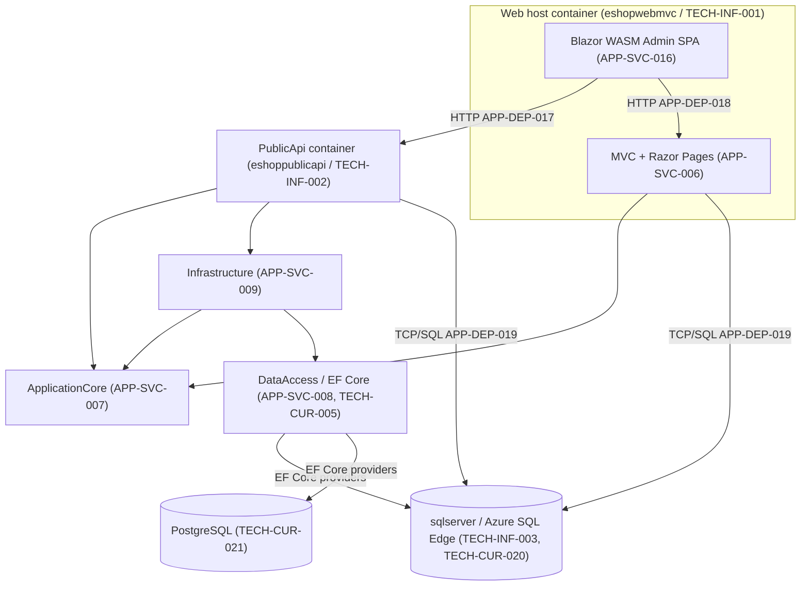
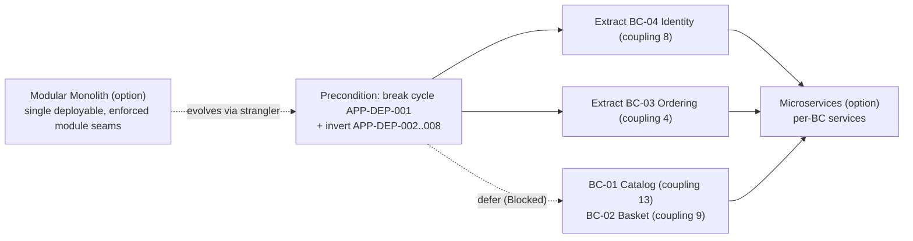

# 12. Technology Blueprint (Technology-Neutral)

> **Single source of truth:** `ENTERPRISE_KNOWLEDGE_GRAPH.json`. Every legacy fact below is traced to a graph node id (TECH-CUR-###, TECH-INF-###, TECH-SEC-###, APP-SVC-###, APP-DEP-###, DATA-REPO-###, APP-API-###, APP-IF-###). Bounded contexts BC-01..BC-07 are reused exactly from `05_DOMAIN_MODEL.md` / `DECISIONS.json`.
>
> **Neutrality contract.** The graph's `target_stack` is **EMPTY (0 TECH-TGT nodes)**. Therefore **no target technology in this document is a discovered fact**. Every target stack, framework, database, or deployment option in Sections 3–7 is a **NEUTRAL OPTION, explicitly not in legacy evidence**, offered to satisfy the mandated candidate set. Only Section 2 (Current Architecture) asserts evidence; it is labelled **"Current (legacy)"** throughout.
>
> **Scope.** This blueprint maps *current concepts* (Section 2) onto each *mandated target option* (Sections 3–7) and presents an architecture-style decision matrix (Section 8) grounded in the graph's coupling and cycle evidence. It contains no code, no manifests-as-artifacts, and no implementation. Manifest and framework *concepts* are described as target options only.

---

## 1. Purpose, Method, and How to Read This Blueprint

This document is the technology-neutral bridge between the evidence-anchored current state and any future forward-engineering decision. It does three things:

1. **Records the current (legacy) stack** exhaustively from the 26 `TECH-CUR-*`, 8 `TECH-INF-*`, and (for context) 17 `TECH-SEC-*` nodes, organised by architectural layer, with ids cited inline.
2. **Offers neutral target options** for backend framework, frontend framework, database engine, and deployment model — covering the full mandated candidate set — via concept-mapping tables that translate each named current component to its analogue in each option. No option is recommended over another at the technology level; selection is a downstream decision.
3. **Frames the architecture-style choice** (Modular Monolith vs Microservices) per bounded context, with trade-offs derived strictly from the coupling scores, the module dependency cycle (`APP-DEP-001`), and the boundary-readiness signals already in the graph.

**Reading rule.** Where a row says *"Current (legacy)"* it is evidence. Where a row names Java/Spring Boot, ASP.NET Core, Node.js, Python, React, Angular, Vue, PostgreSQL, SQL Server, MySQL, Docker, or Kubernetes as a *target*, it is a **neutral option not present in legacy evidence**.

---

## 2. Current Architecture (Evidence — "Current (legacy)")

### 2.1 Architectural Style of the Legacy System

The legacy system is a **layered, multi-project .NET monolith** with three deployable runtime units packaged as containers and orchestrated locally by Docker Compose:

- **Web** (`APP-SVC-006`, deployable `eshopwebmvc` / `TECH-INF-001`) — ASP.NET Core MVC + Razor Pages host that also serves the hosted Blazor WebAssembly admin SPA.
- **PublicApi** (`APP-SVC-011`, deployable `eshoppublicapi` / `TECH-INF-002`) — REST API surface (`APP-API-001`..`APP-API-008`) with Swagger UI.
- **BlazorAdmin** (`APP-SVC-016`) — a non-deployable Blazor WASM SPA delivered *inside* the Web host, calling PublicApi (`APP-DEP-017`) and Web (`APP-DEP-018`) over HTTP at runtime.

Supporting library modules: `ApplicationCore` (`APP-SVC-007`), `Infrastructure` (`APP-SVC-009`), `DataAccess` (`APP-SVC-008`), `SharedContracts`/BlazorShared (`APP-SVC-012`), `CrossCutting` (`APP-SVC-010`). The layering is **weakly enforced**: the graph records a full **module dependency cycle** (`APP-DEP-001`: Admin → ApplicationCore → Basket → Catalog → DataAccess → Identity → Order → Web → back to Admin; ARCH-VIOL-008) and seven direct **endpoint/PageModel → repository** layer violations (six endpoint + one PageModel, `APP-DEP-002`..`APP-DEP-008`). These are the central constraints for Section 8.

> **Open evidence item (hosting model).** The graph carries an internal WASM-vs-Server tension: `TECH-CUR-003` is named **"Blazor WebAssembly"**, whereas the `APP-SVC-006` evidence anchor describes the Web host as an **"ASP.NET Core MVC + Razor Pages + Blazor Server host"**. This blueprint follows `TECH-CUR-003` (WebAssembly) for the admin SPA labels above, and leaves the discrepancy flagged as an **open evidence item** to be confirmed against source.



### 2.2 Current Stack by Layer (all 26 TECH-CUR + 8 TECH-INF)

| Layer | Current (legacy) component | Node id | Version (as recorded) | Confidence |
|-------|----------------------------|---------|------------------------|------------|
| Runtime / SDK | .NET SDK / Runtime | `TECH-CUR-001` | 8.0.x | HIGH |
| Web framework | ASP.NET Core (`Microsoft.NET.Sdk.Web`) | `TECH-CUR-002` | 8.0 (SDK; no pkg version) | HIGH |
| Frontend framework | Blazor WebAssembly | `TECH-CUR-003` | 8.0 (SDK) | HIGH |
| Blazor WASM hosting | `Microsoft.AspNetCore.Components.WebAssembly.Server` | `TECH-CUR-004` | not declared | LOW |
| ORM / data access | Entity Framework Core | `TECH-CUR-005` | not declared | LOW |
| ORM provider (DB driver) | `Microsoft.EntityFrameworkCore.SqlServer` | `TECH-CUR-006` | not declared | LOW |
| ORM provider (DB driver) | `Npgsql.EntityFrameworkCore.PostgreSQL` | `TECH-CUR-007` | not declared | LOW |
| ORM provider (in-memory) | `Microsoft.EntityFrameworkCore.InMemory` | `TECH-CUR-008` | not declared | LOW |
| Specification pattern | `Ardalis.Specification` (+ EF Core evaluator) | `TECH-CUR-009` | not declared | LOW |
| Application pattern libs | Ardalis Guard / Result / ApiEndpoints | `TECH-CUR-010` | not declared | LOW |
| Mediator / CQRS | MediatR | `TECH-CUR-011` | not declared (declared-only) | LOW |
| Object mapping | `AutoMapper.Extensions.Microsoft.DependencyInjection` | `TECH-CUR-012` | not declared | LOW |
| Minimal API pattern | `MinimalApi.Endpoint` | `TECH-CUR-013` | not declared | LOW |
| OpenAPI / Swagger | `Swashbuckle.AspNetCore` (+ SwaggerUI, Annotations) | `TECH-CUR-014` | not declared | LOW |
| Validation | FluentValidation | `TECH-CUR-015` | not declared (declared-only) | LOW |
| JSON / HTTP-JSON | `System.Text.Json` / `System.Net.Http.Json` | `TECH-CUR-016` | not declared | LOW |
| Blazor client libs | Blazored.LocalStorage, BlazorInputFile, Identity.Core | `TECH-CUR-017` | not declared | LOW |
| Logging config | `Microsoft.Extensions.Logging.Configuration` | `TECH-CUR-018` | not declared | LOW |
| EF dev diagnostics | `Microsoft.AspNetCore.Diagnostics.EntityFrameworkCore` | `TECH-CUR-019` | not declared | LOW |
| Relational DB engine | Azure SQL Edge (sqlserver container) | `TECH-CUR-020` | unknown (latest; EOL note) | LOW |
| Relational DB engine | PostgreSQL (eShopCatalog, eShopIdentity) | `TECH-CUR-021` | unknown | LOW |
| In-memory data store | EF Core InMemory database | `TECH-CUR-022` | unknown | LOW |
| Container base images | `dotnet/sdk:8.0`, `dotnet/aspnet:8.0` | `TECH-CUR-023` | 8.0 | HIGH |
| Build / dev tooling | EF Core Tools, CodeGen.Design, Containers.Tools, BundlerMinifier, LibMan, WASM DevServer | `TECH-CUR-024` | not declared | LOW |
| Test tooling | xUnit, MSTest, NSubstitute, coverlet, Test.Sdk, Mvc.Testing | `TECH-CUR-025` | not declared | LOW |
| CI/CD actions | GitHub Actions (checkout@v2, setup-dotnet@v1, RichCodeNavIndexer@v0.1) | `TECH-CUR-026` | as noted | HIGH |

**Infrastructure (8 TECH-INF):**

| Node id | Current (legacy) infrastructure | Type |
|---------|----------------------------------|------|
| `TECH-INF-001` | `eshopwebmvc` container (Web: MVC + Razor + hosted Blazor WASM) | Docker Compose service |
| `TECH-INF-002` | `eshoppublicapi` container (PublicApi + Swagger UI) | Docker Compose service |
| `TECH-INF-003` | `sqlserver` container (Azure SQL Edge; SA_PASSWORD, ACCEPT_EULA, 1433 published) | Database container |
| `TECH-INF-004` | docker-compose orchestration (3-service local topology; `depends_on` only, no resource limits) | Container orchestration |
| `TECH-INF-005` | GitHub Actions CI/CD (`dotnetcore.yml` build+test; `richnav.yml`) | CI/CD pipeline |
| `TECH-INF-006` | Dependabot (NuGet), daily | Dependency automation |
| `TECH-INF-007` | Azure deployment environment (azd / parameters-only) | Cloud target (declared) |
| `TECH-INF-008` | Azure Key Vault (referenced via Azure.Identity + Configuration.Secrets) | Secrets management (referenced) |

### 2.3 Current Security Posture (context for any target hardening)

The 17 `TECH-SEC-*` nodes split into **controls present** and **findings to remediate**. Any target architecture in Sections 3–7 must, at minimum, preserve the controls and close the findings; these are stated here only as constraints, not re-derived.

| Class | Node ids | Summary |
|-------|----------|---------|
| Auth controls (present) | `TECH-SEC-001` (Identity cookie auth), `TECH-SEC-002` (JWT Bearer), `TECH-SEC-003` (Blazor WASM auth), `TECH-SEC-004` (role/claims authz) | Identity + JWT seam must carry forward to any backend option. |
| Secrets handling (present) | `TECH-SEC-005` (User Secrets), `TECH-SEC-006` (Key Vault, referenced), `TECH-SEC-007` (Docker bind-mounted dev certs) | External secret store concept must map onto every option. |
| Critical findings | `TECH-SEC-008` (hardcoded PostgreSQL creds), `TECH-SEC-009` (hardcoded SA password) | Must not be reproduced; replace with externalised config in any target. |
| High findings | `TECH-SEC-010` (no PublicApi auth enforcement), `TECH-SEC-011` (no CORS), `TECH-SEC-012` (no secret scanning), `TECH-SEC-016` (no SAST/dep/container scan) | Apply auth, CORS, and pipeline scanning regardless of stack chosen. |
| Medium findings | `TECH-SEC-013` (1433 exposed), `TECH-SEC-014` (no TLS), `TECH-SEC-015` (AllowedHosts `*` + TrustServerCertificate), `TECH-SEC-017` (no audit/compliance) | Network, TLS, host, and audit controls are stack-independent. |

---

## 3. Supported Target **Backend** Architectures (Neutral Options)

> **Not in legacy evidence.** The graph holds 0 `TECH-TGT` nodes. The four backends below — **Java Spring Boot, ASP.NET Core, Node.js, Python** — are the mandated neutral option set. ASP.NET Core appears as a target option for completeness; selecting it would be the lowest-delta path from `TECH-CUR-002`, but it is still presented as an *option*, not a discovered target.

The table maps each **named current component** to its idiomatic analogue per backend option. Concerns covered: web framework, ORM/persistence, dependency injection, validation, mediator/CQRS, auth, and OpenAPI.

| Current (legacy) concern | Current component (id) | Java Spring Boot (option) | ASP.NET Core (option) | Node.js (option) | Python (option) |
|--------------------------|------------------------|---------------------------|------------------------|------------------|-----------------|
| Web / application framework | ASP.NET Core (`TECH-CUR-002`) | Spring Boot (Spring MVC / WebFlux) | ASP.NET Core (Minimal API / MVC) | NestJS or Express/Fastify | FastAPI or Django REST |
| ORM / persistence | EF Core (`TECH-CUR-005`) | Spring Data JPA / Hibernate | EF Core (retained) | Prisma or TypeORM | SQLAlchemy + Alembic |
| DB driver (relational) | EF SqlServer/Npgsql (`TECH-CUR-006`/`007`) | JDBC + dialect (provider-specific) | EF provider (retained) | node driver (pg/mssql/mysql2) | DBAPI driver (psycopg/pyodbc/mysqlclient) |
| Dependency injection | built-in MS.Extensions.DI (in `TECH-CUR-002`) | Spring IoC container | built-in MS.Extensions.DI | NestJS DI / Awilix / InversifyJS | FastAPI Depends / dependency-injector |
| Validation | FluentValidation (`TECH-CUR-015`) | Jakarta Bean Validation (Hibernate Validator) | FluentValidation (retained) | class-validator / Zod / Joi | Pydantic |
| Mediator / CQRS | MediatR (`TECH-CUR-011`) | Spring `ApplicationEventPublisher` / Axon (CQRS) | MediatR (retained) | NestJS CQRS module / custom mediator | mediatr-py / custom command bus |
| Specification pattern | Ardalis.Specification (`TECH-CUR-009`) | Spring Data Specifications / JPA Criteria | Ardalis.Specification (retained) | repository + query-builder predicates | SQLAlchemy query objects |
| Result / guard libs | Ardalis Guard/Result (`TECH-CUR-010`) | Vavr `Either` / custom Result | Ardalis.Result (retained) | neverthrow / fp-ts Result | returns / custom Result |
| Object mapping | AutoMapper (`TECH-CUR-012`) | MapStruct | AutoMapper (retained) | class-transformer / manual mappers | Pydantic models / dataclasses |
| Auth (JWT + identity) | JWT Bearer + ASP.NET Identity (`TECH-SEC-002`/`001`) | Spring Security (Resource Server + JWT) | ASP.NET Core Identity + JWT (retained) | Passport.js / @nestjs/jwt | Authlib / fastapi-users / python-jose |
| Minimal endpoint pattern | MinimalApi.Endpoint (`TECH-CUR-013`) | Spring `@RestController` / functional routes | Minimal APIs (retained) | NestJS controllers / Express routers | FastAPI path operations |
| OpenAPI / Swagger | Swashbuckle (`TECH-CUR-014`) | springdoc-openapi | Swashbuckle / built-in OpenAPI (retained) | @nestjs/swagger / swagger-jsdoc | FastAPI auto OpenAPI / drf-spectacular |
| JSON / HTTP-JSON client | System.Text.Json (`TECH-CUR-016`) | Jackson | System.Text.Json (retained) | native JSON / undici | json / httpx |
| Logging config | MS.Extensions.Logging (`TECH-CUR-018`) | SLF4J + Logback | MS.Extensions.Logging (retained) | pino / winston | logging / structlog |

**Cross-cutting notes (evidence-anchored):**
- The seam interfaces in the graph — `IRepository<T>`/`IReadRepository<T>` (`APP-IF-001`/`002`), `ITokenClaimsService` (`APP-IF-003`), `IUriComposer` (`APP-IF-004`), `IBasketService`/`IBasketQueryService` (`APP-IF-006`/`007`), `IEmailSender` (`APP-IF-008`), `ICatalogItemService`/`ICatalogLookupDataService` (`APP-IF-010`/`011`) — are the **stack-independent ports** that survive any backend choice; each option above implements them with its own adapter idiom.
- The seven layer-violation dependencies (six endpoint + one PageModel, `APP-DEP-002`..`APP-DEP-008`) where endpoints/PageModel call `EfRepository` (`APP-SVC-022`) directly must be re-expressed through the application layer in **any** target, not preserved verbatim.

---

## 4. Supported Target **Frontend** Architectures (Neutral Options)

> **Not in legacy evidence.** The mandated frontend option set is **React, Angular, Vue**. The current frontend is the Blazor WASM admin SPA (`TECH-CUR-003`, `APP-SVC-016`) plus server-rendered Razor MVC pages (`APP-SVC-006`). Three "frontend routes" in evidence are the Blazor SPA routes `/admin` (`APP-API-040`) and `/logout` (`APP-API-039`) plus the Blazor bootstrap (`APP-API-053`); these, together with the Razor storefront/identity pages, are what a target SPA option would replace or coexist with.

### 4.1 Current frontend surfaces (evidence)

| Current (legacy) surface | Node id(s) | Nature |
|--------------------------|------------|--------|
| Blazor WASM Admin SPA | `TECH-CUR-003`, `APP-SVC-016` | Client-side SPA hosted in Web; calls PublicApi (`APP-DEP-017`) / Web (`APP-DEP-018`) |
| Blazor route `/admin` | `APP-API-040` | SPA catalog list page (calls `ICatalogItemService`/`ICatalogLookupDataService`, `APP-IF-010`/`011`) |
| Blazor route `/logout` | `APP-API-039` | SPA logout |
| Blazor bootstrap | `APP-API-053` | SPA host bootstrap (`Program`) |
| Razor MVC storefront/identity pages | `APP-SVC-006`, `APP-API-009`..`APP-API-052` excluding `APP-API-039`/`040` (BlazorAdmin, `APP-SVC-016`) | Server-rendered MVC + Razor Pages (storefront, basket, orders, identity/manage) |
| Blazor components | `APP-SVC-046`..`APP-SVC-051` | Component base, layout, toast, refresh broadcast, auth-state provider |

### 4.2 Concept mapping per frontend option

| Current (legacy) concept | Component (id) | React (option) | Angular (option) | Vue (option) |
|--------------------------|----------------|----------------|-------------------|--------------|
| Client-side SPA shell | Blazor WASM (`TECH-CUR-003`) | React SPA (Vite/Next CSR) | Angular SPA | Vue SPA (Vite/Nuxt CSR) |
| SPA routing (`/admin`, `/logout`) | `APP-API-039`/`040` | React Router routes | Angular Router routes | Vue Router routes |
| Component base / layout | `APP-SVC-046`/`047` | function components + layout | components + layout module | SFCs + layout component |
| Toast / notifications | `ToastComponent` (`APP-SVC-048`) | toast lib (e.g. react-hot-toast) | Angular Material snackbar | vue-toastification |
| Refresh / broadcast | `RefreshBroadcast` (`APP-SVC-049`) | context / event emitter | RxJS Subject service | Pinia store / event bus |
| Auth state provider | `CustomAuthStateProvider` (`APP-SVC-051`, `APP-IF-013`) | Auth context + token guard | `HttpInterceptor` + AuthGuard | Pinia auth store + navigation guard |
| Catalog data services | `ICatalogItemService`/`ICatalogLookupDataService` (`APP-IF-010`/`011`) | typed fetch/axios client | typed `HttpClient` services | composable API client |
| Local storage (session continuity) | Blazored.LocalStorage (`TECH-CUR-017`) | Web Storage / TanStack Query cache | Angular storage service | Web Storage / Pinia persist |
| Server-rendered Razor pages | `APP-SVC-006` Razor (`APP-API-046` etc.) | Next.js SSR pages (option) | Angular Universal SSR (option) | Nuxt SSR pages (option) |

**Note (ASMP-FE-1201).** The Razor MVC pages are server-rendered; migrating them to a client SPA option (React/Angular/Vue) changes the rendering model and requires the storefront APIs to be exposed as JSON endpoints (today only PublicApi `APP-API-001`..`008` are pure JSON; Web routes `APP-API-009`..`052`, excluding the BlazorAdmin-owned `APP-API-039`/`040` (`APP-SVC-016`), are page handlers). The basket/checkout Razor pages (`APP-API-050`..`052`) functionally belong to BC-02 (per `05_DOMAIN_MODEL.md`, ASMP-FE-004) and would need an API-first redesign under any SPA option.

---

## 5. Supported Target **Database** Architectures (Neutral Options)

> **Not in legacy evidence.** The mandated database option set is **PostgreSQL, SQL Server, MySQL**. The legacy system already runs a **multi-provider EF Core** configuration: SQL Server provider (`TECH-CUR-006`) against Azure SQL Edge (`TECH-CUR-020`, `TECH-INF-003`), a Npgsql/PostgreSQL provider (`TECH-CUR-007`/`TECH-CUR-021`), and an InMemory provider (`TECH-CUR-008`/`TECH-CUR-022`) used even in production projects (TD-16 runtime switch). Two EF DbContexts own the data: `CatalogContext` (`DATA-REPO-003`, serves CatalogItem/Brand/Type/Basket/BasketItem/Order/OrderItem) and `AppIdentityDbContext` (`DATA-REPO-004`, serves ApplicationUser/Role).

| Current (legacy) database concept | Node id(s) | PostgreSQL (option) | SQL Server (option) | MySQL (option) |
|-----------------------------------|------------|---------------------|----------------------|----------------|
| Catalog/Order persistence engine | `TECH-CUR-020` (Azure SQL Edge) | PostgreSQL instance | SQL Server instance (closest to current) | MySQL instance |
| Identity persistence engine | `TECH-CUR-021` (PostgreSQL) | PostgreSQL (closest to current) | SQL Server instance | MySQL instance |
| EF/ORM provider (catalog) | `TECH-CUR-006` SqlServer | Npgsql provider / JPA PostgreSQL dialect | retained SqlServer provider | Pomelo MySQL / JPA MySQL dialect |
| EF/ORM provider (identity) | `TECH-CUR-007` Npgsql | retained Npgsql | SqlServer provider | MySQL provider |
| In-memory / test store | `TECH-CUR-008`/`022` | Testcontainers PostgreSQL / SQLite | EF InMemory / Testcontainers MSSQL | Testcontainers MySQL |
| Owned-type column flattening (Address `ShipToAddress_*`, ItemOrdered `*`) | `DATA-ENT-013`/`012`, `DATA-REL-006`/`007` | jsonb column or flattened columns | flattened columns (current behaviour) | flattened columns / JSON column |
| Soft cross-aggregate refs (BuyerId) | `DATA-REL-008`/`009` (soft-reference) | unenforced FK / app-level integrity | unenforced FK (current behaviour) | unenforced FK / app-level integrity |
| Schema/data seeding | `CatalogContextSeed` (`APP-SVC-025`), `AppIdentityDbContextSeed` (`APP-SVC-026`) | migration + seed scripts | migration + seed scripts | migration + seed scripts |

**Database constraints carried from evidence (stack-independent):**
- **Connection strings must be externalised** — the current hardcoded PostgreSQL credentials (`TECH-SEC-008`) and SQL Server SA password (`TECH-SEC-009`) are Critical findings that no target may reproduce.
- **`TrustServerCertificate=true` + AllowedHosts `*`** (`TECH-SEC-015`) and direct 1433 exposure (`TECH-SEC-013`) are not to be carried forward.
- The two DbContexts (`DATA-REPO-003`/`004`) define a natural **per-context schema split** that aligns with BC-01/02/03 (CatalogContext) and BC-04 (AppIdentityDbContext); see Section 8.

---

## 6. Supported Target **Deployment** Architectures (Neutral Options)

> **Not in legacy evidence as targets.** Docker is already current (`TECH-CUR-023`, `TECH-INF-001`..`004`); **Kubernetes is a neutral option, not in legacy evidence**. The mandated deployment option set is **Docker** and **Kubernetes**. Manifest/orchestration constructs below are described as *target concepts*, not artifacts.

| Current (legacy) deployment concept | Node id(s) | Docker (option, evolves current) | Kubernetes (option — not in legacy evidence) |
|-------------------------------------|------------|----------------------------------|-----------------------------------------------|
| Web runtime unit | `eshopwebmvc` (`TECH-INF-001`) | container image | Deployment + Service (+ Ingress) |
| API runtime unit | `eshoppublicapi` (`TECH-INF-002`) | container image | Deployment + Service (+ Ingress) |
| Database runtime | `sqlserver` (`TECH-INF-003`) | container (dev) / managed DB (prod) | StatefulSet + PVC, or external managed DB |
| Orchestration | docker-compose (`TECH-INF-004`) | docker-compose / Compose spec | Helm chart / Kustomize overlays |
| Base images | `dotnet/sdk:8.0`, `dotnet/aspnet:8.0` (`TECH-CUR-023`) | stack-appropriate runtime base image | same image, scheduled by k8s |
| Service discovery | `depends_on` ordering (`TECH-INF-004`, NFR-28) | Compose service names | k8s DNS / Services |
| Secrets | Key Vault referenced (`TECH-INF-008`, `TECH-SEC-006`); dev bind mounts (`TECH-SEC-007`) | env from secret store / mounted files | k8s Secrets / external secrets operator → Key Vault |
| Resource governance | none (`TECH-INF-004`, NFR-27) | Compose `deploy.resources` | requests/limits, HPA |
| TLS termination | none (`TECH-SEC-014`) | reverse proxy / sidecar | Ingress controller + cert management |
| Network exposure | 1433 published to host (`TECH-SEC-013`) | restrict published ports | ClusterIP + NetworkPolicy |
| CI/CD | GitHub Actions (`TECH-INF-005`, `TECH-CUR-026`) | build+push image | build+push + deploy (Helm/kubectl) |
| Cloud target | Azure azd (parameters-only) (`TECH-INF-007`) | container app / app service | AKS or any conformant cluster |
| Dependency automation | Dependabot NuGet (`TECH-INF-006`) | per-stack package ecosystem | unchanged |

**Deployment hardening required in any option (from `TECH-SEC-*`):** add TLS (`TECH-SEC-014`), CORS (`TECH-SEC-011`), PublicApi auth enforcement (`TECH-SEC-010`), secret scanning + SAST/dependency/container scanning in CI/CD (`TECH-SEC-012`, `TECH-SEC-016`), resource limits (NFR-27), and audit logging (`TECH-SEC-017`).

---

## 7. End-to-End Neutral Stack Profiles (Illustrative Bundles)

The options in Sections 3–6 are independent axes; any backend may pair with any frontend, database, and deployment model. The table below shows three **illustrative, non-prescriptive** bundles purely to demonstrate internal coherence. **None is recommended; none is in legacy evidence.**

| Axis | Bundle A (lowest-delta from legacy) | Bundle B (JVM) | Bundle C (polyglot) |
|------|-------------------------------------|----------------|----------------------|
| Backend | ASP.NET Core (`TECH-CUR-002` retained) | Java Spring Boot | Node.js (NestJS) or Python (FastAPI) |
| Frontend | React or Vue (replacing Blazor `TECH-CUR-003`) | Angular | React |
| Database | SQL Server (closest to `TECH-CUR-020`) | PostgreSQL (closest to `TECH-CUR-021`) | PostgreSQL or MySQL |
| Deployment | Docker (evolve `TECH-INF-004`) | Kubernetes | Kubernetes |

> Selection across these axes is a **forward-engineering decision**, recorded as **ASMP-FE-1202**: the assumption that the four mandated backend, three frontend, three database, and two deployment options are mutually combinable is offered for planning only and must be confirmed against non-functional requirements (NFR registry) before any axis is fixed.

---

## 8. Architecture-Style Option Matrix: Modular Monolith vs Microservices

This section grounds the style choice in the graph's **coupling, cycle, and boundary-readiness** evidence. It does not pick a winner; it presents trade-offs per bounded context.

### 8.1 Evidence inputs (per bounded context)

| BC | Name | Owning module(s) | Coupling / boundary signal (evidence) | Notable constraints |
|----|------|-------------------|----------------------------------------|---------------------|
| BC-01 | Catalog | `APP-SVC-001` | **Coupling 13**, boundary **Weak**, readiness **Blocked** | Direct endpoint→`EfRepository` violations `APP-DEP-002`..`007`; `UriComposer` high-coupling `APP-DEP-010`; shared `CatalogContext` (`DATA-REPO-003`) spans BC-01/02/03 |
| BC-02 | Basket | `APP-SVC-003` | **Coupling 9**, boundary Weak, readiness Blocked | Contributor to cycle `APP-DEP-001`; soft ref to Catalog (`DATA-REL-004`); Basket→Order handoff (`DATA-REL-011`) |
| BC-03 | Ordering | `APP-SVC-004` | Coupling 4, boundary Weak | Uses MediatR (`OrderController` `APP-SVC-038`); owns OrderAggregate (`DATA-AGG-002`) |
| BC-04 | Identity & Access | `APP-SVC-002` | **Coupling 8**, boundary Weak | Owns `AppIdentityDbContext` (`DATA-REPO-004`); JWT issuance (`APP-API-001`); cycle member |
| BC-05 | Catalog Administration | `APP-SVC-005` (+ `APP-SVC-016` BlazorAdmin) | Coupling 3 | **OQ-001 unresolved** (Admin vs BlazorAdmin merge); runtime HTTP deps `APP-DEP-017`/`018`; cycle head |
| BC-06 | Buyer / Customer Profile | none | aspirational/unimplemented | RC-002; `Buyer`/`PaymentMethod` not persisted (`DATA-ENT-010`/`011`); no services/APIs |
| BC-07 | Web Presentation Shell | `APP-SVC-006` | high-coupling module | Presentation/composition shell, not a domain context; serves BC-02/03/04 routes |

The single most decisive constraints are: (a) the **module dependency cycle `APP-DEP-001`** spanning all real contexts, (b) the **shared `CatalogContext`** crossing BC-01/02/03, and (c) **two contexts Blocked** (BC-01 coupling 13, BC-02 coupling 9) for clean extraction.

### 8.2 Style comparison

| Dimension | Modular Monolith (option) | Microservices (option) |
|-----------|---------------------------|-------------------------|
| Fit to current cycle `APP-DEP-001` | Cycle can be broken *in-process* by enforcing module boundaries and inverting the layer violations (`APP-DEP-002`..`008`) — lower risk first step | Cycle becomes a distributed deadlock risk if extracted before it is broken — high risk |
| Shared `CatalogContext` (`DATA-REPO-003`) | Keep one database, enforce per-module schemas/ownership; defer physical split | Requires hard per-service data split (BC-01/02/03) before extraction — significant effort |
| BC-01 (coupling 13, Blocked) | Stays in-process; refactor coupling behind ports incrementally | Poor first candidate; must reduce coupling 13 first |
| BC-04 Identity (coupling 8) | In-process module; JWT seam (`APP-API-001`, `APP-IF-003`) already a clean boundary | **Best early extraction candidate** — well-defined auth boundary + own DbContext (`DATA-REPO-004`) |
| BC-03 Ordering (coupling 4) | In-process module | Second-best extraction candidate (lowest coupling among real domains; clean aggregate `DATA-AGG-002`) |
| BC-05 Admin (OQ-001 open) | Keep as presentation module until OQ-001 resolved | Already HTTP-decoupled (`APP-DEP-017`/`018`); can be a separate frontend deployable independent of style |
| BC-06 (aspirational) | Not built in either style without explicit decision (ASMP-FE-003) | Same — no evidence to extract |
| Operational complexity | Single deployable; simplest ops (closest to `TECH-INF-001`..`004`) | N services, network, observability, distributed transactions, CORS (`TECH-SEC-011`) at scale |
| Team / delivery | Suits current single-codebase, single-pipeline (`TECH-INF-005`) | Needs per-service pipelines, contracts, and platform maturity |
| Security blast radius | Centralised; close findings once | Per-service auth enforcement (`TECH-SEC-010`) and secret distribution multiply |
| Reversibility | High — module seams can later become services | Low — premature split is costly to undo |

### 8.3 Neutral guidance (decision deferred)

The evidence supports a **strangler-friendly sequencing** *if* microservices are ever chosen: break the cycle (`APP-DEP-001`) and invert the seven layer violations (six endpoint + one PageModel, `APP-DEP-002`..`008`) **first**, then extract the lowest-coupling, cleanest-boundary contexts — **BC-04 Identity** (coupling 8, clean JWT seam) and **BC-03 Ordering** (coupling 4) — before attempting BC-01 (coupling 13, Blocked) or BC-02 (coupling 9, Blocked). A **Modular Monolith** preserves these same seams in-process at far lower operational and reversibility cost and is the lower-risk starting point. **No selection is asserted here** — recorded as **ASMP-FE-1203**.



---

## 9. Gaps, Open Questions, and Forward-Engineering Assumptions

### 9.1 Reused graph open questions relevant to technology selection

| Graph id | Relevance to this blueprint |
|----------|------------------------------|
| `OQ-001` | Admin (`APP-SVC-005`) vs BlazorAdmin (`APP-SVC-016`) merge — affects BC-05 deployable shape (Sections 4, 8). |
| `OQ-009` | Synthetic API method classifications (`APP-API-009`..`013`, etc.) — affects how Razor routes are re-exposed under an SPA option (Section 4). |

### 9.2 Forward-engineering assumptions raised by this document

| Assumption | Basis | Impact |
|------------|-------|--------|
| **ASMP-FE-1201** | Razor MVC pages (`APP-SVC-006`, `APP-API-009`..`052`) are server-rendered; only PublicApi (`APP-API-001`..`008`) is pure JSON. | Migrating storefront/basket/identity surfaces to React/Angular/Vue requires an API-first redesign exposing those handlers as JSON endpoints. |
| **ASMP-FE-1202** | The mandated 4 backend × 3 frontend × 3 database × 2 deployment options are presented as independent, combinable axes. | Bundles in Section 7 are illustrative; any chosen combination must be validated against NFRs before being fixed. |
| **ASMP-FE-1203** | Style guidance is grounded only in coupling/cycle/boundary evidence (`APP-DEP-001`, coupling scores, readiness flags). | No architecture style is selected here; selection is a downstream decision; sequencing applies only if microservices are chosen. |
| **ASMP-FE-1204** | `target_stack` is EMPTY (0 `TECH-TGT`); versions for most `TECH-CUR-*` are "not declared" (LOW confidence). | All target technologies are neutral options; exact current versions must be confirmed from source before any like-for-like upgrade claim. |

### 9.3 Explicit gaps (stated, not fabricated)

- **No target stack evidence.** The graph has 0 `TECH-TGT` nodes; everything in Sections 3–7 is a neutral option, not a discovered fact.
- **No version data for most components.** 21 of 26 `TECH-CUR-*` nodes carry "not declared" / unknown versions at LOW confidence; precise upgrade paths cannot be asserted.
- **BC-06 has no implementation.** Buyer/PaymentMethod (`DATA-ENT-010`/`011`, `DATA-AGG-003`, `DATA-REL-012`) are aspirational/unimplemented (RC-002); no technology mapping is generated for it (per ASMP-FE-003 in `05_DOMAIN_MODEL.md`).
- **Payment capabilities are INFERRED/LOW.** `BIZ-CAP-027`/`028` are inferred with LOW confidence and have no technology footprint; excluded from all option tables.
- **MediatR and FluentValidation are "declared-only"** (`TECH-CUR-011`, `TECH-CUR-015`); their actual runtime usage breadth is unconfirmed, so their mappings in Section 3 are conditional on confirmed usage.
```
