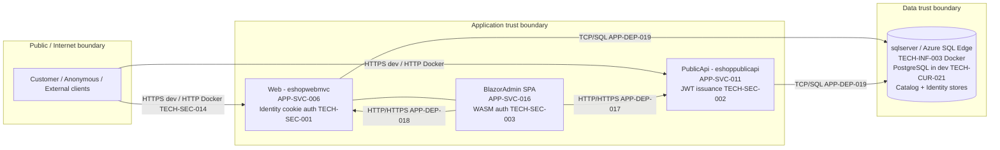

# 13. Security Architecture

> **Scope & grounding.** This document is derived exclusively from the Enterprise Knowledge Graph (`ENTERPRISE_KNOWLEDGE_GRAPH.json`). Every security control, finding, boundary, and gap traces to a graph node id (`TECH-SEC-###`, `APP-API-###`, `APP-SVC-###`, `DATA-ENT-###`, `BIZ-CAP-###`, `TECH-INF-###`). It honors the graph's preserved status flags: where a control is inferred from package references only (LOW confidence) it is labeled as such and never asserted as a verified, enforced control. The legacy stack (ASP.NET Core Identity, JWT Bearer, Azure Key Vault, etc.) is labeled **Current (legacy)**. Because `target_stack` is **empty (0 nodes)**, every forward-looking technology is a **neutral option ("not in legacy evidence")**, never a discovered fact.
>
> **Confidence posture.** The legacy authentication *mechanisms* exist with HIGH confidence (`TECH-SEC-001`); the *enforcement, configuration, and hardening* of those mechanisms are unverified and are recorded by the graph as a set of `type=finding` security gaps (`TECH-SEC-008` … `TECH-SEC-017`), several at Critical/High severity. The security target state is therefore framed as **closing these evidenced gaps**, not re-deriving the legacy posture.

---

## 13.1 Security Architecture Overview

The system (`eShopOnWeb`, name caveat `OQ-007` / `ASSUMP-007`) exposes three trust surfaces, each a separate deployable or hostable unit:

| Surface | Unit (node) | Primary actors | Auth mechanism (Current / legacy) |
|---|---|---|---|
| Public REST API | `APP-SVC-011` PublicApi (`TECH-INF-002` eshoppublicapi) | `BIZ-ACT-001` Customer, `BIZ-ACT-004` Service Account, external clients | JWT Bearer issuance (`TECH-SEC-002`) via `APP-API-001` |
| Storefront web app | `APP-SVC-006` Web (`TECH-INF-001` eshopwebmvc) | `BIZ-ACT-001` Customer, `BIZ-ACT-002` Anonymous Shopper, `BIZ-ACT-003` Administrator | ASP.NET Core Identity cookie auth (`TECH-SEC-001`) |
| Admin SPA | `APP-SVC-016` BlazorAdmin (served via Web host; `OQ-001`) | `BIZ-ACT-003` Administrator | Blazor WASM Authentication (`TECH-SEC-003`) + Authorization components (`TECH-SEC-004`) |

These map to the `BIZ-CAP-029` Identity & Authentication capability and its children `BIZ-CAP-030` Access Control, `BIZ-CAP-031` User Login, `BIZ-CAP-032` Token Issuance, `BIZ-CAP-033/034` Identity Seeding, realized by process `BIZ-PROC-007` User Authentication and `BIZ-PROC-010` Identity Data Seeding.



---

## 13.2 Authentication

### 13.2.1 Current (legacy) authentication

| Control | Node | Confidence (graph) | Evidence summary |
|---|---|---|---|
| ASP.NET Core Identity (cookie-based auth + EF Core user store) | `TECH-SEC-001` | HIGH (mechanism); **Partial** (cookie hardening) | Identity backed by EF Core over `ConnectionStrings:IdentityConnection`; provider switches PostgreSQL (default) / SQL Server (Docker). Password policy, lockout, 2FA toggles, and cookie `SecurePolicy`/`SameSite`/expiry live in `Program.cs`/`Startup.cs` which were **not provided** → completeness Partial. |
| JWT Bearer Authentication | `TECH-SEC-002` (severity High) | LOW — **inferred from package references only** | `Microsoft.AspNetCore.Authentication.JwtBearer` + `System.IdentityModel.Tokens.Jwt` referenced in Web, PublicApi, Infrastructure. **No** `Authentication/Jwt/Authority/Audience/Issuer/signing-key` block found in any of 6 reviewed appsettings files. |
| Blazor WebAssembly Authentication (BlazorAdmin) | `TECH-SEC-003` (severity High) | LOW — **inferred from package references only** | `Microsoft.AspNetCore.Components.WebAssembly.Authentication` + `Microsoft.Extensions.Identity.Core` referenced; **no** OIDC authority/client-id/scope found in BlazorAdmin's 3 `wwwroot/appsettings*.json`. Cannot confirm how BlazorAdmin authenticates calls to PublicApi/Web. |

**Backing data.** The identity store is `DATA-ENT-008` ApplicationUser (`persisted=true`, `pii=true`; attributes `UserName`, `Email`, `PasswordHash`, `PhoneNumber`) and `DATA-ENT-009` Role, persisted via `DATA-REPO-004` AppIdentityDbContext (`APP-SVC-024`) inside the `APP-SVC-002` Identity module. Password storage is delegated to ASP.NET Core Identity's `PasswordHash` column (`DATA-ENT-008`) — see §13.5.3.

**Token issuance flow (legacy).** `BIZ-PROC-007` User Authentication is realized by `APP-API-001` `POST /api/authenticate` (`AuthenticateEndpoint`, `APP-SVC-029`). Per `auth_required` on `APP-API-001`: the endpoint **issues a JWT** via `ITokenClaimsService.GetTokenAsync` (`APP-IF-003`, implemented by `IdentityTokenClaimService` `APP-SVC-021`) after `SignInManager.PasswordSignInAsync` validates credentials. This is the only endpoint that *issues* a token; the graph contains **no evidence** that any PublicApi endpoint *validates/enforces* a presented JWT (see `TECH-SEC-010`, §13.7).

### 13.2.2 Target options (neutral — not in legacy evidence)

`target_stack` is empty. The following are offered as neutral, stack-portable options covering the mandated set; none is asserted as discovered:

| Concern | Neutral target option(s) — *not in legacy evidence* |
|---|---|
| Authentication protocol | OAuth 2.0 / OpenID Connect (OIDC) with authorization-code + PKCE for interactive UIs; client-credentials for service-to-service |
| Token format | Signed JWT (access) + opaque/rotating refresh tokens; short access-token TTL |
| Identity provider | Per-stack equivalents: Java Spring Boot → Spring Security + Spring Authorization Server / Keycloak; ASP.NET Core → ASP.NET Core Identity + Duende/OpenIddict; Node.js → Passport/oidc-provider or Keycloak; Python → Authlib/FastAPI-Users or Keycloak |
| Frontend session | OIDC for React/Angular/Vue admin SPA (`oidc-client-ts`/`angular-auth-oidc-client`/equivalent); BFF pattern to avoid storing tokens in the browser |
| MFA / 2FA | Provider-native TOTP / WebAuthn; the legacy `/Manage/*` 2FA endpoints (`APP-API-025`–`034`) indicate the *intent* exists and should be preserved as a requirement |

> **Assumption ASMP-FE-001** — *Basis:* `TECH-SEC-002`/`TECH-SEC-003` are package-reference inferences with no config evidence (`OQ-005` unresolved). *Statement:* JWT/OIDC enforcement must be explicitly designed and configuration-managed in the target, not assumed inherited. *Impact:* Authentication enforcement is a **net-new design deliverable**, not a lift-and-shift.

---

## 13.3 Authorization & Role-Based Access Control (RBAC)

### 13.3.1 Current (legacy) authorization

| Control | Node | Confidence | Notes |
|---|---|---|---|
| Authorization components (role/claims-based) | `TECH-SEC-004` (severity Medium) | LOW — package reference only | `Microsoft.AspNetCore.Components.Authorization` supplies `AuthorizeView`/`CascadingAuthenticationState` in BlazorAdmin; `System.Security.Claims` referenced in ApplicationCore. **No role/policy definitions visible**; role-to-page mapping cannot be confirmed. |

**Roles.** `DATA-ENT-009` Role (AspNetRoles) carries **one confirmed role name: `Administrators` (RC-008)**. The user↔role link is `DATA-REL-010` ApplicationUser `*..*` Role (`implemented-inferred`; `ASSUMP-006`). No other roles are evidenced. The actor model recognizes `BIZ-ACT-003` Administrator as the privileged human actor and `BIZ-ACT-004` System/Service Account as the elevated automated actor.

> **Important (honor graph status):** The graph's own note on `TECH-SEC-004` states verbatim that "role-based authz to an `'Administrator'` role is **hypothesized in the assessment but NOT confirmed in evidence** — kept as an unconfirmed/inferred gap, not an implemented control." (The note uses the singular token `Administrator`.) Separately, the confirmed *role name* on `DATA-ENT-009` Role is `Administrators` (RC-008); its *enforcement at endpoints* is not confirmed.

### 13.3.2 Endpoint protection map (auth posture per APP-API)

Derived from each API node's `auth_required` field. "Issues token" ≠ "enforces token." Most data-mutating Catalog endpoints are marked `auth_required = "not noted"` — i.e. **no evidence of protection**, which is itself a finding (see `TECH-SEC-010`).

| API node | Method · Path | Unit | `auth_required` (graph) | Required posture (target) |
|---|---|---|---|---|
| `APP-API-001` | POST /api/authenticate | PublicApi | issues JWT (credential check) | Anonymous (login endpoint); rate-limit, brute-force lockout |
| `APP-API-002` | GET /api/catalog-brands | PublicApi | not noted | Public read (acceptable anonymous) |
| `APP-API-003` | GET /api/catalog-items/{id} | PublicApi | not noted | Public read |
| `APP-API-004` | GET /api/catalog-items | PublicApi | not noted | Public read |
| `APP-API-008` | GET /api/catalog-types | PublicApi | not noted | Public read |
| `APP-API-005` | **POST** /api/catalog-items | PublicApi | not noted | **Admin-only** — mutating (maps `BIZ-CAP-038`) |
| `APP-API-006` | **DELETE** /api/catalog-items/{id} | PublicApi | not noted | **Admin-only** — mutating (`BIZ-CAP-038`) |
| `APP-API-007` | **PUT** /api/catalog-items | PublicApi | not noted | **Admin-only** — mutating |
| `APP-API-014`–`034` ¹ | /Manage/* (account, 2FA, password) | Web | user_facing identity | Authenticated user (own account) |
| `APP-API-035`–`036` | /Order/MyOrders, /Order/Detail/{id} | Web | user_facing | Authenticated user; row-level ownership |
| `APP-API-037`–`038` | /User, /User/Logout | Web | user_facing identity (SignInManager) | Authenticated user |
| `APP-API-041`–`044` | /Account/* (Login, Register, ConfirmEmail, Logout) | Web | user_facing identity | Anonymous-to-authenticated transition |
| `APP-API-048`–`049` | /Admin/EditCatalogItem, /Admin | Web | user_facing (**admin**) | **Admin-only** (`Administrators` role, `BIZ-CAP-035/036`) |
| `APP-API-039`–`040` | /logout, /admin (BlazorAdmin) | BlazorAdmin | user_facing | **Admin-only**; auth wiring unverified (`TECH-SEC-003`) |
| `APP-API-050`–`052` ² | /Basket/Checkout (050), /Basket index `/{handler?}` (051), /Basket/Success (052) | Web | user_facing | Authenticated for checkout (`BIZ-PROC-005`) |
| `APP-API-009`–`013`,`045`–`047` | Health checks, Home, Privacy, Error, SPA fallback | Web | not noted / unknown | Public; health endpoints should not leak detail |

> ¹ The `APP-API-014`–`034` range spans the 21 `/Manage/*` routes (`APP-SVC-037` ManageController); all carry `auth=user_facing identity` in the graph. The 2FA subset is `APP-API-025`–`034`.
> ² This range bundles three distinct routes with heterogeneous semantics: `APP-API-050` GET /Basket/Checkout (`auth=user_facing`, status preserve), `APP-API-051` GET `/{handler?}` — the **Basket index Razor Page** (`auth=user_facing`, status **review**, i.e. *not* Checkout or Success), and `APP-API-052` GET /Basket/Success (`auth=user_facing`, status preserve). `APP-API-051` is the basket landing page included in the checkout flow group, not a checkout endpoint itself.

> **Open question `OQ-005` (carried):** Is JWT/authentication actually enforced on PublicApi? Unresolved — the mutating Catalog endpoints (`APP-API-005/006/007`) have **no evidenced protection** today.

> **Assumption ASMP-FE-002** — *Basis:* the only confirmed role is `Administrators` (RC-008) and catalog mutation maps to `BIZ-CAP-038` (Admin Catalog Operations). *Statement:* In the target, all catalog write endpoints (`APP-API-005/006/007`) and all `/Admin*` + BlazorAdmin routes (`APP-API-039/040/048/049`) must require the `Administrators` role; all `/Manage`, `/Order`, `/Basket/Checkout` routes require an authenticated user with row-level ownership checks. *Impact:* Defines the RBAC policy matrix; under-scoping leaves privilege-escalation exposure.

### 13.3.3 Target options (neutral — not in legacy evidence)

- Centralized **policy-based authorization** with role + resource/claim checks; deny-by-default on all non-public endpoints.
- Per-stack equivalents: Spring Security method/URL security; ASP.NET Core authorization policies/`[Authorize(Roles=...)]`; Node.js middleware (e.g. CASL/route guards); Python decorator/dependency-based guards.
- Row/tenant-level authorization for order ownership (`DATA-REL-009` Order→ApplicationUser) so `BIZ-ACT-001` Customers see only their own orders.

---

## 13.4 Secrets Management

### 13.4.1 Current (legacy) secrets handling

| Control | Node | Status / confidence | Notes |
|---|---|---|---|
| Azure Key Vault secrets integration (referenced) | `TECH-SEC-006` / `TECH-INF-008` | **Referenced only**, Medium severity, LOW | `Azure.Extensions.AspNetCore.Configuration.Secrets` + `Azure.Identity` packages and `AZURE_KEY_VAULT_NAME` deployment parameter exist, **but no Key Vault resource declaration and no vault name/URI in any app config** — placeholder only, not wired (`TD-13`). |
| .NET User Secrets (local dev) | `TECH-SEC-005` | HIGH (present) | `UserSecretsId` present for Web and PublicApi. Good practice, but **does not mitigate** the committed plaintext credentials. |
| Docker-mounted host secrets (read-only bind mounts) | `TECH-SEC-007` | HIGH (present) | `~/.aspnet/https:ro` and `~/.microsoft/usersecrets:ro` bind mounts. Local-dev only; **not a production secret-delivery mechanism**. |

### 13.4.2 Secrets findings (Critical/High — see §13.7)

- `TECH-SEC-008` **Critical** — hardcoded PostgreSQL credentials (`Username=postgres;Password=Clarium123`) committed across Web and PublicApi `appsettings.json`.
- `TECH-SEC-009` **Critical** — hardcoded SQL Server / Azure SQL Edge SA password (`@someThingComplicated1234`) in `docker-compose.yml` and `appsettings.Docker.json`.
- `TECH-SEC-012` **High** — no secret scanning in CI/CD; the two Critical findings would pass the current pipeline undetected.

### 13.4.3 Target options (neutral — not in legacy evidence)

| Concern | Neutral target option(s) — *not in legacy evidence* |
|---|---|
| Centralized secret store | HashiCorp Vault; AWS/GCP/Azure KMS + managed Secrets Manager/Key Vault; Kubernetes Sealed Secrets / External Secrets Operator |
| Injection | Workload identity / IRSA / managed-identity → no static credentials in images or config; CSI Secrets Store driver |
| Rotation | Automated rotation of DB credentials and signing keys; short-lived dynamic DB credentials (Vault DB secrets engine) |
| Source-control hygiene | Mandatory secret scanning (gitleaks/trufflehog/detect-secrets) as a CI gate (closes `TECH-SEC-012`); remove and rotate the committed secrets (`TECH-SEC-008/009`) |

> **Assumption ASMP-FE-003** — *Basis:* `TECH-SEC-006`/`TECH-INF-008` show Key Vault referenced but never wired; production secret delivery is undefined. *Statement:* A single externalized secret store with workload-identity injection is required before any non-dev deployment; no plaintext secret may reside in source control or images. *Impact:* Removes the two Critical credential-leak findings and the unwired-vault gap.

---

## 13.5 Encryption

### 13.5.1 Encryption in transit

| Aspect | Evidence (node) | Posture |
|---|---|---|
| Dev/local HTTPS | `TECH-SEC-007` (mounted dev certs `~/.aspnet/https`) | HTTPS used in dev with `https://localhost:*` |
| Docker/container traffic | `TECH-SEC-014` **Medium** finding | Endpoints declared as **plain HTTP** (`ASPNETCORE_URLS=http://+:8080`); **no TLS termination declared** for container traffic → cookie/session exposure risk on the Docker network path (escalates the Identity cookie-security concern under `TECH-SEC-001`). |
| Host filtering / DB TLS | `TECH-SEC-015` **Medium** finding | `AllowedHosts="*"` (permissive host filtering) and `TrustServerCertificate=true` (disables DB TLS certificate validation). |

### 13.5.2 Encryption at rest — **gap**

The graph contains **no evidence** of at-rest encryption (TDE, disk/volume encryption, or column-level encryption) for the relational stores (`TECH-INF-003` sqlserver, `TECH-CUR-021` PostgreSQL). This matters because PII-bearing entities exist: `DATA-ENT-008` ApplicationUser (`pii=true`), `DATA-ENT-006` Order and `DATA-ENT-013` Address (`pii=true`).

> **Assumption ASMP-FE-004** — *Basis:* no at-rest encryption node exists in the graph and `pii=true` entities are persisted. *Statement:* At-rest encryption (database TDE/volume encryption, plus consideration of column/field encryption for PII) is a target requirement. *Impact:* Required for GDPR/data-protection alignment; absence is a compliance exposure (compounds `TECH-SEC-017`).

### 13.5.3 Password hashing

Password storage is handled by ASP.NET Core Identity via the `PasswordHash` attribute on `DATA-ENT-008` ApplicationUser (`TECH-SEC-001`). The specific hashing algorithm/parameters are not in the provided evidence (configured in Identity defaults / `Program.cs`, not supplied). Target: retain a vetted adaptive hash (PBKDF2/bcrypt/Argon2 per stack), never store or log plaintext credentials.

### 13.5.4 Target options (neutral — not in legacy evidence)

- TLS 1.2+ everywhere including east-west/container traffic (closes `TECH-SEC-014`); terminate TLS at ingress/gateway/service-mesh (Docker/Kubernetes-portable).
- Replace `AllowedHosts="*"` with an explicit allow-list and re-enable DB certificate validation (closes `TECH-SEC-015`).
- Database/volume encryption-at-rest via the chosen engine (PostgreSQL/SQL Server/MySQL all support equivalents) and managed-disk encryption.
- Secure cookie flags (`Secure`, `HttpOnly`, `SameSite`) enforced for the Identity session (resolves the `TECH-SEC-001` Partial concern).

---

## 13.6 Audit Logging

### 13.6.1 Current (legacy) evidence level

`TECH-SEC-017` (**Medium**, `type=finding`): **No audit logging configuration, data-retention settings, or compliance annotations (GDPR/PCI/HIPAA/SOC2/RBAC) were found in any provided manifest, config, or IaC file (LAYER NOT FOUND).** Application logging abstractions exist (`APP-IF-005` `IAppLogger<T>`, consumed by `ManageController`), but there is **no evidence** of security/audit-grade event logging (authn success/failure, authz denials, admin catalog mutations, order placement).

### 13.6.2 Target requirement (neutral — not in legacy evidence)

Auditable security events should at minimum cover: authentication outcomes (`BIZ-PROC-007`, `APP-API-001`/`042`), authorization denials, admin catalog create/delete/update (`APP-API-005/006/007/048/049`, `BIZ-CAP-038`), order placement (`BIZ-PROC-005`, `APP-API-050`), and account/2FA changes (`APP-API-014`–`034`).

| Concern | Neutral target option(s) — *not in legacy evidence* |
|---|---|
| Structured audit log | Tamper-evident, append-only audit stream separate from app logs; correlation/trace ids |
| Aggregation | Centralized log/SIEM pipeline (ELK/OpenSearch, Loki, cloud-native logging); alerting on auth anomalies |
| Retention | Explicit retention & data-minimization policy (closes the `TECH-SEC-017` retention gap) |

> **Assumption ASMP-FE-005** — *Basis:* `TECH-SEC-017` records audit logging/compliance controls as not found. *Statement:* Security audit logging with defined retention is a net-new target capability spanning all privileged and identity flows. *Impact:* Required for forensic readiness and compliance (GDPR/PCI considerations re-emerge if `DATA-ENT-011` PaymentMethod is ever implemented — currently dead code, RC-002).

---

## 13.7 Security Findings Register (TECH-SEC `type=finding`)

All `TECH-SEC` findings, with severity preserved verbatim from the graph:

| Node | Finding | Severity | Disposition / remediation |
|---|---|---|---|
| `TECH-SEC-008` | Hardcoded PostgreSQL credentials in source-controlled config | **Critical** | Rotate, remove from VCS, externalize to secret store; add secret scanning (`TD-01`) |
| `TECH-SEC-009` | Hardcoded SQL Server / Azure SQL Edge SA password in config | **Critical** | Rotate, remove from VCS, externalize; do not bake into compose/images (`TD-02`) |
| `TECH-SEC-002` | JWT Bearer config not found (inferred from packages only) | **High** | Define & enforce JWT/OIDC config; resolve `OQ-005` |
| `TECH-SEC-003` | Blazor WASM auth wiring not confirmed | **High** | Define OIDC authority/client for admin SPA |
| `TECH-SEC-010` | No JWT/authentication enforcement configured for PublicApi | **High** | Enforce authn on mutating endpoints (`APP-API-005/006/007`); deny-by-default (`TD-12`, `AP-10`) |
| `TECH-SEC-011` | No CORS policy found despite cross-origin BlazorAdmin→PublicApi/Web calls | **High** | Define explicit CORS allow-list per environment (`TD-17`) |
| `TECH-SEC-012` | No secret scanning in CI/CD | **High** | Add gitleaks/trufflehog/detect-secrets gate (`TD-06`) |
| `TECH-SEC-016` | No SAST / dependency / container vulnerability scanning in CI/CD | **High** | Add SAST + dependency + image scan gates (Dependabot is out-of-band, not a gate) |
| `TECH-SEC-013` | SQL Server port 1433 published directly to host network | **Medium** | Restrict DB network exposure; private subnet/overlay only (`TD-18`) |
| `TECH-SEC-014` | No TLS termination for Docker/container traffic | **Medium** | Terminate TLS at ingress/mesh; encrypt east-west |
| `TECH-SEC-015` | `AllowedHosts="*"` + `TrustServerCertificate=true` | **Medium** | Explicit host allow-list; re-enable DB cert validation |
| `TECH-SEC-017` | No audit logging / compliance controls found | **Medium** | Implement audit logging, retention, RBAC/GDPR/PCI controls |
| `TECH-SEC-004` | Authorization components present but no role/policy definitions visible | **Medium** | Define explicit RBAC policy matrix (§13.3) |
| `TECH-SEC-006` | Azure Key Vault referenced but not wired | **Medium** | Wire a real secret store with workload identity (`TD-13`) |

Findings with HIGH+ severity (`TECH-SEC-008/009/002/003/010/011/012/016`) are **release-blocking** for any non-dev deployment in the target architecture.

---

## 13.8 Security Boundaries

### 13.8.1 Trust boundaries per bounded context / deployable unit

| Boundary | Units (nodes) | Trust level | Controls (Current → Target) |
|---|---|---|---|
| Internet ↔ Public API | `APP-SVC-011` PublicApi / `TECH-INF-002` | Untrusted ingress | JWT issuance only today (`TECH-SEC-002`); **no confirmed enforcement** (`TECH-SEC-010`) → enforce JWT/OIDC + CORS + rate limiting |
| Internet ↔ Storefront Web | `APP-SVC-006` Web / `TECH-INF-001` | Untrusted ingress | Identity cookie auth (`TECH-SEC-001`); cookie hardening Partial → TLS + secure cookies + host allow-list |
| Admin SPA ↔ backends | `APP-SVC-016` BlazorAdmin → PublicApi (`APP-DEP-017`), → Web (`APP-DEP-018`) | Privileged client | WASM auth (`TECH-SEC-003`) + authz components (`TECH-SEC-004`), both unverified → OIDC + admin-role enforcement + CORS (`TECH-SEC-011`) |
| App ↔ Database | Web, PublicApi → DB (`APP-DEP-019`, `TECH-INF-003`) | Sensitive data tier | Plaintext creds (`TECH-SEC-008/009`), port 1433 exposed (`TECH-SEC-013`), no TLS (`TECH-SEC-014`), cert validation off (`TECH-SEC-015`) → secret store, private network, TLS, at-rest encryption (ASMP-FE-004) |

### 13.8.2 Public vs admin surface

- **Public surface (anonymous-acceptable):** catalog read APIs (`APP-API-002/003/004/008`), storefront pages (`APP-API-046/047`), health checks (`APP-API-012/013`), login/register (`APP-API-001/042/044`). Browsing maps to `BIZ-CAP-001`/`BIZ-PROC-001`; anonymous basket to `BIZ-ACT-002` / `BIZ-CAP-016`.
- **Authenticated-user surface:** account management (`APP-API-014`–`034`), orders (`APP-API-035/036`), checkout (`APP-API-050`–`052`).
- **Administrative surface (must require `Administrators` role, RC-008):** catalog mutation APIs (`APP-API-005/006/007`), `/Admin*` pages (`APP-API-048/049`), and BlazorAdmin routes (`APP-API-039/040`). Capability anchor: `BIZ-CAP-035`/`036`/`038`.

### 13.8.3 The PublicApi / Web / BlazorAdmin trust relationships

- **BlazorAdmin → PublicApi (`APP-DEP-017`)** and **BlazorAdmin → Web (`APP-DEP-018`)** are runtime synchronous HTTP/HTTPS calls across origins/ports → require a CORS policy (missing, `TECH-SEC-011`) and authenticated admin calls (auth wiring unverified, `TECH-SEC-003`).
- **Web does not project-reference PublicApi (`APP-DEP-011`)**; Web references ApplicationCore/Infrastructure/BlazorAdmin/BlazorShared (`APP-DEP-013`). The Web host serves the BlazorAdmin SPA (`OQ-001` kept separate pending review), so the admin SPA shares the Web origin while calling PublicApi cross-origin.
- The module dependency **cycle** (`APP-DEP-001`, `ARCH-VIOL-008`, `OQ-004` unresolved) weakens boundary isolation; whether it is a real runtime cycle or static artifact is an open question and is **not** treated as a confirmed security control failure here.

### 13.8.4 Target boundary options (neutral — not in legacy evidence)

- API gateway / ingress as the single enforced ingress point (authn, rate limiting, CORS, TLS termination) — Docker/Kubernetes-portable.
- Network segmentation: data tier on a private network/overlay with no host-published DB port (closes `TECH-SEC-013`).
- Optional service mesh for mutual-TLS east-west (closes `TECH-SEC-014`).
- Zero-trust / deny-by-default authorization at every boundary.

---

## 13.9 Traceability & Gap Summary

| Section | Primary graph anchors |
|---|---|
| Authentication | `TECH-SEC-001/002/003`; `APP-API-001`; `APP-IF-003`; `APP-SVC-021/029`; `DATA-ENT-008/009`; `BIZ-CAP-029`–`032`; `BIZ-PROC-007` |
| Authorization & RBAC | `TECH-SEC-004`; `DATA-ENT-009` (RC-008 `Administrators`); `DATA-REL-010`; `APP-API-005/006/007/039/040/048/049`; `BIZ-CAP-035/036/038`; `BIZ-ACT-003` |
| Secrets | `TECH-SEC-005/006/007/008/009/012`; `TECH-INF-008` |
| Encryption | `TECH-SEC-007/014/015`; in-transit evidence; at-rest gap; `DATA-ENT-006/008/013` (pii) |
| Audit logging | `TECH-SEC-017`; `APP-IF-005` |
| Boundaries | `APP-SVC-006/011/016`; `APP-DEP-011/017/018/019/001`; `TECH-INF-001/002/003`; `OQ-001/004` |

**Forward-engineering assumptions raised:** ASMP-FE-001 (authn enforcement net-new), ASMP-FE-002 (RBAC policy matrix), ASMP-FE-003 (externalized secret store), ASMP-FE-004 (at-rest encryption), ASMP-FE-005 (audit logging + retention).

**Open questions carried from graph:** `OQ-005` (JWT enforcement / CORS — unresolved), `OQ-004` (module cycle reality — unresolved), `OQ-001` (Admin/BlazorAdmin merge — separate pending review).

**Status flags honored:** payment entities `DATA-ENT-011` PaymentMethod / `DATA-ENT-010` Buyer are confirmed dead/unimplemented (RC-002) — **not currently PCI-DSS scope**; payment capabilities `BIZ-CAP-027/028` are INFERRED/LOW; `target_stack` is empty, so all target technologies above are neutral options, not discovered facts.

---

## 13.10 Security Modernization Plan

**Closes:** Audit C3 — critical security remediation. Defines the target security architecture that closes all 10 evidenced findings (TECH-SEC-008..017) and hardens the 7 controls (TECH-SEC-001..007).

### 13.10.1 Findings → remediation map

| Finding | Severity | Remediation | Doc 15 gate |
|---|---|---|---|
| **TECH-SEC-008** hardcoded PostgreSQL creds | **CRITICAL** | Remove from VCS, rotate, move to secret store (§13.10.7); secret scanning in CI | SR-06 / VR-09 |
| **TECH-SEC-009** hardcoded SQL Server SA password | **CRITICAL** | Same as above; no secrets in compose/images | SR-06 / VR-09 |
| **TECH-SEC-010** no JWT enforcement on PublicApi | HIGH | Enforce bearer validation on all non-public endpoints (§13.10.2/§13.10.5) | SR-03 / VR-05 |
| **TECH-SEC-011** no CORS policy | HIGH | Explicit origin allow-list (§13.10.5) | SR-04 / VR-05 |
| **TECH-SEC-012** no secret scanning in CI | HIGH | gitleaks/trufflehog gate (§13.10.7/§13.10.11) | SR-06 |
| **TECH-SEC-013** port 1433 published to host | MEDIUM | Bind DB to private network only (§13.10.9) | IR-05 |
| **TECH-SEC-014** no TLS for container traffic | MEDIUM | TLS at ingress/mesh; HTTPS-only (§13.10.8/§13.10.9) | SR-05 |
| **TECH-SEC-015** AllowedHosts `*` + TrustServerCertificate=true | MEDIUM | Explicit host allow-list; validate DB cert (§13.10.9) | SR-05 |
| **TECH-SEC-016** no SAST/dependency/container scan | HIGH | Add scanning gates (§13.10.11) | VR-09 |
| **TECH-SEC-017** no audit logging/compliance | MEDIUM | Structured security audit log + retention (§13.10.6) | SR-08 |

### 13.10.2 Authentication (target)

| Aspect | Target | Source |
|---|---|---|
| Interactive users | **OAuth 2.0 / OIDC Authorization Code + PKCE** | TECH-SEC-001/003; SR-01 |
| Service-to-service | **OAuth 2.0 Client Credentials** | SR-01 |
| Token format | **JWT** (signed; short-lived access + refresh) | TECH-SEC-002 |
| Identity store | ASP.NET Core Identity (or stack equivalent) over `identity` schema | DATA-REPO-004 |
| Password storage | adaptive hash (bcrypt/argon2/PBKDF2) via `PasswordHash` | DATA-ENT-008 |
| MFA | TwoFactorEnabled column present → enable 2FA (TOTP) | §8.2.8 |

### 13.10.3 Authorization summary

- **Deny-by-default.** Every endpoint requires an explicit policy.
- **RBAC** anchored on the one confirmed role `Administrators` (RC-008) + authenticated Customer tier.
- Catalog mutations (APP-API-005/006/007) require `Administrators`; order/manage/basket-checkout require authenticated user **+ row-level ownership** (BuyerId match).
- Full authorization model in §13.11.

### 13.10.4 RBAC / OAuth2 / OIDC / JWT design

```
[User] ──OIDC AuthCode+PKCE──▶ [Identity Provider] ──issues──▶ JWT (access+refresh)
   │                                                              │
   └──── Bearer JWT ─────────▶ [PublicApi / Web] ── validates ───┘
                                     │  (signature, exp, aud, iss, scope/role claims)
                                     ▼
                          [Authorization policies — deny by default]
                                     ▼
                          [Resource + row-level ownership check]
```

JWT claims: `sub` (→ BuyerId), `role` (Administrators/Customer), `scope`, standard `iss/aud/exp/iat`.

### 13.10.5 API security controls

| Control | Target | Closes |
|---|---|---|
| AuthN on protected endpoints | bearer validation, deny-by-default | TECH-SEC-010 |
| CORS | explicit allow-list (BlazorAdmin/SPA origin → PublicApi/Web); no `*` | TECH-SEC-011 |
| Rate limiting | per-IP + per-token throttle ⚠ (neutral baseline) | hardening |
| Input validation | FluentValidation/Bean-Validation/Pydantic per stack; reject on violation | BR001–BR012 |
| Error model | RFC 9457 problem-detail; no stack traces to clients (API-04) | hardening |
| TLS | HTTPS-only; HSTS | TECH-SEC-014 |

### 13.10.6 Audit logging (closes TECH-SEC-017)

- Structured (JSON) security events: authn success/failure, authz denials, admin actions on catalog (APP-API-005/006/007), order placement, role changes.
- Each event carries `actor (sub)`, `action`, `resource id`, `timestamp`, `outcome`, correlation id.
- Retention 🟦 (default ⚠ 1 year hot / per compliance) — REQUIRES HUMAN DECISION (regulatory scope unknown).
- No PII/secret values in logs.

### 13.10.7 Secrets management (closes TECH-SEC-008/009/012)

- **No secret in source, config, or image.** Externalize to Azure Key Vault (TECH-SEC-006/TECH-INF-008) or Vault/AWS Secrets Manager.
- Workload identity / managed identity for store access; no static store credentials.
- **Rotate** the leaked PostgreSQL + SQL Server credentials immediately (TECH-SEC-008/009).
- CI secret scanning gate (gitleaks/trufflehog) blocks merges (TECH-SEC-012).

### 13.10.8 Encryption

| Data state | Target | Note |
|---|---|---|
| In transit | TLS 1.2+ everywhere (ingress, service-to-service, DB) | closes TECH-SEC-014 |
| At rest | DB-level encryption (TDE/native) + field-level for PII (ApplicationUser, Order, Address) | 🟦 net-new requirement (ASMP-FE-004) |
| Secrets | encrypted in store + in transit | §13.10.7 |
| Passwords | adaptive one-way hash | not "encryption" — hashing |

### 13.10.9 Database & infrastructure security

| Control | Target | Closes |
|---|---|---|
| DB network exposure | private subnet only; **do not publish 1433/5432 to host** | TECH-SEC-013 |
| DB cert | validate (no `TrustServerCertificate=true`) | TECH-SEC-015 |
| Host allow-list | explicit hosts (no `AllowedHosts=*`) | TECH-SEC-015 |
| Least privilege | app DB user scoped per schema (catalog/basket/ordering/identity) | DB-01 |
| Container | non-root, read-only FS, minimal base image | hardening |

### 13.10.10 OWASP Top 10 (2021) mapping

| OWASP | Risk in legacy | Control |
|---|---|---|
| A01 Broken Access Control | TECH-SEC-010 (no enforcement) | SR-02/03, row-level ownership |
| A02 Cryptographic Failures | TECH-SEC-014 (no TLS); no at-rest encryption | §13.10.8 |
| A03 Injection | input validation gaps | parameterized queries (ORM) + validation |
| A04 Insecure Design | module cycle, weak boundaries | doc 15 AR-03/AR-06 |
| A05 Security Misconfiguration | TECH-SEC-013/015 | §13.10.9 |
| A06 Vulnerable Components | TECH-SEC-016; 19 unpinned versions | §13.10.11 scanning + version pinning |
| A07 Auth Failures | TECH-SEC-002/003 (unverified); no lockout config | §13.10.2 + Identity lockout columns |
| A08 Integrity Failures | no supply-chain scanning | dependency/container scan |
| A09 Logging/Monitoring Failures | TECH-SEC-017 | §13.10.6 audit logging |
| A10 SSRF | external calls (UriComposer) | egress allow-list ⚠ |

### 13.10.11 Security pipeline gates (DevSecOps checklist)

- [ ] Secrets externalized + rotated (TECH-SEC-008/009)
- [ ] Secret scanning gate in CI (TECH-SEC-012)
- [ ] SAST + dependency + container scanning gates (TECH-SEC-016)
- [ ] AuthN enforced, deny-by-default authZ (TECH-SEC-010)
- [ ] CORS allow-list (TECH-SEC-011)
- [ ] TLS everywhere + security headers (TECH-SEC-014)
- [ ] DB private + cert-validated (TECH-SEC-013/015)
- [ ] Audit logging + retention (TECH-SEC-017)
- [ ] At-rest + field-level PII encryption (ASMP-FE-004)
- [ ] No payment/PCI surface (BC-06 aspirational — SR-09)

### 13.10.12 🟦 Human decisions in security scope

| # | Decision |
|---|---|
| S1 | Identity provider choice (self-hosted Identity vs Entra ID/Auth0/Keycloak) |
| S2 | Audit-log retention period + regulatory scope (GDPR/PCI/none) |
| S3 | At-rest encryption strategy (TDE vs field-level vs both) |
| S4 | Rate-limit thresholds |
| S5 | Whether `Customer` role is explicit or implicit-authenticated |

---

## 13.11 Authorization Model (RBAC)

**Closes:** Audit C4 — authorization verification. Defines the complete RBAC model: actors, roles, permissions, resources, operations, and the API/business-rule authorization matrices.

### 13.11.1 Actors

| Actor | Node | Type | Authn |
|---|---|---|---|
| Customer / Buyer | BIZ-ACT-001 | human | authenticated |
| Anonymous Shopper | BIZ-ACT-002 | human | unauthenticated |
| Administrator | BIZ-ACT-003 | human | authenticated + `Administrators` role |
| System / Service Account | BIZ-ACT-004 | system | service credentials (seeding) |
| Notification Recipients | BIZ-ACT-005 | external | n/a (not yet implemented) |

### 13.11.2 Roles

| Role | Status | Source | Maps to actor |
|---|---|---|---|
| **Administrators** | ✅ DERIVED (confirmed, RC-008) | DATA-ENT-009 seed | BIZ-ACT-003 |
| **Customer** | ⚠ NEUTRAL DEFAULT (authenticated tier) | inferred from BIZ-ACT-001 | BIZ-ACT-001 |
| **Anonymous** | ⚠ implicit (unauthenticated) | BIZ-ACT-002 | BIZ-ACT-002 |
| **ServiceAccount** | ⚠ NEUTRAL DEFAULT | BIZ-ACT-004 seeding | BIZ-ACT-004 |

> 🟦 **S5 decision:** is `Customer` an **explicit role** or simply "any authenticated user"? Default: treat Customer as the authenticated tier (no explicit role row).

### 13.11.3 Role hierarchy

```
Administrators   (full catalog admin + all Customer capabilities)
      │  inherits
   Customer       (authenticated: own basket, own orders, account mgmt)
      │  inherits
  Anonymous       (browse catalog, anonymous basket only)

ServiceAccount    (separate principal: seeding only)
```

### 13.11.4 Permission matrix

| Permission | Anonymous | Customer | Administrators | ServiceAccount |
|---|:--:|:--:|:--:|:--:|
| catalog:read | ✅ | ✅ | ✅ | — |
| catalog:write | ❌ | ❌ | ✅ | — |
| brandtype:read | ✅ | ✅ | ✅ | — |
| basket:own | ✅ (session) | ✅ | ✅ | — |
| order:place | ❌ | ✅ | ✅ | — |
| order:read:own | ❌ | ✅ (own) | ✅ (all 🟦) | — |
| account:own | ❌ | ✅ | ✅ | — |
| admin:catalog | ❌ | ❌ | ✅ | — |
| seed:execute | ❌ | ❌ | ❌ | ✅ |

### 13.11.5 API Authorization Matrix (all 55 APIs)

| API(s) | Method/Path | Required authorization |
|---|---|---|
| APP-API-001 | POST /api/authenticate | **anonymous** (issues JWT) |
| APP-API-002/003/004/008 | GET /api/catalog-* | **anonymous** (public read) |
| **APP-API-005** | POST /api/catalog-items | **Administrators** |
| **APP-API-006** | DELETE /api/catalog-items/{id} | **Administrators** |
| **APP-API-007** | PUT /api/catalog-items | **Administrators** |
| APP-API-012/013 | GET health checks | **anonymous** |
| APP-API-014..034 | /Manage/* | **Customer (authenticated, own)** |
| APP-API-035/036 | /Order/MyOrders, /Order/Detail/{id} | **Customer (own) + ownership check** |
| APP-API-037/038 | /User, /User/Logout | **Customer (authenticated)** |
| APP-API-039/040 | /logout, /admin (BlazorAdmin) | **Administrators** |
| APP-API-041..044 | /Account/* (login/register/confirm) | **anonymous** (pre-auth flows) |
| APP-API-045/046/047 | /Error, /, /Privacy | **anonymous** |
| APP-API-048/049 | /Admin/* (edit catalog) | **Administrators** |
| APP-API-050/051/052 | /Basket/*, /Basket/Checkout | **Customer or Anonymous (session)**; checkout needs buyer id |
| APP-API-009/010/011/053/054/055 | synthetic ROUTE/CLI | **n/a** (host/bootstrap) |

**Coverage: all 55 APIs assigned an authorization rule.**

### 13.11.6 Row-level (ownership) authorization

| Resource | Ownership rule |
|---|---|
| Basket | `Basket.BuyerId == token.sub` (or anonymous session key) |
| Order | `Order.BuyerId == token.sub` (Customer); Administrators may read all 🟦 |
| Account/Manage | operate only on `token.sub` user |

### 13.11.7 🟦 Authorization decisions requiring human input

| # | Decision | Default |
|---|---|---|
| A1 | Is `Customer` an explicit role or implicit-authenticated? | implicit-authenticated ⚠ |
| A2 | May Administrators read **all** orders? | yes ⚠ (typical), confirm |
| A3 | Split `Administrators` into finer admin roles? | no — single role (evidence) |
| A4 | brand/type CRUD permissions (no API in evidence) | none until API added |
| A5 | Anonymous basket session-key authz mechanism | session/cookie key |
