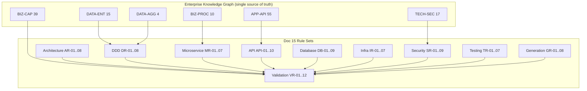

# 15 — Forward Engineering Specification (Master)

> ⚠️ **DISC-001 (verified 2026-06-25):** Generation rules referencing `CatalogItem` stock fields or a
> reorder event/capability (EVT-12) operate on a **verified discrepancy** — those are absent from the real
> `eShopOnWeb` source. The status-flag gate (GR-05) must additionally SKIP the stock fields, the
> `CK_CatalogItem_Stock` constraint, and any reorder behavior. See
> [`../EVIDENCE_VERIFICATION_REPORT.md`](../EVIDENCE_VERIFICATION_REPORT.md).

**Status:** Master, machine-consumable forward-engineering specification — the authoritative rule set for AI-driven code generation
**Single source of truth:** `enterprise-foundation-package/ENTERPRISE_KNOWLEDGE_GRAPH.json`
**Shared decisions reused (do not re-derive):** `forward-engineering-package/.work/DECISIONS.json` (bounded contexts BC-01…BC-07, value objects VO-01…VO-06, domain events EVT-01…EVT-12, generation priorities)
**Companion artifacts:** documents 01–14 (capability, process, domain, data, service, API, technology, security, NFR); the downstream `16_GENERATION_MANIFEST.json`
**Date:** 2026-06-23

---

## 0. Purpose, Authority, and How to Read This Document

This document is the **master specification** that an AI coding agent (or a human team) must obey when generating the target system from the Enterprise Knowledge Graph. It expresses every requirement as a **numbered, testable RULE**. Each rule is traceable to graph node ids (BIZ-CAP/ACT/PROC, DATA-ENT/REL/AGG/REPO, APP-SVC/IF/API/DEP, TECH-CUR/TGT/INF/SEC) and to the shared decisions (BC-##, VO-##, EVT-##).

**Authority order.** When two statements appear to conflict, resolve in this order:
1. The Enterprise Knowledge Graph node facts and **status flags** (highest authority).
2. The shared decisions in `DECISIONS.json` (bounded contexts, VOs, events, generation priorities).
3. This document's rules.
4. Documents 01–14 (already evidence-anchored; do not re-derive their facts).

**Rule grammar.** Each rule uses **MUST / MUST NOT / SHOULD / MAY** (RFC 2119 sense). A rule marked **[GATE]** is enforced by an automated validation check in §10 and is **release-blocking**. A rule marked **[NEUTRAL-OPTION]** offers a target choice that is *not in legacy evidence* and must never be asserted as discovered.

**Status flags honored throughout (non-negotiable).**

| Flag | Nodes | Effect on generation |
|---|---|---|
| Aspirational / unimplemented | `DATA-ENT-010` Buyer, `DATA-ENT-011` PaymentMethod, `DATA-ENT-014` CatalogItemDetails, `DATA-AGG-003` BuyerAggregate, `DATA-REL-012` (RC-002) | **No persistence, no repository, no API generated** unless an explicit human decision is recorded. Scaffold as stub/skipped only (see §9). |
| Inferred / LOW confidence | `BIZ-CAP-027` / `BIZ-CAP-028` Payment capabilities | Treated as design input, never as an active feature. |
| Empty target stack | `target_stack` = 0 nodes | Every named target technology (Spring Boot, ASP.NET Core, Node.js, Python; React/Angular/Vue; PostgreSQL/SQL Server/MySQL; Docker/Kubernetes) is a **[NEUTRAL-OPTION]**, never a discovered fact. |
| Legacy stack | `TECH-CUR-001…026` | Referenced only as **Current (legacy)** evidence of intent; not mandated forward. |

**Bounded contexts (from `DECISIONS.json`, reused verbatim):**

| BC | Name | Kind | Primary capabilities | Aggregate(s) | Owning module evidence |
|---|---|---|---|---|---|
| **BC-01** | Catalog | Core domain | BIZ-CAP-001…009 | DATA-AGG-004 | APP-SVC-001/023/025/030–036 |
| **BC-02** | Basket | Core domain | BIZ-CAP-010…016 | DATA-AGG-001 | APP-SVC-003/027 |
| **BC-03** | Ordering | Core domain | BIZ-CAP-017…023 | DATA-AGG-002 | APP-SVC-004/038/041–043 |
| **BC-04** | Identity & Access | Supporting (cross-cutting prerequisite) | BIZ-CAP-029…034 | — (DATA-REPO-004) | APP-SVC-002/021/024/026/029/037/039 |
| **BC-05** | Catalog Administration | Presentation context over BC-01 | BIZ-CAP-035…039 | — | APP-SVC-005/016/046–051 |
| **BC-06** | Buyer / Customer Profile | **Aspirational only (RC-002)** | BIZ-CAP-024…028 | DATA-AGG-003 (asp.) | none |
| **BC-07** | Web Presentation Shell | Cross-cutting host/composition | — | — | APP-SVC-006/007/008/009/010/011/012/013/022/040/052 |

---

## 1. Architecture Rules (Layering, Dependency Direction, Bounded-Context Isolation)

> Goal: a clean, dependency-inverted, bounded-context-isolated architecture that **eliminates the legacy module cycle** `APP-DEP-001` and the direct endpoint→repository couplings `APP-DEP-002…008`, `APP-DEP-009`, `APP-DEP-010`.

**AR-01 (Layered onion / hexagonal). [GATE]** Each service MUST organize code into four layers with strictly inward dependencies: **Domain** (entities, value objects, domain events, aggregate invariants) ← **Application** (use cases, ports, orchestration) ← **Adapters** (API controllers/endpoints, persistence, messaging) ← **Host/Composition** (bootstrap, DI, configuration). Dependencies MUST point inward only. The Domain layer MUST NOT reference any outer layer or any framework type.

**AR-02 (Dependency direction). [GATE]** Source-code dependencies MUST flow Host → Adapters → Application → Domain. Persistence and transport are **details** behind ports (`APP-IF-001…013` are the evidence anchors for these abstractions). No Domain or Application type may depend on a concrete adapter (e.g. an EF/ORM context or HTTP framework).

**AR-03 (No legacy cycle). [GATE]** The module dependency **cycle** `APP-DEP-001` (Admin → ApplicationCore → Basket → Catalog → DataAccess → Identity → Order → Web → back to Admin; ARCH-VIOL-008 / APP-RISK-002, open question `OQ-004`) MUST NOT be reproduced. The dependency graph across the generated contexts MUST be a **DAG**. Cross-context communication MUST occur only through (a) published contracts/APIs or (b) domain events — never a direct project/source reference from one context's domain into another's.

**AR-04 (No endpoint→repository shortcut). [GATE]** API handlers MUST NOT depend directly on a repository or ORM context. The legacy violations `APP-DEP-002…008` (CatalogBrandListEndpoint/CatalogItemGetById/Create/Delete/Update/CatalogTypeList/IndexModel → `EfRepository`) MUST be replaced by: handler → application service → repository port. The high-coupling `EfRepository` (`APP-SVC-022`, coupling score 16, `APP-DEP-009`) MUST be decomposed into per-context repository implementations behind per-aggregate ports.

**AR-05 (UriComposer decoupling).** The `UriComposer` cross-cutting concern (`APP-SVC-020` / `IUriComposer` `APP-IF-004`, high-coupling `APP-DEP-010`) MUST be exposed as an Application-layer port consumed by the Catalog context only; picture-URI composition MUST NOT leak into Domain entities.

**AR-06 (Bounded-context isolation). [GATE]** Each bounded context (BC-01…BC-05) MUST be an independently buildable, independently deployable unit owning its own domain model, application services, adapters, and persistence. BC-07 (Web Presentation Shell) is a **composition/host** and MUST NOT contain domain logic; it composes the contexts via their published contracts (`APP-DEP-011` records that Web↔PublicApi is runtime-only, with no project reference — this MUST be preserved as a contract boundary, not a code reference).

**AR-07 (Shared kernel minimization).** A shared kernel MAY contain only stable, dependency-free primitives (ids, the `BaseEntity` identity convention `DATA-ENT-015`, the `IAggregateRoot` marker `APP-IF-009`, neutral money/value primitives). It MUST NOT contain any aggregate, repository, or framework dependency. The legacy `ApplicationCore`/`SharedContracts`/`CrossCutting` modules (`APP-SVC-007/012/010`) are evidence of intent but MUST be split along context lines rather than carried forward as one shared library.

**AR-08 (Presentation context boundary).** BC-05 Catalog Administration owns **no entities or aggregates**; it consumes BC-01 Catalog only through the catalog APIs via the `ICatalogItemService` / `ICatalogLookupDataService` ports (`APP-IF-010/011`). It MUST NOT access catalog persistence directly. The open question `OQ-001` (merge Admin module `APP-SVC-005` with BlazorAdmin SPA `APP-SVC-016`) remains **unresolved** — generate them as separate units pending a human decision.

### Per-stack notes (AR) — [NEUTRAL-OPTION]
- **Java Spring Boot:** Domain/Application as framework-free modules; adapters use `spring-web`, `spring-data`; enforce layering with ArchUnit and Maven/Gradle module boundaries.
- **ASP.NET Core:** Clean Architecture project layout (Domain, Application, Infrastructure, Web/Api); enforce with `.editorconfig` + NetArchTest.
- **Node.js:** Hexagonal layout (domain, application, infrastructure, interfaces) per workspace package; enforce with `dependency-cruiser`.
- **Python:** Package-per-layer (domain, application, adapters); enforce with `import-linter` contracts.

---

## 2. DDD Rules (Aggregates, Repositories, Value Objects, Domain Events, References)

**DR-01 (Aggregate boundaries are authoritative). [GATE]** Aggregates MUST be exactly those in the graph; no aggregate may be invented or split:

| Aggregate | Root | Members | BC |
|---|---|---|---|
| `DATA-AGG-001` BasketAggregate | Basket (`DATA-ENT-004`) | Basket, BasketItem (`DATA-ENT-005`) | BC-02 |
| `DATA-AGG-002` OrderAggregate | Order (`DATA-ENT-006`) | Order, OrderItem (`DATA-ENT-007`), Address (`DATA-ENT-013`), CatalogItemOrdered (`DATA-ENT-012`) | BC-03 |
| `DATA-AGG-004` CatalogItem | CatalogItem (`DATA-ENT-001`) | CatalogItem | BC-01 |
| `DATA-AGG-003` BuyerAggregate | Buyer (`DATA-ENT-010`) | Buyer, PaymentMethod (`DATA-ENT-011`) | **BC-06 — aspirational; MUST NOT be generated (RC-002)** |

**DR-02 (One repository per aggregate root). [GATE]** Exactly one repository MUST exist per **aggregate root** (Basket, Order, CatalogItem; plus the Identity user/role store). Reference entities `CatalogBrand` (`DATA-ENT-002`) and `CatalogType` (`DATA-ENT-003`) are read-mostly reference data within BC-01 and MAY be served by read-only query ports (`IReadRepository<T>` `APP-IF-002`). Non-root members (BasketItem, OrderItem, Address, CatalogItemOrdered) MUST NOT have their own repositories — they are loaded/saved only through their aggregate root. The legacy generic `IRepository<T>` (`APP-IF-001`, `DATA-REPO-001`) MUST be specialized per aggregate, not reused as a shared god-repository.

**DR-03 (Aggregate invariants enforced in the domain). [GATE]** Aggregate roots MUST enforce their invariants internally (no anemic models). Required invariants, traced to business rules:
- Basket: BR005 (adding an existing item consolidates quantity, not a duplicate line); BR006 (a line whose quantity reaches 0 is removed); BR007 (negative quantity rejected). Guarded today by `BasketGuards` (`APP-SVC-027`).
- Order: BR010 (order total = Σ(unitPrice × units)); BR011 (order requires a buyer id); BR009 (each ordered line carries a valid catalog-item id, product name, picture snapshot).
- CatalogItem: BR001 (name/description/price valid); BR002 (brand id ≠ 0); BR003 (type id ≠ 0); BR004 (picture URI generated).

**DR-04 (Value objects from decisions). [GATE]** The following value objects (from `DECISIONS.json`, status INFERRED) MUST be modeled as immutable value types, not entities with lifecycle:

| VO | Name | Fields | BC | Notes |
|---|---|---|---|---|
| VO-01 | Address | Street, City, State, Country, ZipCode | BC-03 | PII (`DATA-ENT-013` pii=true); embedded in Order |
| VO-02 | BasketItem (Line) | CatalogItemId, UnitPrice, Quantity | BC-02 | Aggregate-internal; CatalogItemId is a cross-context **id reference** |
| VO-03 | CatalogItemOrdered (snapshot) | CatalogItemId, ProductName, PictureUri | BC-03 | Copied at checkout; decouples Order from live Catalog |
| VO-04 | OrderItem (Line) | CatalogItemOrdered, UnitPrice, Units | BC-03 | Aggregate-internal line |
| VO-05 | Money (Price) | Amount **(amount-only)** | BC-01 | **[NEUTRAL-OPTION]** No currency in evidence (`ASMP-FE-001`); MUST NOT add currency as discovered |
| VO-06 | ProductClassification | CatalogBrandId, CatalogTypeId | BC-01 | Value pair held on CatalogItem |

**DR-05 (No cross-aggregate object references — by id only). [GATE]** An aggregate MUST reference another aggregate **only by identifier**, never by holding the other aggregate's object. Specifically:
- `BasketItem.CatalogItemId` (`DATA-REL-004`, soft) is an **id**, not a `CatalogItem` object.
- `Basket.BuyerId` (`DATA-REL-008`, soft) and `Order.BuyerId` (`DATA-REL-009`, soft) are **ids** referencing the Identity user (BC-04), not an `ApplicationUser` object.
- `CatalogItemOrdered` (VO-03) is a **copied snapshot**, not a live link to CatalogItem.

**DR-06 (Snapshot semantics). [GATE]** At checkout (BIZ-PROC-005), `CatalogItemOrdered` MUST be **copied** from the then-current CatalogItem into the Order. Although the snapshot entity is physically catalog-owned in evidence (`DATA-ENT-012` → `APP-SVC-001`), it MUST be generated as an **Order-context value object** (BC-03) per the decision in `DECISIONS.json`. Subsequent Catalog changes MUST NOT mutate placed orders.

**DR-07 (Domain events). [GATE]** The following domain events (from `DECISIONS.json`, status INFERRED) MUST be defined and raised by their owning aggregate at the indicated lifecycle point; cross-context consumers subscribe (see §3):

| Event | Name | BC | Raised when (process / rule) |
|---|---|---|---|
| EVT-01 | ItemAddedToBasket | BC-02 | BIZ-PROC-002 (BR005) |
| EVT-02 | BasketQuantityAdjusted | BC-02 | BIZ-PROC-004 (BR006/BR007) |
| EVT-03 | AnonymousBasketTransferred | BC-02 | BIZ-PROC-003 |
| EVT-04 | OrderPlaced | BC-03 | BIZ-PROC-005 (BR011); BC-02→BC-03 handoff (`DATA-REL-011`) |
| EVT-05 | OrderTotalCalculated | BC-03 | BIZ-PROC-005 (BR010) |
| EVT-06 | CheckoutRejectedEmptyBasket | BC-03 | BIZ-PROC-005 (BR012) |
| EVT-07 | UserAuthenticated | BC-04 | BIZ-PROC-007 |
| EVT-08 | CatalogItemCreated | BC-01 | BIZ-PROC-006 (BR001–BR004) |
| EVT-09 | CatalogItemDeleted | BC-01 | BIZ-PROC-006 |
| EVT-10 | CatalogCacheRefreshed | BC-05 | BIZ-PROC-006 (BIZ-CAP-039) |
| EVT-11 | BuyerRecordCreated | BC-06 | **Aspirational — MUST NOT be generated (RC-002, `ASMP-FE-153`)** |
| EVT-12 | StockReorderTriggered | BC-01 | **Weakest candidate — no process/rule node; MUST NOT generate reorder behavior without confirmation (`ASMP-FE-152`)** |

**DR-08 (Ubiquitous language).** Generated type names MUST match the entity/aggregate/VO names in the graph (CatalogItem, Basket, BasketItem, Order, OrderItem, Address, CatalogItemOrdered, ApplicationUser, Role). The graph's names are the ubiquitous language; renaming is forbidden.

### Per-stack notes (DR) — [NEUTRAL-OPTION]
- **Spring Boot:** aggregates as JPA `@Entity` roots with `@Embeddable` VOs (Address, CatalogItemOrdered); events via `ApplicationEventPublisher` / Spring Modulith.
- **ASP.NET Core:** aggregates with EF Core owned types for VOs; domain events dispatched on `SaveChanges`.
- **Node.js:** plain domain classes + repository interfaces; events via an in-process bus then outbox.
- **Python:** dataclasses/pydantic VOs, aggregate classes, events via a domain-event collector flushed on commit.

---

## 3. Microservice Rules (When to Split, Data-per-Service, Eventing/Sagas)

**MR-01 (One service per core bounded context). [GATE]** Generate one independently deployable service per **domain** bounded context: **Catalog (BC-01)**, **Basket (BC-02)**, **Ordering (BC-03)**, **Identity & Access (BC-04)**. BC-05 Catalog Administration is generated as a **separate front-end/presentation service** (or merged per `OQ-001` only on explicit decision). BC-07 is the **composition host/gateway**, not a domain service. BC-06 is **not generated** (aspirational).

**MR-02 (Data per service). [GATE]** Each service MUST own its data exclusively; no shared schema or cross-service table access. The legacy shared `CatalogContext` (`DATA-REPO-003`) physically persisting CatalogItem/Brand/Type (BC-01) **and** Basket/BasketItem (BC-02) **and** Order/OrderItem (BC-03) MUST be **split** into three per-context schemas/databases (`RISK-SHARED-DBCTX-001`). `AppIdentityDbContext` (`DATA-REPO-004`) already isolates BC-04 and MUST remain separate.

**MR-03 (Synchronous coupling minimized).** Read-time cross-context needs (e.g. Basket/Order needing catalog item display data) MUST be satisfied either by (a) a query to the Catalog API or (b) the locally stored snapshot/soft id — never by reaching into another service's database. The legacy runtime HTTP couplings (`APP-DEP-017` BlazorAdmin→PublicApi, `APP-DEP-018` BlazorAdmin→Web) are evidence of acceptable synchronous integration points.

**MR-04 (Order ↔ Basket ↔ Catalog flow via events/saga). [GATE]** The checkout flow (BIZ-PROC-005) spanning BC-02 → BC-03 (`DATA-REL-011` Basket 1..1 Order) MUST be implemented as an **event-driven / saga** interaction, not a distributed transaction:
1. BC-03 receives a checkout command referencing a basket.
2. BC-03 enforces BR012 (empty-basket guard → EVT-06 on rejection) and BR011 (buyer id required).
3. BC-03 copies item snapshots (VO-03, DR-06) and computes the total (BR010 → EVT-05).
4. On success BC-03 raises **EVT-04 OrderPlaced**; BC-02 reacts (e.g. basket finalized/cleared).
5. Anonymous-to-registered basket merge (BIZ-PROC-003 / EVT-03) is triggered by BC-04 authentication (EVT-07) and consumed by BC-02.

**MR-05 (Reliable messaging — transactional outbox).** Domain events crossing a service boundary MUST be published via a **transactional outbox** (persist event + state change in one local transaction; relay asynchronously) to guarantee at-least-once delivery; consumers MUST be idempotent (see AS-08).

**MR-06 (No shared mutable state).** Caches such as the catalog cache decorators (`APP-SVC-044/045`, EVT-10 CatalogCacheRefreshed) MUST be per-service and invalidated by events, never a shared cache coupling two services' lifecycles.

**MR-07 (Service-to-service auth).** All inter-service calls MUST be authenticated (service identity / client-credentials token) and authorized; no implicit trust on the network (deny-by-default, see §7).

### Per-stack notes (MR) — [NEUTRAL-OPTION]
- **Messaging/broker:** Kafka, RabbitMQ, or a cloud bus (SNS/SQS, Pub/Sub, Service Bus).
- **Spring Boot:** Spring Cloud Stream / `@KafkaListener`; outbox via Debezium or transactional outbox table.
- **ASP.NET Core:** MassTransit / NServiceBus with outbox.
- **Node.js:** a broker client + an outbox library/pattern.
- **Python:** Celery/Faust/aio-pika with an outbox table.

---

## 4. API Standards (REST, Versioning, Contract Surface, Errors, Pagination, Idempotency)

> The **55 application interfaces (`APP-API-001…055`)** are the **contract surface to preserve**. Document 11 is the authoritative endpoint catalog; the rules below are binding constraints, not a re-listing.

**API-01 (Preserve the contract surface). [GATE]** Every `APP-API-###` flagged `preserve` MUST be implemented with an equivalent operation in the target. The eight PublicApi REST endpoints (`APP-API-001…008`, owner `APP-SVC-011`) MUST be implemented as first-class REST/JSON operations. Endpoints flagged `review` with synthetic `ROUTE`/`CLI` methods (`APP-API-009/010/011/039/040/051/053/054/055`, `OQ-009`) are host/UI/bootstrap concerns and are realized as routing/hosting, not as new JSON APIs.

**API-02 (REST conventions).** Resource paths MUST be noun-based and plural where collections (`/catalog-items`, `/catalog-brands`, `/catalog-types`); HTTP methods MUST carry their standard semantics (GET safe/idempotent, PUT idempotent, DELETE idempotent, POST non-idempotent create). The legacy quirk that `PUT /api/catalog-items` (`APP-API-007`) carries the id **in the body, not the path** is preserved as-is per document 11 unless a versioned redesign is chosen.

**API-03 (Versioning). [NEUTRAL-OPTION]** No versioning exists in legacy evidence (`ASMP-FE-101` of doc 11). Adopt **URI major versioning** `/api/v1/...` as the baseline for the eight PublicApi REST endpoints (per doc 11 `ASMP-FE-102`); UI/page routes and `/Manage/*` are not versioned. New major versions only for breaking changes; retired versions carry a `Sunset` header.

**API-04 (Error model — single envelope). [GATE]** All JSON endpoints MUST return errors using the **neutral problem-detail envelope** defined in document 11 §11.5 (`{type, title, status, detail, instance, errors}`, RFC 9457/7807-style — a target option per doc 11 `ASMP-FE-103`). Status mapping MUST follow doc 11 §11.5 / `ASMP-FE-104`:

| Status | Use |
|---|---|
| 400 | Syntactic/parse error or missing required field |
| 401 | No/invalid authentication |
| 403 | Authenticated but not permitted (incl. lockout BIZ-PROC-007; non-admin mutation; foreign order access) |
| 404 | Target resource absent |
| 409 | State conflict — empty-basket checkout (BR012), concurrent update, delete-with-references |
| 422 | Business-rule violation on well-formed input — BR001/BR002/BR003 (catalog), BR007 (negative qty), BR011 (missing buyer id), BR009 (invalid snapshot) |
| 500 | Unexpected server/data-store failure |

**API-05 (Validation at the edge).** Every mutating endpoint MUST validate request shape (400) before business rules (422). The business rules BR001–BR012 are the canonical validation set; they MUST be enforced in the domain (DR-03) and surfaced through the error model (API-04). Legacy used FluentValidation (`TECH-CUR-015`) as evidence of validation intent.

**API-06 (Pagination). [GATE]** Collection endpoints MUST be paginated. `GET /api/catalog-items` (`APP-API-004`, handler `CatalogItemListPagedEndpoint` `APP-SVC-032`) MUST accept `pageIndex`/`pageSize` (non-negative integers, default first page) plus optional `catalogBrandId` / `catalogTypeId` filters, and return a paged envelope with `totalItems`/`pageCount` (shapes per doc 11 §11.3.2, flagged inferred). Page size MUST have a server-enforced maximum.

**API-07 (Idempotency).** PUT and DELETE MUST be idempotent. POST creates that may be retried (`POST /api/catalog-items` `APP-API-005`; checkout/place-order) SHOULD honor an `Idempotency-Key` request header so a retried request returns the original result rather than creating a duplicate (especially the order-placement command behind BIZ-PROC-005). Event consumers MUST be idempotent (MR-05).

**API-08 (Auth on protected endpoints). [GATE]** Catalog **mutations** (`APP-API-005/006/007`) MUST require authentication + the `Administrators` role (RC-008); legacy marks them `auth=not noted` — a gap (`TECH-SEC-010` / `OQ-005`). All `/Order/*`, `/Manage/*`, `/User`, `/Basket/Checkout` operations require an authenticated user with row-level ownership (`DATA-REL-009`). Catalog **reads** (`APP-API-002/003/004/008`) MAY remain anonymous. See §7.

**API-09 (Authenticate endpoint).** `POST /api/authenticate` (`APP-API-001`, handler `AuthenticateEndpoint` `APP-SVC-029`) MUST issue a signed token on valid credentials (BIZ-PROC-007, EVT-07) and MUST be itself unauthenticated; it MUST be rate-limited and lockout-aware.

**API-10 (Documentation).** Every implemented REST endpoint MUST publish a machine-readable contract (OpenAPI). Legacy used Swashbuckle/Swagger (`TECH-CUR-014`) as evidence of intent.

### Per-stack notes (API) — [NEUTRAL-OPTION]
- **Spring Boot:** `@RestController` + Bean Validation + `springdoc-openapi`; problem-detail via `ProblemDetail`.
- **ASP.NET Core:** Minimal APIs / controllers + `ProblemDetails` + Swashbuckle; API versioning via `Asp.Versioning`.
- **Node.js:** Express/NestJS/Fastify + OpenAPI; a problem-detail error middleware.
- **Python:** FastAPI (native OpenAPI) or DRF; RFC 9457 error handler.

---

## 5. Database Standards (Per-Aggregate Ownership, Neutral Types, Migrations, Integrity, Multi-Provider)

**DB-01 (Per-aggregate / per-context ownership). [GATE]** Each persisted aggregate root owns its tables; each service owns its schema (MR-02). The split of the shared `CatalogContext` (`DATA-REPO-003`) into Catalog / Basket / Ordering schemas is mandatory (`RISK-SHARED-DBCTX-001`). BC-04 keeps the isolated identity store (`DATA-REPO-004`).

**DB-02 (Persisted entities only). [GATE]** Generate schema **only** for `persisted=true` entities: `DATA-ENT-001…009`, `DATA-ENT-012`, `DATA-ENT-013`. `DATA-ENT-015` BaseEntity is an identity convention (provides `Id`), not a table. **No table** is generated for `DATA-ENT-010` Buyer, `DATA-ENT-011` PaymentMethod, `DATA-ENT-014` CatalogItemDetails (RC-002).

**DB-03 (Embedded value objects). [GATE]** `Address` (`DATA-ENT-013`, VO-01) and `CatalogItemOrdered` (`DATA-ENT-012`, VO-03) MUST be persisted as **embedded/owned columns** flattened into their parent (Order → `ShipToAddress_*`; OrderItem → `ItemOrdered_*`), per document 07. They MUST NOT have independent tables or repositories.

**DB-04 (Neutral logical types). [GATE]** Use the neutral type vocabulary from documents 06/07; map per provider:

| Neutral type | PostgreSQL | SQL Server | MySQL |
|---|---|---|---|
| Identifier (surrogate PK) | `bigint`/`serial`/`uuid` | `bigint`/`int IDENTITY`/`uniqueidentifier` | `bigint`/`int AUTO_INCREMENT`/`char(36)` |
| ShortText (names/codes) | `varchar(n)` | `nvarchar(n)` | `varchar(n)` |
| LongText (descriptions/URIs) | `text`/`varchar` | `nvarchar(max)` | `text` |
| Decimal(money) (amount-only, `ASMP-FE-001`) | `numeric(p,s)` | `decimal(p,s)` | `decimal(p,s)` |
| Integer | `integer` | `int` | `int` |
| Boolean | `boolean` | `bit` | `tinyint(1)`/`boolean` |
| Timestamp | `timestamptz` | `datetime2` | `datetime`/`timestamp` |

**DB-05 (Referential integrity). [GATE]** Within a context, enforce foreign keys per `DATA-REL-*`: CatalogItem→CatalogBrand (`DATA-REL-001`), CatalogItem→CatalogType (`DATA-REL-002`), Basket→BasketItem (`DATA-REL-003`), Order→OrderItem (`DATA-REL-005`). BR002/BR003 (brand/type id ≠ 0) are enforced both as FK and as domain invariants (DR-03). **Cross-context** relations are **soft references by id** (`DATA-REL-004/008/009`) and MUST NOT be implemented as cross-database foreign keys (MR-02, DR-05); integrity there is enforced by the owning service and snapshots (DR-06).

**DB-06 (Migrations). [GATE]** All schema MUST be created and evolved through **versioned, repeatable migrations** under source control; no runtime auto-schema mutation in non-dev environments. Each migration MUST be forward-only with a documented rollback. Legacy used EF Core migrations + seeders (`CatalogContextSeed` `APP-SVC-025`, `AppIdentityDbContextSeed` `APP-SVC-026`) as evidence; seeding (BIZ-PROC-009 / BIZ-PROC-010, BIZ-CAP-009/034) MUST be reproduced as idempotent seed migrations.

**DB-07 (Multi-provider support). [NEUTRAL-OPTION] [GATE]** The data layer MUST support **PostgreSQL, SQL Server, and MySQL** behind a provider-agnostic persistence abstraction; the active provider is configuration-selected (legacy evidence: EF Core with SqlServer/Npgsql/InMemory providers `TECH-CUR-005…008`, `TECH-CUR-020…022`). No provider-specific SQL may leak into Domain or Application layers.

**DB-08 (PII handling). [GATE]** PII-bearing data — `ApplicationUser` (`DATA-ENT-008`), `Order` (`DATA-ENT-006`), `Address` (`DATA-ENT-013`) — MUST be protected: at-rest encryption (doc 13 `ASMP-FE-004`), no PII in logs, and password material stored only as an adaptive hash (`DATA-ENT-008.PasswordHash`), never plaintext.

**DB-09 (Concurrency).** Mutable aggregates (CatalogItem, Basket, Order) SHOULD carry an optimistic-concurrency token to surface 409 conflicts (API-04); no concurrency token exists in legacy evidence (flagged in doc 11 §11.3.5) — this is a **[NEUTRAL-OPTION]**.

---

## 6. Infrastructure Standards (Containerization, 12-Factor, Config/Secrets Externalization)

**IR-01 (Containerized services). [GATE]** Each deployable unit MUST ship as an OCI container image. Legacy evidence: container images `TECH-CUR-023`, compose services `eshopwebmvc`/`eshoppublicapi`/`sqlserver` (`TECH-INF-001/002/003`), orchestration `TECH-INF-004`. Target deployment is **Docker + Kubernetes** ([NEUTRAL-OPTION]; not in legacy evidence as target, target_stack empty).

**IR-02 (12-factor). [GATE]** Services MUST follow 12-factor: (i) config in the environment, not code; (ii) backing services attached by config; (iii) stateless processes (session/basket state in the datastore/cache, not process memory); (iv) logs as event streams to stdout; (v) explicit, isolated dependency declarations; (vi) dev/prod parity.

**IR-03 (Config externalization). [GATE]** All environment-specific configuration (connection strings, base URLs, broker endpoints, token authority) MUST be externalized to environment/config maps. The legacy hardcoded base URLs and connection strings (`APP-DEP-019`, `APP-DEP-017/018`) MUST NOT be embedded in images.

**IR-04 (Secrets externalization). [GATE]** Secrets MUST come from an external secret store with workload-identity injection — never from source control or images (closes `TECH-SEC-008` Critical hardcoded Postgres creds, `TECH-SEC-009` Critical hardcoded SQL SA password; doc 13 `ASMP-FE-003`). Legacy `TECH-SEC-005/006/007` (user-secrets, referenced-but-unwired Key Vault `TECH-INF-008`, dev bind-mounts) are dev-only and insufficient.

**IR-05 (Network exposure). [GATE]** The database MUST NOT publish its port to the host/public network (closes `TECH-SEC-013`, SQL 1433 exposed); data tier on a private network/overlay only. TLS MUST terminate at ingress/gateway/mesh and east-west traffic SHOULD be encrypted (closes `TECH-SEC-014`).

**IR-06 (Health & probes). [GATE]** Each service MUST expose health endpoints; the legacy health checks `/home_page_health_check` (`APP-API-012`) and `/api_health_check` (`APP-API-013`) MUST be preserved and wired to container/orchestrator liveness/readiness probes.

**IR-07 (CI/CD).** A pipeline MUST build, test, scan, and publish images. Legacy used GitHub Actions (`TECH-CUR-026`, `TECH-INF-005`) and Dependabot (`TECH-INF-006`); gates MUST add SAST + dependency + container + secret scanning (closes `TECH-SEC-012`, `TECH-SEC-016`).

### Per-stack notes (IR) — [NEUTRAL-OPTION]
- **Images:** distroless/slim base per runtime (Temurin/eclipse-temurin, `dotnet/aspnet`, `node`-slim, `python`-slim).
- **K8s:** Deployments + Services + Ingress; HPA; ConfigMaps for config; External Secrets/CSI for secrets; NetworkPolicies for the data tier.

---

## 7. Security Standards (AuthN, AuthZ/RBAC, Secrets, Secure-by-Default)

> Authoritative detail is in document 13. The rules below are the binding generation constraints.

**SR-01 (Authentication). [GATE]** Interactive UIs and the admin SPA MUST authenticate via OAuth 2.0 / OIDC (authorization-code + PKCE); service-to-service via client-credentials ([NEUTRAL-OPTION]; legacy mechanisms `TECH-SEC-001/002/003` are package-inferred and unenforced, doc 13 `ASMP-FE-001`). The token issued by `APP-API-001` MUST be a signed JWT with identity + role claims (BIZ-PROC-007).

**SR-02 (Authorization / RBAC). [GATE]** Deny-by-default on all non-public endpoints. The `Administrators` role (RC-008, `DATA-ENT-009`, `DATA-REL-010`) MUST gate all catalog mutations (`APP-API-005/006/007`), all `/Admin*` pages (`APP-API-048/049`) and BlazorAdmin routes (`APP-API-039/040`). Authenticated-user + **row-level ownership** MUST gate `/Order/*` (`APP-API-035/036`, `DATA-REL-009`), `/Manage/*` (`APP-API-014…034`), `/User` (`APP-API-037/038`), `/Basket/Checkout` (`APP-API-050`). Public reads (`APP-API-002/003/004/008`) MAY be anonymous (doc 13 §13.3.2, `ASMP-FE-002`).

**SR-03 (Enforce, don't just issue). [GATE]** Protected endpoints MUST **validate** the presented token, not merely rely on the issuance flow (closes `TECH-SEC-010`, `OQ-005`). Token validation includes signature, issuer, audience, and expiry.

**SR-04 (CORS). [GATE]** An explicit, environment-specific CORS allow-list MUST be configured for cross-origin admin SPA → API/Web calls (`APP-DEP-017/018`); wildcard origins are forbidden (closes `TECH-SEC-011`).

**SR-05 (Transport & host hardening). [GATE]** TLS 1.2+ everywhere (IR-05); replace `AllowedHosts="*"` with an explicit allow-list and re-enable DB certificate validation (closes `TECH-SEC-015`); secure cookies (`Secure`/`HttpOnly`/`SameSite`) for any session.

**SR-06 (Secrets). [GATE]** Per IR-04; no plaintext secret in VCS or images (closes `TECH-SEC-008/009`); secret scanning is a CI gate (closes `TECH-SEC-012`).

**SR-07 (Password storage). [GATE]** Passwords stored only as an adaptive hash (PBKDF2/bcrypt/Argon2 per stack) on `DATA-ENT-008.PasswordHash`; never logged or returned.

**SR-08 (Audit logging). [GATE]** Security-relevant events MUST be audit-logged with retention (closes `TECH-SEC-017`, doc 13 `ASMP-FE-005`): authentication outcomes (`APP-API-001/042`), authorization denials, admin catalog mutations (`APP-API-005/006/007/048/049`), order placement (BIZ-PROC-005, `APP-API-050`), account/2FA changes (`APP-API-014…034`). No PII in audit payloads beyond what is necessary.

**SR-09 (No payment/PCI scope). [GATE]** Because `PaymentMethod`/`Buyer` are unimplemented (RC-002), **no payment data is collected, stored, or transmitted**; no PCI-scoped code is generated. If payment is later activated it is a deliberate decision (BC-06, `ASMP-FE-153`).

---

## 8. Testing Standards (Unit / Integration / Contract / E2E; Coverage Gates)

> Legacy test stack as evidence of intent: xUnit, MSTest, NSubstitute, coverlet, `Microsoft.NET.Test.Sdk`, `Mvc.Testing` (`TECH-CUR-025`). The `Verification` module (`APP-SVC-013`) is the evidenced verification surface.

**TR-01 (Unit tests — domain invariants). [GATE]** Every aggregate MUST have unit tests proving its invariants (DR-03): Basket BR005/BR006/BR007; Order BR009/BR010/BR011; CatalogItem BR001/BR002/BR003/BR004. Domain tests MUST NOT touch the database or framework.

**TR-02 (Integration tests — persistence). [GATE]** Each repository/aggregate MUST have integration tests against a real provider (one of PostgreSQL/SQL Server/MySQL, DB-07) verifying mapping, embedded VOs (DB-03), FK integrity (DB-05), and migration apply/rollback (DB-06). Legacy `InMemory` provider (`TECH-CUR-008/022`) is acceptable only for fast unit-ish tests, not as the integration target.

**TR-03 (Contract tests — the 55 APIs). [GATE]** Every `preserve` API (esp. the 8 REST endpoints `APP-API-001…008`) MUST have contract tests validating request/response shapes (doc 11), the error envelope (API-04), pagination (API-06), and auth posture (API-08/SR-02). Consumer/provider contract tests MUST cover BlazorAdmin→PublicApi (`APP-DEP-017`).

**TR-04 (E2E tests — key processes). [GATE]** End-to-end tests MUST cover the high-confidence processes: Add-to-Basket (BIZ-PROC-002), Anonymous-Basket-Transfer (BIZ-PROC-003), Checkout/Place-Order (BIZ-PROC-005), Catalog Administration (BIZ-PROC-006), and User Authentication (BIZ-PROC-007).

**TR-05 (Cross-context / saga tests). [GATE]** The Basket→Order checkout saga (MR-04) MUST be tested for: empty-basket rejection (BR012/EVT-06), snapshot copy (DR-06), total calculation (BR010/EVT-05), OrderPlaced emission (EVT-04), and idempotent retry (API-07).

**TR-06 (Coverage gates). [GATE]** Domain + application layers MUST meet a minimum line/branch coverage gate (recommended ≥ 80% domain, ≥ 70% application; teams MAY raise). Coverage measured via coverlet-equivalent per stack. Build fails below gate.

**TR-07 (Security tests).** Negative authz tests MUST prove deny-by-default (SR-02): anonymous/non-admin callers receive 401/403 on protected endpoints; foreign-order access returns 403/404.

### Per-stack notes (TR) — [NEUTRAL-OPTION]
- **Spring Boot:** JUnit5 + Mockito + Testcontainers + Spring Cloud Contract.
- **ASP.NET Core:** xUnit + NSubstitute + `WebApplicationFactory` + Testcontainers + Pact.NET.
- **Node.js:** Jest/Vitest + supertest + Testcontainers + Pact.
- **Python:** pytest + pytest-cov + Testcontainers + schemathesis/Pact.

---

## 9. Generation Rules (How an AI Agent Consumes `16_GENERATION_MANIFEST.json`)

**GR-01 (Order by generation priorities). [GATE]** The agent MUST generate contexts in the priority order from `DECISIONS.json` (and mirrored in `16_GENERATION_MANIFEST.json`):

| Priority | Context | Rationale anchor |
|---|---|---|
| 1 | **BC-04 Identity & Access** | Cross-cutting prerequisite; isolated store `DATA-REPO-004`; cleanest cut in cycle `APP-DEP-001`; establishes auth contract `APP-API-001` |
| 2 | **BC-01 Catalog** | Upstream reference data; highest coupling (`APP-SVC-001`=13) forcing early resolution of `APP-DEP-002…007/010` and split of `DATA-REPO-003` |
| 3 | **BC-02 Basket** | Depends on Catalog + Identity; clean `DATA-AGG-001` boundary |
| 4 | **BC-03 Ordering** | Consumes Basket handoff (`DATA-REL-011`), Catalog snapshot (VO-03), buyer id; lowest core coupling (`APP-SVC-004`=4) |
| 5 | **BC-05 Catalog Administration** | Presentation over BC-01 via `APP-IF-010/011`; needs Catalog+Identity first; `OQ-001` to be decided |
| 6 | **BC-07 Web Presentation Shell** | Composition/host last; needs split `EfRepository`/`CatalogContext`; wraps finished contexts; host routes `APP-API-009…013/045…047/054/055` |
| 7 | **BC-06 Buyer / Customer Profile** | **Aspirational; generated LAST and only on explicit decision; never inferred as discovered (`ASMP-FE-153`)** |

**GR-02 (One service per bounded context). [GATE]** The agent MUST scaffold one service per BC-01…BC-04, a presentation service for BC-05, a host/gateway for BC-07, and **skip/stub** BC-06 (GR-06).

**GR-03 (Scaffold order within a context). [GATE]** Within each context the agent MUST scaffold in this order: **Domain (entities → value objects → aggregate roots + invariants + domain events) → Repository ports & implementations (one per aggregate root, DR-02) → Application services/use cases → API/adapters (the owning `APP-API-###`) → UI (only BC-05/BC-07)**. Migrations (DB-06) are generated alongside the persistence layer; seeders (BIZ-PROC-009/010) after schema.

**GR-04 (Trace tags mandatory). [GATE]** Every generated unit MUST carry, in code/comments/metadata, the graph node ids it realizes (BIZ-CAP/PROC, DATA-ENT/AGG, APP-SVC/API, VO/EVT). This enables the validation checks in §10.

**GR-05 (Honor status flags — skip/stub aspirational). [GATE]** The agent MUST NOT generate persistence, repositories, APIs, or events for `DATA-ENT-010` Buyer, `DATA-ENT-011` PaymentMethod, `DATA-ENT-014` CatalogItemDetails, `DATA-AGG-003`, `DATA-REL-012`, `BIZ-CAP-027/028`, `BIZ-PROC-008`, EVT-11. Where the manifest references them, emit a clearly labeled **stub/placeholder note** (no executable persistence) and a pointer to `ASMP-FE-153`. EVT-12 StockReorderTriggered MUST NOT produce reorder behavior (`ASMP-FE-152`).

**GR-06 (Functional vs physical ownership). [GATE]** API ownership MUST follow **functional** bounded context for domain logic while physical hosting may remain with the shell (doc 11 / `ASMP-FE-154` reusing decisions `ASMP-FE-004`): e.g. `APP-API-001` authenticate is functionally BC-04 though hosted in PublicApi (`APP-SVC-011`); `/Basket/*`, `/Order/*`, `/Manage/*` are functionally BC-02/BC-03/BC-04 though served by the Web shell (`APP-SVC-006`). The agent MUST place domain logic in the functional context and routing/composition in BC-07.

**GR-07 (No invention). [GATE]** The agent MUST NOT generate any capability, entity, service, API, technology, actor, or relationship absent from the graph. Exactly the 39 capabilities, 10 processes, 15 entities (11 persisted-eligible), 4 aggregates, 47 services/modules, 13 interfaces, 55 APIs, 19 dependencies are the closed world.

**GR-08 (Stack selection). [NEUTRAL-OPTION] [GATE]** The agent MUST read the chosen target stack from the manifest/config (one of Spring Boot / ASP.NET Core / Node.js / Python; React/Angular/Vue; PostgreSQL/SQL Server/MySQL; Docker/K8s). If none is chosen the agent MUST halt and request a decision — it MUST NOT default silently to the legacy stack.

---

## 10. Validation Rules (Post-Generation, Release-Blocking Checks)

> Each check is automatable and maps to upstream rules. Failing any **[GATE]** check blocks release.

**VR-01 (Every capability traceable). [GATE]** Every **generated** business capability (BIZ-CAP-001…023, 029…039) MUST trace to at least one generated service **and** at least one API/operation. The BC-06 capabilities (BIZ-CAP-024…028) are **excluded from this gate**: BIZ-CAP-024/025/026 are status=ACTIVE/confidence=MEDIUM and BIZ-CAP-027/028 are status=inferred/confidence=LOW, but BC-06 has **no service or API in evidence** (DECISIONS BC-06 `service_ids=[]`, `api_ids=[]`; `DATA-ENT-010/011` persisted=false, `DATA-AGG-003` aspirational) and therefore cannot trace to a generated service+API. They are not generated (GR-02/GR-05, `ASMP-FE-153`) and so are not gated here — this is an operational exclusion, not an assertion that the ACTIVE capabilities 024-026 are aspirational. (Anchor: `capability_to_process`, `service_to_api`.)

**VR-02 (Every persisted entity has repo + migration). [GATE]** Every `persisted=true` entity reachable through an aggregate root (`DATA-ENT-001…009`, `DATA-ENT-012/013`) MUST have: a domain type, persistence mapping, a migration, and — for aggregate roots — exactly one repository (DR-02). Embedded VOs (DATA-ENT-012/013) MUST be flattened, not separately tabled (DB-03).

**VR-03 (No dependency cycle). [GATE]** Static analysis MUST confirm the cross-context dependency graph is a **DAG** and that the legacy cycle `APP-DEP-001` is absent. No handler→repository/ORM shortcut (`APP-DEP-002…009`) may exist (AR-04).

**VR-04 (All 55 APIs accounted for). [GATE]** Every `APP-API-###` MUST be either (a) implemented (if `preserve` and a real operation) or (b) explicitly mapped to a host/route/bootstrap realization (if `review`/synthetic, `OQ-009`). The count MUST be exactly 55 with no orphans and no invented endpoints.

**VR-05 (Auth on protected endpoints). [GATE]** Automated check MUST confirm: catalog mutations and `/Admin*`/BlazorAdmin require `Administrators` (SR-02); `/Order`/`/Manage`/`/User`/`/Basket/Checkout` require authenticated user + ownership; public reads are reachable anonymously; protected endpoints reject missing/invalid tokens with 401/403 (SR-03). (Closes `TECH-SEC-010`/`OQ-005`.)

**VR-06 (Aggregate boundary integrity). [GATE]** No cross-aggregate object reference exists; cross-context references are by id only (DR-05); snapshots are copied (DR-06). No cross-database FK exists for soft relations (`DATA-REL-004/008/009`).

**VR-07 (Status flags honored). [GATE]** No persistence/repo/API/event generated for Buyer/PaymentMethod/CatalogItemDetails or aspirational nodes (GR-05); no payment/PCI code (SR-09); EVT-12 produces no reorder behavior.

**VR-08 (Error & contract conformance). [GATE]** All JSON endpoints emit the problem-detail envelope with the API-04 status mapping; collections are paginated (API-06); contract tests pass (TR-03).

**VR-09 (Security gaps closed). [GATE]** No hardcoded secret in VCS/images (`TECH-SEC-008/009`); secret + SAST + dependency + container scanning gates present (`TECH-SEC-012/016`); CORS allow-list present (`TECH-SEC-011`); DB port not host-published (`TECH-SEC-013`); TLS configured (`TECH-SEC-014`); host allow-list + DB cert validation (`TECH-SEC-015`); audit logging present (`TECH-SEC-017`); at-rest encryption for PII tables (DB-08).

**VR-10 (Coverage gate). [GATE]** Coverage thresholds (TR-06) met; required unit/integration/contract/e2e/saga tests present (TR-01…TR-05).

**VR-11 (Multi-provider). [GATE]** Persistence layer builds and integration tests pass against PostgreSQL **and** SQL Server **and** MySQL with no provider-specific code in Domain/Application (DB-04/DB-07).

**VR-12 (Traceability metadata). [GATE]** Every generated unit carries its graph node-id trace tags (GR-04); a generated traceability report maps node id → artifact and is reconciled against this spec and the manifest.

---

## 11. Assumptions and Gaps (this document)

New forward-engineering assumptions are numbered in a document-15 range (**ASMP-FE-150+**) to avoid collision with doc 11 (ASMP-FE-101…106) and doc 13 (ASMP-FE-001…005). Pre-existing graph assumptions (`ASSUMP-001…007`), open questions (`OQ-001…009`), and `DECISIONS.json` assumptions (`ASMP-FE-001…004`) are **reused**, not re-derived.

| Id | Statement | Basis | Impact |
|---|---|---|---|
| **ASMP-FE-150** | Target deployment is containerized on Docker + Kubernetes; the chosen runtime/framework/DB/UI stack is config-selected per the mandated set. | `target_stack` empty (0 nodes); legacy containers `TECH-CUR-023`, `TECH-INF-001…004`. | All §1/§4/§5/§6 per-stack notes are options; the agent MUST be told the stack (GR-08) — no silent legacy default. |
| **ASMP-FE-151** | The legacy module cycle `APP-DEP-001` and direct endpoint→repository couplings are treated as **must-break** regardless of whether the cycle is real or a static-resolution artifact. | `APP-DEP-001` ARCH-VIOL-008 / `OQ-004` unresolved; `APP-DEP-002…009`. | AR-03/AR-04 and VR-03 enforce a DAG; if `OQ-004` later shows no runtime cycle the gates still hold (no harm). |
| **ASMP-FE-152** | `EVT-12` StockReorderTriggered is inferred only from CatalogItem stock attributes; no reorder process/rule exists. | `DATA-ENT-001` AvailableStock/RestockThreshold/MaxStockThreshold/OnReorder; no BIZ-PROC reorder node (reuses `DECISIONS.json` ASMP-FE-002). | Reorder behavior MUST NOT be generated without stakeholder confirmation (GR-05, DR-07, VR-07). |
| **ASMP-FE-153** | BC-06 Buyer/Customer Profile and payment (Buyer/PaymentMethod, EVT-11, BIZ-CAP-027/028) are aspirational; today the buyer reference is the ApplicationUser id. | RC-002; `DATA-ENT-010/011` persisted=false; `DATA-AGG-003` aspirational; soft refs `DATA-REL-008/009` (reuses `DECISIONS.json` ASMP-FE-003). | No Buyer/payment persistence, API, event, or PCI code generated (GR-05, SR-09, VR-07). |
| **ASMP-FE-154** | API ownership distinguishes **functional** bounded context (domain logic placement) from **physical** hosting (shell/PublicApi), preserving the existing hosting topology. | `service_to_api` maps `APP-API-014…052`→`APP-SVC-006`, `APP-API-001`→`APP-SVC-011`; `OQ-009`; reuses `DECISIONS.json` ASMP-FE-004. | GR-06 routing/composition stays in BC-07 while domain logic lives in BC-02/03/04. |
| **ASMP-FE-155** | Optimistic-concurrency tokens, the problem-detail error envelope, URI versioning, idempotency keys, and the transactional outbox are **target options not in legacy evidence**. | No concurrency token, error schema, version segment, idempotency, or outbox in the 55 APIs / graph; reuses doc 11 ASMP-FE-101…104. | DB-09, API-03/04/07, MR-05 are neutral options; teams MAY adjust but the gates assume them. |

**Open questions carried (not resolved here):** `OQ-001` (Admin/BlazorAdmin merge — kept separate), `OQ-004` (module cycle reality — treated as must-break), `OQ-005` (PublicApi JWT/CORS enforcement — target enforces), `OQ-008` (IRepository served-entity inference — specialize per aggregate), `OQ-009` (synthetic ROUTE/CLI labels — host realizations).

**Status flags honored (restated for closure):** Buyer (`DATA-ENT-010`) and PaymentMethod (`DATA-ENT-011`) are `persisted=false`, `status=aspirational/unimplemented` (RC-002) → skipped/stubbed; payment capabilities `BIZ-CAP-027/028` INFERRED/LOW → design input only; `target_stack` EMPTY → every target technology is a neutral option, never asserted as discovered.

---

## 11A. Generation Policy (Consolidated)

> This section consolidates generation rules from the completion package, binding remediations C1–C4 to the existing master spec. It does not supersede §§1–11 — it adds the policy hooks those remediations introduce.

### Architecture rules (AR-01..08 summary)
- Onion/Clean layering: Domain → Application → Adapters → Host; dependencies inward only (AR-01/02).
- **DAG [GATE]:** legacy cycle APP-DEP-001 MUST NOT be reproduced (AR-03 / VR-03).
- **No endpoint→repository shortcut [GATE]:** handler → application service → repository port (AR-04).
- Bounded-context isolation; cross-context via API/events only (AR-06).
- **Target style:** Modular Monolith first; microservices extraction BC-04→BC-03 only after cycle + CatalogContext split.

### DDD rules (DR-01..08 summary)
- 4 aggregates: Basket (DATA-AGG-001), Order (DATA-AGG-002), CatalogItem (DATA-AGG-004); Buyer (DATA-AGG-003) **SKIP — aspirational**.
- One repository per aggregate root (DR-02); no generic god-repo.
- Domain events EVT-01..10 emitted; **EVT-11 (Buyer) and EVT-12 (reorder) NOT generated**.

### Status-flag policy (GR-05 — non-negotiable)
- **SKIP aspirational:** BC-06, DATA-ENT-010/011/014, DATA-AGG-003, EVT-11, reorder/EVT-12.
- **No payment/PCI surface** (SR-09) — Buyer/PaymentMethod unimplemented.
- Honor every confidence flag; never elevate inferred→implemented.

---

## 11B. Implementation Guidelines & Constraints

### Mandatory rules (release-blocking)

| # | Mandatory rule | Source |
|---|---|---|
| M-1 | Record the target stack before generating (else halt) | GR-08 |
| M-2 | Generate only implemented scope (BC-01..05); SKIP aspirational | GR-05 |
| M-3 | No module cycle in output (DAG) | AR-03 / VR-03 |
| M-4 | No endpoint→repository shortcut | AR-04 |
| M-5 | Deny-by-default authZ; Administrators on catalog mutations; ownership on orders/basket | §13.11 |
| M-6 | AuthN enforced on protected endpoints (closes TECH-SEC-010) | SR-03 / VR-05 |
| M-7 | No secrets in source/config/image; externalized + scanned | §13.10.7 / SR-06 |
| M-8 | Physical schema per §8/§9; soft refs app-enforced; snapshot has no FK | DB-03/DB-05 |
| M-9 | Preserve 55-API contract surface | API-01 / VR-04 |
| M-10 | Enforce BR001–BR012 at correct layer; server-side total recompute | DR-03 |
| M-11 | TLS everywhere; security headers; DB not host-published | §13.10.8/§13.10.9 |
| M-12 | Trace tags (graph node ids) on every generated unit | GR-04 / VR-12 |
| M-13 | Coverage gates (domain 80% / app 70%) | VR-10 |
| M-14 | SAST + dependency + container + secret scanning in CI | VR-09 |

### Optional rules

| # | Optional | Default |
|---|---|---|
| O-1 | CQRS command/query split | application-level only (no event-sourcing) |
| O-2 | Basket line-consolidation unique constraint (BR005) | OFF until confirmed |
| O-3 | Stored order Total column | OFF (derived) |
| O-4 | Caching decorators (APP-SVC-044/045) | optional |
| O-5 | Microservices extraction | after Modular Monolith + cycle break |

### Unsupported / forbidden patterns

| Pattern | Why forbidden |
|---|---|
| Generating Buyer/Payment persistence (BC-06) | aspirational/unimplemented (RC-002, SR-09) |
| Generating reorder workflow / EVT-12 | inferred from attributes only; no process/rule (ASMP-FE-152) |
| FK on ordered-item snapshot | violates snapshot semantics (DR-06/BR009) |
| Hard DB FK on cross-DB BuyerId | cross-database; app-enforced only (DATA-REL-008/009) |
| Trusting client-supplied order total | BR010 — recompute server-side |
| `AllowedHosts=*` / `TrustServerCertificate=true` | TECH-SEC-015 |
| Inventing multi-currency | VO-05 amount-only; no currency in evidence (ASMP-FE-001) |
| Treating ROUTE/CLI synthetic verbs as REST contracts | OQ-009 |
| Generating CatalogItem stock fields or reorder workflow | **DISC-001** — verified absent from real source |

### Migration constraints

- Re-architect, don't reproduce: the cycle (APP-DEP-001) and 7 endpoint→repo violations must be fixed.
- CatalogContext (DATA-REPO-003) split per bounded context is a **data-migration project**.
- Rotate the leaked credentials before any deployment (TECH-SEC-008/009).
- Azure SQL Edge is EOL — migrate to a supported engine.

### Definition of Done (per generated bounded context)

- [ ] All entities/aggregates/VOs/events for the BC generated (status flags honored).
- [ ] Repositories per aggregate; soft refs app-enforced.
- [ ] All BC APIs preserved with correct authZ (§13.11).
- [ ] BR invariants enforced + unit-tested; integration tests on real provider.
- [ ] Security controls applied (authN/Z, secrets, TLS, headers, audit).
- [ ] Trace tags present; coverage gates met.
- [ ] No cycle, no endpoint→repo shortcut (DAG verified).
- [ ] Human review at every doc-15 [GATE].

---

## 12. Master Traceability Summary

| Rule set | Primary graph anchors |
|---|---|
| Architecture (AR) | `APP-DEP-001…010`, `APP-IF-001…013`, `APP-SVC-020/022`, `DATA-REPO-003`, `OQ-001/004` |
| DDD (DR) | `DATA-AGG-001…004`, `DATA-ENT-001…013`, `DATA-REL-001…011`, VO-01…06, EVT-01…12, BR001–BR012 |
| Microservice (MR) | BC-01…BC-07, `DATA-REPO-003/004`, `DATA-REL-011`, BIZ-PROC-003/005, `APP-DEP-017/018` |
| API (API) | `APP-API-001…055`, doc 11 (§11.5 errors, §11.6 versioning), `TECH-SEC-010`, `OQ-005/009` |
| Database (DB) | `DATA-ENT-001…015`, `DATA-REL-001…011`, `DATA-REPO-003/004`, `TECH-CUR-005…008/020…022`, BIZ-PROC-009/010 |
| Infrastructure (IR) | `TECH-CUR-023/026`, `TECH-INF-001…008`, `TECH-SEC-008/009/012/013/014/016`, `APP-API-012/013` |
| Security (SR) | `TECH-SEC-001…017`, `DATA-ENT-008/009` (RC-008), `APP-API-001/005/006/007`, `DATA-REL-009/010`, doc 13 |
| Testing (TR) | `TECH-CUR-025`, `APP-SVC-013`, BIZ-PROC-002/003/005/006/007, `APP-API-001…008`, BR001–BR012 |
| Generation (GR) | `DECISIONS.json` priorities, BC-01…BC-07, RC-002, `ASMP-FE-152/153`, `OQ-001` |
| Validation (VR) | all of the above; closed-world counts (39/10/15/4/47/13/55/19) |

> This master specification, together with `16_GENERATION_MANIFEST.json`, is sufficient for an AI agent to generate the target system context-by-context in priority order, with every artifact traceable to a graph node id, every aspirational element skipped/stubbed, and every release-blocking gate testable.
