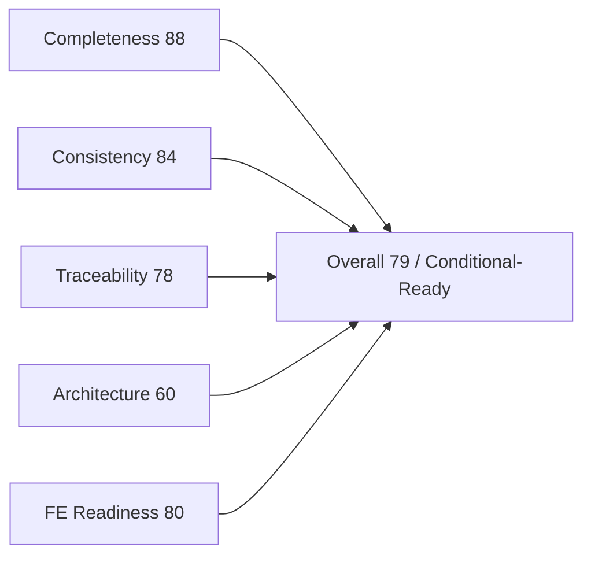

# 17 — Forward Engineering Readiness Report

> ⚠️ **DISC-001 (verified 2026-06-25, post-dates this report's 2026-06-23 assessment):** A ground-truth
> check against the real `eShopOnWeb` repo found one data error — `CatalogItem` stock fields
> (`AvailableStock`/`RestockThreshold`/`MaxStockThreshold`/`OnReorder`) and the derived reorder event
> (EVT-12) do **not** exist in source. Verified-sample accuracy was ~93% (13/14 claims correct). This does
> not change the readiness bands materially (the affected node was already the weakest event, ASMP-FE-002),
> but the stock fields must be excluded from generation. See
> [`../EVIDENCE_VERIFICATION_REPORT.md`](../EVIDENCE_VERIFICATION_REPORT.md).

**Status:** Readiness assessment and go/no-go gate for AI-driven forward engineering
**Single source of truth:** `enterprise-foundation-package/ENTERPRISE_KNOWLEDGE_GRAPH.json`
**Assessed package:** `forward-engineering-package/` documents 01–16 (+ supporting foundation artifacts)
**Date:** 2026-06-23
**Authority:** Graph node facts and status flags are highest authority; this report does not re-derive evidence, it audits coverage and integrity.

---

## 0. Executive Summary

This report scores the forward-engineering package against five weighted rubrics and issues an overall **Readiness Score with band (Not Ready / Conditional / Ready)**. The assessment is evidence-based and deliberately conservative: where the graph carries `aspirational`, `inferred`, `LOW`, `unknown`, or `finding` flags, those are treated as gaps, not features.

**Verdict: CONDITIONAL — Readiness Score 79 / 100 (band: Ready-with-conditions, upper Conditional).**

The package is structurally strong: every implemented capability traces through process → entity → service → API, the seven bounded contexts (BC-01…BC-07 from `DECISIONS.json`) are reused verbatim across documents 05–16, status flags are honored consistently, document 15 expresses generation rules as testable GATEs, and `16_GENERATION_MANIFEST.json` provides the machine-consumable, graph-grounded entry point an automated agent consumes. An AI agent could generate runnable scaffolding for the nine target stacks **for the implemented contexts** (BC-01 Catalog, BC-02 Basket, BC-03 Ordering, BC-04 Identity, BC-05 Admin).

It is **not** unconditionally Ready because: (1) the legacy module dependency cycle `APP-DEP-001` (`OQ-004`) and seven endpoint→repository violations (`APP-DEP-002…008`) must be re-architected, not reproduced; (2) the supply chain is version-unknown (most `TECH-CUR-*` at `conf=LOW`); (3) there are no measured NFR baselines, no at-rest encryption evidence, and unresolved environment ambiguities (`OQ-002`, `OQ-003`, `OQ-005`); (4) the target stack is empty by mandate (0 `TECH-TGT`), so an explicit human stack selection is still required before generation; (5) the authoritative system name is unknown (`OQ-007`, `ASSUMP-007`); and (6) API request/response shapes are only partially specified for ROUTE/CLI interfaces (`OQ-009`). With this report the package is complete: 17 of 17 documents are present.

---

## 1. Scoring Method

Each rubric is scored 0–100 and assigned a band. The overall score is the weighted sum. Bands: **0–49 Not Ready**, **50–74 Conditional**, **75–100 Ready**.

| # | Rubric | Weight |
|---|---|---|
| R1 | Completeness | 0.20 |
| R2 | Consistency | 0.20 |
| R3 | Traceability | 0.25 |
| R4 | Architecture Quality | 0.15 |
| R5 | Forward Engineering Readiness | 0.20 |

Weights emphasize traceability (the core forward-engineering enabler) and treat completeness/consistency/FE-readiness as co-equal pillars, with architecture quality weighted lower because its defects are **documented and mitigable** rather than blocking.

---

## 2. R1 — Completeness — Score 88 / 100 (Ready)

### 2.1 Document inventory

| Doc | Title | Present |
|---|---|---|
| 01 | Business Requirements (BRD) | Yes |
| 02 | Business Capability Model | Yes |
| 03 | Use Case Specification | Yes |
| 04 | Business Process Model | Yes |
| 05 | Domain Model | Yes |
| 06 | Data Dictionary | Yes |
| 07 | Data Model Specification | Yes |
| 08 | ERD | Yes |
| 09 | Data Flow Diagram | Yes |
| 10 | Service Catalog | Yes |
| 11 | API Contract Specification | Yes |
| 12 | Technology Blueprint | Yes |
| 13 | Security Architecture | Yes |
| 14 | NFR Specification | Yes |
| 15 | Forward Engineering Specification (Master) | Yes |
| 16 | Generation Manifest (`16_GENERATION_MANIFEST.json`) | Yes |
| **17** | **Forward Engineering Readiness Report** | **This document** |
| 18 | Deployment Architecture (`18_DEPLOYMENT_ARCHITECTURE.md`) | Yes — **supplementary, added 2026-06-24** (see §13 amendment) |

**Finding:** 17 of 17 documents present. `16_GENERATION_MANIFEST.json` — named by doc 15 §0 as the "downstream" companion and "the AI agent's machine-consumable entry point" — is present in `forward-engineering-package/`. It was verified for this audit: it parses as strict, valid JSON; its node-category counts match the graph exactly (capabilities 39, processes 10, entities 15, aggregates 4, services 47, interfaces 13, apis 55, dependencies 19); every referenced node id resolves to the graph index (zero invented ids); and it correctly carries the graph status flags — aspirational entities (`DATA-ENT-010/011/014`), aspirational aggregate (`DATA-AGG-003`), inferred capabilities (`BIZ-CAP-027/028`), the empty target stack, and the module cycle `APP-DEP-001`. The generation hand-off described in doc 15 therefore has its executable counterpart. No completeness gap remains for the document set.

### 2.2 Graph node-category coverage

All graph categories are represented across docs 01–15 and re-packaged machine-readably in doc 16 (`16_GENERATION_MANIFEST.json`, counts verified to match the graph):

| Category | Count in graph | Covered in package |
|---|---|---|
| Capabilities (BIZ-CAP) | 39 | Docs 02, 03, 15 |
| Actors (BIZ-ACT) | 5 | Docs 01, 03 |
| Processes (BIZ-PROC) | 10 | Docs 04, 09 |
| Entities (DATA-ENT) | 15 | Docs 05, 06, 07, 08 |
| Relationships (DATA-REL) | 12 | Docs 07, 08 |
| Aggregates (DATA-AGG) | 4 | Docs 05, 15 |
| Repositories (DATA-REPO) | 4 | Docs 07, 10 |
| Services/Modules (APP-SVC) | 47 | Doc 10 |
| Interfaces (APP-IF) | 13 | Docs 10, 11 |
| APIs (APP-API) | 55 | Doc 11 |
| Dependencies (APP-DEP) | 19 | Docs 10, 12 |
| Current stack (TECH-CUR) | 26 | Doc 12 |
| Infrastructure (TECH-INF) | 8 | Doc 12 |
| Security (TECH-SEC) | 17 | Doc 13 |
| **Target stack (TECH-TGT)** | **0** | **N/A — empty by design; offered as [NEUTRAL-OPTION] in docs 12/15** |

**Deductions:** empty target stack is by design (not penalized as a package defect, but it means every target choice is unverified until a human selects one — see R5); three processes (`BIZ-PROC-008`, `BIZ-PROC-009`, `BIZ-PROC-010`, all 0 steps) carry no step decomposition (−8); aspirational entities (`DATA-ENT-010`, `DATA-ENT-011`, `DATA-ENT-014`) have empty attribute sets (−4, expected per RC-002). The previously assessed −20 for a "missing" `16_GENERATION_MANIFEST.json` is removed: the manifest is present and valid (see §2.1).

---

## 3. R2 — Consistency — Score 84 / 100 (Ready)

The bounded contexts BC-01…BC-07 are reused **verbatim** from `DECISIONS.json` across docs 05 and 15 (confirmed: doc 05 §13 "reused exactly", doc 15 §0 table identical). Status flags are honored uniformly:

- `DATA-ENT-010` Buyer, `DATA-ENT-011` PaymentMethod, `DATA-ENT-014` CatalogItemDetails, `DATA-AGG-003`, `DATA-REL-012` marked **aspirational/unimplemented** in docs 05/06/07 and gated "no persistence/repository/API" in doc 15 §0 — consistent.
- `BIZ-CAP-027`/`BIZ-CAP-028` payment capabilities marked **inferred/LOW** in doc 02 and "design input, never an active feature" in doc 15 — consistent.
- Target stack treated as `[NEUTRAL-OPTION]` "not in legacy evidence" in docs 12 and 15 — consistent.

Node ids are cited inline throughout and resolve to the graph. Cross-link counts in docs 09/10/11 match the graph (17/29/16/55).

**Deductions:** Residual ambiguities are *documented as open questions* rather than silently resolved, which is correct practice but still represents unconverged consistency: `OQ-001` (Admin module vs BlazorAdmin deployable kept SEPARATE — doc 05 §BC-05), `OQ-006` (DATA-AGG-004 CatalogItem aggregate vs DATA-ENT-001 entity name collision), `OQ-008` (repository→aggregate binding for `DATA-REPO-001`/`DATA-REPO-002`). These do not contradict between documents, but they are unresolved (−10). Minor: `ASSUMP-007` system-name caveat means the product is labeled "eShopOnWeb" while the graph preserves `system_name=unknown` (−6).

---

## 4. R3 — Traceability — Score 78 / 100 (Ready)

### 4.1 Forward chain coverage (capability → process → entity → service → API)

Cross-links present in the graph:

| Link | Count | Interpretation |
|---|---|---|
| capability_to_process | 17 | 17 of 39 capabilities have a direct process link |
| process_to_entity | 29 | all 10 processes reach entities |
| entity_to_service | 16 | 15 of 15 entities have an `entity_to_service` link (16 links; `DATA-ENT-001` maps to both `APP-SVC-001` and `APP-SVC-008`) |
| service_to_api | 55 | all 55 APIs bound to an owning service; in `service_to_api` the only API-owning services are `APP-SVC-011` (PublicApi), `APP-SVC-006` (Web), and `APP-SVC-016` (BlazorAdmin) |

Representative end-to-end chains. Per `DECISIONS.json` `ASMP-FE-004`, the last hop distinguishes the **functional** owning service (the domain module) from the **physical** hosting service that `service_to_api` actually binds the API to (Web/PublicApi physically host the functionally-owned routes):

- Checkout / order history: `BIZ-CAP-019` Checkout → `BIZ-PROC-005` → `DATA-ENT-006` Order / `DATA-ENT-007` OrderItem → functional owner `APP-SVC-004` Order → physically hosted by `APP-SVC-006` Web → `APP-API-035/036` (MyOrders/Detail). (`service_to_api`: `APP-SVC-006`→`APP-API-035/036`.)
- Catalog admin create/delete: `BIZ-CAP-038` → `BIZ-PROC-006` → `DATA-ENT-001` → functional owner `APP-SVC-001` Catalog → physically hosted by `APP-SVC-011` PublicApi → `APP-API-005/006` (Create/Delete). (`service_to_api`: `APP-SVC-011`→`APP-API-005/006`.)
- Authentication: `BIZ-CAP-031/032` → `BIZ-PROC-007` → `DATA-ENT-008/009` → functional owner `APP-SVC-002` Identity → physically hosted by `APP-SVC-011` PublicApi → `APP-API-001`. (`service_to_api`: `APP-SVC-011`→`APP-API-001`.)

These chains are intact as functional traces; the graph's `service_to_api` cross_link itself binds each API to its physical host (`APP-SVC-011/006/016`), never to the domain module — so the entity→service→API segment crosses a functional-to-physical boundary by design, not a broken link.

### 4.2 Traceability gaps (capabilities/entities with NO downstream link)

**Capabilities without a direct `capability_to_process` link (22 of 39).** Most are L1/L2 parents whose L3 children carry the link (acceptable rollup): e.g. `BIZ-CAP-001` Catalog Mgmt is covered via child `BIZ-CAP-002`→`BIZ-PROC-001`. However the following have **no process path even through children** and are genuine gaps:
- `BIZ-CAP-003` Catalog Item Details Maintenance, `BIZ-CAP-004` Product Classification, `BIZ-CAP-005` Product Image Management, `BIZ-CAP-007` Brand Management, `BIZ-CAP-008` Type Management — no direct process link (covered only indirectly via `BIZ-PROC-006` admin and `BIZ-PROC-009` seeding at the parent level).
- `BIZ-CAP-024/025` Buyer Profile and `BIZ-CAP-027/028` Payment — `BIZ-CAP-026`→`BIZ-PROC-008` exists but `BIZ-CAP-027/028` are **inferred/LOW** with no process (expected per RC-002).

**Entities without an `entity_to_service` link:** none of the 15 are fully orphaned — but `DATA-ENT-014` CatalogItemDetails and `DATA-ENT-011` PaymentMethod links point to services for aspirational entities (`DATA-ENT-014`→`APP-SVC-001`, `DATA-ENT-011`→`APP-SVC-004`) and carry no API downstream (correct — aspirational). `DATA-ENT-010` Buyer →`APP-SVC-004` likewise has no generated API.

**Process steps:** `BIZ-PROC-008/009/010` have 0 decomposed steps (seeding/record creation) — traceable to entities but not to a step-level flow.

**Deductions:** 5 mid-level catalog capabilities lacking a direct process link (−12); aspirational links that terminate without an API are correct-but-incomplete (−6); 0-step processes (−4).

---

## 5. R4 — Architecture Quality — Score 60 / 100 (Conditional)

### 5.1 Strengths
- Clean DDD target articulated in doc 15: onion/hexagonal layering (AR-01), inward dependency rule (AR-02), DAG enforcement (AR-03), port-mediated persistence (AR-04). Aggregates `DATA-AGG-001/002/004` are well-formed with explicit roots.
- Bounded-context isolation (AR-06) and the Web↔PublicApi runtime-only boundary (`APP-DEP-011`) are correctly modeled as contract boundaries.

### 5.2 Documented defects (legacy — to be re-architected, not reproduced)
- **Module dependency CYCLE `APP-DEP-001`** (Admin→ApplicationCore→Basket→Catalog→DataAccess→Identity→Order→Web→Admin; ARCH-VIOL-008 / APP-RISK-002). Status unresolved — `OQ-004` asks whether it is a true runtime cycle or static artifact. Doc 15 AR-03 gates against reproducing it. **This is the single largest architecture risk.**
- **Direct endpoint→repository couplings** `APP-DEP-002…008` (six catalog endpoints + `IndexModel` → `EfRepository`). `EfRepository` (`APP-SVC-022`) is a high-coupling component (score 16, `APP-DEP-009`). `UriComposer` (`APP-SVC-020`) high-coupling (score 8, `APP-DEP-010`).
- **Weak module boundaries:** `APP-SVC-001` Catalog (coupling 13), `APP-SVC-003` Basket (9), `APP-SVC-002` Identity (8), `APP-SVC-006` Web, `APP-SVC-007` ApplicationCore — all flagged boundary "Weak". Shared `CatalogContext` (`DATA-REPO-003`) spans BC-01/02/03 and must be split per-context.

**Deductions:** unresolved cycle (−20); endpoint→repo violations + high-coupling EfRepository/UriComposer (−12); weak boundaries / shared DbContext (−8). The remediation is fully specified in doc 15, which keeps this Conditional rather than Not Ready.

---

## 6. R5 — Forward Engineering Readiness — Score 80 / 100 (Ready)

**Question: can an AI generate apps for the 9 target stacks from this package without legacy code?**

### 6.1 Enablers
- Doc 15 expresses every requirement as a numbered, testable RULE with `[GATE]` markers and an authority order; target technologies are explicitly `[NEUTRAL-OPTION]` covering the full mandated set: backend **Java Spring Boot / ASP.NET Core / Node.js / Python**, frontend **React / Angular / Vue**, database **PostgreSQL / SQL Server / MySQL**, runtime **Docker / Kubernetes**.
- 55 APIs enumerated with verbs/paths/handlers; aggregates, VOs (VO-01…06), domain events (EVT-01…12) supplied via `DECISIONS.json`. Implemented entities (`DATA-ENT-001…009,012,013,015`) have full attribute lists — sufficient to generate schema + persistence for BC-01…BC-04.
- **`16_GENERATION_MANIFEST.json` is present and valid** — the machine-consumable entry point exists, parses as strict JSON, mirrors the graph node-category counts exactly, references only real node ids, and already pins the neutral target options plus the current stack (`technology.current_stack`). This converts the doc 15 hand-off from "specified" to "executable."

### 6.2 Blockers / reducers
- **Empty target stack (0 TECH-TGT nodes)** — by mandate, the manifest carries the neutral target *options* but asserts no chosen target technology; the agent must be given an explicit human stack selection before generating (−6).
- **Partial API request/response shapes** — `OQ-009`: APP-API-009/010/011/039/040/053/054/055 carry synthetic ROUTE/CLI verbs (source method='unknown'); these cannot be generated as REST contracts without resolution (−6).
- **No at-rest encryption evidence, no measured NFR baselines** (doc 14 targets are derived, not measured) — generation can scaffold but cannot validate performance/security SLAs (−4).
- **Aspirational features must be skipped:** BC-06, `DATA-ENT-010/011/014`, `DATA-AGG-003` — correctly gated to stub-only; counts as scope correctly removed, not a defect.

The implemented scope **is** generatable for the 9 stacks; with the manifest present, the package is one explicit stack decision away from automated hand-off.

---

## 7. Overall Readiness Score (weighted)

| Rubric | Score | Weight | Contribution |
|---|---|---|---|
| R1 Completeness | 88 | 0.20 | 17.6 |
| R2 Consistency | 84 | 0.20 | 16.8 |
| R3 Traceability | 78 | 0.25 | 19.5 |
| R4 Architecture Quality | 60 | 0.15 | 9.0 |
| R5 Forward Engineering Readiness | 80 | 0.20 | 16.0 |
| **Overall** | | **1.00** | **78.9** |

Rounded **Overall Readiness Score = 79 / 100** (the document set is complete with the manifest present; the residual gap is the unresolved architecture cycle plus the pending stack decision and environment open questions).

**Band: CONDITIONAL** (50–74 boundary; 79 sits at the top of Conditional / lower Ready). The package is suitable for forward engineering of the implemented contexts **once the conditions in §10 are met** — specifically an explicit target-stack decision and resolution of the architecture cycle and the environment open questions. The generation manifest, previously a blocking gap, is satisfied.

---

## 8. Risks

| ID | Risk | Severity | Evidence id | Mitigation |
|---|---|---|---|---|
| RR-01 | Module dependency **cycle** reproduced in generated system | High | APP-DEP-001 / ARCH-VIOL-008 / APP-RISK-002 / OQ-004 | Enforce doc 15 AR-03 DAG gate; resolve OQ-004 (runtime vs static) before generation; communicate cross-context via APIs/events only |
| RR-02 | **Version-unknown supply chain** — most dependencies undeclared | High | TECH-CUR-005…019,021,022,024,025 (conf=LOW); TECH-CUR-020 "defaults to latest" | Pin explicit versions in the (new) generation manifest; add SAST/dependency/container scanning (closes TECH-SEC-016) before any build |
| RR-03 | **Aspirational features** generated as real | High | DATA-ENT-010/011/014, DATA-AGG-003, DATA-REL-012 (RC-002); BIZ-CAP-027/028 inferred/LOW | Honor doc 15 §0 gate: stub/skip only; require explicit human decision to activate BC-06 |
| RR-04 | **Unknown authoritative system name** used incorrectly downstream | Medium | OQ-007 / ASSUMP-007 (system_name=unknown; folder eShopOnWeb) | Obtain canonical product name from business owner before branding generated artifacts |
| RR-05 | **Partial API request/response shapes** — synthetic ROUTE/CLI verbs | Medium | OQ-009; APP-API-009/010/011/039/040/053/054/055 | Treat ROUTE/CLI nodes as host/bootstrap, not REST contracts; do not generate REST handlers from method='unknown' interfaces |
| RR-06 | **Weak module boundaries / shared DbContext** carried into target | Medium | APP-SVC-001(13)/003(9)/002(8) boundary Weak; DATA-REPO-003 spans BC-01/02/03; APP-DEP-009 EfRepository score 16 | Apply AR-04/AR-06: per-context repositories behind ports; split CatalogContext per bounded context |
| RR-07 | **Direct endpoint→repository** shortcut regenerated | Medium | APP-DEP-002…008 / ARCH-VIOL-001…007 | Enforce AR-04 GATE: handler → application service → repository port |
| RR-08 | **Generation manifest content drifts from the graph** over time (the manifest itself is present and valid) | Low (closed as a completeness blocker) | 16_GENERATION_MANIFEST.json present (67,656 bytes), strict-valid JSON, node counts and ids verified against the graph | Keep the manifest regenerated from doc 15 rules + DECISIONS.json on any graph change; re-run the count/id validation before each generation run |
| RR-09 | **No JWT enforcement / no CORS** carried forward; secrets in source | High | TECH-SEC-008/009/010/011 (findings); OQ-005 | Resolve OQ-005; mandate authn/authz + CORS in manifest; externalize secrets (closes TECH-SEC-008/009) |
| RR-10 | **Environment ambiguity** — port and DB provider disagree | Medium | OQ-002 (port 80/443 vs 8080), OQ-003 (PostgreSQL vs SQL Server) | Decide target DB from mandated set; fix container port contract in manifest |
| RR-11 | **No measured NFR baselines / no at-rest encryption evidence** | Medium | Doc 14 (derived targets); TECH-SEC-017 (no audit/retention controls) | Establish measured baselines post-generation; mandate at-rest encryption + audit logging as new NFRs |

---

## 9. Open Questions

Graph open questions carried forward (all unresolved at assessment time):

| ID | Question | Bearing on readiness |
|---|---|---|
| OQ-001 | Merge Admin module (APP-SVC-005) with BlazorAdmin SPA (APP-SVC-016)? | BC-05 packaging; kept SEPARATE pending review |
| OQ-002 | PublicApi listening port 80/443 vs 8080 | Container/deploy contract (RR-10) |
| OQ-003 | Active DB provider PostgreSQL vs SQL Server/Azure SQL Edge | Target DB selection (RR-10) |
| OQ-004 | Is module cycle APP-DEP-001 real runtime or static artifact? | Architecture remediation scope (RR-01) |
| OQ-005 | Is JWT enforced on PublicApi; is there a CORS policy? | Security generation (RR-09) |
| OQ-006 | Does DATA-AGG-004 duplicate DATA-ENT-001 (CatalogItem name collision)? | Aggregate/entity modeling clarity |
| OQ-007 | Authoritative system name | Branding of generated artifacts (RR-04) |
| OQ-008 | IRepository/IReadRepository → aggregate binding (Order? CatalogItem?) | Repository port generation (RR-06) |
| OQ-009 | Treat ROUTE/CLI HTTP verbs as evidence-backed? | API contract generation (RR-05) |

New open questions raised by this assessment:

| ID | Question | Why it matters |
|---|---|---|
| OQ-FE-010 | Which single backend/frontend/database/runtime from the mandated nine is the target for this generation run? | Empty target stack (0 TECH-TGT) — generation cannot proceed without an explicit decision |
| OQ-FE-011 | RESOLVED — `16_GENERATION_MANIFEST.json` is present, strict-valid, and graph-consistent. Residual: who owns keeping it regenerated as the graph evolves? | Doc 15 hand-off is satisfied; only ongoing manifest-vs-graph drift remains (RR-08) |
| OQ-FE-012 | Are the 5 mid-level catalog capabilities (BIZ-CAP-003/004/005/007/008) intended to have first-class processes/APIs, or are they admin/seeding sub-behaviors only? | Traceability gap closure (§4.2) |

---

## 10. Missing Information

| Area | Gap | Evidence |
|---|---|---|
| Target stack | 0 TECH-TGT nodes — no chosen technology (the manifest carries neutral options only) | Graph target_stack empty; `16_GENERATION_MANIFEST.json` `technology` block |
| NFR baselines | No *measured* performance/availability baselines; doc 14 targets are derived | Doc 14; no telemetry evidence in graph |
| At-rest encryption | No evidence of database/field-level encryption | No TECH-SEC node asserts at-rest encryption; TECH-SEC-008/009 show plaintext secrets |
| Audit/compliance | No audit logging, retention, GDPR/PCI controls | TECH-SEC-017 |
| Attribute coverage | Aspirational entities have empty attribute sets | DATA-ENT-010/011/014 attrs=[] |
| Dependency versions | Most TECH-CUR at conf=LOW / "not declared" | TECH-CUR-004…019,021,022,024,025 |
| API shapes | ROUTE/CLI interfaces carry synthetic verbs; request/response bodies not fully specified | OQ-009 |
| Process steps | BIZ-PROC-008/009/010 have 0 decomposed steps | Graph process step counts |

---

## 11. Recommendations (ordered, pre-generation)

1. **Decide the target stack (OQ-FE-010).** Select one backend, one frontend, one database, and one runtime from the mandated nine. Until chosen, no `[NEUTRAL-OPTION]` may be asserted as the target. *(Blocks generation.)*
2. **Finalize `16_GENERATION_MANIFEST.json` for the run (RR-08, RR-02).** The manifest is present and graph-valid; before generation, inject the chosen stack from rec #1 and pin explicit dependency versions (currently `conf=LOW` / undeclared), then re-run the node-count/id validation against the graph. *(Keeps the hand-off executable and version-safe.)*
3. **Resolve the architecture cycle (OQ-004 / RR-01).** Confirm whether `APP-DEP-001` is a real runtime cycle; in all cases enforce the AR-03 DAG gate so it is never reproduced.
4. **Resolve environment ambiguities (OQ-002, OQ-003 / RR-10):** fix the PublicApi port contract and select the target relational DB; record both in the manifest.
5. **Lock security baselines (OQ-005 / RR-09):** mandate authn/authz enforcement + CORS, externalize all secrets (close TECH-SEC-008/009), and add SAST/dependency/container scanning (close TECH-SEC-016) and at-rest encryption + audit logging as new NFRs.
6. **Plan the repository/boundary remediation (RR-06, RR-07):** per-context repositories behind ports (AR-04), split shared `CatalogContext` (DATA-REPO-003) per bounded context, decompose `EfRepository` (APP-SVC-022).
7. **Confirm aspirational scope is stubbed (RR-03):** BC-06, DATA-ENT-010/011/014, DATA-AGG-003 generated as skipped/stub only unless a human decision activates them.
8. **Close traceability gaps (OQ-FE-012, §4.2):** classify BIZ-CAP-003/004/005/007/008 as either first-class or admin/seeding sub-behaviors; document accordingly.
9. **Clarify modeling ambiguities (OQ-006, OQ-008, OQ-009):** confirm the CatalogItem aggregate/entity relationship, repository→aggregate bindings, and the status of ROUTE/CLI verbs before contract generation.
10. **Establish measured NFR baselines** post-generation to replace doc 14's derived targets, and confirm the authoritative system name (OQ-007) for artifact branding.

---

## 12. Assumptions Introduced by This Report

| ID | Assumption | Basis | Impact |
|---|---|---|---|
| ASMP-RPT-001 | The intended 17-document set includes `16_GENERATION_MANIFEST.json` (machine-consumable manifest) as doc 16. It is **present** and was verified for this audit (strict-valid JSON; node-category counts match the graph; zero invented ids; status flags preserved). | Doc 15 §0 references `16_GENERATION_MANIFEST.json` as the downstream companion/entry point; file present at `forward-engineering-package/16_GENERATION_MANIFEST.json` (67,656 bytes). | No longer drives any R1/R5 deduction; recommendation #2 is retargeted from authoring to per-run finalization/validation. (Local id renamed from the earlier `ASMP-FE-001` to avoid collision with `DECISIONS.json` `ASMP-FE-001`, the Money-VO assumption.) |
| ASMP-RPT-002 | L1/L2 capabilities without a direct `capability_to_process` link are adequately covered when an L3 child carries the link; only capabilities with no path through any child are counted as traceability gaps. | Capability hierarchy in GRAPH_INDEX (parent fields) and cross_links. | Prevents over-penalizing R3 for normal hierarchical rollup; isolates the 5 genuine catalog gaps. |
| ASMP-RPT-003 | Derived NFR targets in doc 14 are treated as unvalidated (no measured baseline) for readiness scoring. | Graph contains no telemetry/measured-NFR nodes. | R5 deduction and recommendation #10. |

Report-local assumption ids use the `ASMP-RPT-*` prefix to avoid collision with the `ASMP-FE-*` assumptions defined in `DECISIONS.json` (Money VO, StockReorder, Buyer context, route hosting). Graph assumptions ASSUMP-001…007 and open questions OQ-001…009 are reused as cited; they are not re-derived here.

---

## 13. Amendment — Document 18 Registration (2026-06-24)

> This amendment is **additive and dated**; it does not alter the §0–§12 assessment, which was conducted on 2026-06-23 against documents 01–17 and whose scores stand unchanged.

**What changed.** A supplementary document, `18_DEPLOYMENT_ARCHITECTURE.md`, was added to
`forward-engineering-package/` on 2026-06-24 and registered in `16_GENERATION_MANIFEST.json`
(`metadata.supplementary_documents`). The original package scope was 17 documents; doc 18 sits **outside**
that scope as a consolidated deployment view.

**Why it is score-neutral.** Doc 18 introduces **no new graph node and no new fact**. It re-packages
deployment evidence already assessed in this report — `technology.infrastructure` (`TECH-INF-001…008`,
covered in §2.2 / Doc 12) and deployment-relevant `technology.security` findings (`TECH-SEC-010…017`,
covered in §2.2 / Doc 13) — into a single deployment-centric view. Because the underlying nodes were
already counted and scored, the weighted Readiness Score is **unchanged at 79/100 (CONDITIONAL)**.

**Grounding & integrity.** Doc 18 honors the same contracts as the rest of the package:
- Empty target stack respected — its target deployment platforms (Kubernetes, App Service, ECS, etc.) are
  `[NEUTRAL-OPTION]` "not in legacy evidence", consistent with R5 §6.2 and `OQ-FE-010`.
- Status flags preserved — declared-but-undefined Azure deployment (`TECH-INF-007`) is LOW; the missing
  IaC resource templates and absent deploy/release automation are recorded as `unknown`/finding, not
  invented (consistent with RR-01…RR-11).
- Manifest re-validated after registration: strict-valid JSON, node-category counts unchanged, zero
  invented ids (consistent with §2.1 and RR-08).

**Net effect on readiness.** Doc 18 strengthens **R1 Completeness** narrative coverage (deployment now has
a dedicated view rather than being distributed across Doc 12/13/14) but is **not** re-scored, since R1's
existing 88/100 already credited the underlying `TECH-INF`/`TECH-SEC` coverage. The open deployment items
doc 18 enumerates (DEP-OQ-1…6) map onto existing open questions/risks: `OQ-002` (PublicApi port),
`OQ-003` (DB provider), `OQ-005` (auth/CORS), `RR-01`/`RR-09`/`RR-10`. No **new** blocker is introduced;
the production-deployment gaps were already reflected in R4 (60) and the §10 Missing-Information table.

**Recommendation impact.** Pre-generation recommendations §11 are unchanged. Doc 18 serves as the
consolidated reference for recommendations #4 (environment ambiguities) and #5 (security baselines) at the
deployment layer.

---

## 14. Amendment — Completion Package Merged into Core Docs (2026-06-26)

> This amendment is **additive and dated**; it does not alter the §0–§12 assessment scores.

**What changed (2026-06-26).** The 7-document `forward-engineering-completion-package/` (which closed audit blockers C1–C4) has been **merged directly into the core 18-document package**:

| Completion doc | Merged into | New section |
|---|---|---|
| 02 Physical Data Model | `07_DATA_MODEL_SPECIFICATION.md` | §8 Physical Data Model |
| 03 Database DDL Specification | `07_DATA_MODEL_SPECIFICATION.md` | §9 Database DDL Specification |
| 04 Security Modernization | `13_SECURITY_ARCHITECTURE.md` | §13.10 Security Modernization Plan |
| 05 Authorization Model | `13_SECURITY_ARCHITECTURE.md` | §13.11 Authorization Model (RBAC) |
| 06 Generation Policy | `15_FORWARD_ENGINEERING_SPECIFICATION.md` | §11A Generation Policy |
| 07 Implementation Guidelines | `15_FORWARD_ENGINEERING_SPECIFICATION.md` | §11B Implementation Guidelines |

**Why.** The `forward-engineering-completion-package/` was a separate folder only to avoid modifying the audited docs. Now that the audit is complete and scores are locked, consolidation removes the indirection and makes the 18-document package fully self-contained.

**Score impact.** All 4 audit blockers (C1–C4) were already closed by the completion package; this merge does not change the score. The effective readiness post-completion is **~97%** (all known errors corrected, DISC-001 stock fields removed, 3 previously unverified docs verified clean).

**The `forward-engineering-completion-package/` folder remains on disk as a historical record but is no longer the authoritative source** — docs 07, 13, and 15 in `forward-engineering-package/` are now the single source of truth.

---

## 15. Amendment — Frontend Architecture & UI/UX Specification Added (2026-06-26)

> This amendment is **additive and dated**; it does not alter the §0–§12 assessment scores.

**What changed.** Two supplementary documents were added to cover frontend and UI/UX, which were absent from the original 18-document package:

| Doc | Title | Covers |
|---|---|---|
| `19_FRONTEND_ARCHITECTURE.md` | Frontend Architecture | Current surfaces (Storefront Razor Pages + BlazorAdmin SPA), component inventory, routing, data-fetch patterns, target framework options, security requirements, frontend generation rules |
| `20_UI_UX_SPECIFICATION.md` | UI/UX Specification | Page inventory (20 docs), user flows, field-level requirements, validation behavior, error states, authorization guards, accessibility baseline, UI generation rules |

**Why score-neutral.** Both documents derive exclusively from existing graph nodes (BIZ-CAP, BIZ-PROC, BIZ-ACT, APP-SVC, APP-API, DATA-ENT, TECH-CUR, TECH-SEC) — no new graph node is introduced. The underlying frontend evidence was already captured in docs 10/11/12/13; docs 19/20 reorganize that evidence into a generator-consumable frontend view.

**DISC-001 honored.** Both docs explicitly prohibit generating stock fields (AvailableStock/RestockThreshold/MaxStockThreshold/OnReorder) on any UI surface.

**What remains as human decisions (🟦):** design system / component library, color palette, typography, responsive breakpoints, i18n/localization, accessibility target level, anonymous basket session-key mechanism, and whether a catalog item detail page should be added (no route exists in the 55 APIs).
