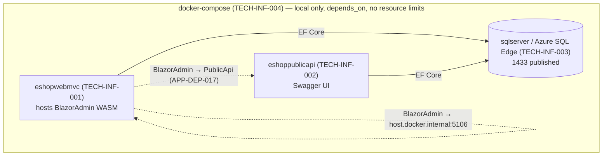

# 18. Deployment Architecture

> **Scope & grounding.** This document is derived exclusively from the Enterprise Knowledge Graph
> (`ENTERPRISE_KNOWLEDGE_GRAPH.json`) and the Technology Architecture deployment evidence
> (`ta-outputs/ta_agent1/infrastructure-deployment-blueprint.md`). Every deployable unit, environment,
> pipeline, and topology fact traces to a graph node id (`TECH-INF-###`, `TECH-CUR-###`, `TECH-SEC-###`,
> `APP-SVC-###`) and a source file. It honors the graph's preserved status flags: items inferred from
> parameters/naming only (LOW confidence) are labeled as such and never asserted as verified.
>
> **Neutrality contract.** The graph's `target_stack` is **EMPTY (0 TECH-TGT nodes)**. Therefore **no
> target deployment platform in this document is a discovered fact**. Every target option (Kubernetes,
> Azure App Service, AWS ECS, etc.) in §18.6 is a **NEUTRAL OPTION, explicitly not in legacy evidence**,
> offered to satisfy the candidate set; selection is a downstream decision. Only §18.1–§18.5 assert
> evidence, labeled **"Current (legacy)"**.
>
> **Why this document exists.** Deployment facts were previously distributed across
> `12_TECHNOLOGY_BLUEPRINT.md` (§2 current architecture) and the NFR/security specs. This document
> consolidates them into a single deployment view without adding any new fact.

---

## 18.1 Deployment Overview (Current — legacy)

The legacy system is a **layered .NET 8 monolith** packaged as **three Docker Compose services**,
orchestrated locally only. There is **declared-but-undefined** Azure deployment intent (parameters
present, no resource templates) and **no production orchestration evidence** (no Kubernetes, no IaC
resource definitions).

| Deployable unit | Graph node | Backing service | Kind |
|---|---|---|---|
| `eshopwebmvc` (Web: MVC + Razor + hosted Blazor WASM admin) | `TECH-INF-001` | `APP-SVC-006` | Docker Compose service / container |
| `eshoppublicapi` (PublicApi REST + Swagger UI) | `TECH-INF-002` | `APP-SVC-011` | Docker Compose service / container |
| `sqlserver` (Azure SQL Edge) | `TECH-INF-003` | data tier (`DATA-REPO-003/004`) | Database container |
| `BlazorAdmin` (WASM SPA) | — (`APP-SVC-016`) | served **inside** `eshopwebmvc` | **Non-deployable** — hosted asset, not a runtime unit |

> **Topology note.** `BlazorAdmin` is **not** a separate deployable; it is delivered inside the Web host
> and calls PublicApi (`APP-DEP-017`) and Web (`APP-DEP-018`) over HTTP at runtime.

## 18.2 Deployable Units & Container Images (Current)

| Unit | Build image | Runtime image | Ports (host:container) | Confidence | Source |
|---|---|---|---|---|---|
| `eshopwebmvc` (`TECH-INF-001`) | `mcr.microsoft.com/dotnet/sdk:8.0` | `mcr.microsoft.com/dotnet/aspnet:8.0` | `5106:8080` | HIGH | docker-compose.yml, docker-compose.override.yml, src/Web/Dockerfile |
| `eshoppublicapi` (`TECH-INF-002`) | `mcr.microsoft.com/dotnet/sdk:8.0` | `mcr.microsoft.com/dotnet/aspnet:8.0` | `5200:8080` (Dockerfile EXPOSE 80/443) | HIGH | docker-compose.yml, src/PublicApi/Dockerfile |
| `sqlserver` (`TECH-INF-003`) | — | `mcr.microsoft.com/azure-sql-edge` (no tag → `latest`) | `1433:1433` | HIGH (tag LOW) | docker-compose.yml |

**Container base image set (`TECH-CUR-023`, HIGH):** `dotnet/sdk:8.0`, `dotnet/aspnet:8.0`.
**Runtime/SDK (`TECH-CUR-001`, HIGH):** .NET 8.0.x.

> **Discrepancy (preserved):** PublicApi Dockerfile declares `EXPOSE 80/443` but compose maps `8080`.
> Flagged LOW; carry to source confirmation (also in `12_TECHNOLOGY_BLUEPRINT.md`).
> **Azure SQL Edge** image is untagged → resolves to `latest`; EOL/version **unknown** (`TECH-CUR-020`, LOW).

## 18.3 Environments (Current)

| Environment | Trigger / target | `ASPNETCORE_ENVIRONMENT` | Source |
|---|---|---|---|
| Development | Local run | `Development` (implicit) | appsettings.Development.json (Web/PublicApi/BlazorAdmin) |
| Docker | `docker-compose` run | `Docker` | docker-compose.override.yml, appsettings.Docker.json |
| Default / Production-like | Fallback config | (none) | appsettings.json |
| CI (build) | push / PR / dispatch, any branch | n/a | .github/workflows/dotnetcore.yml |
| CI (code index) | manual `workflow_dispatch` | n/a | .github/workflows/richnav.yml |
| Azure (azd) | `${AZURE_ENV_NAME}` — **target undeclared** | n/a | infra/main.parameters.json |
| Test (in-memory) | `UseOnlyInMemoryDatabase: true` | n/a | tests/PublicApiIntegrationTests/appsettings.test.json |

## 18.4 CI/CD Pipelines (Current — `TECH-INF-005`, `TECH-INF-006`)

| Pipeline | Job | Tool invocations | Actions | Trigger | Runner | Source |
|---|---|---|---|---|---|---|
| `dotnetcore.yml` | build | `dotnet build` + `dotnet test` `./eShopOnWeb.sln --configuration Release` | `actions/checkout@v2`, `actions/setup-dotnet@v1` | push / PR / dispatch (all branches) | `ubuntu-latest` | .github/workflows/dotnetcore.yml |
| `richnav.yml` | build | `dotnet build ./Everything.sln --configuration Release /bl` | `+ microsoft/RichCodeNavIndexer@v0.1` | `workflow_dispatch` (manual) | `windows-latest` | .github/workflows/richnav.yml |
| `dependabot.yml` (`TECH-INF-006`) | — | NuGet daily update bot (out-of-band PRs, **not** an in-pipeline gate) | — | daily schedule | — | .github/dependabot.yml |

**Pipeline capability gaps (evidenced findings, carry from Security spec):**
`TECH-SEC-012` no secret scanning · `TECH-SEC-016` no SAST/dependency/container scan. CI builds + tests
only; **no deploy stage, no release/rollback automation in evidence.**

## 18.5 Runtime Topology, Network & Secrets (Current)

**Orchestration (`TECH-INF-004`):** `docker-compose.yml` + `docker-compose.override.yml`, 3-service local
topology, `depends_on` ordering only, **no resource limits, no named DB volume** (data non-persistent
across container recreation).

**Network (declared only — no inference):**
- No ingress / load balancer / reverse proxy / API gateway in evidence.
- No VPC / subnet / security-group / network-policy declarations.
- Docker endpoints declared plain `http://+:8080` — **no TLS termination point for container traffic**
  (`TECH-SEC-014`). Dev uses `https://localhost` with bind-mounted dev certs (`TECH-SEC-007`).
- `1433` published directly to host (`TECH-SEC-013`); `TrustServerCertificate=true` + `AllowedHosts: *`
  (`TECH-SEC-015`).

**Secrets in deployment:**
- Dev: User Secrets (`TECH-SEC-005`), bind-mounted dev certs (`TECH-SEC-007`).
- DB: `SA_PASSWORD` via compose env (`TECH-INF-003`).
- Azure (declared): `sqlAdminPassword` / `appUserPassword` sourced via `secretOrRandomPassword` from
  Azure Key Vault (`TECH-INF-008`, `${AZURE_KEY_VAULT_NAME}`) — **referenced, not verified enforced**.

**Cloud deployment (declared, LOW — `TECH-INF-007`):** `infra/main.parameters.json` (azd) +
`infra/abbreviations.json` (≈80 Azure resource-type abbreviations) are present, but **no resource-defining
template** (`main.bicep` / ARM / Terraform / K8s manifests) is in evidence. Actual cloud topology is
**unknown** — the abbreviations file lists AKS, App Service, Redis, Cosmos, SQL etc. with **no matching
resource declarations**.

## 18.6 Target Deployment Options (NEUTRAL — not in legacy evidence)

> Per the neutrality contract, the graph's `target_stack` is empty. The following are **candidate options**
> mapping each current deployment concept to analogues. **No option is recommended at this layer.**

| Current concept (legacy) | Option A — Container orchestration | Option B — Managed PaaS | Option C — Serverless/container hybrid |
|---|---|---|---|
| docker-compose 3-service (`TECH-INF-004`) | Kubernetes (AKS/EKS/GKE) Deployments + Services | Azure App Service / AWS App Runner per unit | Azure Container Apps / AWS Fargate |
| `sqlserver` container (`TECH-INF-003`) | StatefulSet + PVC, or managed DB | Azure SQL DB / Amazon RDS | managed DB (provider-native) |
| GitHub Actions build-only (`TECH-INF-005`) | + deploy job (`kubectl`/Helm) + scanning gates | + provider deploy action + scanning | + IaC apply + scanning |
| azd params, no template (`TECH-INF-007`) | author Bicep/Terraform/Helm to match | author Bicep for App Service | author IaC for the chosen runtime |
| Key Vault referenced (`TECH-INF-008`) | CSI Secrets Store / sealed secrets | native managed-identity + Key Vault | native secret store |

**Cross-cutting target requirements (stack-independent, from evidenced findings):** add TLS termination
(`TECH-SEC-014`), stop publishing `1433` (`TECH-SEC-013`), enforce PublicApi auth (`TECH-SEC-010`) and
CORS (`TECH-SEC-011`), add SAST/dependency/container/secret scanning gates (`TECH-SEC-012/016`), persist
DB state (named volume / managed DB), and author the missing IaC so `TECH-INF-007` becomes a defined
topology.

## 18.7 Deployment Readiness Assessment

| Dimension | Status | Evidence |
|---|---|---|
| Containerization | ✅ Present (3 services) | `TECH-INF-001/002/003` |
| Local orchestration | ✅ Present (compose) | `TECH-INF-004` |
| **Production orchestration** | ❌ **Not in evidence** | no K8s/IaC resource templates |
| **CI → deploy automation** | ❌ Build/test only | `TECH-INF-005` (no deploy stage) |
| Release / rollback strategy | ❌ Not in evidence | — |
| Cloud topology | ⚠️ Declared, undefined (LOW) | `TECH-INF-007` params only |
| Secrets management | ⚠️ Referenced, unverified | `TECH-INF-008`, `TECH-SEC-005/007` |
| State persistence | ❌ No named DB volume | `TECH-INF-004` |
| Network hardening (TLS/ports) | ❌ Findings open | `TECH-SEC-013/014/015` |

**Readiness verdict:** **Local-dev-ready, production-incomplete.** The container build artifacts exist
with HIGH confidence, but production orchestration, deploy automation, release/rollback, IaC resource
definitions, and network/secret hardening are **absent or only declared** — recorded as `unknown` /
findings, **not invented**.

## 18.8 Open Deployment Questions (carry to source confirmation)

| ID | Question |
|---|---|
| DEP-OQ-1 | Azure target topology — what does `main.bicep`/IaC actually define? (`TECH-INF-007`, LOW) |
| DEP-OQ-2 | Azure SQL Edge image tag/version & EOL (`TECH-CUR-020`, untagged → latest) |
| DEP-OQ-3 | PublicApi port: Dockerfile `EXPOSE 80/443` vs compose `8080` (which is authoritative?) |
| DEP-OQ-4 | Blazor hosting model: WASM (`TECH-CUR-003`) vs Server (`APP-SVC-006` anchor) — affects deploy unit |
| DEP-OQ-5 | Is there any deploy/release pipeline outside the two scanned workflows? |
| DEP-OQ-6 | DB persistence in any non-local environment (no named volume in evidence) |

---

### Traceability
Every fact above resolves to a graph node (`TECH-INF-001`…`008`, `TECH-CUR-001/020/023`,
`TECH-SEC-010`…`017`, `APP-SVC-006/011/016`) and a cited source file. No deployment platform, cloud
resource, or pipeline stage absent from the evidence has been asserted as fact; all such gaps are marked
`unknown` / finding / NEUTRAL OPTION, consistent with the package's anti-hallucination grounding.
