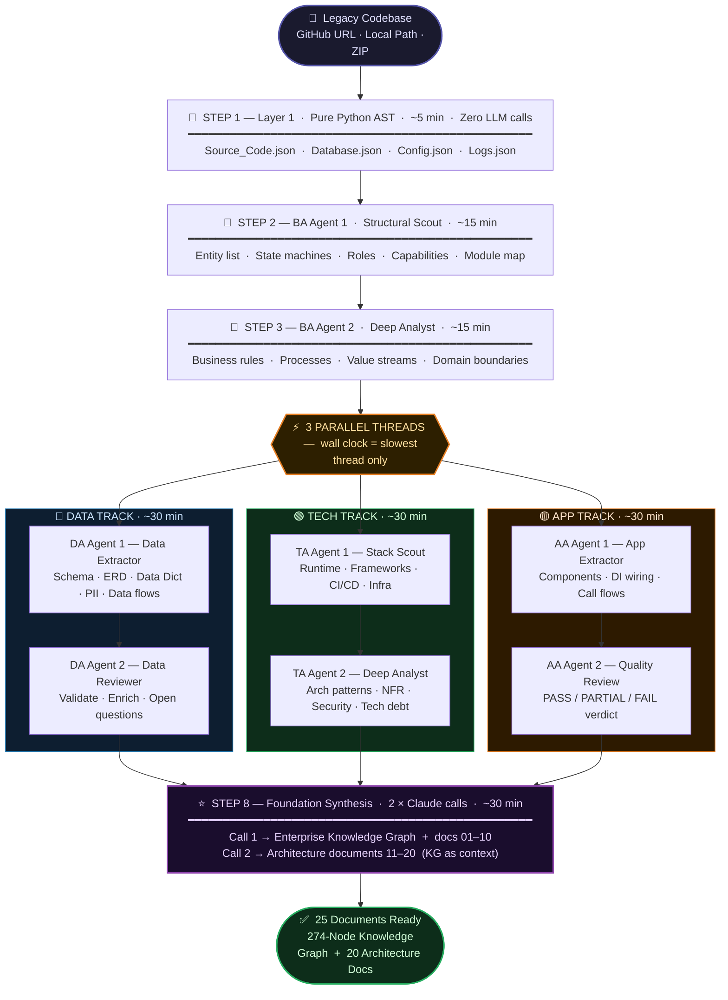
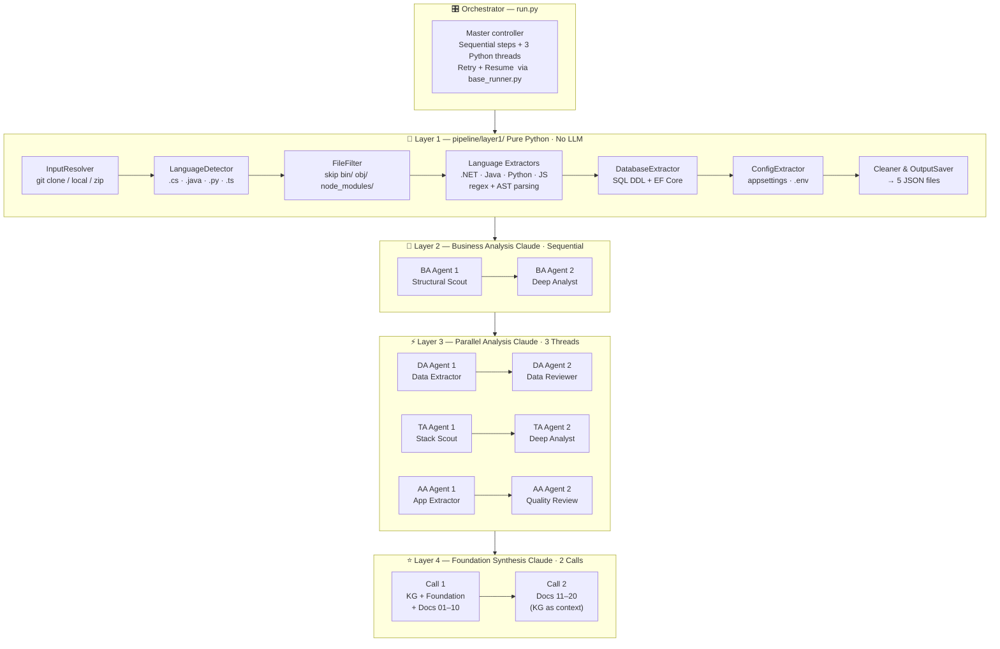
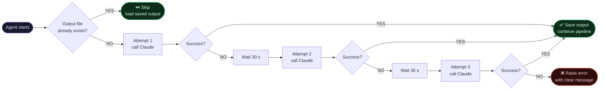

<div align="center">


<br/><br/>

[](https://python.org)
[](https://anthropic.com)
[](https://dotnet.microsoft.com)
[](#-25-output-documents)
[](Enterprise_Foundation_Package/ENTERPRISE_KNOWLEDGE_GRAPH.json)
[](Forward_Engineering_Package/11_API_CONTRACT_SPECIFICATION.md)
[](Forward_Engineering_Package/10_SERVICE_CATALOG.md)

<br/>

> 🛡️ **Production hardened** — Auto-retry on Claude API failures (3×, 30 s wait) &nbsp;·&nbsp; Resume from last completed step &nbsp;·&nbsp; Safe to re-run at any time

</div>

---

## ⚡ What This Does

Hands a legacy codebase to **9 Claude AI agents** across 4 specialised analysis layers. Each agent reads the code from a different angle — business rules, data schema, tech stack, application structure. A final synthesis agent merges all findings into a **274-node Enterprise Knowledge Graph** and **20 architecture documents** a senior architect would take weeks to produce manually.

<div align="center">

| | Manual (by hand) | This Pipeline |
|---|:---:|:---:|
| ⏱️ **Time** | 2–4 weeks | ~1.5–2 hours |
| 👤 **Human needed** | At every step | Zero |
| 📄 **Documents** | 25 docs + KG | 25 docs + KG |
| ✅ **Reproducible** | No | Yes — re-run anytime |
| 🔍 **Evidence-cited** | Depends on analyst | Every finding cited |
| 💰 **Token cost** | N/A | ~30% lower (Layer 1 pre-extracts) |

</div>

---

## 🚀 Quick Start

```bash
# 1 — Install Python dependencies
pip install -r requirements.txt

# 2 — Install Claude Code CLI
npm install -g @anthropic/claude-code
claude login

# 3 — Run the pipeline
python run.py --source "source/eShopOnWeb" --output ./results

# Or point at any other codebase
python run.py --source "https://github.com/your-org/your-app" --output ./results
python run.py --source "C:/projects/legacy-app"               --output ./results
```

> [!TIP]
> **Interrupted mid-run?** Re-run the exact same command. Every step checks if its output file already exists and skips — only incomplete steps run again.

---

## 🗺️ Pipeline Flow — End to End



---

## 📊 Pipeline Analytics

<div align="center">

<table>
<tr>
<td align="center" width="50%">

**⏱️ Step Duration (minutes)**


</td>
<td align="center" width="50%">

**📄 25 Documents by Category**


</td>
</tr>
<tr>
<td align="center" colspan="2">

**🎯 Analysis Coverage by Dimension**


</td>
</tr>
</table>

</div>

---

## 📦 25 Output Documents

### 🏛️ Foundation — Enterprise Knowledge Graph (5 files)

| File | What it contains |
|---|---|
| [ENTERPRISE_KNOWLEDGE_GRAPH.json](Enterprise_Foundation_Package/ENTERPRISE_KNOWLEDGE_GRAPH.json) | 274-node cross-layer graph — every entity, service, API, and tech node, fully linked with confidence scores |
| [CANONICAL_ENTERPRISE_MODEL.md](Enterprise_Foundation_Package/CANONICAL_ENTERPRISE_MODEL.md) | Human-readable summary — one row per node across all domains |
| [ARCHITECTURE_INVENTORY.md](Enterprise_Foundation_Package/ARCHITECTURE_INVENTORY.md) | Deployables, databases, APIs, services, tech stack, security findings, PII, tech debt |
| [TRACEABILITY_MATRIX.md](Enterprise_Foundation_Package/TRACEABILITY_MATRIX.md) | Full chain: Capability → Process → Entity → Service → API → Database |
| [FORWARD_ENGINEERING_INPUT_MAP.md](Enterprise_Foundation_Package/FORWARD_ENGINEERING_INPUT_MAP.md) | What is KNOWN · INFERRED · MISSING — input spec for AI code regeneration |

### 📄 Forward-Engineering Documents (20 files)

| # | Document | Contains |
|---|---|---|
| 01 | [Business Requirements Document](Forward_Engineering_Package/01_BRD.md) | Business goals, scope, stakeholders, success criteria |
| 02 | [Business Capability Model](Forward_Engineering_Package/02_BUSINESS_CAPABILITY_MODEL.md) | 39 capabilities mapped across business domains |
| 03 | [Use Case Specification](Forward_Engineering_Package/03_USE_CASE_SPECIFICATION.md) | Actors, preconditions, main flows, alternate paths |
| 04 | [Business Process Model](Forward_Engineering_Package/04_BUSINESS_PROCESS_MODEL.md) | End-to-end processes — triggers, steps, outcomes |
| 05 | [Domain Model](Forward_Engineering_Package/05_DOMAIN_MODEL.md) | DDD bounded contexts, aggregates, Mermaid context maps |
| 06 | [Data Dictionary](Forward_Engineering_Package/06_DATA_DICTIONARY.md) | Every entity, field, type, constraint, and business meaning |
| 07 | [Data Model Specification](Forward_Engineering_Package/07_DATA_MODEL_SPECIFICATION.md) | Physical schema + full PostgreSQL DDL ready to execute |
| 08 | [Entity Relationship Diagram](Forward_Engineering_Package/08_ERD.md) | Full ERD with cardinality and foreign key relationships |
| 09 | [Data Flow Diagram](Forward_Engineering_Package/09_DATA_FLOW_DIAGRAM.md) | Data movement across all layers and system boundaries |
| 10 | [Service Catalog](Forward_Engineering_Package/10_SERVICE_CATALOG.md) | 47 services — interfaces, responsibilities, dependencies |
| 11 | [API Contract Specification](Forward_Engineering_Package/11_API_CONTRACT_SPECIFICATION.md) | 55 REST endpoints with full request/response contracts |
| 12 | [Technology Blueprint](Forward_Engineering_Package/12_TECHNOLOGY_BLUEPRINT.md) | Target architecture, stack decisions, patterns |
| 13 | [Security Architecture](Forward_Engineering_Package/13_SECURITY_ARCHITECTURE.md) | RBAC model, auth flows, threat model, modernisation plan |
| 14 | [NFR Specification](Forward_Engineering_Package/14_NFR_SPECIFICATION.md) | Performance, availability, scalability, compliance targets |
| 15 | [Forward Engineering Specification](Forward_Engineering_Package/15_FORWARD_ENGINEERING_SPECIFICATION.md) | 89 generation rules · 68 validation gates |
| 16 | Generation Manifest *(repo root)* | Machine-readable JSON — fill `target_stack` to generate |
| 17 | [Readiness Report](Forward_Engineering_Package/17_FORWARD_ENGINEERING_READINESS_REPORT.md) | Scored readiness assessment — **start here** |
| 18 | [Deployment Architecture](Forward_Engineering_Package/18_DEPLOYMENT_ARCHITECTURE.md) | Containers, infra topology, deployment pipeline |
| 19 | [Frontend Architecture](Forward_Engineering_Package/19_FRONTEND_ARCHITECTURE.md) | UI architecture, component hierarchy, state management |
| 20 | [UI/UX Specification](Forward_Engineering_Package/20_UI_UX_SPECIFICATION.md) | Screen flows, interaction patterns, design system |

---

## 🏗️ Internal Architecture



---

## 🛡️ Resilience — Retry & Resume



> [!IMPORTANT]
> The pipeline can be interrupted at any point — power cut, rate limit, timeout — and re-running the **same command** resumes from exactly where it stopped. No work is ever repeated unless the step failed.

---

## 📐 Key Numbers

<div align="center">

| 🔗 KG Nodes | 📁 Capabilities | 🗃️ Entities | ⚙️ Services | 🌐 APIs | 📐 Gen Rules | 🚦 Gates | 📄 Docs | ⏱️ Runtime |
|:---:|:---:|:---:|:---:|:---:|:---:|:---:|:---:|:---:|
| **274** | **39** | **15** | **47** | **55** | **89** | **68** | **25** | **~2 hrs** |

</div>

---

## 🔢 Two Ways to Use This

### Option A — Single Command *(recommended)*

```bash
python run.py --source "source/eShopOnWeb" --output ./results
```

Leave it running. Come back in ~2 hours. All 25 documents are waiting.

### Option B — Batch by Batch *(for token budget control)*

Run each agent as its own terminal session. Each session is independent — ideal when you need to stay within a per-session token limit. Wait for each command to fully finish before running the next.

> [!WARNING]
> **PowerShell users:** Run each command on a **single line**. Never use `\` for line continuation — it is bash syntax and will cause a parser error in PowerShell.

---

#### 🟦 STEP 0 — Set variables once (copy this first, then keep the window open)

```powershell
$src = "source/eShopOnWeb"
$out = "./results"
```

---

#### 🟩 STEP 1 — Layer 1: Source Extraction
> Pure Python — no LLM, no token cost. Takes ~5 minutes. Skip if `results/Source_Extraction/` already exists.

```powershell
cd pipeline
python -m layer1 --source (Resolve-Path "../source/eShopOnWeb") --output "../results/Source_Extraction"
cd ..
```

---

#### 🟩 STEP 2 — BA Agent 1: Structural Scout
> Maps all entities, states, roles, capabilities. Must run before Step 3.

```powershell
python pipeline/runners/ba_agent1_runner.py --input "$out/Source_Extraction" --repo-root $src --output "$out/Business_Analysis"
```

---

#### 🟩 STEP 3 — BA Agent 2: Deep Analyst
> Reads method bodies and interprets business rules, processes, value streams. Must run after Step 2.

```powershell
python pipeline/runners/ba_agent2_runner.py --input "$out/Source_Extraction" --repo-root $src --output "$out/Business_Analysis"
```

---

#### 🟦 STEPS 4–9 — DA / TA / AA Tracks
> These three tracks are independent. You can run them in any order after Step 3 — but within each track, Agent 1 must run before Agent 2.

**DATA TRACK — Steps 4 and 5**

```powershell
# Step 4 — DA Agent 1: Data Extractor (schema, ERD, data dictionary, PII register, data flows)
python pipeline/runners/da_agent1_runner.py --input "$out/Source_Extraction" --repo-root $src --output "$out/Data_Analysis"
```

```powershell
# Step 5 — DA Agent 2: Data Reviewer  (validate, enrich, open questions)  — run after Step 4
python pipeline/runners/da_agent2_runner.py --input "$out/Source_Extraction" --repo-root $src --output "$out/Data_Analysis"
```

**TECHNOLOGY TRACK — Steps 6 and 7**

```powershell
# Step 6 — TA Agent 1: Stack Scout  (runtime, frameworks, CI/CD, infra inventory)
python pipeline/runners/ta_agent1_runner.py --input "$out/Source_Extraction" --repo-root $src --output "$out/Technology_Analysis"
```

```powershell
# Step 7 — TA Agent 2: Deep Analyst  (arch patterns, NFR, security, tech debt)  — run after Step 6
python pipeline/runners/ta_agent2_runner.py --input "$out/Source_Extraction" --repo-root $src --output "$out/Technology_Analysis"
```

**APPLICATION TRACK — Steps 8 and 9**

```powershell
# Step 8 — AA Agent 1: App Extractor  (components, DI wiring, call flows, violations)
python pipeline/runners/aa_agent1_runner.py --input "$out/Source_Extraction" --repo-root $src --output "$out/Application_Analysis"
```

```powershell
# Step 9 — AA Agent 2: Quality Review  (PASS/PARTIAL/FAIL verdict + evidence)  — run after Step 8
python pipeline/runners/aa_agent2_runner.py --input "$out/Source_Extraction" --repo-root $src --output "$out/Application_Analysis"
```

---

#### 🟨 STEP 10 — Foundation: Knowledge Graph + 20 Documents
> **Always run this last.** Requires all 9 previous steps to be complete.

```powershell
python pipeline/foundation_runner.py --output $out
```

> ✅ When this finishes, all 25 documents are ready in `results/Foundation_KnowledgeGraph/` and `results/ForwardEngineering_Docs/`

---

**Run order summary:**

```
Step 1 → Step 2 → Step 3 → Steps 4–9 (any order, Agent 1 before Agent 2 within each track) → Step 10
```

---

## 📖 Using the Pre-Built Analysis

The full eShopOnWeb analysis is already included. No pipeline run needed unless you want to analyse a different codebase.

**Recommended reading order:**

```
1. Forward_Engineering_Package/17_FORWARD_ENGINEERING_READINESS_REPORT.md   ← start here
2. Enterprise_Foundation_Package/ENTERPRISE_KNOWLEDGE_GRAPH.json             ← source of truth
3. Forward_Engineering_Package/16_GENERATION_MANIFEST.json                  ← fill target_stack
4. Documents 01–20 by layer  (Business → Data → Application → Technology → Frontend)
```

> [!NOTE]
> `target_stack` in `16_GENERATION_MANIFEST.json` is **intentionally empty** — the package is technology-neutral. The same 25 documents support regeneration to .NET, Java, Node.js, Python, or any target stack.

---

## 📁 Repository Structure

```
📦 standard---eShopOnWeb-ForwardEngineering/
│
├── 🐍 run.py                               ← Pipeline entry point
├── 📄 requirements.txt
│
├── 📂 pipeline/
│   ├── base_runner.py                      ← Claude CLI + retry + resume (shared)
│   ├── foundation_runner.py                ← KG synthesis + 25 docs (2 calls)
│   ├── 📂 layer1/                          ← Pure Python AST extraction (no LLM)
│   │   ├── pipeline.py                     ← 8-step internal orchestrator
│   │   ├── input_resolver.py               ← git clone / local / zip
│   │   ├── language_detector.py            ← .NET · Java · Python · JS
│   │   ├── database_extractor.py           ← SQL DDL + EF Core DbSet
│   │   ├── config_extractor.py             ← appsettings / .env / web.config
│   │   ├── log_extractor.py                ← Business event scanner
│   │   ├── cleaner.py + output_saver.py    ← Normalise + write 5 JSON files
│   │   └── 📂 extractors/                  ← dotnet · java · python · javascript
│   └── 📂 runners/                         ← 8 Claude agent runners
│       ├── ba_agent1/2_runner.py
│       ├── da_agent1/2_runner.py
│       ├── ta_agent1/2_runner.py
│       └── aa_agent1/2_runner.py
│
├── 📂 Prompts_Ready_To_Use/                ← 8 fully-assembled agent prompts
├── 📂 source/eShopOnWeb/                   ← Original .NET 8 source
├── 📂 Enterprise_Foundation_Package/       ← KG + 4 foundation views
└── 📂 Forward_Engineering_Package/         ← 20 architecture documents
```

---

## 🛠️ Tech Stack

<div align="center">


</div>

---

## ⚙️ Key Design Decisions

| Decision | Reason |
|---|---|
| **Layer 1 is pure Python — no LLM** | Deterministic, zero token cost, reads what is literally in the code — not what Claude guesses |
| **BA runs before all others** | BA_Structural_Scout.md produces the entity and capability map that DA, TA, and AA all use as their reference baseline |
| **DA / TA / AA run in 3 parallel threads** | No cross-track dependency — parallel cuts wall clock time by ~2/3 vs sequential |
| **AA uses Claude, not Python** | Catches DI wiring, constructor injection, architecture violations, and cross-layer call chains that static AST cannot see |
| **Foundation uses 2 sequential calls** | Claude's per-response output limit cuts off at ~doc 06 in one call. Two calls with KG-as-context produces all 25 documents reliably |
| **All outputs are plain `.md` / `.json`** | Readable by humans, any LLM, any downstream tool — no proprietary format, no lock-in |

---

## 📜 Changelog

### v1.3 — 2026-07-07
- 🔁 **Retry logic** — every Claude call retries up to 3× (30 s wait) on rate limits, timeouts, or session errors
- ▶️ **Resume logic** — every agent skips if its output file already exists; re-running resumes from exactly where it stopped; Foundation checks Part 1 and Part 2 checkpoints separately

### v1.2 — 2026-07-07
- 🛠️ **Foundation truncation fix** — 2 sequential Claude calls; previously Claude hit its output limit at doc 06, leaving 15 documents unwritten
- 🏷️ **Descriptive naming** — all folders and files renamed from cryptic codes to readable `Title_Case` names
- 📋 **Batch-by-batch commands** — step-by-step PowerShell commands added for token budget control

### v1.1 — 2026-07-06
- 💰 **Token cost reduction (~30–40%)** — DA, TA, AA agents now read from Layer 1 JSON instead of re-reading source files BA already extracted

---

<div align="center">

Built with [Claude Code](https://claude.ai/code) &nbsp;·&nbsp; Powered by [Anthropic Claude](https://anthropic.com)

</div>


