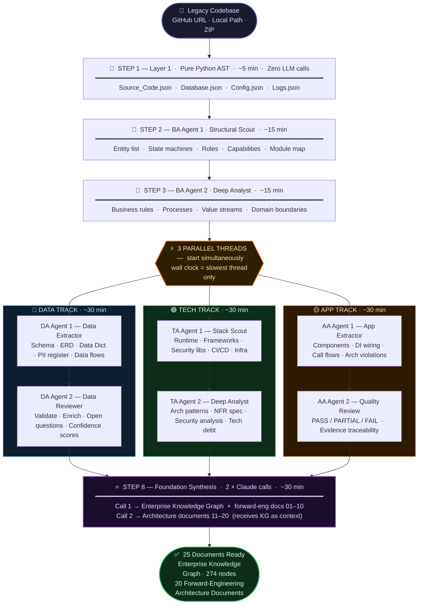
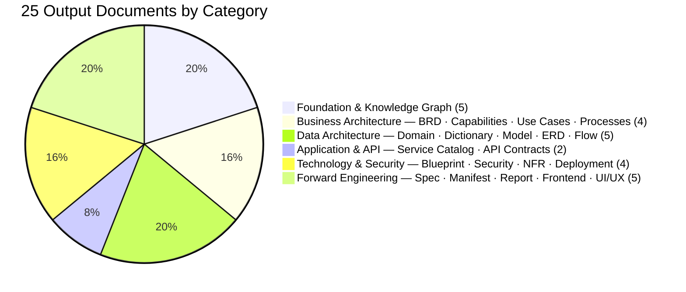
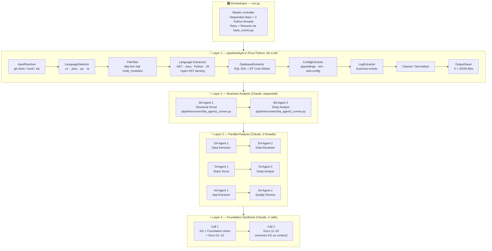
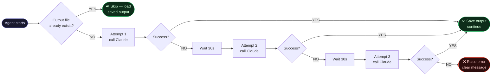
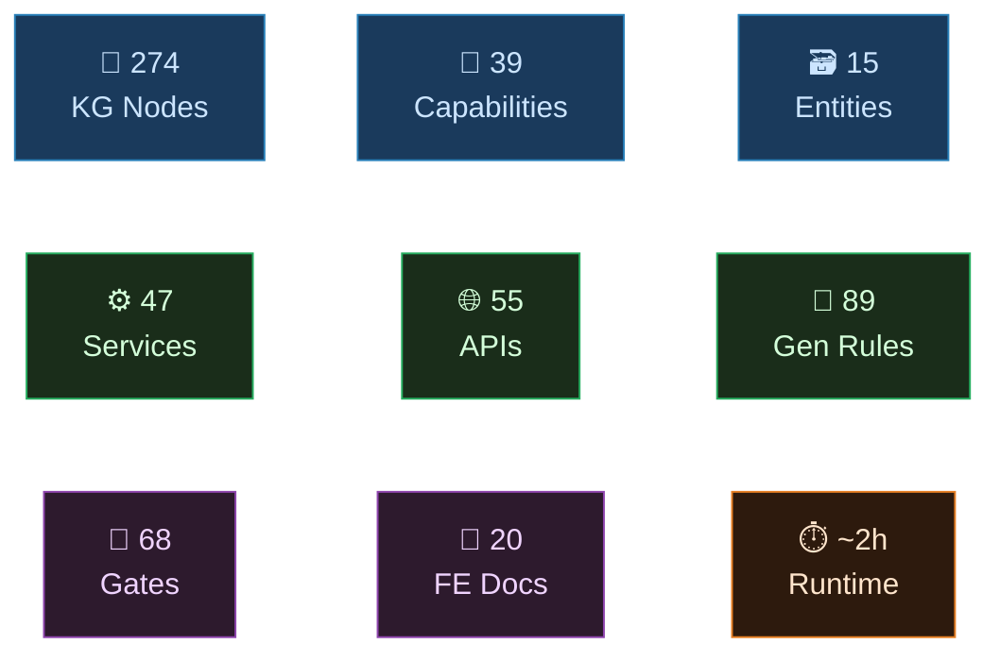

<div align="center">

# 🏗️ eShopOnWeb — Enterprise Forward Engineering Package

### Reverse-engineer any legacy .NET codebase into 25 production-grade architecture documents — **fully automated**

<br/>

[](https://python.org)
[](https://anthropic.com)
[](https://dotnet.microsoft.com)
[](#-output--25-documents-produced)
[](Enterprise_Foundation_Package/ENTERPRISE_KNOWLEDGE_GRAPH.json)
[](Forward_Engineering_Package/11_API_CONTRACT_SPECIFICATION.md)
[](Forward_Engineering_Package/10_SERVICE_CATALOG.md)

<br/>

> 🛡️ **Production hardened** — Auto-retry on Claude API failures (3×, 30s wait) &nbsp;·&nbsp; Resume from last completed step &nbsp;·&nbsp; Safe to re-run at any time

</div>

---

## ⚡ What This Does

Hands a legacy codebase to 9 Claude AI agents across 4 specialised analysis layers. Each agent reads the code from a different angle — business rules, data schema, tech stack, application structure. A final synthesis agent merges all findings into a 274-node Enterprise Knowledge Graph and 20 architecture documents a senior architect would take **weeks** to write manually.

> **Pipeline completes in ~1.5–2 hours, unattended.**

| | Manual (by hand) | This Pipeline |
|---|:---:|:---:|
| ⏱️ **Time** | 2–4 weeks | ~1.5–2 hours |
| 👤 **Human needed** | At every step | Zero |
| 📄 **Output** | 25 docs + KG | 25 docs + KG |
| ✅ **Reproducible** | No | Yes — re-run anytime |
| 🔍 **Evidence-cited** | Depends on analyst | Every finding cited |

---

## 🚀 Quick Start

```bash
# 1 — Install Python dependencies
pip install -r requirements.txt

# 2 — Install Claude Code CLI (agents call Claude headlessly)
npm install -g @anthropic/claude-code
claude login

# 3 — Run on the included eShopOnWeb source
python run.py --source "source/eShopOnWeb" --output ./results

# 3b — Or run on any other codebase
python run.py --source "https://github.com/your-org/your-app" --output ./results
python run.py --source "C:/projects/legacy-app"               --output ./results
```

> [!TIP]
> Already ran once and it was interrupted? Re-run the **exact same command**. Every step checks if its output file already exists and skips automatically — only the steps that didn't finish will run.

---

## 🗺️ Pipeline Flow



---

## 📦 Output — 25 Documents Produced



<details>
<summary><b>📋 View all 25 documents with descriptions</b></summary>

<br/>

### 🏛️ Foundation — Enterprise Knowledge Graph (5 files)

| File | What it contains |
|---|---|
| [ENTERPRISE_KNOWLEDGE_GRAPH.json](Enterprise_Foundation_Package/ENTERPRISE_KNOWLEDGE_GRAPH.json) | 274-node cross-layer graph — every entity, service, API, and tech node, fully linked |
| [CANONICAL_ENTERPRISE_MODEL.md](Enterprise_Foundation_Package/CANONICAL_ENTERPRISE_MODEL.md) | Human-readable summary — one row per node across all domains |
| [ARCHITECTURE_INVENTORY.md](Enterprise_Foundation_Package/ARCHITECTURE_INVENTORY.md) | Deployables, databases, APIs, services, tech stack, security findings, PII, debt — all in one place |
| [TRACEABILITY_MATRIX.md](Enterprise_Foundation_Package/TRACEABILITY_MATRIX.md) | Full chain: Capability → Process → Entity → Service → API → Database, with confidence |
| [FORWARD_ENGINEERING_INPUT_MAP.md](Enterprise_Foundation_Package/FORWARD_ENGINEERING_INPUT_MAP.md) | What is KNOWN · INFERRED · MISSING — the input spec for AI-assisted code regeneration |

### 📄 Forward-Engineering Documents (20 files)

| # | Document | What it contains |
|---|---|---|
| 01 | [Business Requirements Document](Forward_Engineering_Package/01_BRD.md) | Business goals, scope, stakeholders, success criteria |
| 02 | [Business Capability Model](Forward_Engineering_Package/02_BUSINESS_CAPABILITY_MODEL.md) | 39 capabilities mapped across business domains |
| 03 | [Use Case Specification](Forward_Engineering_Package/03_USE_CASE_SPECIFICATION.md) | Actors, preconditions, main flows, alternate paths |
| 04 | [Business Process Model](Forward_Engineering_Package/04_BUSINESS_PROCESS_MODEL.md) | End-to-end processes — triggers, steps, outcomes |
| 05 | [Domain Model](Forward_Engineering_Package/05_DOMAIN_MODEL.md) | DDD bounded contexts, aggregates, Mermaid context maps |
| 06 | [Data Dictionary](Forward_Engineering_Package/06_DATA_DICTIONARY.md) | Every entity, field, type, constraint, and business meaning |
| 07 | [Data Model Specification](Forward_Engineering_Package/07_DATA_MODEL_SPECIFICATION.md) | Physical schema + full PostgreSQL DDL ready to run |
| 08 | [Entity Relationship Diagram](Forward_Engineering_Package/08_ERD.md) | Full ERD with cardinality and FK relationships |
| 09 | [Data Flow Diagram](Forward_Engineering_Package/09_DATA_FLOW_DIAGRAM.md) | Data movement across all layers and system boundaries |
| 10 | [Service Catalog](Forward_Engineering_Package/10_SERVICE_CATALOG.md) | 47 services — interfaces, responsibilities, dependencies |
| 11 | [API Contract Specification](Forward_Engineering_Package/11_API_CONTRACT_SPECIFICATION.md) | 55 REST endpoints — full request/response contracts |
| 12 | [Technology Blueprint](Forward_Engineering_Package/12_TECHNOLOGY_BLUEPRINT.md) | Target architecture blueprint, stack decisions, patterns |
| 13 | [Security Architecture](Forward_Engineering_Package/13_SECURITY_ARCHITECTURE.md) | RBAC model, auth flows, threat model, modernisation plan |
| 14 | [NFR Specification](Forward_Engineering_Package/14_NFR_SPECIFICATION.md) | Performance, availability, scalability, compliance |
| 15 | [Forward Engineering Specification](Forward_Engineering_Package/15_FORWARD_ENGINEERING_SPECIFICATION.md) | 89 generation rules · 68 validation gates |
| 16 | Generation Manifest *(in repo root)* | Machine-readable JSON — fill `target_stack` to generate code |
| 17 | [Readiness Report](Forward_Engineering_Package/17_FORWARD_ENGINEERING_READINESS_REPORT.md) | Scored readiness assessment — **start here** |
| 18 | [Deployment Architecture](Forward_Engineering_Package/18_DEPLOYMENT_ARCHITECTURE.md) | Containers, infra topology, deployment pipeline |
| 19 | [Frontend Architecture](Forward_Engineering_Package/19_FRONTEND_ARCHITECTURE.md) | UI architecture, component hierarchy, state management |
| 20 | [UI/UX Specification](Forward_Engineering_Package/20_UI_UX_SPECIFICATION.md) | Screen flows, interaction patterns, design system |

</details>

---

## 🏗️ Internal Architecture — 4 Layers



---

## 🛡️ Resilience — Retry & Resume

> [!IMPORTANT]
> The pipeline can be interrupted at any point — power cut, rate limit, timeout, API error — and re-running the same command will resume from exactly where it stopped. No step is ever repeated unless it failed.



---

## 📊 Key Numbers at a Glance



| Metric | Value |
|---|---|
| 🔗 Knowledge Graph nodes | **274** |
| 📁 Business Capabilities mapped | **39** |
| 🗃️ Domain Entities | **15** |
| ⚙️ Services / Modules catalogued | **47** |
| 🌐 REST APIs documented | **55** |
| 📐 Forward engineering rules | **89** |
| 🚦 Validation gates | **68** |
| 📄 Architecture documents | **25 total** (5 foundation + 20 FE) |
| ⏱️ Total pipeline runtime | **~1.5–2 hours** |
| 🔁 Auto-retries per Claude call | **3 (30s between each)** |
| ⚡ Parallel analysis threads | **3** |

---

## 🔢 Two Ways to Use This

### Option A — Single Command *(recommended)*

```bash
python run.py --source "source/eShopOnWeb" --output ./results
```

Leave it running. Come back in ~2 hours. All 25 documents will be waiting.

### Option B — Batch by Batch *(for token budget control)*

Run each agent as its own terminal session. Ideal when you need to stay within a per-session token limit.

<details>
<summary><b>📋 Open batch-by-batch PowerShell commands</b></summary>

<br/>

**Set once at the top of your session:**
```powershell
$src = "source/eShopOnWeb"
$out = "./results"
```

---

**Batch 1 — Layer 1** *(deterministic, no LLM, ~5 min)*
```powershell
cd pipeline
python -m layer1 --source (Resolve-Path "../source/eShopOnWeb") --output "../results/Source_Extraction"
cd ..
```
> ✅ Skip if `results/Source_Extraction/` already exists from a previous run.

---

**Batch 2 — BA Agent 1: Structural Scout**
```powershell
python pipeline/runners/ba_agent1_runner.py --input "$out/Source_Extraction" --repo-root $src --output "$out/Business_Analysis"
```

**Batch 3 — BA Agent 2: Deep Analyst** *(must run after Batch 2)*
```powershell
python pipeline/runners/ba_agent2_runner.py --input "$out/Source_Extraction" --repo-root $src --output "$out/Business_Analysis"
```

---

**Batch 4 — DA Agent 1: Data Extractor** *(can run after Batch 3, any order vs TA/AA)*
```powershell
python pipeline/runners/da_agent1_runner.py --input "$out/Source_Extraction" --repo-root $src --output "$out/Data_Analysis"
```

**Batch 5 — DA Agent 2: Data Reviewer** *(must run after Batch 4)*
```powershell
python pipeline/runners/da_agent2_runner.py --input "$out/Source_Extraction" --repo-root $src --output "$out/Data_Analysis"
```

---

**Batch 6 — TA Agent 1: Stack Scout** *(can run after Batch 3, any order vs DA/AA)*
```powershell
python pipeline/runners/ta_agent1_runner.py --input "$out/Source_Extraction" --repo-root $src --output "$out/Technology_Analysis"
```

**Batch 7 — TA Agent 2: Deep Analyst** *(must run after Batch 6)*
```powershell
python pipeline/runners/ta_agent2_runner.py --input "$out/Source_Extraction" --repo-root $src --output "$out/Technology_Analysis"
```

---

**Batch 8 — AA Agent 1: App Extractor** *(can run after Batch 3, any order vs DA/TA)*
```powershell
python pipeline/runners/aa_agent1_runner.py --input "$out/Source_Extraction" --repo-root $src --output "$out/Application_Analysis"
```

**Batch 9 — AA Agent 2: Quality Review** *(must run after Batch 8)*
```powershell
python pipeline/runners/aa_agent2_runner.py --input "$out/Source_Extraction" --repo-root $src --output "$out/Application_Analysis"
```

---

**Batch 10 — Foundation** *(always last — needs all previous outputs)*
```powershell
python pipeline/foundation_runner.py --output $out
```

> [!WARNING]
> **PowerShell only:** Run each command on a single line. Do **not** use `\` for line continuation — that is bash syntax and will cause a parser error in PowerShell.

**Run order rules:**
- Batches **1 → 2 → 3** must run in strict order
- Batches **4–9** (DA / TA / AA tracks) can run in any order after Batch 3, but within each track Agent 1 must run before Agent 2
- Batch **10** always runs last

</details>

---

## 📁 Repository Structure

```
📦 standard---eShopOnWeb-ForwardEngineering/
│
├── 🐍 run.py                               ← Pipeline entry point (master orchestrator)
├── 📄 requirements.txt
│
├── 📂 pipeline/                            ← Automated pipeline engine
│   ├── base_runner.py                      ← Claude CLI + retry + resume (shared by all runners)
│   ├── foundation_runner.py                ← KG synthesis + 20 docs (2-call approach)
│   │
│   ├── 📂 layer1/                          ← Deterministic AST extraction (no LLM)
│   │   ├── pipeline.py                     ← Layer 1 orchestrator (8 internal steps)
│   │   ├── input_resolver.py               ← git clone / local / zip input handler
│   │   ├── language_detector.py            ← .NET · Java · Python · JavaScript detector
│   │   ├── database_extractor.py           ← SQL DDL + EF Core pattern extractor
│   │   ├── config_extractor.py             ← appsettings / env / web.config reader
│   │   ├── log_extractor.py                ← Business event log scanner
│   │   ├── file_filter.py                  ← Skips bin/ obj/ node_modules/ etc.
│   │   ├── cleaner.py                      ← Normalise and deduplicate artifacts
│   │   ├── output_saver.py                 ← Writes the 5 JSON output files
│   │   └── 📂 extractors/
│   │       ├── dotnet_extractor.py         ← C# regex: classes, interfaces, enums, methods
│   │       ├── java_extractor.py
│   │       ├── python_extractor.py
│   │       └── javascript_extractor.py
│   │
│   └── 📂 runners/                         ← 8 Claude agent runners (prompt → Claude → save)
│       ├── ba_agent1_runner.py             ← 01_BA_Agent1_StructuralScout.md
│       ├── ba_agent2_runner.py             ← 02_BA_Agent2_DeepAnalyst.md
│       ├── da_agent1_runner.py             ← 03_DA_Agent1_DataExtractor.md
│       ├── da_agent2_runner.py             ← 04_DA_Agent2_DataReviewer.md
│       ├── ta_agent1_runner.py             ← 05_TA_Agent1_StackScout.md
│       ├── ta_agent2_runner.py             ← 06_TA_Agent2_DeepAnalyst.md
│       ├── aa_agent1_runner.py             ← 07_AA_Agent1_AppExtractor.md
│       └── aa_agent2_runner.py             ← 08_AA_Agent2_QualityReview.md
│
├── 📂 Prompts_Ready_To_Use/                ← 8 fully-assembled agent prompts
│   ├── 00_README.md                        ← Manual usage guide
│   └── 01 – 08 *.md                        ← One prompt per agent
│
├── 📂 source/eShopOnWeb/                   ← Original .NET 8 source (analysis target)
│
├── 📂 Enterprise_Foundation_Package/       ← 274-node Knowledge Graph + 4 views
│   ├── ENTERPRISE_KNOWLEDGE_GRAPH.json
│   ├── CANONICAL_ENTERPRISE_MODEL.md
│   ├── TRACEABILITY_MATRIX.md
│   ├── ARCHITECTURE_INVENTORY.md
│   └── FORWARD_ENGINEERING_INPUT_MAP.md
│
└── 📂 Forward_Engineering_Package/         ← 20 architecture documents
    ├── 01_BRD.md  →  20_UI_UX_SPECIFICATION.md
    └── 16_GENERATION_MANIFEST.json         ← Fill target_stack to generate code
```

---

## 📖 Using the Pre-Built eShopOnWeb Analysis

The full analysis is already included — no need to run the pipeline unless you want a different codebase.

**Start here:**

| Step | File | Why |
|---|---|---|
| 1 | [17_FORWARD_ENGINEERING_READINESS_REPORT.md](Forward_Engineering_Package/17_FORWARD_ENGINEERING_READINESS_REPORT.md) | Scored readiness — read this first to understand what's ready |
| 2 | [ENTERPRISE_KNOWLEDGE_GRAPH.json](Enterprise_Foundation_Package/ENTERPRISE_KNOWLEDGE_GRAPH.json) | The 274-node source of truth for all 20 documents |
| 3 | [16_GENERATION_MANIFEST.json](Forward_Engineering_Package/) | Fill `target_stack`, then feed to an LLM to generate code |

**Feed to an LLM for code generation (in this order):**
```
1. Forward_Engineering_Package/16_GENERATION_MANIFEST.json     ← fill target_stack here first
2. Forward_Engineering_Package/15_FORWARD_ENGINEERING_SPECIFICATION.md
3. Documents by layer:
   Business    → 01_BRD · 02_CAPABILITY_MODEL · 03_USE_CASES · 04_PROCESSES
   Data        → 05_DOMAIN_MODEL · 06_DATA_DICT · 07_DATA_MODEL · 08_ERD · 09_DATA_FLOW
   Application → 10_SERVICE_CATALOG · 11_API_CONTRACTS
   Technology  → 12_TECH_BLUEPRINT · 13_SECURITY · 14_NFR
   Frontend    → 19_FRONTEND_ARCH · 20_UI_UX_SPEC
```

> [!NOTE]
> `target_stack` in `16_GENERATION_MANIFEST.json` is **intentionally empty** — the package is technology-neutral by design. The same 25 documents support regeneration to .NET, Java, Node.js, Python, or any other stack.

---

## ⚙️ Design Decisions

| Decision | Reason |
|---|---|
| **Layer 1 is pure Python — no LLM** | Deterministic, zero cost, reads what is actually in the code. Claude never has to guess class names or table names |
| **BA runs first, before all others** | BA_Structural_Scout.md produces the entity and capability map that all three parallel tracks use as their reference baseline |
| **DA / TA / AA run in 3 parallel threads** | No cross-track dependency — running in parallel cuts wall clock by ~2/3 vs sequential |
| **AA uses Claude, not Python** | Catches DI wiring, constructor injection, architecture violations, and cross-layer call chains that static AST analysis cannot see |
| **Foundation uses 2 sequential calls** | Claude has a per-response output limit. One call hits that limit at ~doc 06. Two calls with KG-as-context produces all 25 documents reliably |
| **All outputs are plain `.md` / `.json`** | Readable by humans, any LLM, any downstream tool — no proprietary format |

---

## 📜 Changelog

### v1.3 — 2026-07-07
- 🔁 **Retry logic** — every Claude call retries up to 3× (30s wait) on rate limits, timeouts, or session errors
- ▶️ **Resume logic** — every agent skips if its output file already exists; re-running resumes from exactly where it stopped; Foundation checks Part 1 and Part 2 checkpoints separately

### v1.2 — 2026-07-07
- 🛠️ **Foundation truncation fix** — 2 sequential Claude calls (Call 1: KG + docs 01–10, Call 2: docs 11–20); previously Claude hit its output limit at doc 06 leaving 15 documents unwritten
- 🏷️ **Descriptive naming** — all folders and files renamed from cryptic codes to readable `Title_Case` names across the entire project
- 📋 **Batch-by-batch commands** — step-by-step PowerShell commands added for token budget control

### v1.1 — 2026-07-06
- 💰 **Token cost reduction (~30–40%)** — DA, TA, AA agents now read from Layer 1 JSON instead of re-reading the same source files BA already extracted

---

<div align="center">

Built with [Claude Code](https://claude.ai/code) &nbsp;·&nbsp; Powered by [Anthropic Claude](https://anthropic.com)

</div>
