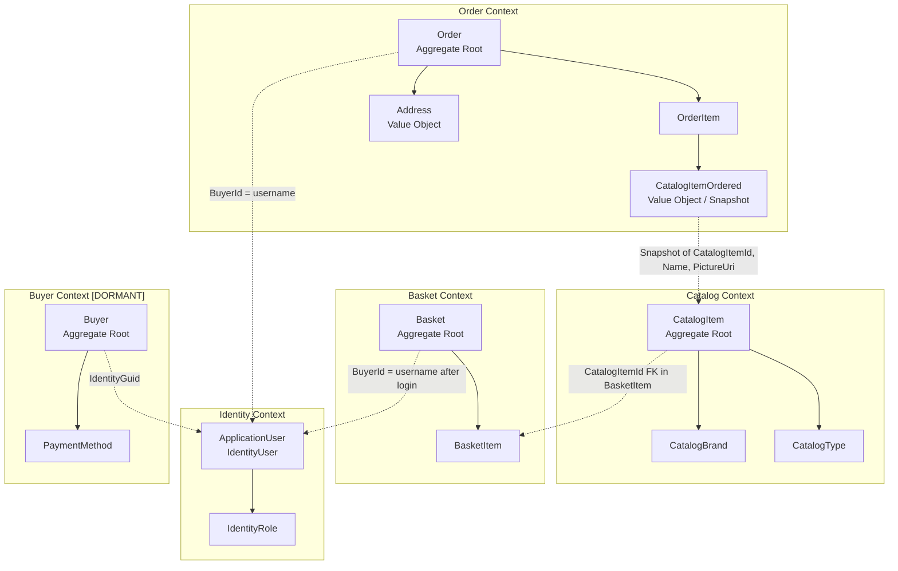

# Domain Model — eShopOnWeb

**Date:** 2026-07-06
**Methodology:** Domain-Driven Design (DDD)

---

## Bounded Contexts

### Context Map (Mermaid)

---

## Catalog Bounded Context

### Aggregate: CatalogItem (root)

**Invariants:**
- Name non-blank (BR-001)
- Description non-blank (BR-002)
- Price > 0 (BR-003)
- Valid CatalogBrandId (BR-004)
- Valid CatalogTypeId (BR-005)
- Name globally unique (BR-012)
- Image ≤ 512 KB, .jpg/.jpeg/.png/.gif (BR-009, BR-010)

**Commands (Methods):**
- `UpdateDetails(CatalogItemDetails { Name, Description, Price })`
- `UpdateBrand(int catalogBrandId)`
- `UpdateType(int catalogTypeId)`
- `UpdatePictureUri(string pictureName)` — ⚠️ cache-busting broken (TD-22)

**Entities in aggregate:**
- CatalogBrand (Id, Brand) — lookup; read-only via API
- CatalogType (Id, Type) — lookup; read-only via API

**Repository:** `IRepository<CatalogItem>` / `IReadRepository<CatalogItem>` via EfRepository

**Specifications:**
- `CatalogFilterSpecification(brandId?, typeId?)` — filter without paging
- `CatalogFilterPaginatedSpecification(skip, take, brandId?, typeId?)` — paged filter
- `CatalogItemNameSpecification(name)` — uniqueness check
- `CatalogItemsSpecification(int[] ids)` — batch lookup

---

## Basket Bounded Context

### Aggregate: Basket (root)

**Invariants:**
- BuyerId non-null (set at construction)
- BasketItem.UnitPrice locked at first-add; never updated on re-add
- BasketItem.Quantity >= 0

**Commands (Methods):**
- `AddItem(int catalogItemId, decimal price, int quantity)` — creates or increments
- `RemoveEmptyItems()` — removes items with Quantity = 0
- `SetNewBuyerId(string buyerId)` — transfers basket ownership (calling code unconfirmed — OQ-004)

**Entities in aggregate:**
- BasketItem (Id, CatalogItemId, UnitPrice[locked], Quantity, BasketId)

**Domain Service:** BasketService
- `AddItemToBasket(string username, int catalogItemId, decimal price, int quantity)`
- `SetQuantities(int basketId, Dictionary<string,int> quantities) → Result<Basket>`
- `DeleteBasketAsync(int basketId)`
- `TransferBasketAsync(string anonymousId, string userName)`

**Cross-context dependency:** BasketItem.CatalogItemId references Catalog context — FK only, no navigation property across context boundary. Price passed in by calling code (Web layer reads catalog price before calling service).

**Repository:** `IRepository<Basket>` via EfRepository

**Specifications:**
- `BasketWithItemsSpecification(int basketId)`
- `BasketWithItemsSpecification(string buyerId)`

---

## Order Bounded Context

### Aggregate: Order (root)

**Invariants:**
- BuyerId non-null and non-empty (BR-023)
- OrderDate set at creation (DateTimeOffset.Now)
- Must have ≥1 OrderItem
- Total = Σ(UnitPrice × Units) (BR-025)

**Entities / Value Objects in aggregate:**

| Type | Name | Notes |
|------|------|-------|
| Value Object | Address | Street, City, State, Country, ZipCode — owned entity; no separate table |
| Entity | OrderItem | UnitPrice, Units, ItemOrdered (owned) |
| Value Object | CatalogItemOrdered | CatalogItemId, ProductName, PictureUri — immutable snapshot (BR-021) |

**Domain Service:** OrderService
- `CreateOrderAsync(int basketId, Address shippingAddress)`

**No order status field — lifecycle tracking entirely absent. Orders are terminal after creation.**

**Repository:** `IRepository<Order>` / `IReadRepository<Order>` via EfRepository

**Specifications:**
- `CustomerOrdersSpecification(string buyerId)`
- `CustomerOrdersWithItemsSpecification(string buyerId)` — with ItemOrdered snapshots
- `OrderWithItemsByIdSpec(int orderId)`

---

## Identity Bounded Context

**This is a supporting context — not a domain aggregate; backed by ASP.NET Core Identity.**

| Entity | Store | Key Fields |
|--------|-------|-----------|
| ApplicationUser | IdentityDb.AspNetUsers | UserName, Email (custom fields unconfirmed — OQ-010) |
| IdentityRole | IdentityDb.AspNetRoles | Name = "Administrators" (only role) |

**Services:**
- `IdentityTokenClaimService.GetTokenAsync(string userName) → string` — JWT, 7-day, HMAC-SHA256
- `CustomAuthStateProvider` (Blazor) — 60s in-memory cache of UserInfo

**Seeded accounts:**
- `demouser@microsoft.com` — no role
- `admin@microsoft.com` — ADMINISTRATORS role
- Both use `DEFAULT_PASSWORD = "Pass@word1"` — CRITICAL SECURITY RISK (SEC-001/SEC-002)

---

## Buyer Bounded Context (DORMANT)

**Status: Entities declared; no persistence; no service; not in DbContext.**

| Entity | Fields | Note |
|--------|--------|------|
| Buyer (AggregateRoot) | Id, IdentityGuid, PaymentMethods | IdentityGuid links to ApplicationUser |
| PaymentMethod | Id, Alias, CardId, Last4 | CardId comment references Stripe PCI vault |

**Action required:** Implement or explicitly remove. See FE-D-004.

---

## Domain Events (Absent — Gap)

No domain event infrastructure identified in the codebase. No INotification, IDomainEvent, or MediatR notifications found fired from domain entities. Forward engineering should add:

- `OrderPlacedDomainEvent` → trigger payment + email
- `BasketCheckedOutDomainEvent` → trigger basket cleanup
- `ProductCreatedDomainEvent` → trigger cache invalidation