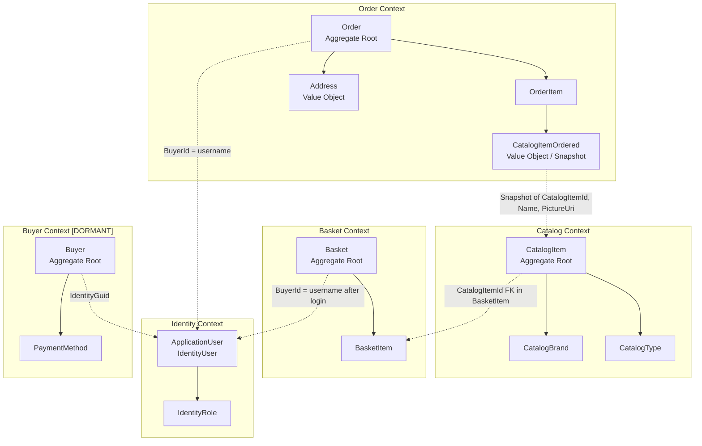

| .NET 8.0 LTS only | Technical | LTS until November 2026; do not downgrade |
| Single SQL Server instance | Technical | Both CatalogDb and IdentityDb on same SQL Server logical server |
| Azure-first deployment | Deployment | Bicep IaC targets Azure; no on-premises path |
| Modular monolith | Architecture | Not microservices; single solution, two deployable containers |
| Clean Architecture layering | Architecture | ApplicationCore must have zero framework dependencies |

---

## 7. Assumptions and Dependencies

| ID | Assumption/Dependency | Impact if Wrong |
|----|----------------------|-----------------|
| ASMP-001 | Stripe chosen for payment integration | Payment flow must be redesigned |
| ASMP-002 | Web checkout page deletes basket after order creation | Data consistency risk if absent |
| ASMP-006 | Email stub is intentional for reference app; real integration needed for production | Users receive no transactional email |
| DEP-001 | Azure subscription with AZURE_PRINCIPAL_ID, AZURE_LOCATION, AZURE_ENV_NAME parameters available | Deployment blocked |
| DEP-002 | Key Vault name injected at azd deploy time | Production secrets not loaded |

=== DOCUMENT: 02_BUSINESS_CAPABILITY_MODEL.md ===

# Business Capability Model — eShopOnWeb

**Date:** 2026-07-06

---

## Level 0 — Business Domain

```
eShopOnWeb Online Retail Platform
```

---

## Level 1 — Capability Areas

| ID | Area | Status |
|----|------|--------|
| BCA-01 | Product Management | ACTIVE |
| BCA-02 | Customer Acquisition | ACTIVE |
| BCA-03 | Transaction Processing | PARTIAL |
| BCA-04 | Fulfillment | NOT IMPLEMENTED |
| BCA-05 | Customer Management | PARTIAL |
| BCA-06 | Platform Operations | PARTIAL |

---

## Level 2 — Capabilities by Area

### BCA-01 — Product Management

| ID | Capability | Status | Bounded Context | API Surface |
|----|-----------|--------|-----------------|-------------|
| CAP-001 | Catalog Browsing | ACTIVE | Catalog | GET /api/catalog-items, /api/catalog-brands, /api/catalog-types |
| CAP-002 | Catalog Administration | ACTIVE | Catalog | POST/PUT/DELETE /api/catalog-items (ADMINISTRATORS only) |
| CAP-101 | Product Image Management | ACTIVE | Catalog | Image upload via DTO PictureBase64; 512 KB max, .jpg/.jpeg/.png/.gif |
| CAP-102 | Brand Management | ACTIVE (read-only API) | Catalog | GET /api/catalog-brands; create/update via seeding only |
| CAP-103 | Product Type Management | ACTIVE (read-only API) | Catalog | GET /api/catalog-types; create/update via seeding only |

### BCA-02 — Customer Acquisition

| ID | Capability | Status | Bounded Context | Handler |
|----|-----------|--------|-----------------|---------|
| CAP-005 | User Authentication | ACTIVE | Identity | POST /authenticate (JWT); Login.cshtml.cs (Cookie) |
| CAP-006 | User Registration | ACTIVE (email unconfirmed) | Identity | Register.cshtml.cs |
| CAP-007 | Anonymous-to-Authenticated Basket Transfer | ACTIVE | Basket/Identity | BasketService.TransferBasketAsync |
| CAP-201 | Account Lockout Protection | ACTIVE | Identity | lockoutOnFailure:true in AuthenticateEndpoint |
| CAP-202 | Email Confirmation | STUB — NOT FUNCTIONAL | Identity | EmailSender stub |

### BCA-03 — Transaction Processing

| ID | Capability | Status | Bounded Context | Handler |
|----|-----------|--------|-----------------|---------|
| CAP-003 | Basket Management | ACTIVE | Basket | BasketService (no REST API; Web Razor Pages) |
| CAP-004 | Order Checkout | ACTIVE (no payment) | Order | OrderService.CreateOrderAsync; Web checkout page |
| CAP-008 | Payment Processing | NOT IMPLEMENTED | Buyer | No service; Stripe intent in comment only |
| CAP-301 | Price Lock at Basket Add | ACTIVE | Basket | BasketItem.UnitPrice at construction |
| CAP-302 | Order Line Snapshot | ACTIVE | Order | CatalogItemOrdered value object |

### BCA-04 — Fulfillment

| ID | Capability | Status | Bounded Context | Handler |
|----|-----------|--------|-----------------|---------|
| CAP-401 | Order Status Tracking | NOT IMPLEMENTED | Order | No status field on Order entity |
| CAP-402 | Order Dispatch Notification | NOT IMPLEMENTED | Order/Identity | No email; no status transitions |
| CAP-403 | Delivery Confirmation | NOT IMPLEMENTED | Order | — |

### BCA-05 — Customer Management

| ID | Capability | Status | Bounded Context | Handler |
|----|-----------|--------|-----------------|---------|
| CAP-009 | Order History Retrieval | UNCONFIRMED | Order | Specification exists; no confirmed UI |
| CAP-501 | Saved Payment Methods | NOT IMPLEMENTED | Buyer | Buyer/PaymentMethod dormant |
| CAP-502 | GDPR Data Erasure | NOT IMPLEMENTED | All PII entities | No erasure mechanism found |

### BCA-06 — Platform Operations

| ID | Capability | Status | Component | Notes |
|----|-----------|--------|-----------|-------|
| CAP-601 | Infrastructure as Code | ACTIVE | infra/ Bicep | Azure App Service, SQL, Key Vault |
| CAP-602 | Build and Test CI | ACTIVE | GitHub Actions | dotnet build + dotnet test |
| CAP-603 | Automated Deployment | NOT WIRED | azure.yaml + Bicep | IaC complete; no pipeline step |
| CAP-604 | Health Monitoring | PARTIAL | /health endpoints | Content assertion — fragile |
| CAP-605 | APM Telemetry | NOT IMPLEMENTED | App Insights ref only | No SDK; no resource provisioned |
| CAP-606 | Secrets Management | ACTIVE (production) | Azure Key Vault | Hardcoded in source for dev |

---

## Capability Heat Map

| Capability Area | Completeness | Business Risk | Forward Engineering Priority |
|-----------------|-------------|--------------|------------------------------|
| Product Management | 90% | Low | Low — minor gaps only |
| Customer Acquisition | 70% | Medium | Medium — email stub |
| Transaction Processing | 40% | CRITICAL | CRITICAL — no payment |
| Fulfillment | 0% | HIGH | HIGH — orders untrackable |
| Customer Management | 10% | HIGH | HIGH — GDPR exposure |
| Platform Operations | 60% | HIGH | HIGH — no deploy pipeline; no APM |

=== DOCUMENT: 03_USE_CASE_SPECIFICATION.md ===

# Use Case Specification — eShopOnWeb

**Date:** 2026-07-06

---

## UC-001: Browse Product Catalog

**Actor:** Anonymous Shopper (primary), Registered Customer
**Precondition:** None — publicly accessible
**Trigger:** User navigates to catalog page

| Step | Actor | System Response |
|------|-------|----------------|
| 1 | Actor requests catalog page (optional: filter by brand/type, page number) | System checks IMemoryCache (30s TTL); serves from cache or queries CatalogDb |
| 2 | — | System returns paginated list (10 items/page) with Name, Description, Price, PictureUri, Brand, Type |
| 3 | Actor selects a product | System calls GET /api/catalog-items/{id}; returns full product detail |

**Postcondition:** Product details displayed
**Exceptions:** Product not found → 404 response
**Business Rules:** NFR-04 (10/page), NFR-01 (30s cache)
**Known Issue:** Task.Delay(1000) in API-002 adds 1 second artificial latency (TD-21)

---

## UC-002: Add Product to Basket

**Actor:** Anonymous Shopper
**Precondition:** Product exists in catalog; UC-001 completed
**Trigger:** Actor clicks "Add to Cart"

| Step | Actor | System Response |
|------|-------|----------------|
| 1 | Actor clicks add; quantity defaults to 1 | System reads current catalog price for this product |
| 2 | — | System calls BasketService.AddItemToBasket(username/cookie-GUID, catalogItemId, price, quantity) |
| 3 | — | If item already in basket: BasketItem.SetQuantity(existing + new); BR-017 |
| 4 | — | BasketItem.UnitPrice locked at this catalog price; BR-018 |
| 5 | — | System persists Basket and BasketItem to CatalogDb |

**Postcondition:** Basket updated; item quantity and locked price recorded
**Exceptions:** CatalogItem not found → error; negative quantity → guard violation
**Business Rules:** BR-013, BR-017, BR-018

---

## UC-003: Update Basket Quantities

**Actor:** Registered Customer (or Anonymous Shopper)
**Precondition:** Basket exists with at least one item
**Trigger:** Actor adjusts quantities on basket page

| Step | Actor | System Response |
|------|-------|----------------|
| 1 | Actor submits updated quantities per item | System calls BasketService.SetQuantities(basketId, {itemId: qty, ...}) |
| 2 | — | For each item: BasketItem.SetQuantity(qty); validates qty >= 0 (BR-013) |
| 3 | — | Basket.RemoveEmptyItems() — removes any item where qty = 0 (BR-014) |
| 4 | — | Returns Result<Basket>; Ardalis.Result pattern |

**Postcondition:** Basket updated; zero-qty items removed
**Exceptions:** Basket not found → Result.NotFound (BR-015)

---

## UC-004: Login with Basket Merge

**Actor:** Anonymous Shopper with basket
**Precondition:** Actor has anonymous basket; valid account credentials
**Trigger:** Actor submits login form

| Step | Actor | System Response |
|------|-------|----------------|
| 1 | Actor submits email + password | System calls SignInManager.PasswordSignInAsync(lockoutOnFailure:true) |
| 2 | — | On success: establish cookie session |
| 3 | — | System calls TransferAnonymousBasketToUserAsync → BasketService.TransferBasketAsync(anonymousGuid, username) |
| 4 | — | Anonymous basket items merged into user basket; anonymous basket deleted (BR-016) |
| 5 | — | Redirect to intended destination |

**Postcondition:** User authenticated; anonymous basket merged
**Exceptions:** Invalid credentials → error; account locked → IsLockedOut=true (BR-026)
**Business Rules:** BR-016, BR-026

---

## UC-005: Checkout (Place Order)

**Actor:** Registered Customer
**Precondition:** Basket has ≥1 item; actor authenticated
**Trigger:** Actor submits checkout form with shipping address

| Step | Actor | System Response |
|------|-------|----------------|
| 1 | Actor provides shipping address (Street, City, State, Country, ZipCode) | System validates address fields |
| 2 | — | Guard.Against.EmptyBasketOnCheckout → rejects if basket empty (BR-020) |
| 3 | — | OrderService.CreateOrderAsync(basketId, shippingAddress) |
| 4 | — | Loads basket with items; Guard.Against.Null(basket) (BR-019) |
| 5 | — | For each BasketItem: loads CatalogItem; builds CatalogItemOrdered snapshot (BR-021) |
| 6 | — | Creates Order aggregate with OrderItems; uses BasketItem.UnitPrice (BR-022) |
| 7 | — | Persists Order to CatalogDb |
| 8 | — | [Web layer — ASMP-002] Deletes basket |
| 9 | — | [MISSING] Charges payment method — NOT IMPLEMENTED |
| 10 | — | [MISSING] Sends order confirmation email — NOT IMPLEMENTED |

**Postcondition:** Order record created; basket cleared (assumed)
**Exceptions:** Basket not found → BasketNotFoundException; empty basket → EmptyBasketOnCheckoutException
**Business Rules:** BR-019 through BR-025
**Critical Gap:** No payment charging occurs (FE-D-002 decision required)

---

## UC-006: Admin Create Product

**Actor:** System Administrator (authenticated with JWT, ADMINISTRATORS role)
**Precondition:** Actor has valid JWT with Administrators claim
**Trigger:** Admin submits new product form in BlazorAdmin

| Step | Actor | System Response |
|------|-------|----------------|
| 1 | Actor submits product details (name, description, price, brand, type, image) | System validates: name required (BR-007), description required (BR-008), price 0.01–1000 (BR-006) |
| 2 | — | Image validation: size ≤ 512 KB (BR-009), extension .jpg/.jpeg/.png/.gif (BR-010) |
| 3 | — | POST /api/catalog-items with Bearer token |
| 4 | — | PublicApi verifies JWT and ADMINISTRATORS role (BR-011) |
| 5 | — | Checks CatalogItemNameSpecification — rejects if name already exists (BR-012) |
| 6 | — | Creates CatalogItem entity; persists to CatalogDb.Catalog table |
| 7 | — | Returns created CatalogItemDto; BlazorAdmin invalidates LocalStorage cache |

**Postcondition:** Product visible in catalog; admin cache refreshed
**Exceptions:** Unauthorized → 401; duplicate name → 409 (DuplicateException → ExceptionMiddleware)
**Business Rules:** BR-006 through BR-012

---

## UC-007: Admin Update Product

**Actor:** System Administrator
**Precondition:** Product exists; actor authenticated as ADMINISTRATORS
**Trigger:** Admin edits and submits product form

| Step | Actor | System Response |
|------|-------|----------------|
| 1 | Actor modifies product fields | Same validation as UC-006 |
| 2 | — | PUT /api/catalog-items with Bearer token |
| 3 | — | Calls CatalogItem.UpdateDetails(details), .UpdateBrand(id), .UpdateType(id), .UpdatePictureUri(name) as applicable |
| 4 | — | Persists to CatalogDb.Catalog table |

**Business Rules:** BR-001 through BR-005, BR-006, BR-011
**Known Issue:** UpdatePictureUri uses DateTime.MinValue.Ticks → cache-busting broken (TD-22)

---

## UC-008: Register New User

**Actor:** New Visitor
**Precondition:** Email not already registered
**Trigger:** Visitor submits registration form

| Step | Actor | System Response |
|------|-------|----------------|
| 1 | Visitor submits email, password | UserManager.CreateAsync(ApplicationUser, password) |
| 2 | — | Email uniqueness enforced by ASP.NET Identity |
| 3 | — | [STUB] EmailSender.SendEmailAsync → Task.CompletedTask — no email delivered (ASMP-006) |
| 4 | — | SignInManager.SignInAsync — user immediately signed in |

**Postcondition:** Account created; user signed in; confirmation email NOT delivered
**Gap:** FR-AUTH-008 — email confirmation required for production

=== DOCUMENT: 04_BUSINESS_PROCESS_MODEL.md ===

# Business Process Model — eShopOnWeb

**Date:** 2026-07-06

---

## BPMN Notation Key

```
[Actor] → (Action) → <Decision> → |Event| → [[System State]]
```

---

## Process 1: Customer Shopping Journey (End-to-End)

**ID:** PROC-001
**Trigger:** Visitor arrives at storefront
**Terminal Outcomes:** Order placed | Visitor exits without purchase

```
START
  │
  ▼
[Anonymous Shopper] → (Browse catalog) → [[Product list displayed]]
  │
  ▼
<Filter by brand/type?>
  │ YES → CatalogFilterSpecification → [[Filtered results]]
  │ NO  → CatalogFilterPaginatedSpecification(pageIndex, pageSize=10)
  │
  ▼
[Anonymous Shopper] → (Select product) → GET /api/catalog-items/{id}
  │
  ▼
[Anonymous Shopper] → (Add to basket) → BasketService.AddItemToBasket
                                       → [[BasketItem.UnitPrice LOCKED]]
  │
  ▼
<More items?>
  │ YES → loop to Browse
  │ NO  ↓
  │
  ▼
<Authenticated?>
  │ NO → [Anonymous Shopper] → (Login) → SignInManager.PasswordSignInAsync
  │                           → BasketService.TransferBasketAsync
  │                           → [[Anonymous basket MERGED + DELETED]]
  │ YES ↓
  │
  ▼
[Registered Customer] → (Review basket) → BasketService.SetQuantities
  │                    → Basket.RemoveEmptyItems
  │
  ▼
[Registered Customer] → (Submit checkout + shipping address)
  │
  ▼
<Basket empty?>
  │ YES → Guard.Against.EmptyBasketOnCheckout → ERROR → loop to Review
  │ NO  ↓
  │
  ▼
OrderService.CreateOrderAsync(basketId, shippingAddress)
  → Load basket; Guard.Against.Null
  → For each BasketItem: load CatalogItem → build CatalogItemOrdered snapshot
  → Create Order + OrderItems (price = BasketItem.UnitPrice)
  → Persist Order to CatalogDb
  │
  ▼
[Web Layer — ASMP-002] → (Delete basket)
  │
  ▼
[[MISSING: Payment processing]]
  │
  ▼
[[MISSING: Order confirmation email]]
  │
  ▼
|Order Created| → END
```

**Handoff Points:**
- Login page → BasketService.TransferBasketAsync (cross-domain: Identity → Basket)
- OrderService.CreateOrderAsync → Web layer basket deletion (not atomic)
- OrderService → Payment provider (NOT IMPLEMENTED)

**States Defined:**

| State | Trigger | Duration |
|-------|---------|---------|
| No basket | Pre-first add | Indefinite |
| Anonymous basket | AddItemToBasket | Until login |
| Account basket | TransferBasketAsync | Until checkout |
| Order created | CreateOrderAsync | Permanent record |
| Basket cleared | Web layer post-checkout | Immediate |

**Missing States:** Payment pending, Payment confirmed, Order confirmed, Packed, Dispatched, Delivered, Cancelled

---

## Process 2: Product Catalog Management

**ID:** PROC-002
**Trigger:** Administrator needs to add/update/remove product
**Terminal Outcomes:** Catalog updated and visible | Validation rejection

```
START
  │
  ▼
[Admin] → (Navigate to BlazorAdmin) → GET /User (OQ-003)
                                     → [[UserInfo loaded; JWT attached to HttpClient]]
  │
  ▼
[Admin] → (View catalog) → CatalogItemService.List() or ListPaged()
                         → [[Cache check: Blazored.LocalStorage 1-min TTL]]
  │
  ▼
<Action?>
  ├─── CREATE ──────────────────────────────────────────────────────┐
  │    [Admin] → (Fill form) → (Submit)                             │
  │    → POST /api/catalog-items (Bearer token)                     │
  │    → [PublicApi] validate JWT + ADMINISTRATORS role             │
  │    → FluentValidation: name required, description required,     │
  │      price 0.01–1000, image 512KB/.jpg/.png/.gif                │
  │    → CatalogItemNameSpecification: check uniqueness             │
  │    → <Duplicate name?> YES → 409 Conflict → END with error      │
  │    → Create CatalogItem → Persist → Return DTO                  │
  │    → BlazorAdmin invalidates LocalStorage cache                  │
  │    → [[Product visible in catalog]]                             │
  │                                                                  │
  ├─── UPDATE ──────────────────────────────────────────────────────┤
  │    Same validation flow; PUT /api/catalog-items                  │
  │    → UpdateDetails / UpdateBrand / UpdateType / UpdatePictureUri │
  │                                                                  │
  └─── DELETE ──────────────────────────────────────────────────────┘
       DELETE /api/catalog-items/{id}
       → Product removed from Catalog table
       → BlazorAdmin invalidates LocalStorage cache
       → [[Product no longer visible]]
```

---

## Process 3: User Login with Basket Merge

**ID:** PROC-003
**Trigger:** Anonymous shopper initiates login

```
START
  │
  ▼
[Anonymous Shopper] → (Submit email + password to Login.cshtml.cs)
  │
  ▼
SignInManager.PasswordSignInAsync(email, password, lockoutOnFailure:true)
  │
  ▼
<Result?>
  ├─ IsLockedOut → ERROR: account locked
  ├─ IsNotAllowed → ERROR: account not allowed
  ├─ RequiresTwoFactor → [STUB — no 2FA flow implemented]
  └─ Succeeded ↓
  │
  ▼
Login.cshtml.cs.TransferAnonymousBasketToUserAsync()
  → BasketService.TransferBasketAsync(anonymousCookieGuid, authenticatedUsername)
  → Load anonymous basket; load user basket (or create)
  → Copy all anonymous basket items to user basket
  → Delete anonymous basket
  │
  ▼
[[Cookie session established; anonymous basket merged]]
  │
  ▼
Redirect to ReturnUrl → END
```

---

## Process 4: New User Registration

**ID:** PROC-004

```
START
  │
  ▼
[New Visitor] → (Submit email + password to Register.cshtml.cs)
  │
  ▼
UserManager.CreateAsync(new ApplicationUser{UserName=email, Email=email}, password)
  │
  ▼
<Email unique?>
  │ NO → Identity error → return form with error message
  │ YES ↓
  │
  ▼
[STUB] EmailSender.SendEmailAsync → Task.CompletedTask
      (No email delivered — ASMP-006 / PP-05)
  │
  ▼
SignInManager.SignInAsync → [[Cookie session established immediately]]
  │
  ▼
Redirect to home → END
```

**Gap:** Email confirmation not enforced — unverified email addresses accepted

=== DOCUMENT: 05_DOMAIN_MODEL.md ===

# Domain Model — eShopOnWeb

**Date:** 2026-07-06
**Methodology:** Domain-Driven Design (DDD)

---

## Bounded Contexts

### Context Map (Mermaid)



---

## Catalog Bounded Context

### Aggregate: CatalogItem (root)

**Invariants:**
- Name non-blank (BR-001)
- Description non-blank (BR-002)
- Price > 0 (BR-003)
- Valid CatalogBrandId (BR-004)
- Valid CatalogTypeId (BR-005)
- Name globally unique (BR-012)
- Image ≤ 512 KB, .jpg/.jpeg/.png/.gif (BR-009, BR-010)

**Commands (Methods):**
- `UpdateDetails(CatalogItemDetails { Name, Description, Price })`
- `UpdateBrand(int catalogBrandId)`
- `UpdateType(int catalogTypeId)`
- `UpdatePictureUri(string pictureName)` — ⚠️ cache-busting broken (TD-22)

**Entities in aggregate:**
- CatalogBrand (Id, Brand) — lookup; read-only via API
- CatalogType (Id, Type) — lookup; read-only via API

**Repository:** `IRepository<CatalogItem>` / `IReadRepository<CatalogItem>` via EfRepository

**Specifications:**
- `CatalogFilterSpecification(brandId?, typeId?)` — filter without paging
- `CatalogFilterPaginatedSpecification(skip, take, brandId?, typeId?)` — paged filter
- `CatalogItemNameSpecification(name)` — uniqueness check
- `CatalogItemsSpecification(int[] ids)` — batch lookup

---

## Basket Bounded Context

### Aggregate: Basket (root)

**Invariants:**
- BuyerId non-null (set at construction)
- BasketItem.UnitPrice locked at first-add; never updated on re-add
- BasketItem.Quantity >= 0

**Commands (Methods):**
- `AddItem(int catalogItemId, decimal price, int quantity)` — creates or increments
- `RemoveEmptyItems()` — removes items with Quantity = 0
- `SetNewBuyerId(string buyerId)` — transfers basket ownership (calling code unconfirmed — OQ-004)

**Entities in aggregate:**
- BasketItem (Id, CatalogItemId, UnitPrice[locked], Quantity, BasketId)

**Domain Service:** BasketService
- `AddItemToBasket(string username, int catalogItemId, decimal price, int quantity)`
- `SetQuantities(int basketId, Dictionary<string,int> quantities) → Result<Basket>`
- `DeleteBasketAsync(int basketId)`
- `TransferBasketAsync(string anonymousId, string userName)`

**Cross-context dependency:** BasketItem.CatalogItemId references Catalog context — FK only, no navigation property across context boundary. Price passed in by calling code (Web layer reads catalog price before calling service).

**Repository:** `IRepository<Basket>` via EfRepository

**Specifications:**
- `BasketWithItemsSpecification(int basketId)`
- `BasketWithItemsSpecification(string buyerId)`

---

## Order Bounded Context

### Aggregate: Order (root)

**Invariants:**
- BuyerId non-null and non-empty (BR-023)
- OrderDate set at creation (DateTimeOffset.Now)
- Must have ≥1 OrderItem
- Total = Σ(UnitPrice × Units) (BR-025)

**Entities / Value Objects in aggregate:**

| Type | Name | Notes |
|------|------|-------|
| Value Object | Address | Street, City, State, Country, ZipCode — owned entity; no separate table |
| Entity | OrderItem | UnitPrice, Units, ItemOrdered (owned) |
| Value Object | CatalogItemOrdered | CatalogItemId, ProductName, PictureUri — immutable snapshot (BR-021) |

**Domain Service:** OrderService
- `CreateOrderAsync(int basketId, Address shippingAddress)`

**No order status field — lifecycle tracking entirely absent. Orders are terminal after creation.**

**Repository:** `IRepository<Order>` / `IReadRepository<Order>` via EfRepository

**Specifications:**
- `CustomerOrdersSpecification(string buyerId)`
- `CustomerOrdersWithItemsSpecification(string buyerId)` — with ItemOrdered snapshots
- `OrderWithItemsByIdSpec(int orderId)`

---

## Identity Bounded Context

**This is a supporting context — not a domain aggregate; backed by ASP.NET Core Identity.**

| Entity | Store | Key Fields |
|--------|-------|-----------|
| ApplicationUser | IdentityDb.AspNetUsers | UserName, Email (custom fields unconfirmed — OQ-010) |
| IdentityRole | IdentityDb.AspNetRoles | Name = "Administrators" (only role) |

**Services:**
- `IdentityTokenClaimService.GetTokenAsync(string userName) → string` — JWT, 7-day, HMAC-SHA256
- `CustomAuthStateProvider` (Blazor) — 60s in-memory cache of UserInfo

**Seeded accounts:**
- `demouser@microsoft.com` — no role
- `admin@microsoft.com` — ADMINISTRATORS role
- Both use `DEFAULT_PASSWORD = "Pass@word1"` — CRITICAL SECURITY RISK (SEC-001/SEC-002)

---

## Buyer Bounded Context (DORMANT)

**Status: Entities declared; no persistence; no service; not in DbContext.**

| Entity | Fields | Note |
|--------|--------|------|
| Buyer (AggregateRoot) | Id, IdentityGuid, PaymentMethods | IdentityGuid links to ApplicationUser |
| PaymentMethod | Id, Alias, CardId, Last4 | CardId comment references Stripe PCI vault |

**Action required:** Implement or explicitly remove. See FE-D-004.

---

## Domain Events (Absent — Gap)

No domain event infrastructure identified in the codebase. No INotification, IDomainEvent, or MediatR notifications found fired from domain entities. Forward engineering should add:

- `OrderPlacedDomainEvent` → trigger payment + email
- `BasketCheckedOutDomainEvent` → trigger basket cleanup
- `ProductCreatedDomainEvent` → trigger cache invalidation

=== DOCUMENT: 06_DATA_DICTIONARY.md ===

# Data Dictionary — eShopOnWeb

**Date:** 2026-07-06
**Database:** CatalogDb (primary) + IdentityDb (identity)
**ORM:** Entity Framework Core 8.0.2

---

## CatalogDb Entities

### CatalogItem (table: Catalog)

| Field | C# Type | SQL Type | Nullable | Constraints | Notes |
|-------|---------|---------|---------|-------------|-------|
| Id | int | INT IDENTITY(1,1) | NO | PK | Inherited from BaseEntity |
| Name | string | NVARCHAR | NO | NOT NULL; referenced by uniqueness check | Guard: non-blank |
| Description | string | NVARCHAR | NO | NOT NULL | Guard: non-blank |
| Price | decimal | DECIMAL | NO | NOT NULL | Guard: > 0; DTO range 0.01–1000 |
| PictureUri | string | NVARCHAR | YES | — | Updated via UpdatePictureUri; cache-busting broken |
| CatalogTypeId | int | INT | NO | FK → CatalogTypes.Id; ON DELETE RESTRICT* | Guard: valid |
| CatalogBrandId | int | INT | NO | FK → CatalogBrands.Id; ON DELETE RESTRICT* | Guard: valid |

*ON DELETE RESTRICT never tested by any test suite — DA_Agent2_VQ-02

### CatalogBrand (table: CatalogBrands)

| Field | C# Type | SQL Type | Nullable | Constraints |
|-------|---------|---------|---------|-------------|
| Id | int | INT IDENTITY | NO | PK |
| Brand | string | NVARCHAR | NO | NOT NULL |

### CatalogType (table: CatalogTypes)

| Field | C# Type | SQL Type | Nullable | Constraints |
|-------|---------|---------|---------|-------------|
| Id | int | INT IDENTITY | NO | PK |
| Type | string | NVARCHAR | NO | NOT NULL |

### Basket (table: Baskets)

| Field | C# Type | SQL Type | Nullable | Constraints | Notes |
|-------|---------|---------|---------|-------------|-------|
| Id | int | INT IDENTITY | NO | PK | |
| BuyerId | string | NVARCHAR | NO | NOT NULL | Either username (auth) or GUID string (anon) |

### BasketItem (table: BasketItems)

| Field | C# Type | SQL Type | Nullable | Constraints | Notes |
|-------|---------|---------|---------|-------------|-------|
| Id | int | INT IDENTITY | NO | PK | |
| UnitPrice | decimal | DECIMAL | NO | NOT NULL | Locked at add time — never updated |
| Quantity | int | INT | NO | NOT NULL; >= 0 | |
| CatalogItemId | int | INT | NO | FK → Catalog.Id | No navigation property across context |
| BasketId | int | INT | NO | FK → Baskets.Id | |

### Order (table: Orders)

| Field | C# Type | SQL Type | Nullable | Constraints | Notes |
|-------|---------|---------|---------|-------------|-------|
| Id | int | INT IDENTITY | NO | PK | |
| BuyerId | string | NVARCHAR | NO | NOT NULL | Username of authenticated buyer |
| OrderDate | DateTimeOffset | DATETIMEOFFSET | NO | NOT NULL; default = now | |
| ShipToAddress_Street | string | NVARCHAR | YES | Owned entity columns | |
| ShipToAddress_City | string | NVARCHAR | YES | Owned entity columns | |
| ShipToAddress_State | string | NVARCHAR | YES | Owned entity columns | |
| ShipToAddress_Country | string | NVARCHAR | YES | Owned entity columns | |
| ShipToAddress_ZipCode | string | NVARCHAR | YES | Owned entity columns | |

**PII:** ShipToAddress_Street, ShipToAddress_City, BuyerId contain personal data — GDPR erasure obligation.

### OrderItem (table: OrderItems)

| Field | C# Type | SQL Type | Nullable | Constraints | Notes |
|-------|---------|---------|---------|-------------|-------|
| Id | int | INT IDENTITY | NO | PK | |
| UnitPrice | decimal | DECIMAL | NO | NOT NULL | Price at basket-add time |
| Units | int | INT | NO | NOT NULL | Quantity ordered |
| ItemOrdered_CatalogItemId | int | INT | NO | NOT NULL | Snapshot — reference only; not FK |
| ItemOrdered_ProductName | string | NVARCHAR | YES | nullable:true IN MIGRATION despite IsRequired() in config | ⚠️ DISCREPANCY RC-08 / OQ-018 |
| ItemOrdered_PictureUri | string | NVARCHAR | YES | Nullable in migration | |
| OrderId | int | INT | NO | FK → Orders.Id | |

---

## IdentityDb Entities (ASP.NET Identity Standard Schema)

| Table | Key Columns | Notes |
|-------|------------|-------|
| AspNetUsers | Id (NVARCHAR PK), UserName, NormalizedUserName, Email, NormalizedEmail, EmailConfirmed, PasswordHash, SecurityStamp, ConcurrencyStamp, PhoneNumber, TwoFactorEnabled, LockoutEnd, LockoutEnabled, AccessFailedCount | Standard Identity schema |
| AspNetRoles | Id, Name, NormalizedName, ConcurrencyStamp | One seeded role: "Administrators" |
| AspNetUserRoles | UserId FK + RoleId FK | Many-to-many bridge |
| AspNetUserClaims | Id, UserId, ClaimType, ClaimValue | |
| AspNetRoleClaims | Id, RoleId, ClaimType, ClaimValue | |
| AspNetUserLogins | LoginProvider + ProviderKey + UserId | External login support |
| AspNetUserTokens | UserId + LoginProvider + Name + Value | Token storage |

---

## Indexes and Constraints (Confirmed + Gaps)

| Table | Index/Constraint | Status | Risk |
|-------|-----------------|--------|------|
| Catalog | PK on Id | Confirmed | — |
| Catalog | FK to CatalogBrands | Confirmed | ON DELETE RESTRICT untested |
| Catalog | FK to CatalogTypes | Confirmed | ON DELETE RESTRICT untested |
| Catalog | UNIQUE on Name | **ABSENT** — no UNIQUE index found | Race condition — two concurrent creates can insert same name (DA_Agent2_VQ-04) |
| Baskets | PK on Id | Confirmed | — |
| BasketItems | FK to Baskets | Confirmed | — |
| BasketItems | FK to Catalog (CatalogItemId) | Confirmed | — |
| Orders | PK on Id | Confirmed | — |
| OrderItems | FK to Orders | Confirmed | — |
| OrderItems | ItemOrdered_ProductName | nullable:true in migration — CONFLICT with EF IsRequired() | OQ-018 |

Continue with prompt "next" for documents 07–11.
